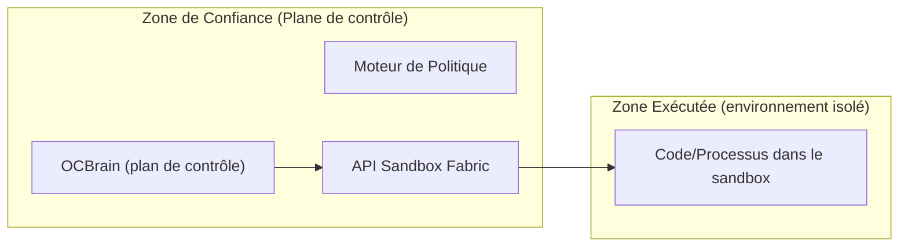
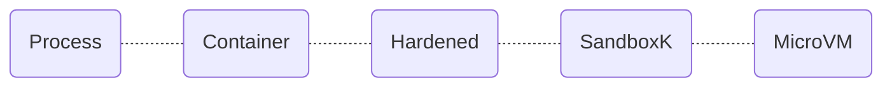
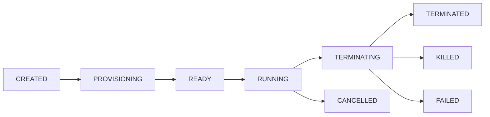

# Résumé

La **conception du bac à sable (sandbox) et de la plateforme d’exécution** OCBrain doit viser une isolation forte tout en restant extensible. Elle s’inspire des travaux industriels : microVMs (Docker Sandbox [3][5], Firecracker [9], Kata [11]) et sandboxes utilisateur (gVisor [7], nsjail [16], bubblewrap [20]). La chaîne d’admission de nouvelles « capacités » (depuis des dépôts GitHub) utilisera SBOM, signatures Sigstore et tests en bac à sable pour garantir provenance et immutabilité. Un plan de politiques composées (globales, par tâche, par capacité), un courtier de secrets, et un contrôleur de ressources global sont nécessaires. Les invariants de sécurité (impossibilité d’accès hors-chemin, non-évasion, coupure réseau stricte, isolement inter-sandbox, etc.) seront formalisés et validés par tests adversaires.

Nous proposons de développer ce sous-système en parallèle. D’abord, établir **l’état de l’hôte/du dépôt** (OS, Docker/Rootless, cgroups v2, seccomp, Landlock, user namespaces, KVM, WSL2), puis figer les **contrats** (JSON/YAML) : `ExecutionRequest`, `SandboxPolicy`, `ExecutionHandle`, `ExecutionEvent`, `ExecutionResult`, `ArtifactManifest`, `RuntimeCapabilities`. Ensuite, créer une API d’exécution indépendante du backend, implémenter d’abord un backend Docker/OCI avec confinement basique (en utilisant rootless, cgroups, seccomp, userns, mounts restreints) et des politiques de réseau/ressources strictes. Enfin, durcir par des tests (symlink/traversée, réseau non autorisé, DoS, dénis, processus orphelins…) pour vérifier les invariants de sécurité. Cette approche graduelle permettra d’aboutir à une infrastructure robuste prête à intégrer ultérieurement gVisor, Kata, Firecracker ou WSL2. 

**Sources clés** : Docker Sandbox, gVisor, Firecracker, Kata, OpenSandbox, Agent-Sandbox K8s, NIST SBOM. 

# 1. État de l’art et travaux connexes

- **MicroVM et hyperviseurs légers**  
  Des solutions comme **Firecracker** (par AWS, micro-VM minimaliste sous KVM) privilégient la sécurité par minimisation : seul 5 périphériques virtuels, faible surface d’attaque. Elles offrent un vrai isolement noyau (VM par sandbox) avec des temps de démarrage rapides (<125 ms) et un faible overhead (quelques Mo par VM). **Kata Containers** est un runtime OCI qui crée des VMs légères (via QEMU, Firecracker…) sous licence Apache-2. Il fournit une isolation proche de celle d’une VM (réseau, I/O, mémoire dédiés) tout en restant compatible avec les conteneurs Kubernetes. Ces solutions nécessitent KVM ou autre support d’hyperviseur (d’où vérification `ls /dev/kvm`, commandes CPU).

- **Sandboxes orientés conteneur/utilisateur**  
  **gVisor** (Google) intercepte les appels système du conteneur dans un "kernel en espace utilisateur", offrant un confinement défensif supplémentaire sans VM dédiée. Il tourne sans virtualisation matériel, démarrages instantanés, et supporte checkpoint/restore pour figer des états d’exécution. **Docker Sandbox** (Docker Inc.) utilise un microVM Alpine par agent, chaque sandbox a son propre kernel, sa propre pile réseau isolée et son moteur Docker intégré. Il introduit des couches : hyperviseur (VM dédiée), proxy réseau, daemon Docker interne, montage d’espace de travail et interception des credentials. **nsjail** (Google, MIT) et **bubblewrap** (Flatpak, LGPL) offrent un confinement plus léger : nsjail utilise namespaces + seccomp-bpf pour isoler un processus, tandis que bubblewrap crée un nouvel espace de montage et utilise PR_SET_NO_NEW_PRIVS pour empêcher setuid. Ils nécessitent un design explicite de politique de sécurité (bubblewrap *ne fait rien sans options*).

- **Plateformes de gestion de sandboxes**  
  **OpenSandbox** (Alibaba, 2026) est un contrôleur multi-langage qui gère des sandboxes sur Docker ou K8s. Chaque sandbox héberge un service `execd` pour exécuter rapidement des commandes (pas de `docker exec` récurrent), avec volumes persistants et contrôle poussé du réseau (URLs stables en ingress, listes blanches en egress). **Agent-Sandbox (kubernetes-sigs)** propose un CRD `Sandbox` déclaratif pour K8s, pilotant des Pods isolés (via RuntimeClass gVisor/Kata) avec identité réseau stable, stockage persistant, pause/reprise et pools préchauffés. **OpenHands** (Sysbox containers) recommande des pools de nœuds isolés pour sandboxes, montrant l’intérêt d’un runtime comme Sysbox (Docker + userns) qui isole presque au niveau VM. **E2B** (Commercial) expose chaque sandbox comme une microVM Firecracker personnalisée, avec snapshot, reprise, gestion du clavier/souris et coffre-fort à secrets. **Daytona** (mobile) cible les cas d’usage backend, fournissant un sandbox persistant où un agent peut lancer une API web et des bases de données locales, conservant l’état quand le sandbox s’arrête. 

- **Supply-chain et assurance**  
  Les nouvelles capacités issues de GitHub doivent passer un **contrôle d’admission** strict. On requiert un SBOM (NIST) pour garantir traçabilité et transparence, signé via Sigstore ou équivalent. L’extraction des dépendances, l’analyse statique, et l’exécution dans un bac à sable « d’isolation en build » sont nécessaires pour prévenir les exécutions arbitraires. L’objectif est d’aboutir à un “bill of materials” signé, protégeant contre les attaques de la chaîne d’approvisionnement (typoquatting, scripts malveillants, etc.). Cela complète les pratiques SAST/DAST/IAI prônées par NIST/NTIA [38], bien qu’aucune publication académique précise dans ce contexte agent n’ait été trouvée dans la documentation parcourue. 

# 2. Comparaison des implémentations existantes

| Projet        | Type d’isolation            | Exemples d’isolement       | Exigences hôte         | Avantages/Limitations                                 | Licence    |
|---------------|-----------------------------|----------------------------|------------------------|-------------------------------------------------------|------------|
| **Docker Sandbox** | MicroVM par agent [3][5]   | VM Linux Alpine dédiée, réseau via proxy, daemon Docker interne | Requiert Docker Desktop (VM), Linux VM | Isolation forte (kernel dédié) avec montage/workspace contrôlé; démarrages rapides (<1s); =⟶ pas de cohabitation de noyau avec host. Inconvénient : nécessite Docker Desktop VM (Win/Mac) ou VM Linux locale, consommation mémoire plus élevée qu’un conteneur pur. | Apache-2   |
| **gVisor**    | Namespace + syscall intercepteur | Sépare l’application du host au niveau syscalls; implémenté en Go | Linux récent; pas de support kvm requis | Légère (repose sur kernel hôte) et portable; intercepte TOUT syscall pour confinement. Commence en quelques ms, isolation plus forte qu’un conteneur normal, checkpoint/restore disponible. Limitations : compatibilité système limitée aux syscalls implémentés; vulnérabilités potentielles dans gVisor lui-même possible. | Apache-2   |
| **Firecracker** | MicroVM KVM (Rust) [9]      | Machine virtuelle minimaliste (5 devices, «jailer» en plus)  | Linux x86/ARM avec KVM | Sécurité maximale (barrière VM matérielle) et densité (quelques Mo), démarrage <125ms, volume massivement parallèle. Convient SI KVM dispo; overhead plus faible que QEMU classique. Nécessite privilèges KVM (root) et assemblage de FS images en amont. | Apache-2   |
| **Kata Containers** | VM légère (Container + VM) | QEMU ou Firecracker en backend; noyau dédié par conteneur | Linux avec virtualisation (QEMU + hypervisor) | Apporte isolation VM (réseau, mémoire dédiés) tout en restant compatible OCI/K8s. Multi-plateforme et supporte Firecracker. Charge virtuelle plus importante qu’un conteneur classique, complexité de configuration (runtimeClass, kernel). | Apache-2   |
| **nsjail**    | Namespace + cgroups + seccomp | Linux namespaces isolés, filtres seccomp-bpf (aide Kafel) | Tout Linux avec seccomp | Outil Google historique, léger (C/C++) et configurable. Isolement sans VM (pas de layer matériel), bonne granularité seccomp. Moins sûr qu’une VM si faille noyau; maintenance réduite (dernier commit 2021). | MIT        |
| **bubblewrap**| User namespaces (rootless) | New mount namespace, PR_SET_NO_NEW_PRIVS | Linux 4.8+ (userns activés) | Outil de bas niveau (Flatpak) pour bâtir un conteneur sans privilège. N’applique pas de politique par défaut; c’est un “builder” d’environnements. Avantage : rootless, multi-distro. Inconvénient : chaque argument (réseau, FS) détermine l’isolation effective. | LGPL-2.1  |
| **OpenSandbox** | Orchestrateur (K8s/Docker)   | Utilise execd + conteneurs/K8s; gestion réseau (ingress, egress) | K8s/Docker, control plane Python | Plateforme prête à l’emploi : persistance, URLs stables en entrée, contrôle d’accès flux sortie. Flexibilité élevée (on peut changer backend). Complexité de déploiement. Dépend de K8s ou Docker en back-end. | ?          |
| **Agent-Sandbox (K8s)** | Orchestrateur K8s + gVisor/Kata | Sandbox CRD, RuntimeClass gVisor/Kata | K8s (SIG Apps)   | Intégration native K8s : identités stables, stockage persistant, pause/reprise, pools préchauffés. Sécurité par isolation des runtimes. Complexe à mettre en place; en phase alpha/beta. | Apache-2   |
| **OpenHands** | Conteneurs Sysbox (dans K8s) | Docker + userns (Sysbox)                  | K8s (vSphere, EKS) | Plateforme commerciale, recommande isoler les sandboxes dans pool Sysbox dédié. Sysbox isole les conteneurs plus que Docker normal. Bonus: simplicité pour agent (docker inside). Limite: orientation entreprise; dépend d’un outil spécifique (Sysbox). | Propriétaire (EE) |
| **Daytona**   | Orchestrateur + Dev infra | Sandboxes Docker/ECS, volume persistant  | Local (dev), Cloud AWS | Cible dev back-end, permet de lancer DB/queue/etc. localement dans le sandbox. Sandbox persistant conservant état entre sessions. Axé dev backend, moins documenté pour usage général. | Proprietary |
| **E2B**       | MicroVM custom (Firecracker) | VM Firecracker dédiée, snapshot rapide   | AWS/GCP/OnPrem    | Plateforme complète Cloud/Enterprise: VM isolée, contrôle réseau, gestion secrète, snapshot/fork. Très robuste (scale massif), rapide (démarre sur snapshot). Coût élevé, dépend du service. | Apache-2   |
| **SWE-ReX**   | Abstraction d’exécution     | Métaclasse agent (Shell sessions)       | Divers (Docker, Modal) | Framework agent, pas un sandbox en soi. Permet exécuter parallèlement des shells sur differents backends (fargate, modal). Dénoué de la logique agent vs infra. Utile pour tests par lots, pas pour la sécurité sandbox. | MIT        |

**Sources** : Documentation Docker, gVisor, Firecracker, Kata, OpenSandbox, Agent-Sandbox, Sysbox/OpenHands docs, E2B site, SWE-ReX repo.

# 3. Inventaire de l’hôte et état du dépôt OCBrain

Avant toute implémentation, vérifier l’environnement de développement/production : 
- **OS et kernel** : `uname -a` (e.g. Linux 6.x ou Win+WSL2). Sur Linux, vérifier `lsb_release -a`. WSL2 se détecte par `grep Microsoft /proc/version`.  
- **Docker** : installé ? `docker info` et `docker version`. Mode rootless (non-root) ? (`docker info` donne `rootless`). Vérifier `docker info --format '{{json .SecurityOptions}}'` pour voir cgroups, seccomp.  
- **cgroups v2** : `stat -fc %T /sys/fs/cgroup`. Attendu cgroup2 sur Ubuntu 22+. (`mount | grep cgroup` pour distinguer cgroup2 vs hybrid).  
- **Namespaces utilisateur** : `sysctl kernel.unprivileged_userns_clone` (0=désactivés, 1=activés).  
- **KVM** : présence de `/dev/kvm` et modules (`lsmod | grep kvm`). `egrep '(vmx|svm)' /proc/cpuinfo`.  
- **Landlock** (FS sandbox) : vérifier noyau >=5.13 ou `grep LANDLOCK /boot/config-$(uname -r)`.  
- **Seccomp** : (`cat /proc/self/status | grep Seccomp`).  
- **WSL2** : si sous Windows, `ver` et `systeminfo`.  
- **Git repo OCBrain** : examiner les fichiers existants liés à l’exécution : classes Watchdog, Budget, Event Backbone, ValidationGate, Artefacts, etc. Voir s’il existe un rudiment d’API d’exécution. Déterminer : quel code existant (Runner, Worker) gère déjà processus ou containers. Tout code obsolète ou non-sécurisé doit être isolé.  

Ces vérifications fixent le périmètre : par exemple, si userns non dispo, bubblewrap ne sera pas rootless; si pas de KVM, Firecracker ne démarrera pas. L’inventaire précis guidera le choix des premiers backends (Docker/OCI en local, éventuellement gVisor sans KVM, etc.) et les restrictions de conception (ex. isoler `docker` via un autre contrôleur si accès direct est risqué).

# 4. Contrats et schémas clés

Nous définissons plusieurs schémas JSON/YAML pour l’API du Fabric. En voici des extraits illustratifs (simplifiés) :

- **ExecutionRequest** : décrit la tâche à exécuter.
```yaml
ExecutionRequest:
  execution_id: "uuid-1234"      # Identifiant unique de l'exécution
  operation_id: "task-42"        # Opération ou workflow parent
  command: ["python", "script.py", "--arg"]  # Commande complète
  cwd: "/workspace"             # Répertoire de travail
  env:
    - "KEY=value"
  timeout: 300                  # secondes max
  resources:
    cpu: 1.0
    memory: "2Gi"
    disk: "5Gi"
  network:
    egress:
      allow:
        - domain: "pypi.org"
        - cidr: "10.0.0.0/8"
    ingress:
      enabled: false
  mounts:
    workspace: { path: "/workspace", type: "bind" }
  sandbox_policy:              # Référence au politique à appliquer
    id: "policy-abc"
```

- **SandboxPolicy** : regroupe les dimensions de sécurité (par héritage ou composition).
```yaml
SandboxPolicy:
  id: "policy-abc"
  filesystem:
    allow_read: ["/workspace/**"]
    deny_write: ["/etc/*", "/root/*"]
  network:
    allow_domains: ["pypi.org", "huggingface.co"]
    block_external: true
  credentials:
    inject:
      - type: "ssh"
        identity: "user-key"
  processes:
    max_forks: 64
  resources:
    cpu_max: 2.0
    memory_max: "4Gi"
  lifecycle:
    mutable_filesystems: ["workspace"]
    readonly_paths: ["/usr", "/bin"]
    label: "untrusted"
```
- **ExecutionHandle et état** : identifie et suit le sandbox en cours.
```yaml
ExecutionHandle:
  execution_id: "uuid-1234"
  state: "RUNNING"   # CREATED, PROVISIONING, READY, RUNNING, PAUSED, CANCELLED, FAILED, TERMINATED
  start_time: "2026-09-09T12:00:00Z"
  end_time: null
  exit_code: null
```
- **ExecutionEvent** : journal d’événements (obs., erreurs, décisions politiques). Ex. :
```yaml
ExecutionEvent:
  - timestamp: "2026-09-09T12:00:01Z"
    level: "INFO"
    message: "Sandbox provisioned"
  - timestamp: "2026-09-09T12:01:30Z"
    level: "WARN"
    message: "Network connection blocked: 192.168.1.5:80"
    policy: "network"
```
- **ExecutionResult** : final, avec ressources et artefacts.
```yaml
ExecutionResult:
  execution_id: "uuid-1234"
  status: "SUCCEEDED"   # or FAILED, TIMEOUT, CANCELLED
  exit_code: 0
  start_time: "2026-09-09T12:00:00Z"
  end_time: "2026-09-09T12:01:35Z"
  duration: 95
  cpu_usage: "500ms"
  max_memory: "150Mi"
  stdout: "Output text..."
  stderr: ""
  artifacts:
    - path: "/workspace/output.txt"
      size: 2048
      hash: "sha256:abcdef..."
      provenance: "hostscript v1.2"
  termination_reason: "NORMAL"
```
- **ArtifactManifest** : décrit les sorties produites.
```yaml
ArtifactManifest:
  execution_id: "uuid-1234"
  artifacts:
    - id: "art1"
      type: "file"
      path: "/workspace/output.txt"
      size: 2048
      hash: "sha256:abcdef..."
      created_at: "2026-09-09T12:01:35Z"
```
- **RuntimeCapabilities** (découvertes) : carac. d’un backend.
```yaml
RuntimeCapabilities:
  backend: "docker"
  os: "linux"
  namespaces: true
  seccomp: true
  userns: true
  cgroups_v2: true
  containerd_version: "1.6.0"
```
Ces contrats minimaux couvrent les besoins identifiés (identité, ressources, FS, réseau, secrets, lifecycle). Ils seront affinés en fonction de l’inventaire du code existant OCBrain.

# 5. Modèle de menace et zones de confiance

La plateforme **contrôle d’exécution** doit assumer que *tout code dans le sandbox est potentiellement malveillant*, y compris les capacités générées ou desbinaires téléchargés. Nous définissons deux zones de confiance (cf. diagramme ci-dessous) :


- **Zone de Confiance (control plane)** : contient OCBrain central, moteurs de politique, ordonnanceurs, courtier de secrets, etc. C’est là que les décisions (quelles capacités, quelles ressources) sont prises. Ce plan doit rester inviolé.  
- **Zone non fiable (sandbox)** : tout ce qui se passe dans le sandbox (processus agents, code GitHub, modèles, données externes) est considéré non fiable. Il ne doit rien pouvoir toucher hors de son périmètre (OS, autres sandbox, données sensibles).

Chaque backend choisi a un niveau d’isolation (0 à 4) déterminant sa force de confinement : 

- **Niveau 0 (process)** : pas de sandbox (processus normal).  
- **Niveau 1 (container/OCI)** : namespaces Linux simples (Docker sans userns) – partage noyau hôte.  
- **Niveau 2 (conteneur durci)** : +Seccomp, user namespaces, cgroups v2, Landlock possible.  
- **Niveau 3 (noyau sandboxé)** : e.g. gVisor ou Kata sur gVisor, intercepte syscalls.  
- **Niveau 4 (MicroVM)** : Firecracker/Kata (VM complète). 

Les politiques de sécurité (globale, par tâche, par capabilité) doivent exprimer explicitement le niveau requis (ex. “VM obligatoire si code non audité”). Par exemple, un code non vérifié venant d’un repo Git pourrait déclencher `IsolationLevel>=3`. 

# 6. Classification des risques et composition des politiques

OCBrain doit évaluer le **risque** de chaque exécution. Par exemple :
- *Confiance en la source* (code interne vs code GitHub public)
- *Accès requis* (réseau ouvert, droits sudo, etc.)
- *Sensibilité des données* (ex. manipulation de données privées)
- *Catégorie de tâche* (simple transformation vs gestion système).
Ces facteurs forment un profil de risque global. La politique effective est la conjonction de couches : politique globale (neutre <ima, ex. interdiction temps/hôte), politique métier utilisateur, politique de tâche, politique spécifique à la capacité, etc.  

**Exemple de composition** :  
```
Politique effective = GLOBALE ∧ TACHE ∧ CAPABILITE
```
où `GLOBALE` impose (ex) «pas de réseau sortant par défaut», `CAPABILITE` pourrait lever cette restriction en mode *read-only* sur certains domaines, etc.  

Cette architecture multi-couches garantit qu’aucune demande d’exécution ne contourne les règles (« deny-by-default »). Docker Sandbox illustre ce principe : il ne fait confiance à aucun montage ou secret non explicitement configuré. 

# 7. Chaîne d’admission de nouvelles capacités GitHub

Quand OCBrain veut intégrer une nouvelle capacité depuis GitHub, le processus suivant s’applique :

```
GitHub repo → Analyse source & SBOM → Vérif. licence & vulnérabilités → Construction en sandbox isolé → Exécution de tests (CI) → Vérif. comportement → Décision admission → Enregistrement dans le registry → Découverte et utilisation
```

**Détails clés** : 
- Extraire SBOM (e.g. via CycloneDX) pour traçabilité. 
- Stocker commit SHA immuable pour le code source. 
- Exécuter un **build/test** complet dans un environnement isolé (même sandbox ou conteneur ad-hoc) avant usage. 
- Sigstore/Cosign pour signer l’artefact final (exécutable ou image) et l’associer à la source (attestation vendue).  
- Chaque capacité admise reçoit un identifiant et une version, et ne peut exécuter *que* le binaire/artéfact approuvé (imposer digests de conteneur précis). 

On définit un **CapabilityManifest** listant :
```yaml
Capability:
  id: "cap-xyz"
  source: "https://github.com/org/repo"
  commit: "abcdef123456"
  digest: "sha256:987654..."
  sbom: "cyclonedx.json"
  policy_id: "policy-cap-xyz"
  status: "ADMITTED"   # ou QUARANTINED/REJECTED
```
Cette vérification garantit que même le propre code d’OCBrain ne devient pas une faille : rien ne sort du contrôle jusqu’à l’enregistrement. 

# 8. Courtier de secrets et isolation des identités

Les **identifiants secrets (API keys, tokens)** ne doivent jamais être injectés directement dans le sandbox. On adopte un *broker de secrets* : le sandbox envoie les requêtes externes (p.ex. HTTP) vers un proxy hôte. Ce proxy consulte la politique et *injecte* les en-têtes/Credentials sécurisés si autorisé. Ainsi, la valeur du secret n’est jamais écrite dans l’environnement du sandbox. Par exemple, les clés OpenAI sont gardées hors du sandbox, le proxy les attache aux requêtes sortantes. 

Pour SSH, on peut utiliser un agent forwardé (privé restant sur l’hôte). Chaque exécution reçoit un **jeton d’accès éphémère** (« lease ») spécifiant scope et durée. 

# 9. Gestion globale des ressources

Au-delà des limites par execution, il faut réguler l’ensemble des sandboxes sur l’hôte :
- **Quota global** (CPU, RAM, disque) pour OCBrain. 
- **Concurrence par utilisateur/workflow** : par ex. max 5 sandboxes simultanés. 
- **Équité** : partager équitablement (ex. algorithme de noyer ou cgroups parent). 
- **Backpressure** : file d’attente si atteinte de quota, refus gracieux (`503`). 
Ces aspects seront gérés par un ordonnanceur central. Par exemple, Kubernetes ou un gestionnaire interne d’OCBrain pourrait limiter le nombre de conteneurs/microVM en cours pour l’ensemble des sessions. 

# 10. Traçabilité, idempotence et TOCTOU

- Chaque exécution `X` est identifiée de manière unique (opération + tentative). La même commande réessayée dans le même sandbox peut avoir un *attempt_id* distinct.  
- **Provenance reproductible** : on doit pouvoir obtenir un “replay” : mêmes entrées (commande, env, binaires, policy) → même résultat (si nondéterminisme maîtrisé). Toutes les dépendances et l’**image d’exécution** doivent être décrites par digests immuables (pas de tag `:latest`). Conserver enregistrement du seed aléatoire, de l’horloge, des versions de runtime, etc.  
- **TOCTOU** : protégeons les ressources hôtes contre les variations pendant setup. Par ex., fixer les checksums de fichiers de config (Lockfiles) avant exécution. Utiliser des handles immuables (SHA). Toute ressource (dépôt Git, image, package) doit être verrouillée à un commit ou digest. 

# 11. Options avancées (en avant-projet)

- **Snapshotted & Warm-Pool** : prévoir l’API `snapshot`/`restore` afin de dupliquer un sandbox. Utile pour multicasting d’état ou reprise sur erreur. En attendant, un pool de sandboxes « chaudes » (warm) pourrait réduire la latence de lancement (cf. Agent-Sandbox WarmPool).  
- **Cache partagés** : séparation clair entre cache « trusted » (ex : images Docker de base) et cache du sandbox (p.ex. `~/.cache`). Attention aux attaques par cache poisoning.  
- **Isolement inter-sandbox** : explicitement interdit sauf besoin déclaré. Pas de réseau direct entre deux sandboxes, pas de partage de fichiers (même /tmp), pas de transferts latéraux.  
- **Exécution interactive & PTY** : supporter les commandes interactives. Permettre STDIN/TTY, contrôle de flux. Les sessions d’exécution doivent renvoyer les flux stdout/ stderr de façon asynchrone, avec journal d’événements ordonnancés.  
- **Observabilité vs Audit vs Télémétrie** : distinguer les logs internes (exéc. évt), les données de performance (métriques CPU/Mem), et l’audit de sécurité (qui, quand, pourquoi). L’API `ExecutionEvent` devrait servir à l’analyse post-mortem par la Vérification, tandis que de la télémétrie peut alimenter la supervision en temps réel.  
- **Plan d’urgence (Kill-plane)** : au-delà du simple cancel, prévoir un déclencheur « kill » indépendant du sandbox (par ex. `SIGKILL` du PID parent plus investigation kernel). Le control plane doit surveiller l’état et pouvoir « casser » un sandbox figé (et sa VM si existante) sans attendre la coopération du code exécutant.  

# 12. Invariants de sécurité & tests adversariaux

**Invariants formels** (propriété à garantir) :  
- P1: Un processus sandboxé ne peut lire/écrire que dans les chemins montés explicitement.  
- P2: Si une requête réseau est bloquée par la politique, aucune couche (proxy ou NAT) ne doit la permettre.  
- P3: La terminaison d’une exécution arrête *tous* ses processus fils. Pas de processus zombies/orphelins.  
- P4: Aucune donnée confidentielle (clés, token) ne peut être extraite du sandbox (pas de variable d’environnement, fichier ou SIDIRI exposé).  
- P5: Chaque artefact extérieur (fichier, snapshot) enregistré a une entrée de provenance immuable.  
- P6: Deux sandboxes isolés ne communiquent jamais (sauf exception policy).  
- Etc.

Un **banc de tests adversaires** doit valider ces invariants. Par exemple :  
- *Évasion FS* : essayer de monter `/`, `/proc`, `/var/lib/docker` inside sandbox. Tester des liens symboliques transcendants.  
- *Escalade seccomp* : tenter des appels forbidden (CAP_SYS_TIME, open /etc/shadow).  
- *Réseau indésirable* : initier connexion UDP, ICMP ou vers metadata (169.254.169.254).  
- *Fuite de processus* : lancer `nohup bash & disown`, tuer sandbox; vérifier si `bash` meurt.  
- *Bombe CPU/Mémoire* : fork-bomb, allouer >RAM, ouvrir fichiers >FD max.  
- *Volume de sortie* : écrire 10 GB sur stdout, vérifier kill ou throttle.  
- *TOCTOU* : entre validation et exécution, changer un fichier de config.  
- *Dépendances malveillantes* : repo contenant un script post-install qui exfiltre data.  
- *Cache/shared volumes* : sandbox A remplit un fichier de cache Docker, B le lit.  
- Chaque scénario doit déclencher le mécanisme prévu (KILL, FAIL, etc.). 

Ces tests doivent devenir automatiques (pytest, containers brutaux) pour prévenir toute régression.

# 13. Planification et première phase

Nous adoptons une approche incrémentale **par phase** :
1. **Preuve d’existant** : Inventaire du dépôt OCBrain actuel et de l’hôte (cf. section 3). Mettre à jour ce document avec tout ce qui a été observé concrètement.  
2. **Contrats figés** : Définir les schémas YAML/JSON définitifs (API) pour les messages du Fabric. Tests unitaires (schemas) pour valider les structures.  
3. **Abstraction de backend** : Implémenter une interface d’abstraction de runtime (`create`, `start`, `stop`, `exec`, `inspect`, `destroy`, etc.) et l’évaluer.  
4. **Premier backend (Docker/OCI)** : Sous Linux local, mettre en place un backend Docker qui :  
   - lance des conteneurs rootless (runc ou etc.) ou des VMs légères,  
   - applique chroot/userns, seccomp par conteneur,  
   - gère montages workspace en direct ou clone,  
   - implémente réseau isolé (bridge Docker),  
   - fait respecter les quotas CPU/mem (cgroups).  
   *Note : Ce backend ne sera PAS « final » en isolation, mais servira de base testable.*  
5. **Isolation FS/Réseau** : S’assurer que les volumes et règles réseau sont appliqués (fs stricte, block de tout egress par défaut).  
6. **Contrôle de ressources** : Appliquer limites CPU/mémoire, cgroups v2, s'assurer qu'on kill en cas d’overrun.  
7. **Cycle de vie** : Créer une machine d’état pour sandbox (CREATED→RUNNING→TERMINATED) que l’on peut piloter (stop/kill).  
8. **Artefacts & preuves** : Recueillir les fichiers de sortie dans un manifest. Implémenter la journalisation complète.  
9. **Batterie de tests** : Exécuter les scénarios adversaires (étape 12) sur le backend Docker. Documenter les évasions et corriger.  
10. **Documentation/Diagrammes** : Maintenir docs architecture, modèle de menace, schémas. Générer un diagramme de cycle de vie (voir ci-dessous).  
11. **Évaluation d’autres backends** : Une fois la version Docker sécurisée, étudier l’ajout de gVisor (sans KVM, juste pour sec. OS) et Kata/Firecracker (via KVM). Évaluer sécurité vs performance (tableau prévu).  

Au bout de ces étapes, le Fabric Docker/OCI sera « prêt pour l’intégration » : les composants de contrôle pourront s’y raccrocher et la comparaison avec Astra reposer sur une base solide plutôt que sur promesses. 



# 14. Critères d’acceptation et DoD

### Critères fonctionnels initiaux
- **Isolation complète** : Un code simple (« echo » etc.) s’exécute dans le sandbox, mais toute tentative d’accès hors du workspace est bloquée. 
- **Politiques appliquées** : Les règles (FS, réseau, ressources) de `SandboxPolicy` sont respectées à l’exécution. 
- **Événements structurés** : Des events datés reflètent toute action importante (start, stop, erreurs). 
- **Gestion artefacts** : Les fichiers produits sont capturés avec métadonnées (hash, taille). 
- **Limitation ressources** : Tests de surconsommation forcent l’arrêt du conteneur. 
- **Interopération** : Le Fabric se pilote par l’API, indépendamment de C-MoE (pas de couplage avec la logique de l’agent).

### DoD (« Definition of Done ») phase 1
1. Les schémas JSON/YAML (ExecutionRequest, Policy, etc.) sont définis, validés par tests d’interface (schema).  
2. Un backend Docker (runc) basique est implémenté, configuré pour rootless, namespaces, seccomp.  
3. Les limites CPU, mémoire, temps d’exécution, FD sont appliquées et testées.  
4. FS workspace isolé (mount diret ou cloné) sans fuite. Pas d’accès extérieurs autorisés sans règle.  
5. Contrôle réseau : Par défaut tout egress est bloqué, on peut whitelist une URL via `SandboxPolicy`. Testé (ex. `curl example.com`).  
6. Les *events* (log structured) pour démarrage, finish, kill existent.  
7. Les artefacts (fichiers de sortie) sont listés dans un manifeste avec hash.  
8. Sur `cancel` ou `timeout`, tous processus fils du sandbox sont bien arrêtés (vérifié avec ps).  
9. **Tests adversaires de base** réussis (attaques FS, réseau, DoS documentées).  
10. Documentation : architecture, contrat API, modèle de menace sommaire, limitation connue (ex. «pas de KVM supporté»).

### Discipline Git / workflow
- Travailler sur une branche dédiée `sandbox-fabric`.
- `git fetch --all` avant chaque révision.  
- Commits atomiques et signés.  
- Revue de code obligatoire (PR) avant merge sur `main`.  
- Tests et audit de sécurité (les scripts adversaires) sont des builds red team automatisés qui doivent passer.  
- Mettre à jour la documentation (markdown) au fil du code.  
- Garder une liste de dettes techniques (ex. fonctionnalités promises non implémentées).  
- Ne pas mélanger avec le code de Vérification/C-MoE. Ce travail est isolé jusqu’à stabilisation.

### Artefacts requis
- **Diagramme d’architecture** (Mermaid) : zones de confiance, interactions Fabric-control vs sandbox (voir ci-dessus).  
- **Modèle de menace** formalisé (ex. centré sur le flow d’exécution et listes d’attaques).  
- **Schémas de contrats** en YAML/JSON (au moins exemples commentés).  
- **Batterie de tests** pour les invariants listés (scripts ou pytest).  
- **Document de conception** résumant chaque choix (précédentes sections).

# 15. Prompt initial pour la session parallèle (en français)

> **Contexte** : Nous démarrons une session de développement parallèle pour construire le **module Sandbox/Exécution** d’OCBrain. Ce module doit fournir un plan de contrôle sécurisé et un cœur d’exécution isolé pour toutes les capacités, sans toucher le code actuel de Vérification.  
> **Règles** : 
> - Tout code lancé dans le sandbox est potentiellement malveillant (même notre propre génération).  
> - La sécurité est “deny-by-default” : l’agent ne peut accéder que ce que la politique autorise.  
> - Les tâches de cette session doivent rester isolées du reste du projet (branche dédiée, pas de merge prématuré).  
> - Documenter chaque décision, règle de sécurité, et tout comportement d’échappement découvert.  
>
> **Objectifs de la Phase 1** : Mettre en place une interface et un backend Docker/OCI de base qui assure : isolation FS, contrôle réseau et ressources, capture d’artefacts, et logs structurés.  
>
> **Phases** :  
> 1. *État des lieux* : Lister précisément l’existant (code OCBrain, config Docker, kernel).  
> 2. *Contrats* : Formaliser les schémas (voir section **4**). Valider par tests statiques.  
> 3. *Backend abstrait* : Écrire une interface Go/Python (classe Runtime) avec methods (create, exec, poll, stop, destroy, inspect). Implémenter un stub minimal si nécessaire pour tests d’interface.  
> 4. *Implémentation Docker* : Choisir mode (runc rootless ou docker run) et appliquer namespace, cgroups, seccomp. Monter le workspace en direct ou via clone (ajuster policy). Encapsuler chaque run.  
> 5. *Isolation FS/Réseau* : Vérifier qu’aucune donnée hors-workspace n’est accessible (tester symlinks, ../ chemins). Bloquer tout egress TCP/UDP par défaut (ex. `curl 8.8.8.8` échoue). Autoriser explicitement depuis la politique pour le test.  
> 6. *Limites ressources* : Appliquer CPU/Mem en cgroup. Surprovocation doit aboutir à kill avec raison *RESOURCE_EXCEEDED*.  
> 7. *Cycle de vie* : Implémenter état **TERMINATED** pour chaque exécution, avec cleanup complet. Un cancel doit tuer immédiatement tous les processus enfants.  
> 8. *Résultats structurés* : Le code renvoie un `ExecutionResult` complet (exit code, stdout/stderr, artefacts listés, utilisation CPU/Mem, times).   
> 9. *Batterie de tests* : Exécuter nos tests adversaires (voir section **12**). Bloquer toute faille trouvée.  
> 10. *Documentation+Diagrammes* : Mettre à jour docs de conception (en français). Créer au moins les diagrammes Mermaid ci-dessus.  
>
> **Critères de réussite** :  
> - Un exécutable simple (`echo Hello`) s’exécute dans le sandbox et retourne son output sans bloquer.  
> - Une tentative d’accès illégal (p.ex. `ls /root`) échoue gracieusement avec log d’erreur.  
> - Un appel réseau non autorisé est intercepté (log « network blocked »).  
> - Les logs `ExecutionEvent` reflètent correctement le flux (start, provision, finish).  
> - Les artefacts (fichiers créés) sont rapportés avec hash.  
> - Les limites CPU et mémoire sont appliquées (test `stress` aboutit à *RESOURCE_EXCEEDED*).  
> - Aucun cas critique de tests adversaires n’est possible (exploit documentaire).  
> - Pas de dépendance externe cloud ou code de Vérification ajouté.  
>
> **Critères de clôture (Definition of Done)** : Conformément à la section **14**, toutes les conditions fonctionnelles de base sont satisfaites, la documentation initiale est rédigée, et le code est prêt pour revue finale sans intervention externe.

En suivant ces étapes précises, cette session parallèle fournira à OCBrain un **fabric d’exécution local sûr et prêt à intégrer** (phase ultérieurement) C-MoE et l’ingestion de capacités GitHub.