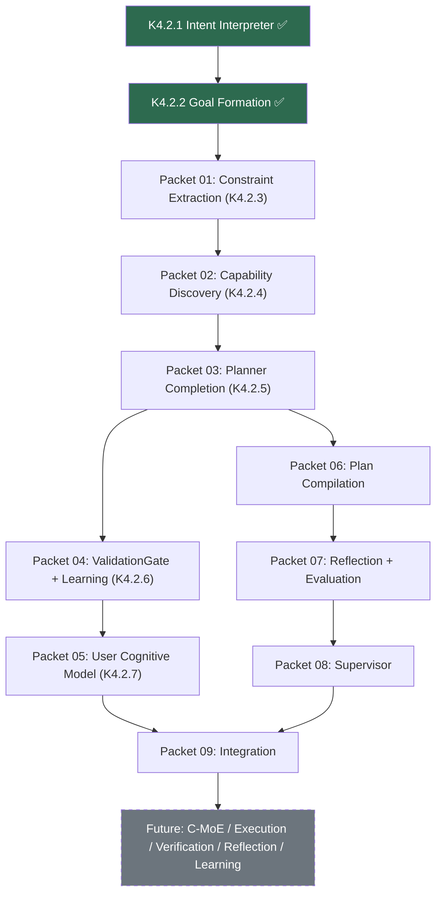

# OCBrain K4.3 — Architecture-to-Implementation Transition

**Date:** July 24, 2026
**Status:** DRAFT — awaiting approval
**Authority:** Architecture Governance
**Scope:** Implementation planning only — no architectural evolution permitted
**Prerequisite:** Architecture Evolution Directive v1.0 (approved)

---

## 0. Purpose and Constraints

This document transforms the frozen OCBrain architecture into independently implementable work packets. It introduces **zero new architecture**. Every implementation decision traces to an existing authoritative section.

**Source Documents (immutable — no modification permitted):**

| Document | Role |
|:---|:---|
| [OCBRAIN_KERNEL_CONSTITUTION.md](file:///c:/Users/Produ/Downloads/ocbrain-v4.1-main(3)/ocbrain-v4.1-main/OCBRAIN_KERNEL_CONSTITUTION.md) | Supreme authority (9-law) |
| [KERNEL_ARCHITECTURE_v1.0.md](file:///c:/Users/Produ/Downloads/ocbrain-v4.1-main(3)/ocbrain-v4.1-main/docs/architecture/KERNEL_ARCHITECTURE_v1.0.md) | Frozen Kernel engineering specification |
| [OCBRAIN_K4_COGNITIVE_RUNTIME_ARCHITECTURE.md](file:///c:/Users/Produ/Downloads/ocbrain-v4.1-main(3)/ocbrain-v4.1-main/docs/architecture/OCBRAIN_K4_COGNITIVE_RUNTIME_ARCHITECTURE.md) | Cognitive Runtime specification |
| [OCBRAIN_K4_1_FINAL_CONSOLIDATED_ARCHITECTURE.md](file:///c:/Users/Produ/Downloads/ocbrain-v4.1-main(3)/ocbrain-v4.1-main/docs/architecture/OCBRAIN_K4_1_FINAL_CONSOLIDATED_ARCHITECTURE.md) | Runtime foundation + delegation |
| [OCBRAIN_K4_2_COGNITIVE_FRONTEND_ARCHITECTURE_AUTHORITATIVE.md](file:///c:/Users/Produ/Downloads/ocbrain-v4.1-main(3)/ocbrain-v4.1-main/docs/architecture/OCBRAIN_K4_2_COGNITIVE_FRONTEND_ARCHITECTURE_AUTHORITATIVE.md) | Cognitive Front-End (frozen) |
| [OCBrain Architecture Evolution Directive.md](file:///c:/Users/Produ/Downloads/ocbrain-v4.1-main(3)/ocbrain-v4.1-main/docs/architecture/OCBrain%20Architecture%20Evolution%20Directive.md) | Evolution governance rules |
| [OCBRAIN_K5_FUTURE_COGNITIVE_EVOLUTION_ARCHITECTURE.md](file:///c:/Users/Produ/Downloads/ocbrain-v4.1-main(3)/ocbrain-v4.1-main/docs/architecture/OCBRAIN_K5_FUTURE_COGNITIVE_EVOLUTION_ARCHITECTURE.md) | K5 future extensions |
| [FUTURE_RESEARCH_VAULT.md](file:///c:/Users/Produ/Downloads/ocbrain-v4.1-main(3)/ocbrain-v4.1-main/docs/architecture/FUTURE_RESEARCH_VAULT.md) | Deferred research items |

**Constraints (from Evolution Directive):**
- No completed milestone redesigned
- No implementation shortcuts that alter architectural intent
- Planning produces abstract Work Units only — never invokes capabilities
- Capability selection belongs exclusively to future Cognitive Runtime (C-MoE)
- K4.2 scope: Intent Interpretation → Goal Formation → Constraint Extraction → Capability Discovery → Planning. Nothing beyond Planning.

---

## 1. Architecture Freeze — What is Already Implemented

### 1.1 Existing Implementation Inventory

| Subsystem | Status | Key Files | Architecture Source |
|:---|:---|:---|:---|
| **EventStream** | ✅ COMPLETE | `core/events/event_stream.py` | Kernel Architecture §15 |
| **UnifiedMemory** (L0-L4) | ✅ COMPLETE | `core/memory/unified_memory.py`, backends/ | Kernel Architecture §12-13 |
| **GovernanceKernel** | ✅ COMPLETE | `core/governance/governance_kernel.py` | Kernel Architecture §9 |
| **7 Governors** | ✅ COMPLETE | `core/governance/*.py` | Kernel Architecture §9, K4 §13 |
| **ExecutionRuntime** | ✅ COMPLETE | `core/runtime/execution_runtime.py` | Kernel Architecture §7 |
| **ExecutionContext** | ✅ COMPLETE | `core/runtime/execution_context.py` | Kernel Architecture §7.2 |
| **CancellationToken** | ✅ COMPLETE | `core/runtime/cancellation.py` | Kernel Architecture §7.4 |
| **WorkingMemory (L0)** | ✅ COMPLETE | `core/runtime/working_memory.py` | Kernel Architecture §7.3 |
| **WorkerRegistry** | ✅ COMPLETE | `core/runtime/worker_registry.py` | K4 §3 |
| **WorkflowRuntime** | ✅ COMPLETE | `core/workflow/runtime.py` | Kernel Architecture §8 |
| **WorkflowDefinition** | ✅ COMPLETE | `core/workflow/definition.py` | Kernel Architecture §8.1 |
| **CapabilityRegistry** | ✅ COMPLETE | `core/capabilities/registry.py` | Kernel Architecture §6 |
| **AdapterRuntime** | ✅ COMPLETE | `core/capabilities/adapter_runtime.py` | Kernel Architecture §6.2 |
| **Adapter Protocol** | ✅ COMPLETE | `core/capabilities/capability.py` | Kernel Architecture §6.1 |
| **ResourceManager** | ✅ COMPLETE | `core/capabilities/resource.py` | K1.6 (partial — K2.3 scope) |
| **AbstractCognitiveWorker** | ✅ COMPLETE | `core/workers/base.py` | K4 §3 |
| **MemoryCuratorWorker** | ✅ COMPLETE | `core/workers/curator.py` | K4 §4/§15 |
| **PlannerWorker** | ✅ COMPLETE | `core/workers/planner.py` | K4 §5 (legacy — pre-K4.2) |
| **ProviderMesh** | ✅ COMPLETE | `core/provider_mesh.py` | K4.1 §5 |
| **ContextAssemblyEngine** | ✅ COMPLETE | `core/memory/assembly.py` | K4.1 §6 |
| **RetrievalFusionEngine** | ✅ COMPLETE | `core/memory/retrieval/fusion.py` | K4 §4 |
| **KnowledgeEntry** | ✅ COMPLETE | `core/memory/knowledge_entry.py` | Kernel Architecture §12.3 |
| **Graph Memory** | ✅ COMPLETE | `core/memory/graph/*.py` | Kernel Architecture §13 |
| **K4.2.1 Intent Interpreter** | ✅ COMPLETE | `core/cognitive/intent.py` | K4.2 §2, §15 |
| **K4.2.2 Goal Formation** | ✅ COMPLETE | `core/cognitive/intent.py` | K4.2 §4, §15 |

### 1.2 Frozen Public Interfaces

These interfaces are implemented and SHALL NOT change:

| Interface | Signature | Source |
|:---|:---|:---|
| `interpret()` | `interpret_request(raw_text: str) → List[Goal]` | K4.2 §1 |
| `EventStream.append()` | `append(event_type, source, payload)` | Kernel Architecture §15 |
| `UnifiedMemory.write()` | `write(entry: KnowledgeEntry)` | Kernel Architecture §12 |
| `GovernanceKernel.evaluate_action()` | `evaluate_action(action: GovernanceAction) → GovernanceResult` | Kernel Architecture §9 |
| `ExecutionRuntime.invoke()` | `invoke(worker_type, context) → WorkerResult` | Kernel Architecture §7 |
| `WorkflowRuntime.execute()` | `execute(definition, context) → WorkflowResult` | Kernel Architecture §8 |

### 1.3 Frozen Resource Contracts

| Resource | Fields | Source |
|:---|:---|:---|
| `CognitiveArtifact` | `resource_id, produced_by, derived_from, lifecycle_state` | K4.1 Part IV |
| `Intent` | `resource_id, produced_by, raw_request, hypotheses, selected, confidence, dimensions, ontology_ref, derived_from, lifecycle_state` | K4.2 §12 |
| `Goal` | `resource_id, produced_by, intent_id, structured_form, sub_goals, alternatives, confidence, derived_from, lifecycle_state` | K4.2 §12 |
| `IntentHypothesis` | `label, score, embedding_ref` | K4.2 §12 |
| `KnowledgeEntry` | Per Kernel Architecture §12.3 | Kernel Architecture |

### 1.4 Frozen Events

| Event | Status | Source |
|:---|:---|:---|
| `cognitive.intent_hypotheses_generated` | ✅ Implemented | K4.2 §11 |
| `cognitive.intent_interpreted` | ✅ Implemented | K4.2 §11 |
| `cognitive.goal_formed` | ✅ Implemented | K4.2 §11 |
| `cognitive.intent_clarified` | 🔲 K4.2.5 | K4.2 §11 |
| `cognitive.goal_refined` | 🔲 K4.2.5 | K4.2 §11 |
| `cognitive.constraints_extracted` | 🔲 K4.2.3 | K4.2 §11 |
| `cognitive.capabilities_discovered` | 🔲 K4.2.4 | K4.2 §11 |
| `cognitive.planner_impasse` | 🔲 K4.2.5 | K4.2 §11 |
| `cognitive.pattern_learned` | 🔲 K4.2.6 | K4.2 §11 |
| `cognitive.ontology_evolved` | 🔲 K4.2.6 | K4.2 §11 |
| `cognitive.user_model_updated` | 🔲 K4.2.7 | K4.2 §11 |

### 1.5 Frozen State Machines

| Artifact | Lifecycle | Source |
|:---|:---|:---|
| Intent | `draft → interpreted → [clarification_pending → clarified] → superseded` | K4.2 §13 |
| Goal | `draft → verified → [refinement_pending → refined] → compiled → superseded` | K4.2 §13 |
| Learning | `observed → accumulated → candidate → gated → [promoted \| rejected]` | K4.2 §13 |

### 1.6 Frozen Ownership Boundaries

Per K4.2 §5 and Evolution Directive:

| Owner | Responsibility | Boundary |
|:---|:---|:---|
| Intent Interpreter | Everything up to `Goal` | K4.2 §5 |
| Planner | Everything from `Goal` to `ExecutionPlan` | K4.2 §5 |
| Plan Compiler | Everything from `ExecutionPlan` to `WorkflowDefinition` | K4.2 §5 |
| Kernel | Execution, event durability, memory persistence | K4.1 Part VII |
| GovernanceKernel | All policy evaluation | K4.1 Part VII |
| Future C-MoE | Expert selection, capability routing | Evolution Directive |

---

## 2. Implementation Packets

### Packet 01 — K4.2.3: Constraint Extraction + Planner Contracts

**Status:** NOT STARTED
**Architecture:** K4.2 §5, §12, §15 (K4.2.3)
**Module:** `core/cognitive/planner.py`
**Dependencies:** K4.2.2 (✅ complete)

**Scope:**
- `Constraint` dataclass (K4.2 §12: `kind, relation, source, rationale, validated_by`)
- `PlannerRequest` dataclass (K4.2 §12: `goal_id, goal, context_view_ref, hints`)
- `PlannerHint` dataclass (K4.2 §12: `kind, weight, source`)
- `PlannerResult` dataclass (K4.2 §12: `status, execution_plan, impasse_detail`)
- `_extract_constraints(goal) → List[Constraint]` (K4.2 §5)
- Event: `cognitive.constraints_extracted` (K4.2 §11)

**Explicitly forbidden:**
- Capability selection (Evolution Directive: "belongs exclusively to the future Cognitive Runtime")
- Execution logic
- Work Graph construction
- Expert routing

**Completion criteria:**
- Given a Goal, produces a well-formed `List[Constraint]`
- Contradictory hard constraints yield `PlannerResult.status = "rejected_precheck"`
- Event `cognitive.constraints_extracted` emitted
- All existing tests pass (773+)

---

### Packet 02 — K4.2.4: Capability Discovery

**Status:** NOT STARTED
**Architecture:** K4.2 §5, §12, §15 (K4.2.4)
**Module:** `core/cognitive/planner.py`
**Dependencies:** Packet 01 (K4.2.3)

**Scope:**
- `CapabilityRequest` handling (K4.2 §12: `subgoal_ref, description, applicable_constraints, context_view_ref`)
- Description-and-schema matching against existing `CapabilityRegistry`
- Event: `cognitive.capabilities_discovered` (K4.2 §11)

> [!IMPORTANT]
> Per Evolution Directive: Capability *discovery* (finding what's available) belongs to K4.2. Capability *selection* (choosing which expert to invoke) belongs exclusively to the future Cognitive Runtime (C-MoE). This packet discovers candidates — it does NOT select or invoke them.

**Completion criteria:**
- Resolves to same-or-better candidate set as exact-match baseline on fixed test set (K4.2 §15)
- Event `cognitive.capabilities_discovered` emitted
- No capability invoked, no expert selected
- All existing tests pass

---

### Packet 03 — K4.2.5: Planner Completion

**Status:** NOT STARTED
**Architecture:** K4.2 §2, §5, §14, §15 (K4.2.5)
**Module:** `core/cognitive/planner.py`, `core/governance/governance_kernel.py`
**Dependencies:** Packet 02 (K4.2.4)

**Scope:**
- HTN reframing: Skill preconditions wired into `_decompose()` (K4.2 §5)
- Impasse→subgoaling path (K4.2 §5, K4.2-R §4.9)
- `ImpasseRecord` dataclass
- `ClarificationPolicy` rule added to `OrchestrationGovernor` (K4.2 §2) — not a new governor
- Events: `cognitive.intent_clarified`, `cognitive.goal_refined`, `cognitive.planner_impasse` (K4.2 §11)
- Bounded clarification retry (K4.2 §14)

**Explicitly forbidden:**
- New governors (ClarificationPolicy is a rule inside existing OrchestrationGovernor)
- Execution logic
- Work Graph construction

**Completion criteria:**
- Full `Intent → ... → ExecutionPlan` pipeline produces an uncompiled ExecutionPlan
- Low-confidence fixture escalates exactly once (bounded-loop check, K4.2 §14)
- Event trail complete
- All existing tests pass

---

### Packet 04 — K4.2.6: Shared ValidationGate + Learning Wiring

**Status:** NOT STARTED
**Architecture:** K4.2 §6, §8, §12, §15 (K4.2.6)
**Module:** `core/cognitive/learning.py` (new)
**Dependencies:** Packet 03 (K4.2.5)

**Scope:**
- One shared `ValidationGate` function serving three content domains (Skills, Intent Ontology, User Cognitive Model) — K4.2 §6
- `LearningRecord` dataclass (K4.2 §12)
- `CognitiveDecision` dataclass (K4.2 §12)
- Events: `cognitive.pattern_learned`, `cognitive.ontology_evolved` (K4.2 §11)
- Evolution pipeline: `observed → accumulated → candidate → gated → [promoted | rejected]` (K4.2 §13)

**Explicitly forbidden:**
- Three parallel gate implementations (K4.2 §6/§16 item 1 explicitly closes this risk)
- New memory layers
- New governors

**Completion criteria:**
- Synthetic recurring-pattern fixture promotes only after clearing ValidationGate
- Contradiction fixture blocked pre-promotion
- Same gate function confirmed to serve all three content domains via one code path (K4.2 §15)
- All existing tests pass

---

### Packet 05 — K4.2.7: User Cognitive Model

**Status:** NOT STARTED
**Architecture:** K4.2 §3, §15 (K4.2.7)
**Module:** `core/cognitive/user_model.py` (new)
**Dependencies:** Packet 04 (K4.2.6)

**Scope:**
- Read-mostly projection over L1/L3 preference/pattern entries (K4.2 §3)
- Write path through shared ValidationGate (K4.2 §6)
- Two new `EvolutionGovernor.SELF_MODIFYING_ACTIONS`: `user_model_propose`, `user_model_promote`
- Event: `cognitive.user_model_updated` (K4.2 §11)
- Privacy invariants: inspectable, deletable, excluded from cross-instance advisory (K4.2 §3)

**Completion criteria:**
- Projection assembly is stable and cacheable
- Promoted entries governed through shared ValidationGate
- Privacy invariants enforced
- No cross-instance advisory path touches this data (K4.2 §15)
- All existing tests pass

---

### Packet 06 — Plan Compilation

**Status:** NOT STARTED (existing `PlannerWorker` is legacy pre-K4.2)
**Architecture:** K4 §15, K4.2 §1
**Module:** `core/cognitive/compiler.py` (new)
**Dependencies:** Packet 03 (K4.2.5)

**Scope:**
- `compile(plan: ExecutionPlan) → WorkflowDefinition` — the third public entrypoint (K4.2 §1)
- Governance gate: `GovernanceAction(action_type="plan_compile")` (K4 §15)
- Maps `ExecutionPlan` steps → `WorkflowDefinition` nodes/edges
- This is the **single seam** between reasoning and execution (K4.2 §1 line 23)

**Explicitly forbidden:**
- Reasoning (K4 §16: "execution never plans")
- Capability invocation
- Memory writes (beyond governance logging)

**Completion criteria:**
- Given an `ExecutionPlan`, produces a valid `WorkflowDefinition`
- Governance gate properly invoked
- `GovernanceVerdict.REJECT` prevents compilation
- `GovernanceVerdict.ESCALATE` surfaces to SupervisorWorker
- All existing tests pass

---

### Packet 07 — Reflection + Evaluation Workers

**Status:** NOT STARTED
**Architecture:** K4 §7, §8
**Module:** `core/workers/reflection.py`, `core/workers/evaluator.py` (new)
**Dependencies:** Packet 06 (Plan Compilation)

**Scope:**
- `ReflectionWorker(AbstractCognitiveWorker)` — post-execution only (K4 §7)
- `EvaluatorWorker(AbstractCognitiveWorker)` — produces `EvaluationRecord` (K4 §8)
- Brier-style calibration tracking (K4 §8)
- Memory writes through `UnifiedMemory.write()` + `GovernanceKernel` (K4 §13)

**Explicitly forbidden:**
- Continuous reflection loops (K4 §7: "post-execution only")
- Mutating history (K4 §16 invariant 6)
- Changing evaluated facts (K4 §16 invariant 7)

**Completion criteria:**
- ReflectionWorker produces `ReflectionRecord` from `EvaluationRecord`
- EvaluatorWorker produces `EvaluationRecord` with calibration data
- Memory writes governed
- All existing tests pass

---

### Packet 08 — Supervisor Worker

**Status:** NOT STARTED
**Architecture:** K4 §9
**Module:** `core/workers/supervisor.py` (new)
**Dependencies:** Packet 07 (Reflection + Evaluation)

**Scope:**
- `SupervisorWorker(AbstractCognitiveWorker)` — monitors via EventStream (K4 §9)
- Failure recovery / retry via new `ExecutionRuntime.invoke()` call (K4 §9)
- Escalation: surfaces `GovernanceVerdict.ESCALATE` for HITL
- Loop prevention: never retries unchanged rejected plan (K4 §16 invariant 9)

**Completion criteria:**
- Detects failure events and initiates recovery
- Escalation surfaced correctly
- Invariant 9 enforced (no silent retry of rejected plan)
- All existing tests pass

---

### Packet 09 — Integration: Full Cognitive Pipeline

**Status:** NOT STARTED
**Dependencies:** Packets 01–08

**Scope:**
- End-to-end integration test: `raw_text → interpret() → plan() → compile() → WorkflowDefinition`
- Verify all events emitted in correct order
- Verify all lifecycle transitions
- Verify governance gates at Plan Compilation
- Verify clarification bounded-retry
- Verify SupervisorWorker recovery path

**Completion criteria:**
- Full pipeline fixture passes
- Event trail complete and replayable
- All 9 K4 §16 invariants verified by test
- All existing tests pass (773+)

---

## 3. Future Architectural Placeholders

> [!IMPORTANT]
> Per Evolution Directive: These are **architectural placeholders only**. No implementation planning permitted. No implementation packets produced. They exist to document the long-term cognitive loop and prevent premature implementation.

| Future Milestone | Responsibility | Evolution Directive Section |
|:---|:---|:---|
| **Cognitive Runtime (C-MoE)** | Expert selection, dynamic routing, capability composition | §277-303 |
| **Execution Runtime** | Cooperative execution, Work Graph, continuation, suspend/resume | §322-380 |
| **Verification Runtime** | Structural/semantic verification, acceptance policies, consensus | §417-433 |
| **Reflection Runtime** | Execution critique, strategy evaluation, failure diagnosis | §435-447 |
| **Adaptive Learning** | Experience replay, routing optimization, failure learning | §455-468 |

These milestones depend on K4.2 completion. They SHALL NOT influence K4.2 implementation decisions.

---

## 4. Dependency Graph

---

## 5. Implementation Sequence

### Phase A — Cognitive Front-End Completion (Sequential)

| Order | Packet | Can Parallel? | Rationale |
|:---|:---|:---|:---|
| 1 | Packet 01 (K4.2.3 Constraints) | No — depends on K4.2.2 | First Planner contracts |
| 2 | Packet 02 (K4.2.4 Capability Discovery) | No — depends on Packet 01 | Extends Planner |
| 3 | Packet 03 (K4.2.5 Planner Completion) | No — depends on Packet 02 | Full Planner |

### Phase B — Parallel Tracks

| Order | Packet | Can Parallel? | Rationale |
|:---|:---|:---|:---|
| 4a | Packet 04 (K4.2.6 Learning) | ✅ Parallel with 4b | Independent of compilation |
| 4b | Packet 06 (Plan Compilation) | ✅ Parallel with 4a | Independent of learning |
| 5 | Packet 05 (K4.2.7 User Model) | No — depends on Packet 04 | Needs ValidationGate |

### Phase C — Workers + Integration (Sequential)

| Order | Packet | Can Parallel? | Rationale |
|:---|:---|:---|:---|
| 6 | Packet 07 (Reflection + Evaluation) | No — depends on Packet 06 | Needs compiled plans |
| 7 | Packet 08 (Supervisor) | No — depends on Packet 07 | Monitors workers |
| 8 | Packet 09 (Integration) | No — depends on all | Full pipeline validation |

---

## 6. Amendment Process

Per Constitution Part VIII and Evolution Directive:

> No architectural amendment is permitted unless implementation evidence demonstrates a genuine deficiency.

**Required evidence before any amendment:**
1. Specific test case or integration scenario that fails
2. Citation of the architectural section that is deficient
3. Demonstration that no existing mechanism covers the gap
4. Proposed minimal change (extend/clarify/refine only)
5. Impact assessment on all downstream packets

---

## 7. Validation

| Check | Result |
|:---|:---|
| No architectural concepts added | ✅ |
| Every packet traces to approved architecture | ✅ |
| All dependencies explicit | ✅ |
| No ambiguity requiring implementation-time architectural decisions | ✅ |
| K4.2 scope unchanged (Intent → Goal → Constraints → Discovery → Planning) | ✅ |
| Planning remains capability-agnostic | ✅ |
| Capability selection deferred to future C-MoE | ✅ |
| No completed milestone redesigned | ✅ |
| Roadmap executable incrementally | ✅ |
| Constitution and Kernel Architecture preserved | ✅ |
