# OCBrain Workspace & UX/UI Architecture

## AUTHORITATIVE IMPLEMENTATION BASELINE

| Field | Value |
|-------|-------|
| **Status** | AUTHORITATIVE |
| **Repository baseline** | `c67187a` (main) |
| **Last verified** | 2026-09-16 (final consistency & authority pass) |
| **Supersedes** | `ocbrain_ux_architecture_report.md`, `ocbrain_architecture_corrections.md` |

> This document is the single authoritative architecture baseline for OCBrain Workspace implementation. Superseded predecessor documents must not be used as independent implementation sources.

---

## Table of Contents

- [A. Purpose and Scope](#a-purpose-and-scope)
- [B. Repository Evidence / Verification Basis](#b-repository-evidence--verification-basis)
- [C. Canonical Terminology](#c-canonical-terminology)
- [D. Workspace Domain Model](#d-workspace-domain-model)
- [E. Source-of-Truth Model](#e-source-of-truth-model)
- [F. Trust vs Authority](#f-trust-vs-authority)
- [G. Capability Invocation Architecture](#g-capability-invocation-architecture)
- [H. Command Architecture / Lifecycle](#h-command-architecture--lifecycle)
- [I. File Architecture](#i-file-architecture)
- [J. Artifact Architecture](#j-artifact-architecture)
- [K. Verification Architecture](#k-verification-architecture)
- [L. Identity Architecture](#l-identity-architecture)
- [M. Computational Level](#m-computational-level)
- [N. Resource Architecture](#n-resource-architecture)
- [O. Workspace Read/Write Architecture](#o-workspace-readwrite-architecture)
- [P. Search / Security Model](#p-search--security-model)
- [Q. Frontend Architecture](#q-frontend-architecture)
- [R. AG-UI / MCP Interoperability](#r-ag-ui--mcp-interoperability)
- [S. Dependency Graph](#s-dependency-graph)
- [T. P0/P1/P2/P3 Roadmap](#t-p0p1p2p3-roadmap)
- [U. Kernel-Freeze Boundary](#u-kernel-freeze-boundary)
- [V. Open Decisions](#v-open-decisions)
- [W. Decision / Evidence Ledger](#w-decision--evidence-ledger)
- [Appendix: Architectural Risks and Anti-Patterns](#appendix-architectural-risks-and-anti-patterns-normative)
- [Appendix: Testing Requirements](#appendix-testing-requirements-normative)
- [Appendix: 21 Architectural Invariants](#appendix-21-architectural-invariants-normative)
- [Appendix: Predecessor Documents](#appendix-predecessor-documents)
- [Appendix: Consolidation Coverage Audit](#appendix-consolidation-coverage-audit)

---

## A. Purpose and Scope

OCBrain is transitioning from a single-conversation browser chat interface to a **cognitive workspace** — a structured environment through which a human interacts with OCBrain across Projects, Sessions, Discussions, Tasks, Files, Artifacts, C-MoE, Memory, Context, Verification, Identity, Components, Execution, and Computational Resources.

**The browser is the first client. It must not become the definition of the system.**

### What this document covers

- Workspace domain model and persistence
- CQRS command/query/event architecture
- File and Artifact lifecycle and semantics
- Computational Level / Resource Policy / Resource Envelope chain
- Capability invocation and Governance integration
- Verification, Identity, and Trust models
- Frontend technology and protocol recommendations
- Implementation roadmap (P0 through DEFER)

### What this document does NOT cover

- Kernel internals (Orchestrator, Planner, Compiler, WorkflowRuntime) — these are frozen or near-frozen
- C-MoE research (see `docs/studies/OCBRAIN_K4_3_CMOE_ARCHITECTURE_STUDY.md`)
- Production deployment, infrastructure, or CI/CD

### Statement classification

Throughout this document, statements are classified as:

| Label | Meaning |
|-------|---------|
| `NORMATIVE` | Binding **architecture** requirement. Violating it breaks the architecture |
| `NORMATIVE UX` | Binding **Workspace UX** requirement. Binding on the workspace product, but a different kind of obligation — it constrains what the user must be able to do, not how the system must be built |
| `REPO FACT` | Verified against live repository code |
| `RECOMMENDATION` | Preferred approach, subject to prototype validation |
| `HEURISTIC` | Initial value, requires calibration |
| `OPEN DECISION` | Not yet resolved |
| `HISTORICAL` | Context from earlier development phases |

---

## B. Repository Evidence / Verification Basis

### B.1 Live baseline

| Property | Value |
|----------|-------|
| HEAD | `c67187a` |
| Branch | `main` |
| Latest commit | Add files via upload (this document + predecessors) |
| Prior HEAD | `fd03b63` (Merge security/ctx-export-001 into main) |
| Baseline at first authoring | `aae1310` — superseded, see below |

**Baseline movement since first authoring (REPO FACT).** This document was originally
written against `aae1310`. Three commits have landed since, all verified as a clean
fast-forward (`git merge-base --is-ancestor`):

| Commit | Change | Effect on this document |
|--------|--------|------------------------|
| `e41a820` / `fd03b63` | CTX-EXPORT-001 path-traversal-to-arbitrary-deletion fix | §B.3 blocker list updated |
| `69375c9` | `core/workspace/domain.py` added (554 lines) | New §B.6 conformance audit |
| `b97188c` / `c67187a` | This document and its two predecessors committed | §Appendix: Predecessor Documents corrected |

All `REPO FACT` line-number citations in §W.4 were re-verified against `c67187a` and
confirmed accurate at the exact lines cited.

### B.2 Active branches (REPO FACT)

Ten remote branches exist at `c67187a`. Full verified list:

| Branch | Status |
|--------|--------|
| `main` | Primary. HEAD `c67187a` |
| `feature/verification-critic-evidence-phase-c` | Active. Verification subsystem |
| `sandbox-fabric` | Active. Sandbox execution backends |
| `eval-lab/research-and-architecture` | Active. Evaluation framework |
| `security/ctx-export-001` | Merged into `main` at `fd03b63` |
| `security/rce-001-modules-new-hotfix` | Merged (historical) |
| `fix/ctx-scope-001-caller-wiring` | Merged (historical) |
| `docs/ctx-auth-001b-freeze-classification-sep2026` | Merged (historical) |
| `docs/debt-020-parallel-branch-superseded` | Superseded, retained |
| `fix/debt-020-completion-semantics-sep2026` | Superseded, retained (PR closed unmerged) |

No branch other than `main` contains any Workspace architecture artifact.

### B.3 Kernel freeze status (REPO FACT)

Near freeze. Kernel v1.0 verdict of record remains **NOT_FREEZE_READY**
(`docs/studies/OCBRAIN_KERNEL_V1_FREEZE_AUDIT_SEPT_2026.md`). Open items:

| Item | Status | Freeze classification |
|------|--------|----------------------|
| **CTX-AUTH-001b** | Open. Parser/authority acceptance. Closure depends on REM-004 authority taxonomy | Under active decision (Moncif) |
| **CTX-EXPORT-001** | **Partially fixed** at `e41a820`. Path-traversal-to-arbitrary-deletion closed via `.isidentifier()` validation. Bundle signature/checksum/content validation and transactional rollback on `overwrite=True` **remain open** | **Explicitly unresolved** — no document classifies this item for freeze purposes by name |
| **DEBT-024** | Open. `SupervisorWorker._attempt_retry()` has zero production call sites | Non-blocking, disposition pending |
| **DEBT-025** | Open. `interface/api.py` has no authentication on any endpoint | Non-blocking, deployment-model-dependent |

DEBT-025 is a direct dependency of this document's §G.4 fail-closed analysis and §P.2
search authorization model: **no Principal system exists in the repository today.**

### B.4 Repository structure (REPO FACT)

- **Composition root**: `main.py` (489 lines). Wires: UnifiedMemory → GovernanceKernel (7 governors) → EventStream (SQLiteEventStore) → CapabilityRegistry → ResourceManager → AdapterRuntime → WorkerRegistry → ExecutionRuntime → WorkflowRuntime → Orchestrator
- **K4.2 cognitive front-end**: `use_k42_frontend=True` by default. Pipeline: `interpret() → Goal → plan() → ExecutionPlan → compile() → WorkflowDefinition → WorkflowRuntime.execute()`
- **API**: 28 endpoints total — 22 in `interface/api.py`, 6 in `core/brain_api.py` under `/brain/v2/`
- **Frontend**: 3 static HTML files with inline JavaScript. No build toolchain
- **Missing entirely**: Project/Session/Discussion/File/Artifact endpoints, WebSocket support, workspace search, HITL approval flows

### B.5 Key code dimensions (REPO FACT)

| Component | File | Lines | Status |
|-----------|------|-------|--------|
| Orchestrator | `core/orchestrator.py` | 831 | Implemented |
| Intent | `core/cognitive/intent.py` | 1105 | Implemented |
| Planner | `core/cognitive/planner.py` | 1654 | Implemented |
| Compiler | `core/cognitive/compiler.py` | 425 | Implemented |
| UnifiedMemory | `core/memory/unified_memory.py` | ~58KB | Implemented |
| GovernanceKernel | `core/governance/governance_kernel.py` | 451 | Implemented |
| EventStream | `core/events/event_stream.py` | 540 | Implemented (SQLite WAL) |
| ExecutionBudget | `core/runtime/execution_budget.py` | 242 | Time-only |
| UserCognitiveModel | `core/cognitive/user_model.py` | 327 | Implemented, unwired |
| SelfModel | `core/meta/self_model.py` | Static dict | Stale ("3.01") |
| AdapterRuntime | `core/capabilities/adapter_runtime.py` | 195 | Implemented |
| Capability types | `core/capabilities/capability.py` | 204 | Only LLM_COMPLETION registered |
| Sandbox contracts | `core/sandbox/contracts.py` | 229 | Implemented |
| FILE_ACCESS | `core/capabilities/capability.py:73` | — | Declared, zero adapters |
| Workspace domain model | `core/workspace/domain.py` | 554 | **Added `69375c9`. Unwired, untested, non-conformant — see §B.6** |

### B.6 `core/workspace/domain.py` conformance audit (REPO FACT)

A Workspace domain model landed on `main` at `69375c9`, after this document's original
baseline. It is **not** a realization of this document. Verified state:

- **Not wired.** Repo-wide grep finds zero importers outside the file itself.
- **Not tested.** No test file references it.
- **Anchored to a superseded source.** Every `Architecture:` docstring cites
  "UX Architecture Report §J / §L / §M / §N / §20 / §26 / §43" — the predecessor
  marked SUPERSEDED — DO NOT USE FOR IMPLEMENTATION. None cite this document.
- Namespace-package layout (no `__init__.py`) matches existing `core/` convention and
  imports cleanly. That is not a defect.

**Conformance gaps against this document's NORMATIVE sections.** Recorded, not fixed —
this pass has no authority to modify production code:

| # | Code | Conflicts with | Nature |
|---|------|---------------|--------|
| 1 | `VerificationStatus = {UNVERIFIED, VERIFIED, CONTRADICTED, SUPERSEDED}` — one flat enum | §K.1 | Collapses three **independent** dimensions into a linear state. Also silently resolves Open Decision #9 (verification vocabulary) in favour of `CONTRADICTED` |
| 2 | `File` has no state field; only `deleted: bool` | §I.3, §W.1 #13 | **QUARANTINED is unrepresentable.** Quarantine-before-acceptance cannot be enforced by this model |
| 3 | `File` has no `version` field | §I.7 | Optimistic concurrency via version is unimplementable |
| 4 | `File` has `uploaded_by` only | §D.4 | `created_by` + `owned_by` principal IDs required from v1 |
| 5 | `Artifact` has `version: int` + `modified_at`, mutated in place | §J.4 | Applies File-mutation semantics to Artifacts; no `derived_from` / `supersedes` |
| 6 | `Artifact` docstring: "files are inputs, artifacts are outputs" | §J.1 | Artifacts are **both** inputs and outputs |
| 7 | `ResourceBudget` — "hard ceilings" for tokens, cost, duration, tool calls alike | §N.2, §N.3 | Tokens are not pre-reservable and cost is derived; uniform hard-ceiling framing is wrong |
| 8 | No `ResourceEnvelope` type; `ResourceBudget` used instead | §C, §N.1 | §C defines Envelope and Budget as distinct concepts that must not be conflated; the requested → effective **envelope** step has no representation |
| 9 | `ResourceAllocation` docstring: "Actual resources consumed" | §C, §N.4 | §C separates Allocation from Usage explicitly; §N.4 separates Allocated from Actual |
| 10 | No `Execution` class, despite the module docstring claiming one | §D.1, §D.3 | Declared, absent |
| 11 | No Command envelope type | §H.2 | The NORMATIVE idempotency key has no domain representation |

**Disposition: OPEN DECISION.** Either the module is reworked to conform to this
document, or a documented exception is recorded. Until one of those happens it must not
be treated as the Workspace domain model, and no component should import it.
This document remains authoritative; the code does not amend it.

---

## C. Canonical Terminology

| Canonical Name | Meaning | Legacy/Synonyms | Must NOT be confused with |
|---------------|---------|-----------------|--------------------------|
| **Project** | Long-lived workspace container | — | Session |
| **Session** | Active working period within a Project | — | Discussion, connection |
| **Discussion** | Branchable conversation thread within a Session | Conversation, chat | Session |
| **Task** | Goal-directed unit of work | — | Execution, Job |
| **Execution** | A single attempt to fulfill a Task | Run, attempt | Task |
| **File** | A data object in the workspace (uploaded/imported) | Attachment, document | Artifact |
| **Artifact** | Provenance-bearing, versioned object (can be input or output) | Output, result | File |
| **Context** | Scoped state available to cognitive processing | — | Memory |
| **Memory** | Persistent semantic knowledge (L0–L4 tiers) | Knowledge, recall | Context, persistence |
| **Capability** | A typed action the system can perform | Skill, tool | Worker, Adapter |
| **Worker** | A cognitive unit that performs capability-mediated work | Agent, expert | Adapter |
| **Adapter** | Concrete implementation of a Capability | Provider, connector | Worker |
| **AdapterRuntime** | Execution service for capability adapters | — | Governance boundary |
| **Governance** | Authorization and safety enforcement (GovernanceKernel) | Permissions, policy | Resource Policy |
| **Verification** | Assessment of claim/artifact truth status | Validation, confidence | Critique, opinion |
| **Identity** | System self-model derived from component observations | Self-model, introspection | Authentication, Principal |
| **Computational Level** | User intent for computational intensity (LOW/MEDIUM/HIGH/MAX) | Effort, thinking | Model tier, model name |
| **Resource Policy** | System-derived rules from Level + context + governance | — | Governance constraints |
| **Resource Envelope** | Per-task ceilings derived from Resource Policy | Budget limits | Budget, Allocation |
| **Budget** | Total permitted resource consumption | Allowance | Envelope, Allocation |
| **Allocation** | Resources assigned to an active execution | Assignment | Budget, Usage |
| **Usage** | Resources actually consumed (measured) | Consumption | Allocation |
| **Projection** | Derived read model for UI display | View, cache | Authoritative source |
| **Event** | Immutable authoritative domain fact in EventStream | Record, log entry | Observation |
| **Observation** | Runtime telemetry / transient progress data | Metric, signal | Event (authoritative) |
| **Command** | A mutating instruction with identity for idempotency | Action, request | Query |
| **Principal** | Authenticated identity that owns resources and issues commands | User, account | OCBrain Identity |

---

## D. Workspace Domain Model

### D.1 Hierarchy (NORMATIVE)

```
Project
  └─ Session
       └─ Discussion
            └─ Message
            └─ Task
                 └─ Execution
                      └─ Artifact
  └─ File (project-scoped)
```

### D.2 Context inheritance (NORMATIVE)

Context flows **downward only**. Upward promotion requires explicit Governance authorization.

```
Project context → Session context → Discussion context → Task → Execution
```

Sibling discussions are isolated. Zero sibling leakage.

### D.3 Domain primitives

| Primitive | Owner | Scope | Persistence | Lifecycle |
|-----------|-------|-------|-------------|-----------|
| Project | User | Global | Durable | ACTIVE → ARCHIVED → DELETED |
| Session | User | Project | Durable | ACTIVE → PAUSED → CLOSED → ARCHIVED |
| Discussion | User/System | Session | Durable | ACTIVE → PAUSED → ARCHIVED |
| Message | System | Discussion | Durable | Append-only |
| Task | System | Session/Discussion | Durable | PLANNED → AWAITING_APPROVAL → APPROVED → EXECUTING → COMPLETED/FAILED/CANCELLED |
| Execution | System | Task | Durable | Wraps ExecutionContext/ExecutionOutcome |
| File | User/System | Project | Durable | QUARANTINED → ACCEPTED → ACTIVE → ARCHIVED → DELETED |
| Artifact | System | Project | Durable | Created with lineage, versioned |
| ResourcePolicy | System | Task | Derived | Computed before execution |
| ResourceEnvelope | System | Task | Derived | Computed from policy |

### D.4 Ownership (NORMATIVE)

All user-owned workspace entities carry `created_by` and `owned_by` principal IDs from v1. Single-user v1 uses a default principal; multi-user RBAC requires only populating real principal IDs.

### D.5 Persistence ≠ Memory (NORMATIVE)

Workspace persistence (chat history, files, artifacts) is NOT memory. Memory promotion requires explicit, governed gates. The User Cognitive Model is personalization state — never an authority source, never shared into project memory.

---

## E. Source-of-Truth Model

### E.1 Authority hierarchy (NORMATIVE)

A projection is authoritative **as a workspace read model** — it is what the UI should display. It is NOT authoritative for the underlying domain fact.

**Rule**: If a projection disagrees with its authoritative source, the source wins. The projection must be rebuilt, not the source corrected.

| Truth Domain | Authoritative Source | Projection Role | UI Displays |
|-------------|---------------------|----------------|------------|
| Historical truth | EventStream (immutable, append-only) | Derived from events | Projection |
| Execution truth | Runtime (ExecutionRuntime, WorkflowRuntime) | Reflects runtime state | Projection |
| Authorization truth | GovernanceKernel (`evaluate_action`) | Never projected as overridable | Status only |
| Verification truth | Verification system | Read-only display | Projection |
| File-content truth | File storage / File Adapter | Metadata projection, not content | Projection + on-demand content |
| Memory truth | UnifiedMemory (L0–L4) | Not projected; queried directly | Query results |
| Resource consumption | Runtime + Watchdog + ExecutionBudget | Summary projection | Projection |
| Identity truth | Component observations + runtime state | Snapshot projection | Projection |

### E.2 Event vs Observation (NORMATIVE)

| Category | Destination | Examples | Authority |
|----------|------------|---------|-----------|
| Authoritative domain events | EventStream (append-only) | Task created, file accepted, execution completed | Authoritative historical record |
| Operational observations | Telemetry / observation stream | Token throughput, model latency, health scores | Operational, non-authoritative |

Not every state transition becomes an EventStream event. Runtime telemetry and transient progress are observations, not authoritative domain events.

### E.3 Implementation-boundary matrix (NORMATIVE)

Which layer owns each concern, what is authoritative for it, and the specific shortcut
that must never be taken. Layer names match the repository where one exists; concerns
with no implementation yet are marked.

| Concern | Owning layer | Authoritative source | Forbidden shortcut |
|---------|-------------|---------------------|-------------------|
| Authentication | Application (**not implemented** — DEBT-025) | Principal system (**does not exist**) | UI-defined identity |
| Authorization | Governance | `GovernanceKernel.evaluate_action()` | Frontend-evaluated permission |
| Command handling | Application Layer (**not implemented**) | Command log + emitted events | Direct runtime call from UI |
| Domain state | Domain / Persistence (**not implemented** — P0 #2) | Domain store + events per §O.1.1 | Mutating a projection instead of the domain |
| Events | EventStream (`core/events/event_stream.py`) | EventStream, append-only | UI-emitted authoritative events |
| Projections | Query / Projection (**not implemented**) | Derived read model only | Treating a projection as domain truth |
| Resource Policy | Resource layer (**not implemented**) | Policy engine, per §N.1 | C-MoE overriding policy |
| Router | `core/model_router.py` | Router / model selection | Bypassing Governance to reach a provider |
| Runtime | `core/runtime/`, `core/workflow/` | Runtime state | UI controlling runtime directly |
| Capability execution | `AdapterRuntime` (`core/capabilities/adapter_runtime.py`) | Runtime execution result | Treating AdapterRuntime as an authorization boundary (§G.2) |
| Sandboxed execution | `core/sandbox/` | `SandboxBackend` result + `ArtifactManifest` | Inline execution outside the sandbox |
| Files | File subsystem (**not implemented** — FILE_ACCESS declared, zero adapters) | File store | Raw filesystem path as identity (§I.1) |
| Verification | Verification (`core/verification/`, unmerged branch) | Verification subsystem | Inferring trust from provenance alone (§F.1) |
| Memory | `UnifiedMemory` (`core/memory/`) | UnifiedMemory L0–L4, queried directly | Treating workspace persistence as memory (§D.5) |
| Identity | `core/meta/self_model.py` (static) | Component / runtime observations | C-MoE owning or defining Identity (§L.1) |
| Frontend | Client | Projection / query state | Direct mutation of backend truth |

**"Not implemented" is a statement about today, not a permission.** A concern with no
owning implementation still has an owning *layer*; building it elsewhere because the
layer does not exist yet is the drift this matrix exists to prevent.

---

## F. Trust vs Authority

### F.1 Two independent dimensions (NORMATIVE)

**Authority** determines who may issue instructions.
**Data trust** determines how much evidence should be relied upon.

> High data trust does not grant instruction authority.

A verified document may have HIGH data trust and ZERO instruction authority.
A user instruction may have FULL authority while referring to unverified data.

### F.2 Authority hierarchy

| Source | Authority Level |
|--------|----------------|
| Authenticated user instruction | Full (within Governance) |
| Project policy | Scoped to project |
| System policy | Global |
| Everything else | Zero instruction authority |

### F.3 Data trust hierarchy

| Source | Trust Level | Notes |
|--------|------------|-------|
| Verified evidence | Highest | Verified by verification system |
| Runtime observations | High | Direct system observation |
| User-provided data | Medium-high | Assumed honest but unverified |
| Generated content | Medium | LLM output, requires verification |
| Tool/capability output | Medium | Provenance-tracked |
| MCP server output | Low-medium | External, untrusted by default |
| External web content | Low | Untrusted |

### F.4 User Cognitive Model (NORMATIVE)

Personalization state only. May influence search ranking and result presentation. NEVER overrides Governance, permissions, or hard resource limits. Not an authority source.

---

## G. Capability Invocation Architecture

### G.1 Actual invocation path (REPO FACT)

Traced from live repository. `evaluate_action()` call sites confirmed:

```
Orchestrator.handle()
  → GovernanceKernel.evaluate_action()          [orchestrator.py L226]
  → K4.2 Cognitive Pipeline OR legacy dispatch
      → PlanCompiler.compile()
          → GovernanceKernel.evaluate_action()  [compiler.py L369]
      → WorkflowRuntime.execute()
          → ExecutionRuntime.invoke()
              → AbstractCognitiveWorker.execute()
                  → GovernanceKernel.evaluate_action()  [base.py L246]
                  → Worker._do_work()
                      → AdapterRuntime.invoke()         [NO governance here]
                          → CapabilityRegistry.get_adapters()
                          → _rank_adapters()
                          → Adapter.execute()
                              → ResourceManager
                              → Result
```

### G.2 Key findings (REPO FACT)

- **AdapterRuntime.invoke() does NOT call `evaluate_action()`.** It is a pure execution service with fallback/health-ranking logic.
- Governance is enforced **upstream** at three levels: Orchestrator, Compiler, Worker Template Method.
- AdapterRuntime must NOT be described as the governance boundary.

> **These three are observed enforcement points / defense-in-depth checks, not
> independent authorization authorities. `GovernanceKernel` remains the single
> authorization authority.** Each call site delegates the verdict to
> `GovernanceKernel.evaluate_action()`; none of them decides authorization itself.
> There is no centralized Governance *stage* in the pipeline, and this document does
> not invent one — enforcement is distributed across the three call sites above, which
> is what the repository implements.
- For future FILE_ACCESS capability: Governance check will occur at the Worker or application-layer command handler, NOT inside the file adapter.

### G.3 Sandbox path (REPO FACT)

`SandboxPolicy` and `SandboxRequest` exist in `core/sandbox/contracts.py`. Sandbox provides namespace/cgroup isolation with:
- `workspace_dir`, `timeout_sec`, `memory_limit_mb`, `max_pids`
- `allowed_imports`, `allowed_hosts` (deny-by-default)
- `read_only_paths`
- Command is argv-list only, never shell string (RCE prevention)

### G.4 Fail-closed authorization (NORMATIVE + REPO FACT)

An action requiring authorization must **never** become permitted because
authorization could not be determined.

| Condition | Current behavior | Classification |
|-----------|-----------------|---------------|
| A governor raises during evaluation | `evaluate_action()` catches the exception and synthesizes `GovernanceVerdict.REJECT` with the governor's error as the reason | **REPO FACT** — fail-closed, implemented |
| GovernanceKernel entirely unavailable | No path exists; the kernel is constructed at the composition root and every call site holds a direct reference | **REPO FACT** — not reachable today |
| Principal identity missing | **No Principal system exists** (DEBT-025: zero authentication on any endpoint) | **OPEN DECISION** |
| Authorization scope ambiguous | No scope model exists to be ambiguous about — see §G.5 | **OPEN DECISION** |
| Capability authorization indeterminate | Only `LLM_COMPLETION` has registered adapters; no indeterminate case is reachable | **OPEN DECISION** (becomes live with FILE_ACCESS) |

**NORMATIVE rule for the three OPEN rows:** when the Principal and capability-scope
mechanisms are built, indeterminate authorization must deny. An absent principal is not
an anonymous principal, and an unresolvable scope is not an empty scope. Neither may be
silently widened to permit.

The implemented row is genuine fail-closed behavior at the governor boundary. It must
not be read as evidence that the unimplemented rows are also handled.

### G.5 Capability authorization scope (NORMATIVE)

A capability grant is a five-tuple, never a capability type alone:

```
Principal
  → Capability
    → Operation
      → Target resource
        → Project / ownership scope
```

**A generic capability grant does not imply unrestricted access to every resource of
that capability type.** Granting FILE_ACCESS does not grant access to every file; it is
scoped to specific operations on specific targets within a specific project.

| Capability | Operation examples | Target | Scope constraint |
|-----------|-------------------|--------|-----------------|
| FILE_ACCESS (declared, zero adapters) | read, write, delete, list, preview | `file_id` | Must resolve inside the issuing Principal's accessible project. Never a raw path — see §I.1 |
| CODE_EXECUTION (future) | execute | Sandbox request | Requires its own grant; upload/read never implies it (§I.6) |
| WEB / external (future) | fetch, post | Host / URL | Deny-by-default host allowlist, mirroring `SandboxPolicy.allowed_hosts` |

**Status: NORMATIVE requirement, zero implementation.** No scope-carrying
`CapabilityRequest` exists. This is a P0 prerequisite for the File Adapter, not a
follow-on refinement of it.

---

## H. Command Architecture / Lifecycle

### H.1 CQRS separation (NORMATIVE)

| Type | Idempotent? | Handler | Target |
|------|------------|---------|--------|
| Query | Yes | Projection reader | Read models |
| Command | Yes (via command_id) | Application Layer handler | Domain + EventStream |
| Event | N/A (immutable fact) | EventStream | Projections |

### H.2 Command envelope (NORMATIVE)

Every mutating command carries:
- `command_id` (UUID, client-generated, idempotency key)
- `command_type`
- `issued_by` (principal ID)
- `issued_at`
- `target_entity_id`, `target_entity_type`
- `payload`

Duplicate `command_id` → return the recorded outcome of the first attempt, never
re-execute the command.

**`command_id` deduplication is NOT exactly-once side-effect execution (NORMATIVE).**
These are four distinct identities and must not be collapsed:

| Identity | Scope | Guarantees |
|----------|-------|-----------|
| **Command identity** (`command_id`) | Client-generated, stable across retransmission | Duplicate *submission* detection. The client asking twice produces one command |
| **Execution-attempt identity** (`attempt_id`) | Server-generated, one per execution attempt of that command | Distinguishes a retry from a resubmission. Mirrors `WorkflowNodeState.attempt_id`, which already exists in the kernel |
| **Side-effect idempotency** | Per side effect, per target | Property of the *operation*, not of the envelope. A `command_id` cannot make a non-idempotent side effect idempotent |
| **Crash/recovery semantics** | Per command, across process restart | What happens to a command observed as `Executing` when the server died mid-flight |

**What deduplication does guarantee:** the same `command_id` submitted twice executes at
most one logical command.

**What it does not guarantee:** that a command which crashed part-way through left no
partial side effects. A command that mutated domain state, then crashed before its event
was appended, is *not* made whole by rejecting the retransmission — the retransmission
returns a recorded outcome that may not describe reality. See §O.1 for the underlying
atomicity gap this depends on.

**Crash/recovery semantics: OPEN.** Whether a command found in `Executing` after restart
is resumed, failed, or compensated is not decided and not implemented. It must not be
assumed resolved by the idempotency key. Related existing work: DEBT-015 proposed an
Operation / ExecutionAttempt / ExecutionSnapshot model covering this identity split; it
is **proposed only, not implemented**, and its sub-item (6) was resolved under
ADR-KERNEL-03 (checkpoint/resume) without adopting the rest of the schema. That
checkpoint/resume mechanism is node-level within a workflow execution, not
command-level, and does not close this item.

### H.3 Command lifecycle (NORMATIVE)

Use only the states applicable to each command type. Not every command traverses every
state; a command rejected during validation never reaches `Executing`.

```
Client:
  Draft → Issued

Server:
  Accepted → Validating → Executing
    → Committed
    → Failed
    → Cancelled
    → Superseded
```

**Ordering invariant (NORMATIVE):** `Accepted` precedes `Validating`, therefore
`Accepted` cannot mean "validated." Admission and validation are separate gates.
Admission answers *can this server process this envelope at all*; validation answers
*is this command semantically legal and authorized*. §O.5's client-facing `Accepted`
("Server acknowledged") carries the same meaning and is consistent with this table.

| State | Meaning | Persistence |
|-------|---------|------------|
| Draft | Client-side only, unsent | Client-local |
| Issued | Sent to server, awaiting acceptance | Server (command log) |
| Accepted | **Admitted for processing.** Well-formed envelope, recognized `command_type`, `command_id` not a duplicate. Not yet semantically validated and not yet authorized | Server (command log) |
| Validating | Semantic validation and authority/governance checks in progress | Server |
| Executing | Domain mutation in progress | Server |
| Committed | Successfully completed, event emitted | EventStream |
| Failed | Execution failed, error recorded | EventStream |
| Cancelled | Cancelled before or during execution | EventStream |
| Superseded | Replaced by a subsequent command | EventStream |

### H.4 Application Layer (NORMATIVE)

An explicit mediation layer between the API and kernel:
- Semantic validation
- Authority routing (GovernanceKernel where required)
- Idempotency enforcement
- Event emission
- Projection maintenance

---

## I. File Architecture

### I.1 File identity (NORMATIVE)

```
Project
  → Workspace File Root / Store (per-project, isolated)
    → File ID (UUID, canonical identity)
    → Relative Path (project-scoped, never absolute)
    → Storage Locator (internal, opaque)
```

- `file_id` (UUID) is the canonical identity. NEVER a raw filesystem path.
- `relative_path` is always project-scoped.
- Storage locators are implementation details.

### I.2 Ingestion lifecycle (NORMATIVE)

```
Upload → Quarantine (temporary holding)
  → Size check → Format validation → Security scan
  → Metadata extraction (MIME, encoding, hash, line count)
  → Acceptance (move from quarantine to project file store)
  → Storage → Discovery (visible in project)
```

**Quarantine rules:**
- Files in quarantine are NOT visible to the project, NOT queryable, NOT available to C-MoE, NOT part of any context until accepted.
- Restricted quarantine metadata (filename, size, upload time) may be inspected internally for administration. Quarantined content must not enter normal Workspace/cognitive processing before acceptance.

### I.3 File states (NORMATIVE)

| State | Meaning |
|-------|---------|
| QUARANTINED | Uploaded, awaiting validation |
| ACCEPTED | Validated, visible in project |
| ACTIVE | Normal working state |
| ARCHIVED | Archived, not visible by default |
| DELETED | Soft-deleted |

### I.4 File interaction states (NORMATIVE)

These are independent properties, not a lifecycle:

| State | Meaning |
|-------|---------|
| Selected | User has selected this file in the UI |
| Attached | File is attached to a message |
| Referenced | File is referenced by a task/artifact |
| Read | File content has been read by C-MoE |
| In Context | File is in the current cognitive context |
| Indexed | File has been indexed for search |
| Memorized | File content has been promoted to memory |

### I.5 File security (NORMATIVE)

- Project jailing: files cannot escape project root
- Symlink rejection
- Sandbox parsing for untrusted formats
- Zip bomb / decompression limits
- All filesystem operations require `CapabilityRequest(FILE_ACCESS)` through Governance

### I.6 Uploaded-file execution (NORMATIVE)

Upload/read **never grants** execution authority. Execution requires:
1. Explicit capability request (e.g., CODE_EXECUTION)
2. GovernanceKernel.evaluate_action() authorization
3. SandboxPolicy and SandboxRequest
4. Runtime execution within sandbox

The file's upload status does not determine execution permission.

### I.7 File concurrency (NORMATIVE)

- Optimistic concurrency via a monotonically increasing `version` field on the File
- Staged mutations into diffs
- Atomic write-then-rename commits
- Lock-free reading

**Version-mismatch resolution (NORMATIVE).** Every write carries the `version` the
writer read. If it does not match current:

```
Version mismatch
  → reject (default)
  → refresh (client re-reads, re-bases, resubmits)
  → merge (only where a defined merge strategy exists)
  → explicit conflict (surfaced to the user, both versions retained)
```

**A newer File version is never silently overwritten.** A stale write fails; it does not
win. Last-write-wins is forbidden for File content.

**Merge semantics: OPEN.** Which file classes support automatic merge, and by what
strategy, is not established. Until it is, `reject` and `explicit conflict` are the only
implementable outcomes — `merge` must not be assumed available.

**Implementation status: REPO FACT — blocked.** `core/workspace/domain.py`'s `File` has
no `version` field (§B.6 gap #3), so none of the above is currently expressible.

### I.8 Large file handling (RECOMMENDATION)

Chunking, partial reading, streaming, structural extraction, and sampling strategies for files exceeding context limits. Format support tiers: Core (preview/edit), Extended (parse), Media (metadata), Other.

---

## J. Artifact Architecture

### J.1 Artifact definition (NORMATIVE)

Artifacts are **provenance-bearing, versioned objects** that can be both inputs and outputs:

```
Task A → reads File X → produces Artifact A1
Task B → reads Artifact A1 (as input) → produces Artifact B1
```

A file can be **promoted** to an artifact when provenance tracking is needed. Promotion does not mutate the File into the Artifact — they remain distinct domain concepts.

### J.2 Artifact lineage (NORMATIVE)

Every artifact carries:
- `source_task_id`, `source_execution_id`
- `input_file_ids`, `input_artifact_ids`
- `capability_types` invoked
- `model_used`
- `computational_level` active during production

### J.3 Artifact types

TEXT, CODE, DATA, REPORT, IMAGE, BINARY, OTHER.

### J.4 Artifact version semantics (NORMATIVE)

**Artifact versioning is not File mutation.** A File is a mutable object whose content
changes in place under optimistic concurrency (§I.7). An Artifact is not.

| Concept | Definition |
|---------|-----------|
| **Immutable identity** | `artifact_id` identifies one immutable artifact. Its content never changes after creation |
| **Version identity** | A new version is a **new artifact** with its own `artifact_id`, linked to its predecessor. Versions form a chain of distinct objects, not mutations of one object |
| **Derived-from relation** | `derived_from: artifact_id` — this artifact was produced *using* another as input. Lineage, not replacement |
| **Replacement / supersession relation** | `supersedes: artifact_id` — this artifact is intended to replace another. The superseded artifact is retained, not deleted |

**Consequences:**

- An artifact has no `modified_at` in the File sense. Re-running a task produces a new
  artifact, not an edited one.
- Supersession does not erase history, and does not alter the superseded artifact's own
  verification status (§K.1).
- `derived_from` and `supersedes` are independent. B may derive from A without
  superseding it; B may supersede A without deriving from it.
- File → Artifact promotion (§J.1) creates an artifact referencing the File at a point in
  time. Subsequent File mutation does not retroactively change the artifact.

**Implementation status: REPO FACT — non-conformant.** `core/workspace/domain.py`'s
`Artifact` carries `version: int` plus `modified_at` and no `derived_from`/`supersedes`
(§B.6 gaps #5, #6) — in-place mutation semantics, which this section forbids.

---

## K. Verification Architecture

### K.1 Independent dimensions (NORMATIVE)

Verification is NOT a linear lifecycle. Three independent dimensions:

| Dimension | Values | Meaning |
|-----------|--------|---------|
| **Verification status** | UNVERIFIED, VERIFIED, REFUTED | Has this been checked? |
| **Contradiction relations** | Set of (source_id, target_id, evidence) | Does this contradict something? |
| **Supersession relations** | Set of (new_id, old_id, reason) | Has this been replaced? |

- An artifact can be VERIFIED and simultaneously have contradiction relations.
- A superseded artifact does not lose its verification status.
- Contradiction is a relation, not a state transition.

These three dimensions must not be collapsed into a single enum. A flat
`{UNVERIFIED, VERIFIED, CONTRADICTED, SUPERSEDED}` state field cannot express
"verified **and** contradicted," which is a legitimate and important state.

### K.2 Verification objects vs Artifacts (NORMATIVE)

Two distinct object graphs. Conflating them is the error this section exists to prevent.

**The verification graph:**

```
Claim / Assertion
  → Evidence
    → Verification Result
```

**The artifact graph:**

```
Artifact
  → materialized, provenance-bearing object
  → may reference claims, evidence, and verification results
```

| | Claim | Evidence | Verification Result | Artifact |
|---|---|---|---|---|
| What it is | A proposition asserted to be true | Material supporting or refuting a claim | The outcome of assessing a claim against evidence | A produced object with provenance |
| Carries status | Yes — UNVERIFIED / VERIFIED / REFUTED | No | Is the status | Only by reference |
| Can be an input | Yes | Yes | Yes | Yes (§J.1) |

**An Artifact is not verified merely because it contains verified information.**
Verification attaches to claims, not to containers. A report artifact whose every cited
claim is VERIFIED is not itself thereby VERIFIED — the report may still assert
unverified conclusions, omit refuting evidence, or draw an invalid inference from valid
inputs. Artifact-level verification, if asserted at all, is a separate claim about the
artifact, verified by its own evidence.

Conversely, an artifact may carry REFUTED claims and remain a legitimate, useful
artifact — a refutation record, for example.

**Vocabulary note.** This section uses REFUTED. Open Decision #9 (REFUTED vs
CONTRADICTED) remains open; `core/workspace/domain.py` has already picked CONTRADICTED
unilaterally (§B.6 gap #1). That code choice does not settle the decision.

---

## L. Identity Architecture

### L.1 Identity derivation (NORMATIVE)

```
Component Registry → System Topology → Runtime Observations
  → Verified / Runtime State → Identity / Self-Model
```

**Identity does NOT depend on C-MoE.** C-MoE consumes Identity to know what the system can do.

### L.2 Current state (REPO FACT)

`core/meta/self_model.py` defines a static `SELF_MODEL` dict with stale version "3.01". `CapabilityDetector.detect_all()` updates provider reliability and memory status at startup only. Dynamic runtime introspection is missing.

### L.3 Authentication vs Identity (NORMATIVE)

| Domain | Pipeline | Scope |
|--------|----------|-------|
| Human Principal | User → Authentication → Principal → Authorization | Resource access |
| OCBrain Identity | Component Registry → Self-Model | System introspection |

These are separate identity domains. Principal-based ownership applies only to user-created workspace entities. Ownership semantics are not forced onto telemetry, derived projections, or intrinsically system-generated objects.

### L.4 Component inspection modes (NORMATIVE)

| Mode | Description | Governance |
|------|-------------|-----------|
| READ | View public properties | None required |
| INSPECT | View operational state | None required |
| REQUEST | Request capabilities | Governance required |
| CONTROL | Modify configuration | Governance required |
| MUTATE | Change component state | Governance required |

---

## M. Computational Level

### M.1 Levels (NORMATIVE)

| Level | Semantics |
|-------|-----------|
| LOW | Minimize latency and resource use |
| MEDIUM | Balanced quality / cost / latency (default) |
| HIGH | Prioritize quality and reliability |
| MAX | Maximum justified computation within hard caps. MAX never means unlimited |

AUTO is omitted to prevent ambiguity regarding decision ownership (OPEN DECISION — may be revisited).

### M.2 Independence from C-MoE (NORMATIVE)

Computational Level → Resource Policy → Resource Envelope is a **standalone subsystem**. It does NOT require C-MoE. C-MoE may later recommend levels, but the chain works without it.

### M.3 Matrix values (HEURISTIC)

All numeric mappings between computational levels and resource allocations are classified as:

| Dimension | LOW | MEDIUM | HIGH | MAX | Classification |
|-----------|-----|--------|------|-----|----------------|
| Expert count | 1 | 1–2 | 2–3 | 3+ | INITIAL HEURISTIC |
| Retries | 0 | 1 | 2 | 3 | INITIAL HEURISTIC |
| Retrieval breadth | Narrow | Standard | Expanded | Broadest | CALIBRATION CANDIDATE |
| Verification depth | Minimal | Standard | Strong | Strongest | CALIBRATION CANDIDATE |

No numeric mapping is frozen as architecture. All values require experimental validation.

### M.4 Precedence cascade (NORMATIVE)

```
System Hard Caps → Governance Constraints → Project Defaults
  → Session Overrides → Task Request → Runtime Adaptation
```

Governance constraints unconditionally override user or session preferences.

---

## N. Resource Architecture

### N.1 Chain (NORMATIVE, no C-MoE dependency)

```
Computational Level (user intent)
  → Resource Policy Engine (system rules + context + governance)
    → Requested Resource Envelope (per-task ceilings)
      → Governance constraints
        → Effective Resource Envelope
          → Router / Runtime allocation
            → Actual usage
```

Governance may constrain or reject a policy-derived envelope. Resource Policy does not replace Governance.

### N.2 Resource Envelope (NORMATIVE)

Per-task resource ceilings derived before execution:

Each field is classified by **enforcement semantics**. These are not interchangeable,
and a field's classification determines what the system may promise about it.

| Class | Meaning |
|-------|---------|
| `HARD CEILING` | System-enforceable. Breach is detectable and stoppable by OCBrain |
| `TARGET` | Aimed at, measurable after the fact, may overshoot |
| `PREFERENCE` | Passed to a provider or subsystem that may honor, approximate, or ignore it |
| `DERIVED PARAMETER` | Computed from other inputs; tunes behavior, enforces nothing |

| Field | Type | Class | Description and enforcement note |
|-------|------|-------|--------------------------------|
| max_tokens | int? | `TARGET` | Not pre-reservable; final count is unknown until generation completes. Enforceable only by aborting mid-stream or refusing the next call — **overshoot within a single call is possible** |
| max_cost_usd | float? | `TARGET` | Derived from token usage; inherits max_tokens' overshoot |
| max_tool_calls | int? | `HARD CEILING` | Counter checked before each invocation; the (n+1)th call is refusable |
| max_retries | int | `HARD CEILING` | Counter owned entirely by OCBrain |
| max_duration_seconds | float | `HARD CEILING` | Watchdog-enforced. Detection granularity is the watchdog interval — **bounded overshoot up to one interval** |
| max_llm_calls | int? | `HARD CEILING` | Counter checked before dispatch |
| max_parallel | int | `HARD CEILING` | Semaphore, pre-allocated |
| max_experts | int | `HARD CEILING` | Counter owned by OCBrain (C-MoE, future) |
| context_limit | int? | `TARGET` | A packing target for context assembly, additionally bounded by the model's own hard window |
| retrieval_breadth | float | `DERIVED PARAMETER` | Expansion factor; tunes retrieval, enforces nothing |
| verification_depth | str | `DERIVED PARAMETER` | Selects verification effort tier |
| reasoning_effort | str | `PREFERENCE` | **Provider-dependent.** A provider may ignore it entirely. Never an enforcement limit |

**A provider-dependent preference must never be described or relied on as a universal
hard enforcement limit.** `reasoning_effort` in particular carries no guarantee.

### N.3 Reservation semantics vary by type (NORMATIVE)

Tokens, cost, concurrency, CPU/GPU, duration, and tool calls **do not share enforcement
semantics**. For each, the policy target, the enforceable ceiling, the measurement
boundary, and the possible overshoot are stated separately.

| Resource | Reservation model | Policy target | Enforceable ceiling | Measurement boundary | Possible overshoot |
|----------|------------------|---------------|--------------------|--------------------|-------------------|
| Tokens | Estimated → actual | Yes | **Partial** — refuse next call; abort mid-stream | Per provider response | **Yes** — up to one full generation |
| Cost | Estimated → actual | Yes | **Partial** — inherits tokens | Post-hoc from token usage × price | **Yes** — inherits tokens, plus price-table staleness |
| Concurrency | Hard reservation (semaphore) | Yes | **Yes** — admission is blocking | At acquire/release | No |
| GPU/CPU | Opportunistic or queued | Weak | **No** — OCBrain does not own the scheduler | Sampled, if at all | **Yes** — unbounded; not an OCBrain guarantee |
| Duration | Ceiling (watchdog-enforced) | Yes | **Yes** | Watchdog poll interval | **Yes** — bounded by one poll interval |
| Tool calls | Counter, consumed incrementally | Yes | **Yes** — checked pre-invocation | At invocation | No |

**No resource in this table may be presented to a user as a guarantee stronger than its
"Enforceable ceiling" column allows.** A token or cost limit is a *target with bounded
overshoot*, not a hard cap; GPU/CPU is not enforced by OCBrain at all.

### N.4 Resource states (NORMATIVE)

| State | Definition | Timing |
|-------|-----------|--------|
| Estimated | Predicted before execution | Pre-execution |
| Committed | Pre-allocated capacity (where applicable) | Pre-execution |
| Allocated | Resources assigned to active execution | During execution |
| Actual | Measured consumption | During/post-execution |
| Remaining | Envelope − Usage | During execution |

### N.5 Existing runtime mechanisms (REPO FACT)

- **ExecutionBudget**: Time-based only (startup=10s, progress=45s, ceiling=300s, extension=240s)
- **ExecutionWatchdog**: Monitors progress deadlines
- **AdaptiveSemaphore**: Concurrency control
- **ThroughputHistory**: EMA of tokens/sec per (provider, model)
- **Missing**: Token budgets, cost ceilings, effort controls, expert limits

---

## O. Workspace Read/Write Architecture

### O.1 Write path (NORMATIVE)

```
UI (client)
  → REST Command (with command_id)
    → API Layer (validate, auth, rate-limit)
      → Application Layer / Command Handler
        → Authority checks (GovernanceKernel.evaluate_action where required)
        → Domain mutation (Repository.save / Runtime action)
        → EventStream.append() (authoritative event)
  → EventStream → Projection update
  → SSE delta → Client → UI update
```

**Inviolable rules:**
- The UI NEVER directly mutates projections
- The UI NEVER directly emits authoritative events
- The UI NEVER directly calls Runtime or Governance
- All mutations flow through the Application Layer
- **Authoritative domain state changes are recorded as authoritative domain events
  before their domain projections are updated.** Operational telemetry, health, and
  transient runtime observations are not required to become EventStream domain events
  (§E.2)

### O.1.1 Domain mutation / EventStream consistency (REPO FACT + OPEN)

The write path shows:

```
Domain mutation → EventStream.append() → Projection
```

**These two steps are not currently atomic.** Verified against `c67187a`:

- `SQLiteEventStore._append_sync()` opens its **own** `sqlite3.connect(self._db_path)`
  per append and commits on that connection independently
  (`core/events/event_stream.py`).
- Repo-wide grep for `outbox`, `two_phase`, `2pc` under `core/`: **zero matches.**
- No shared transaction, transactional outbox, or event-first write ordering exists
  anywhere between a domain mutation and its event append.
- The Workspace domain has no persistence layer at all yet (P0 item #2), so there is
  currently no domain store for an event append to be transactional *with*.

**Consistency mechanism: OPEN.** It is not being invented here. The candidates —
single transaction over a shared store, transactional outbox, or event-first semantics
where the event is the mutation — are a P0 decision, not an implementation detail to be
settled later by whoever writes the repository layer first.

**NORMATIVE constraint on whatever is chosen:** an authoritative domain state change
must not be permanently committable while its corresponding historical event is silently
lost. A mutation whose event append failed is not a successful mutation. Failure must be
detectable and must surface — it must not present as success with a missing event.

This is the atomicity gap §H.2's crash/recovery analysis depends on.

### O.2 Read path (NORMATIVE)

```
UI → Query → API → Projection OR authoritative source → Response
```

**Not every UI read is projection-backed.** §E.1 defines domains whose authoritative
source is queried directly; forcing those through projections merely for uniformity
would be wrong. Every read path is classified:

| Read | Class | Source |
|------|-------|--------|
| Project / Session / Discussion lists and trees | **Projection-backed** | Domain projections, rebuilt from EventStream |
| Task tree, execution timeline | **Projection-backed** | Domain projections |
| File and Artifact metadata lists | **Projection-backed** | Domain projections |
| File **content** | **Authoritative-source-backed** | File storage / File Adapter, on demand (§E.1) |
| Memory queries (L0–L4) | **Authoritative-source-backed** | `UnifiedMemory`, queried directly — **not projected** (§E.1) |
| Authorization status | **Authoritative-source-backed** | `GovernanceKernel`. Never projected as overridable (§E.1) |
| Live execution progress | **Hybrid** | Runtime state now, plus historical events for the completed portion |
| Resource usage | **Hybrid** | Runtime + Watchdog + ExecutionBudget now, plus historical events |
| Identity / self-model | **Hybrid** | Component observations + runtime state, snapshotted |
| Notifications | **Projection-backed** | Domain projection |

**Rebuild semantics differ by class (NORMATIVE):**

- **Domain projections** are derived from authoritative domain events and must be
  completely reconstructable by replaying the EventStream.
- **Operational projections** derive from runtime and observation sources and may
  combine current runtime state with historical events. They are **not** required to be
  reconstructable from the EventStream alone, because their inputs were never
  authoritative domain events in the first place (§E.2). A restarted process legitimately
  cannot reconstruct the live runtime state of an execution that is no longer running.

Requiring EventStream-only rebuild for operational projections would force telemetry into
the authoritative event log — the exact conflation §E.2 forbids.

### O.3 Projections (NORMATIVE)

11 purpose-built read models, classified per §O.2:

| Projection | Class | Rebuild source |
|-----------|-------|---------------|
| ProjectListProjection | Domain | EventStream replay |
| SessionProjection | Domain | EventStream replay |
| DiscussionProjection | Domain | EventStream replay |
| TaskTreeProjection | Domain | EventStream replay |
| FileListProjection | Domain | EventStream replay |
| ArtifactProjection | Domain | EventStream replay |
| NotificationProjection | Domain | EventStream replay |
| SearchIndexProjection | Domain | EventStream replay + re-index of current content (§P.4) |
| ExecutionTimelineProjection | Hybrid | Historical events + live runtime for in-flight executions |
| ResourceUsageProjection | Hybrid | Historical events + Runtime/Watchdog/ExecutionBudget |
| ComputationalControlProjection | Domain | EventStream replay |

### O.3.1 Projection freshness and recovery (NORMATIVE)

Every projection exposes a freshness state. Consumers must be able to distinguish "this
is current" from "this is what I last knew."

| State | Meaning |
|-------|---------|
| `CURRENT` | Caught up to the latest applied event; safe to display as current |
| `STALE` | Lagging a known-later source position. Displayable, must be marked |
| `REBUILDING` | Being reconstructed. Contents are incomplete by definition |
| `UNAVAILABLE` | Cannot be served at all |
| `CAUGHT_UP` | Transition signal: rebuild or catch-up completed, now `CURRENT` |

**A stale projection is never authoritative for a negative fact (NORMATIVE).** Absence
from a stale projection must never be interpreted as:

- **absence** — the entity may exist and not be projected yet
- **deletion** — the delete event may simply not be applied yet, or the opposite: a
  delete may have occurred that the projection has not yet reflected
- **rejection** — a command's outcome is not readable from a projection's silence
- **failure** — a missing result is not a failed result

A UI that cannot obtain a `CURRENT` projection must say so. It must not render a
`STALE`, `REBUILDING`, or `UNAVAILABLE` projection as if it were current state, and must
not infer any of the four negatives above from it.

### O.4 Transport (NORMATIVE)

| Protocol | Role |
|----------|------|
| REST | Commands and queries |
| SSE | Server → client events (monotonic sequence numbers) |
| WebSocket | Reserved for future needs (not currently implemented) |

SSE reconnection: client sends `Last-Event-ID`, server replays from that sequence number.

### O.5 Eventual consistency UX (NORMATIVE)

| UI State | Meaning |
|----------|---------|
| Requested | Command sent, awaiting server |
| Accepted | Server acknowledged |
| Processing | Execution in progress |
| Committed | Event recorded, projection updated |
| Projected | UI reflects new state |

Optimistic UI updates are strictly forbidden for: approvals, mutations, executions, governance outcomes.

### O.6 API / domain contract boundaries (NORMATIVE)

Four distinct model layers. Each may evolve independently; none may silently stand in
for another.

```
Domain model
  → Application command / query contract
    → Transport schema
      → Projection / read schema
```

| Layer | Owns | Changes when | Example |
|-------|------|-------------|---------|
| **Domain model** | Entities, invariants, lifecycle | The business meaning changes | `File` with its state machine (§I.3) |
| **Application command / query contract** | What may be asked for and by whom | The set of legal operations changes | `CreateFileCommand`, `GetFileQuery` |
| **Transport schema** | Wire representation, versioning, serialization | Client compatibility requires it | Pydantic models / OpenAPI |
| **Projection / read schema** | Shape optimized for a specific view | A UI view's needs change | `FileListProjection` row |

**Rules:**

- **The frontend state model is never the source of domain or API truth.** A field
  existing because a component needed it is not a domain field. Domain changes flow
  outward, never inward from the client.
- A projection schema is not a domain model. It may denormalize, omit, and precompute
  freely — precisely because it is not authoritative (§E.1).
- A transport schema is not a command contract. Transport may version and deprecate
  independently of the operations it carries.
- Reusing one class across all four layers couples them permanently. Convenient
  early; it is how the client ends up defining the domain.

---

## P. Search / Security Model

### P.1 Search architecture (NORMATIVE)

Multi-scope search supporting exact and semantic queries across: global, project, session, discussion, file, and memory targets.

### P.2 Cross-project search security (NORMATIVE)

1. **Authorized query scope**: Principal must have access to searched projects
2. **Authorized result visibility**: Results filtered to accessible entities only
3. **No metadata leakage**: Search cannot reveal existence of entities the principal cannot access

> **Security invariant (NORMATIVE): a stale search index must never expose an
> unauthorized entity merely because the index has not yet caught up.**
> Authorization is evaluated against the **current** authorization state at query time,
> never against whatever permission snapshot the index happens to hold. The index may
> lag on *content*; it may never lag on *access*.

### P.4 Search index consistency (NORMATIVE where stated, otherwise OPEN)

`SearchIndexProjection` is a projection (§O.3) and therefore inherits §O.3.1 freshness
semantics. Search-specific behavior:

| Concern | Disposition |
|---------|------------|
| **Indexing delay** | **OPEN.** Target latency from acceptance to discoverability is not established. Newly accepted content is expected to be discoverable eventually, not immediately |
| **Stale index behavior** | **NORMATIVE.** A stale index may under-report. It must never be read as proof of absence (§O.3.1). A search returning nothing is not evidence that nothing exists |
| **Deletion propagation** | **NORMATIVE.** Deletion must remove the entity from results. Until the index confirms removal, results are filtered against the authoritative source at query time. **A deleted entity must not be returned because the index still holds it** |
| **Permission-change propagation** | **NORMATIVE.** Authorization is applied at query time against current state, never from the index. A revoked permission takes effect on the next query, not on the next reindex |
| **Index rebuild / recovery** | **OPEN.** Full rebuild requires EventStream replay **plus** re-reading current content, because file content is not carried in events (§E.1). The rebuild procedure and its trigger conditions are not established. During `REBUILDING`, search must report degraded state rather than silently return partial results |

The two NORMATIVE propagation rows resolve to the same mechanism: **filter results
against the authoritative source before returning them.** The index proposes candidates;
it never authorizes them.

### P.3 Attention / Notification model (NORMATIVE)

| Priority | Behavior |
|----------|----------|
| Urgent | Always surface (approvals, security alerts). Never suppressed by quiet mode |
| Important | Active notification |
| Background | Badge/counter only |
| Informational | Passive log |

### P.5 Background jobs, interruption, handoff (NORMATIVE)

Consolidated from predecessor §T.

| Concept | Definition |
|---------|-----------|
| Task | Goal-directed work unit |
| Execution | Single runtime attempt |
| Job | Long-running background execution |
| Activity | Any observable system action |

```
C-MoE working → user leaves → task continues (background)
  → user returns → workspace reconstructs state from projections
  → pending approvals shown → execution progress visible
```

Reconstruction on return is subject to §O.3.1: if the projection is not `CURRENT`, the
workspace reports that rather than presenting a stale reconstruction as live state.

| Draft state | Persistence |
|------------|------------|
| Draft message | Client-local + server draft API |
| Draft plan edit | Client-local |
| Unsaved edits | Client-local with recovery |
| Pending approval | Server-side, durable |
| Submitted command | Server-side, tracked by `command_id` (§H.2) |

### P.6 Bulk operations (NORMATIVE)

Consolidated from predecessor §BC.

| Operation | Progress | Partial failure | Cancellation | Authorization |
|-----------|----------|----------------|-------------|---------------|
| Multi-file upload | Per-file | Continue others | Cancel remaining | Per-file |
| Bulk read/analyze | Per-file | Report per-item | Cancel remaining | Per-file |
| Bulk download | Per-file | Continue others | Cancel remaining | Per-file |
| Bulk archive | Per-file | Continue others | Cancel remaining | Per-file |
| Bulk deletion | Per-file | Report failures | Cancel remaining | Per-file + confirmation |
| Batch task creation | Per-task | Report per-item | Cancel remaining | Per-task |

**Authorization is per item, never per batch.** A batch grant is not a scope widening
(§G.5); each item is authorized against its own target.

```
COMPLETE:   All items succeeded
PARTIAL:    Some succeeded, some failed
FAILED:     All failed
CANCELLED:  Cancelled — completed items remain completed
```

**PARTIAL is a real outcome and must be reported as PARTIAL.** It must never be
presented as COMPLETE. This is the same honesty requirement the kernel already carries
via `FailureType.COMPLETED_WITH_PARTIAL_OUTPUT`, applied at the workspace layer.

Each item emits its own event — individual success, `governance.denied`,
`file.validation_failed` — so the batch outcome is reconstructable per item, not only in
aggregate.

### P.7 Data lifecycle (NORMATIVE)

Consolidated from predecessor §AD.

| Action | Meaning |
|--------|---------|
| Archive | Move to cold storage, retrievable |
| Purge | Permanent deletion |
| Supersede | Replace with a newer version (§J.4) |
| Invalidate | Mark as no longer accurate — **not** deletion, and **not** REFUTED (§K.2) |
| Compact | Consolidate event history |

Retention policies are per project. Event growth is managed by compaction/snapshotting —
strategy is Open Decision #3. Compaction must preserve the ability to rebuild domain
projections (§O.2), which constrains what may be compacted away.

### P.8 Import / export / portability (RECOMMENDATION)

Consolidated from predecessor §AE.

| Operation | Scope | Format |
|-----------|-------|--------|
| Project export | Complete project | ZIP with manifest |
| Discussion export | Single discussion | Markdown / JSON |
| Artifact export | Individual artifact | Native format |
| Metadata export | Project structure | JSON |
| Workspace backup | Everything | Archive |
| Machine migration | Full system | Export + import |

> **Security note (NORMATIVE).** Import is an ingestion path and inherits §I.2 quarantine
> and §I.5 file security in full. CTX-EXPORT-001 is a live demonstration of what an
> unvalidated manifest-driven import does: attacker-controlled manifest content reached a
> path construction and a destructive `rmtree` before any validation ran. Workspace
> import must not repeat that shape. Bundle content validation and transactional rollback
> remain open on the existing `brain_export.py` path (§B.3).

### P.9 Provider and capability lifecycle (NORMATIVE)

Consolidated from predecessor §Z.

| Provider state | Meaning |
|---------------|---------|
| Configured | Exists in config |
| Available | Reachable |
| Healthy | Responding normally |
| Rate-limited | Temporarily throttled |
| Offline | Unreachable |
| Degraded | Partially functional |
| Disabled | Manually disabled |

| Capability state | Meaning |
|-----------------|---------|
| Installed | Code exists |
| Available | Adapter registered |
| Enabled | Can be invoked |
| Disabled | Manually disabled |
| Unavailable | Dependencies missing |
| Degraded | Partially functional |
| Deprecated | Scheduled for removal |
| Removed | No longer available |

> **A capability existing is not a capability being executable.** FILE_ACCESS is the
> live example: declared at `core/capabilities/capability.py:73`, zero registered
> adapters — `Installed`, not `Available`. Provider and capability state are
> **operational observations** (§E.2), surfaced through operational projections, not
> authoritative domain events.

### P.10 Secrets and credentials (NORMATIVE)

Consolidated from predecessor §AC. Reinforces `PROJECT_INSTRUCTIONS.md` §14.2.

| Type | Storage | Exposure to C-MoE |
|------|---------|------------------|
| API keys | Encrypted config / OS keychain | Never directly |
| OAuth tokens | Secure storage | Never |
| Provider credentials | Config with masking | Via capability request only |
| Project secrets | Per-project encrypted store | Never |
| Git credentials | OS credential manager | Never |

**Rules:** no hardcoded secrets; no secrets in logs, events, or projections; no secrets
committed. A secret reaching the EventStream is unremovable by construction, since the
EventStream is append-only and immutable (Invariant 2) — secrets must never enter it in
the first place.

---

## Q. Frontend Architecture

### Q.1 Technology (RECOMMENDATION)

**SvelteKit** is the current leading candidate based on:
- Native reactive stores align with event-driven state (research finding)
- Smaller typical bundle sizes (public benchmark data)
- Natural Tauri integration for future desktop client
- Less boilerplate for component development

> Validate with a small Workspace prototype (Project CRUD + SSE sync + Discussion view) before architectural lock-in. If the prototype reveals blocking issues, re-evaluate React/Vite as the primary alternative.

No unsupported performance claims (e.g., "lower GC pressure") are made.

### Q.2 Browser / Desktop strategy (RECOMMENDATION)

**Strategy D**: Client-agnostic backend, browser SPA first, Tauri desktop shell second.

Tauri remains deferred until the browser workspace stabilizes.

### Q.3 UI requirements

Separated by obligation type. The first group is architecture: violating it breaks a
system invariant. The second is product: binding on the Workspace, but not architectural.
The third is preference.

**`NORMATIVE ARCHITECTURE REQUIREMENT`** — these enforce invariants defined elsewhere in
this document and are not negotiable at the UI layer:

- Rendering follows §O.2 read-path classes — projection-backed views render from
  projections and must surface freshness state (§O.3.1); they must not silently render
  a `STALE` projection as current
- Authorization states are displayed as read-only indicators. The UI never evaluates or
  represents permission it did not receive from Governance (§E.3)
- HITL approval flows carry scoped approval levels and never optimistically
  pre-confirm an approval (§O.5)

**`NORMATIVE WORKSPACE UX REQUIREMENT`** — binding on the Workspace product:

- Command palette with keyboard shortcuts
- Deep linking: canonical URLs for all primary entities
- Multi-discussion parallel tabs with split-pane viewing
- Execution observability (task trees, timelines, event logs)

**`RECOMMENDATION`:**

- Draft persistence in browser storage — a prototype convenience, deliberately not
  promoted to a requirement. Client-local drafts are `Draft` state per §H.3 and have no
  server obligation attached

Reclassifying an item out of the first group requires the architectural invariant behind
it to change. Reclassifying within the second and third groups is a product decision.

### Q.4 Performance targets (RECOMMENDATION)

- Virtualized lists for >100 items
- First meaningful paint <2s
- SSE reconnect <1s
- WCAG 2.1 AA compliance
- i18n infrastructure from v1

---

## R. AG-UI / MCP Interoperability

### R.1 AG-UI (RECOMMENDATION)

AG-UI is an external agent-UI interoperability protocol. It defines lifecycle events, state management, and tool interaction patterns suitable for general agent-UI communication. OCBrain's native event architecture handles governance, verification, computational control, and projections — these are internal concerns that an external interop protocol is not expected to cover.

**Decision: BORROW** naming conventions and lifecycle patterns. Evaluate INTEROPERATE for future external agent hosting.

No unsupported claims are made about what AG-UI categorically cannot represent.

### R.2 MCP (NORMATIVE)

OCBrain acts as **MCP Host**. MCP provides standardized access to external tools/resources. MCP output is external data with associated provenance, subject to OCBrain's trust classification (Low-medium). MCP is NOT the internal authority protocol.

**Decision: ADOPT as HOST.**

---

## S. Dependency Graph

```mermaid
graph TD
    DM["P0: Domain Model"] --> PERS["P0: Persistence"]
    DM --> API["P0: API Contracts"]
    API --> AUTH["P0: Authentication"]
    API --> FA["P0: File Adapter"]

    DM --> FE["P1: SvelteKit Frontend"]
    FE --> WS["P1: Workspace Shell"]
    WS --> PSD["P1: Project/Session/Discussion"]
    WS --> FU["P1: File Upload/Download"]
    WS --> NC["P1: Notifications"]
    WS --> SRCH["P1: Search"]
    WS --> BASIC_CMOE["P1: Basic C-MoE (K4.2 CFE)"]
    WS --> EO["P1: Execution Observability"]

    DM --> CL["P2: Computational Level"]
    CL --> RP["P2: Resource Policy Engine"]
    RP --> RE["P2: Resource Envelope"]
    RE --> ROUTE["P2: Router Enhancement"]

    WS --> PIU["P2: Plan Inspection/Approval"]
    WS --> HITL["P2: HITL Approval Flow"]
    WS --> ART["P2: Artifact Lifecycle"]
    WS --> BRANCH["P2: Discussion Branching"]

    KF["Kernel Freeze"] --> ADV_CMOE["P3: Advanced C-MoE"]
    KF --> VER["P3: Advanced Verification"]
    KF --> DYN_ID["P3: Dynamic Identity"]

    ADV_CMOE --> EXPERT_UX["P3: Expert Selection UX"]
    VER --> VER_UX["P3: Verification UX"]
    DYN_ID --> ID_UX["P3: Identity Inspection UX"]

    FE --> DESK["DEFER: Desktop (Tauri)"]

    style DM fill:#f96
    style PERS fill:#f96
    style API fill:#f96
    style AUTH fill:#f96
    style FA fill:#f96
    style FE fill:#ff9
    style WS fill:#ff9
    style PSD fill:#ff9
    style FU fill:#ff9
    style BASIC_CMOE fill:#ff9
    style EO fill:#ff9
    style CL fill:#9f9
    style RP fill:#9f9
    style RE fill:#9f9
    style ROUTE fill:#9f9
    style PIU fill:#9f9
    style HITL fill:#9f9
    style ADV_CMOE fill:#9cf
    style VER fill:#9cf
    style DYN_ID fill:#9cf
```



### Key dependency rules

- Computational Level chain (P2) has **no dependency on C-MoE**
- Identity has **no dependency on C-MoE** (C-MoE consumes Identity)
- Basic C-MoE (P1) uses existing K4.2 foundations — does NOT require kernel freeze
- Advanced C-MoE (P3) requires kernel freeze
- File Workspace integration does NOT require kernel modification

---

## T. P0/P1/P2/P3 Roadmap

### P0 — Architectural Prerequisites (before kernel freeze)

| # | Item | Freeze? | Classification |
|---|------|---------|---------------|
| 1 | Domain model (Project/Session/Discussion/Task/File/Artifact) | No | Non-kernel |
| 2 | Persistence layer (SQLite-backed repositories) | No | Non-kernel |
| 3 | API contract definitions (Pydantic models, OpenAPI) | No | Non-kernel |
| 4 | Authentication foundation (API key / session token) | No | Non-kernel |
| 5 | File capability adapter + storage backend | No | Non-kernel |
| 6 | Projection architecture design | No | Non-kernel |

### P1 — Workspace Foundation

| # | Item | Freeze? | Classification |
|---|------|---------|---------------|
| 7 | SvelteKit frontend scaffold | No | Non-kernel |
| 8 | Project/Session/Discussion CRUD | No | Non-kernel |
| 9 | File upload/download/preview | No | Non-kernel |
| 10 | Basic C-MoE interaction (K4.2 Cognitive Front-End) | No | Compatible with frozen kernel |
| 11 | Execution observability (task tree, progress, events) | No | Non-kernel |
| 12 | SSE sync with sequence-based reconnect | No | Non-kernel |
| 13 | Notification center | No | Non-kernel |
| 14 | Basic search | No | Non-kernel |

### P2 — Computational Control & Advanced Features

| # | Item | Freeze? | Classification |
|---|------|---------|---------------|
| 15 | Computational Level selector (LOW/MEDIUM/HIGH/MAX) | No | Non-kernel |
| 16 | Resource Policy Engine | No | Non-kernel |
| 17 | Resource Envelope derivation | No | Non-kernel |
| 18 | Router enhancement (policy-aware model selection) | No | Compatible with frozen kernel |
| 19 | Plan inspection/approval UI | No | Non-kernel |
| 20 | HITL approval flow | No | Non-kernel |
| 21 | Artifact lifecycle (versioning, provenance) | No | Non-kernel |
| 22 | Discussion branching | No | Non-kernel |
| 23 | Command palette + keyboard shortcuts | No | Non-kernel |

### P3 — Advanced / Subsystem-Dependent

| # | Item | Freeze? | Classification |
|---|------|---------|---------------|
| 24 | Advanced C-MoE (multi-expert, dynamic routing) | Yes | Requires freeze exception |
| 25 | C-MoE expert interaction UX | Yes | Depends on #24 |
| 26 | Dynamic Identity (Component Registry introspection) | Yes | Requires freeze exception |
| 27 | Advanced Verification UX | Yes | Depends on verification branch merge |
| 28 | Task-aware adaptive routing | Yes | Requires freeze exception |
| 29 | Dynamic escalation/de-escalation | Yes | Requires freeze exception |
| 30 | Provenance UX | No | Non-kernel |

### DEFER

| # | Item | Classification |
|---|------|---------------|
| 31 | Desktop client (Tauri) | Non-kernel, deferred |
| 32 | Multi-user collaboration | Non-kernel, deferred |
| 33 | Voice interface | Non-kernel, deferred |
| 34 | Plugin marketplace | Non-kernel, deferred |
| 35 | Visual workflow design | Non-kernel, deferred |
| 36 | AG-UI interoperability | Non-kernel, deferred |

---

## U. Kernel-Freeze Boundary

### U.1 Pre-freeze / kernel-compatible (can begin now)

Domain modeling, SvelteKit scaffold, authentication foundation, persistence layer, API
contracts, projection design, basic C-MoE interaction (K4.2), SSE transport, command
architecture.

**Resource chain — pre-freeze (explicit).** The P2 resource architecture is **not**
post-freeze work and must not be deferred to P3:

- Computational Level (§M)
- Resource Policy (§N.1)
- Resource Envelope derivation (§N.2)
- Policy-aware routing that is compatible with the existing Router

All four are new non-kernel subsystems plus a compatible routing input. None requires a
kernel change.

**File architecture — pre-freeze (explicit).** Pre-freeze File work is:

- The Workspace File domain (§I.1–§I.4)
- File storage
- Application / API integration
- **Compatible** File adapter integration — registering a FILE_ACCESS adapter through
  the existing `CapabilityRegistry`/`AdapterRuntime` interfaces, which already accept
  adapters by design

> Pre-freeze File work does **not** carry permission to modify the frozen kernel. If the
> File Adapter turns out to require a new kernel capability mechanism rather than a new
> adapter on the existing one, that crosses into §U.2 and needs a documented freeze
> exception — the File roadmap position does not grant it.

### U.2 Post-freeze / subsystem-dependent (requires kernel stability)

Deep C-MoE integration, governed workspace capabilities, dynamic identity, advanced
verification, runtime capability integration.

**Resource chain — post-freeze (explicit).** Only the parts that require kernel changes:

- Deep runtime-native adaptive resource control
- Dynamic escalation / de-escalation inside the execution loop
- Any mechanism requiring changes to frozen kernel behavior

**File architecture — post-freeze (explicit).** New kernel or runtime capability
mechanisms, or changes to frozen kernel behavior.

The split above resolves the apparent conflict between §T's P2 table (items 15–18,
classified non-kernel / kernel-compatible) and the earlier blanket phrase "full adaptive
resource system." Only the adaptive-control tail is post-freeze. **The Computational
Level → Resource Policy → Resource Envelope chain as a whole is not.**

### U.3 Requires specific subsystem

| Task | Blocked on |
|------|-----------|
| Advanced Verification UX | Verification branch merge |
| Dynamic Identity | Component Registry implementation |
| Full file capabilities | File Adapter implementation |

### U.4 Rule (NORMATIVE)

Roadmap phase does NOT grant permission to modify the frozen kernel. Any kernel change requires a documented freeze exception.

### U.5 Kernel-freeze classification (NORMATIVE)

Every architecture item in this document carries exactly one classification:

| Class | Meaning |
|-------|---------|
| `IMPLEMENTED-IN-KERNEL` | Already exists in the frozen kernel. Use as-is |
| `KERNEL-COMPATIBLE` | Builds on existing kernel interfaces without changing them |
| `NON-KERNEL` | Lives entirely outside the kernel |
| `FREEZE-EXCEPTION-REQUIRED` | Cannot be built without changing frozen kernel behavior |
| `UNRESOLVED` | Classification not yet determinable |

Applied:

| Item | Class |
|------|-------|
| GovernanceKernel authorization; three enforcement points (§G.1–G.2) | `IMPLEMENTED-IN-KERNEL` |
| EventStream append-only store (§E.1) | `IMPLEMENTED-IN-KERNEL` |
| Sandbox contracts and backends (§G.3) | `IMPLEMENTED-IN-KERNEL` |
| ExecutionBudget / Watchdog / AdaptiveSemaphore (§N.5) | `IMPLEMENTED-IN-KERNEL` |
| K4.2 cognitive pipeline, basic C-MoE interaction | `IMPLEMENTED-IN-KERNEL` |
| Workspace domain model, persistence, projections (§D, §O.3) | `NON-KERNEL` |
| Application Layer / command architecture (§H) | `NON-KERNEL` |
| File domain, storage, quarantine (§I) | `NON-KERNEL` |
| Artifact domain and versioning (§J) | `NON-KERNEL` |
| API contracts, transport, SSE (§O.4, §O.6) | `NON-KERNEL` |
| Frontend (§Q) | `NON-KERNEL` |
| Search + index (§P) | `NON-KERNEL` |
| Computational Level / Resource Policy / Envelope (§M, §N.1–N.2) | `NON-KERNEL` |
| FILE_ACCESS adapter via existing CapabilityRegistry (§U.1) | `KERNEL-COMPATIBLE` |
| Policy-aware routing input to existing Router (§N.1) | `KERNEL-COMPATIBLE` |
| Scoped CapabilityRequest (§G.5) | `UNRESOLVED` — may be `KERNEL-COMPATIBLE` or require a capability-contract change; not determinable until designed |
| Domain mutation / EventStream atomicity (§O.1.1) | `UNRESOLVED` — depends on Open Decision #12; event-first semantics could touch EventStream's contract |
| Deep runtime-native adaptive resource control (§U.2) | `FREEZE-EXCEPTION-REQUIRED` |
| Dynamic escalation / de-escalation in-loop (§T #29) | `FREEZE-EXCEPTION-REQUIRED` |
| Advanced C-MoE, task-aware adaptive routing (§T #24, #28) | `FREEZE-EXCEPTION-REQUIRED` |
| Dynamic Identity via Component Registry (§T #26) | `FREEZE-EXCEPTION-REQUIRED` |
| Advanced Verification integration (§T #27) | `FREEZE-EXCEPTION-REQUIRED` |
| `core/workspace/domain.py` as shipped (§B.6) | `UNRESOLVED` — non-conformant; disposition is Open Decision #19 |

**Two items are `UNRESOLVED` rather than assumed compatible.** Neither may be started on
the assumption that it will turn out kernel-compatible; each needs its classification
settled first. `UNRESOLVED` is a stop, not a default-permit.

---

## V. Open Decisions

| # | Decision | Options | Impact | Blocked On | Status |
|---|----------|---------|--------|-----------|--------|
| 1 | AUTO as fifth level | Include / Omit | Low | User feedback | OPEN |
| 2 | Discussion end semantics | Auto-archive / manual / both | Low | Design decision | OPEN |
| 3 | Event compaction strategy | Time / size / explicit | Medium | Scale data | OPEN |
| 4 | File storage backend | Local FS / S3-compatible | Medium | Deployment model | OPEN |
| 5 | Cross-project file references | Copy / link / deny | Medium | Security model | OPEN |
| 6 | Projection snapshot frequency | Per-event / periodic / on-demand | Medium | Performance data | OPEN |
| 7 | Resource Envelope granularity | Per-task / per-execution | Medium | Calibration | OPEN |
| 8 | SvelteKit validation | Prototype-first / commit now | Medium | Prototype results | OPEN |
| 9 | Verification vocabulary | VERIFIED/REFUTED vs VERIFIED/CONTRADICTED | Low | Domain modeling | OPEN |
| 10 | Command lifecycle subset | Full lifecycle / simplified per type | Low | API design | OPEN |
| 11 | Quarantine storage | Temp directory / staging table | Low | File adapter design | OPEN |
| 12 | Domain mutation / EventStream atomicity | Single transaction / transactional outbox / event-first | **High** | P0 persistence design | **OPEN** (§O.1.1) |
| 13 | Command crash/recovery semantics | Resume / fail / compensate | **High** | #12 | **OPEN** (§H.2) |
| 14 | Fail-closed behavior for missing principal | Deny / default principal | **High** | Principal system (DEBT-025) | **OPEN** (§G.4) |
| 15 | Capability scope representation | Scoped CapabilityRequest / policy table | **High** | P0, gates File Adapter | **OPEN** (§G.5) |
| 16 | File merge semantics | Reject-only / per-class merge strategies | Medium | File adapter design | **OPEN** (§I.7) |
| 17 | Search indexing latency target | Defined SLA / best-effort | Medium | Search implementation | **OPEN** (§P.4) |
| 18 | Search index rebuild procedure | Replay+reindex / snapshot restore | Medium | #12 | **OPEN** (§P.4) |
| 19 | `core/workspace/domain.py` disposition | Rework to conform / documented exception / remove | **High** | Moncif decision | **OPEN** (§B.6) |
| 20 | CTX-EXPORT-001 freeze classification | Blocking / non-blocking for Kernel v1.0 | **High** | Moncif decision | **OPEN** (§B.3) |

---

## W. Decision / Evidence Ledger

### W.1 Locked decisions

| # | Decision | Basis | Status | Subsystem |
|---|----------|-------|--------|-----------|
| 1 | CQRS architecture | ARCHITECTURE DECISION | LOCKED | Workspace |
| 2 | Client-generated command idempotency | ARCHITECTURE DECISION | LOCKED | Command |
| 3 | SSE as primary event transport | ARCHITECTURE DECISION | LOCKED | Transport |
| 4 | Project → Session → Discussion hierarchy | ARCHITECTURE DECISION | LOCKED | Domain |
| 5 | Downward-only context inheritance | ARCHITECTURE DECISION | LOCKED | Context |
| 6 | Persistence ≠ Memory | ARCHITECTURE DECISION | LOCKED | Domain |
| 7 | GovernanceKernel as authorization authority | REPO | LOCKED | Governance |
| 8 | AdapterRuntime = pure execution service | REPO | LOCKED | Capabilities |
| 9 | EventStream = append-only historical truth | REPO | LOCKED | Events |
| 10 | Projections = derived read models only | ARCHITECTURE DECISION | LOCKED | Workspace |
| 11 | Upload never grants execution authority | SECURITY REQUIREMENT | LOCKED | File/Security |
| 12 | File ID = UUID, never filesystem path | SECURITY REQUIREMENT | LOCKED | File |
| 13 | Quarantine before acceptance | SECURITY REQUIREMENT | LOCKED | File |
| 14 | Trust ≠ Authority (independent dimensions) | ARCHITECTURE DECISION | LOCKED | Security |
| 15 | User Cognitive Model = personalization only | ARCHITECTURE DECISION | LOCKED | UX |
| 16 | Verification = independent dimensions | ARCHITECTURE DECISION | LOCKED | Verification |
| 17 | Identity independent of C-MoE | ARCHITECTURE DECISION | LOCKED | Identity |
| 18 | Computational Level independent of C-MoE | ARCHITECTURE DECISION | LOCKED | Computational |
| 19 | MAX = bounded, never unlimited | ARCHITECTURE DECISION | LOCKED | Computational |
| 20 | MCP = Host only, outputs untrusted | ARCHITECTURE DECISION | LOCKED | Interop |
| 21 | Compensating actions over naive undo | ARCHITECTURE DECISION | LOCKED | UX |
| 22 | Principal-based ownership from v1 | ARCHITECTURE DECISION | LOCKED | Auth |
| 23 | Four computational levels (LOW/MED/HIGH/MAX) | ARCHITECTURE DECISION | LOCKED | Computational |
| 24 | Authoritative domain events recorded before domain projection updates; observations exempt | ARCHITECTURE DECISION | LOCKED | Events |
| 25 | UI never directly mutates projections | ARCHITECTURE DECISION | LOCKED | Workspace |
| 26 | Accepted precedes Validating; Accepted ≠ validated | ARCHITECTURE DECISION | LOCKED | Command |
| 27 | `command_id` dedup ≠ exactly-once side effects | ARCHITECTURE DECISION | LOCKED | Command |
| 28 | Indeterminate authorization denies (fail-closed) | SECURITY REQUIREMENT | LOCKED | Governance |
| 29 | Capability grant is Principal→Capability→Operation→Target→Scope | SECURITY REQUIREMENT | LOCKED | Governance |
| 30 | Governance enforcement points are defense-in-depth, not authorities | REPO | LOCKED | Governance |
| 31 | Stale projection is never authoritative for absence/deletion/rejection/failure | ARCHITECTURE DECISION | LOCKED | Projections |
| 32 | Stale search index must never expose an unauthorized entity | SECURITY REQUIREMENT | LOCKED | Search |
| 33 | Newer File version never silently overwritten | ARCHITECTURE DECISION | LOCKED | File |
| 34 | Artifact versions are new immutable artifacts, not File-style mutation | ARCHITECTURE DECISION | LOCKED | Artifact |
| 35 | An Artifact is not verified because it contains verified claims | ARCHITECTURE DECISION | LOCKED | Verification |
| 36 | Resource fields classified CEILING/TARGET/PREFERENCE/DERIVED; not interchangeable | ARCHITECTURE DECISION | LOCKED | Resource |
| 37 | Computational Level → Resource Policy → Envelope chain is pre-freeze | ARCHITECTURE DECISION | LOCKED | Resource |
| 38 | Frontend state model is never the source of domain or API truth | ARCHITECTURE DECISION | LOCKED | API |

### W.2 Provisional decisions

| # | Decision | Basis | Status | Subsystem |
|---|----------|-------|--------|-----------|
| 1 | SvelteKit frontend | RECOMMENDATION | PROVISIONAL | Frontend |
| 2 | Tauri for desktop | RECOMMENDATION | PROVISIONAL | Frontend |
| 3 | SQLite for persistence | RECOMMENDATION | PROVISIONAL | Persistence |
| 4 | AG-UI pattern borrowing | RECOMMENDATION | PROVISIONAL | Interop |
| 5 | Computational matrix values | HEURISTIC | PROVISIONAL | Computational |

### W.3 Research decisions

| # | Decision | Basis | Status | Subsystem |
|---|----------|-------|--------|-----------|
| 1 | Advanced C-MoE architecture | RESEARCH | RESEARCH | C-MoE |
| 2 | Multi-expert routing | RESEARCH | RESEARCH | C-MoE |
| 3 | Dynamic Identity introspection | RESEARCH | RESEARCH | Identity |

### W.4 Key evidence references

| Claim | Source | Symbol/Line |
|-------|--------|-------------|
| Governance at Orchestrator | `core/orchestrator.py` | `evaluate_action()` L226 |
| Governance at Compiler | `core/cognitive/compiler.py` | `evaluate_action()` L369 |
| Governance at Worker | `core/workers/base.py` | `evaluate_action()` L246 |
| AdapterRuntime has NO governance | `core/capabilities/adapter_runtime.py` | `invoke()` — no evaluate_action call |
| K4.2 enabled by default | `main.py` | `use_k42_frontend=True` |
| Only LLM_COMPLETION registered | `core/capabilities/capability.py` | L73: FILE_ACCESS declared, zero adapters |
| EventStream = SQLite WAL | `core/events/event_stream.py` | `SQLiteEventStore` |
| SandboxPolicy exists | `core/sandbox/contracts.py` | L91: `SandboxPolicy` |
| SandboxRequest argv-only | `core/sandbox/contracts.py` | L123: rejects shell strings |
| ExecutionBudget time-only | `core/runtime/execution_budget.py` | startup/progress/ceiling defaults |
| Static self-model | `core/meta/self_model.py` | `SELF_MODEL` dict, version "3.01" |
| 28 API endpoints | `interface/api.py` (22) + `core/brain_api.py` (6) | Full route audit |
| FailureType 9 values | `core/runtime/execution_outcome.py` | FailureType enum |
| UnifiedMemory L0–L4 | `core/memory/unified_memory.py` | ~58KB module |
| 7 governors | `core/governance/governance_kernel.py` | Template Method pattern |
| CTX-AUTH-001 partially closed | `CURRENT_STATE.md` | Updated at `aae1310` |

---

## Appendix: Architectural Risks and Anti-Patterns (NORMATIVE)

Consolidated from predecessor §AS and §AT.

| Risk | Severity | Mitigation | Enforced by |
|------|----------|-----------|------------|
| Frontend becoming authoritative | Critical | All state owned by backend | §E.3, §O.6 |
| Fake workspace entities (frontend-only) | Critical | Backend persistence required first | §T P0 #2 |
| C-MoE filesystem authority | Critical | All ops through Governance → Adapter | §G.5, §I.5 |
| MAX causing unbounded work | Critical | Hard caps on every enforceable dimension | §M.1, §N.2, §N.3 |
| Instruction injection via file content | Critical | Trust boundary enforcement | §F.1 |
| Domain state committed without its event | **Critical** | **Unmitigated — Open Decision #12** | §O.1.1 |
| Stale projection read as truth | High | Freshness states; negatives never inferred | §O.3.1 |
| Stale index exposing unauthorized entities | High | Query-time authorization against current state | §P.2, §P.4 |

**What OCBrain must not become:**

| Anti-pattern | Reason |
|-------------|--------|
| One giant chat | OCBrain has structured execution |
| One opaque agent | The value is transparency |
| Frontend-only projects/sessions | Must have backend persistence |
| Fake memory | Memory requires governed writes (§D.5) |
| A workspace whose domain model is whatever the UI needed | §O.6 |

---

## Appendix: Testing Requirements (NORMATIVE)

Consolidated from predecessor §AW.

| Category | Scope |
|----------|-------|
| Unit tests | Domain model, projections, policy derivation |
| UI component tests | Frontend components |
| API contract tests | All workspace endpoints |
| End-to-end tests | Full user flows |
| Event replay tests | **Domain** projection reconstruction (§O.2 — operational projections are out of scope for replay-equivalence tests by definition) |
| Authorization tests | Fail-closed paths (§G.4) and capability scope (§G.5), including the indeterminate cases |
| Concurrency tests | File version-mismatch resolution (§I.7) |
| Partial-failure tests | Bulk operation PARTIAL outcomes (§P.6); command crash/recovery once Open Decision #13 is settled |

Per `PROJECT_INSTRUCTIONS.md` §16 and this project's established practice: a test
asserting a security property must be verified to **fail against the vulnerable code**
before it is accepted as proving anything.

---

## Appendix: 21 Architectural Invariants (NORMATIVE)

1. No component may bypass GovernanceKernel for actions requiring authorization
2. EventStream is append-only and immutable
3. Projections are derived read models. Domain projections are rebuildable from EventStream replay; operational projections may combine runtime state with historical events and are not required to be EventStream-reconstructable (§O.2)
4. Context flows downward; upward requires governed promotion
5. File access requires CapabilityRequest through Governance
6. Upload never grants execution authority
7. MAX is bounded by policy, budget, and governance
8. Governance constraints override user preferences
9. Trust and authority are independent dimensions
10. Memory and persistence are separate concerns
11. Sibling discussions have zero context leakage
12. Commands carry client-generated idempotency keys
13. Compensating actions, not naive undo
14. Authoritative domain state changes are recorded as authoritative domain events before their domain projections are updated. Operational telemetry, health, and transient runtime observations are not required to become EventStream domain events
15. UI never directly mutates authoritative state
16. User Cognitive Model is never an authority source
17. Verification, contradiction, and supersession are independent
18. Identity does not depend on C-MoE
19. Computational Level does not depend on C-MoE
20. MCP output is untrusted external data
21. Kernel freeze requires documented exception for modification

---

## Appendix: Predecessor Documents

**Both predecessors are now repository files**, committed at `c67187a`. They are no
longer conversation artifacts, and this appendix's previous description of them as such
is corrected here.

| Document | Repository path | Status | Notes |
|----------|----------------|--------|-------|
| `ocbrain_ux_architecture_report.md` | `docs/architecture/ocbrain_ux_architecture_report.md` | **SUPERSEDED** | Original baseline report, authored against HEAD `977ebcc`. All content consolidated here. Carries its own SUPERSEDED header. |
| `ocbrain_architecture_corrections.md` | `docs/architecture/ocbrain_architecture_corrections.md` | **SUPERSEDED** | 20-correction pass against the same baseline. All corrections applied here. Carries its own SUPERSEDED header. |

**Machine-local paths (§15 audit).** This canonical document contains no machine-local
path references. The two predecessors contain six `file:///C:/Users/...` links (five in
the report, one in the corrections pass). Both files are explicitly marked SUPERSEDED and
retained for historical reference only, so those links are historical evidence rather
than canonical references — permitted, but they must never be used as implementation
pointers, and no new document may reintroduce them.

> SUPERSEDED — DO NOT USE FOR IMPLEMENTATION. Refer to this document (`docs/architecture/WORKSPACE_ARCHITECTURE.md`) as the single authoritative baseline.

---

## Appendix: Consolidation Coverage Audit

Bidirectional audit of Source A (`ocbrain_ux_architecture_report.md`, §0 + §A–§BO, 67
sections) and Source B (`ocbrain_architecture_corrections.md`, 20 corrections + §A–§G)
against this document. Disposition vocabulary: `PRESERVED`, `MERGED`, `CORRECTED`,
`SUPERSEDED`, `DUPLICATE`, `OBSOLETE`.

### Source A → canonical

| Source | Canonical location | Disposition |
|--------|-------------------|------------|
| §0 Research Method | §A Statement classification | `MERGED` |
| §A Executive Conclusion | §A Purpose and Scope | `MERGED` |
| §B Live Repository Ground Truth | §B.1–B.5 | `PRESERVED` (baseline updated to `c67187a`) |
| §C Interface/API Ground Truth | §B.4 | `MERGED` |
| §D Context/Memory/User Model | §D.5, §F.4 | `MERGED` |
| §E Identity Ground Truth | §L.2 | `MERGED` |
| §F C-MoE Ground Truth | §A (scope exclusion), §M.2 | `MERGED` — C-MoE detail is out of scope by §A |
| §G File/Artifact Ground Truth | §B.5 | `MERGED` |
| §H Computational/Resource Ground Truth | §N.5 | `MERGED` |
| §I Landscape Research | — | `OBSOLETE` as architecture. Provider-parameter survey grounding §N.2 `reasoning_effort` as a `PREFERENCE`; the finding is carried, the survey is not |
| §J File Workspace Architecture | §I | `PRESERVED` |
| §K Artifact Semantics | §J | `PRESERVED` + `CORRECTED` (§J.4 added) |
| §L C-MoE Architecture | `docs/studies/` C-MoE study | `SUPERSEDED` — out of scope per §A |
| §M Command/Query/Event Model | §H | `PRESERVED` + `CORRECTED` (§H.2, §H.3) |
| §N Projection/Read-Model | §O.2, §O.3 | `PRESERVED` + `CORRECTED` (§O.3.1 added) |
| §O Event/State Synchronization | §O.4, §O.5 | `PRESERVED` |
| §P Domain Model | §D | `PRESERVED` |
| §Q Multi-Discussion UX | §Q.3 | `MERGED` |
| §R Search / Retrieval | §P.1–P.2 | `PRESERVED` + `CORRECTED` (§P.4 added) |
| §S Task/Plan/Execution UX | §Q.3, §T #19 | `MERGED` |
| §T Background Jobs / Interruption / Handoff | **§P.5** | `PRESERVED` — consolidated this pass |
| §U Human-in-the-Loop | §Q.3, §T #20 | `MERGED` |
| §V Attention / Notification | §P.3 | `PRESERVED` |
| §W Undo / Compensation | §W.1 #21 | `MERGED` — retained as a locked decision |
| §X Governance Matrix | **§E.3** | `MERGED` — consolidated this pass |
| §Y Computational Level Architecture | §M | `PRESERVED` |
| §Z Model/Provider/Capability Lifecycle | **§P.9** | `PRESERVED` — consolidated this pass |
| §AA Instruction/Data Trust Boundaries | §F | `PRESERVED` |
| §AB Provenance Architecture | §J.2 | `MERGED` |
| §AC Secrets / Credentials | **§P.10** | `PRESERVED` — consolidated this pass |
| §AD Data Lifecycle | **§P.7** | `PRESERVED` — consolidated this pass |
| §AE Import / Export / Portability | **§P.8** | `PRESERVED` — consolidated this pass |
| §AF Performance / Accessibility / i18n | §Q.4 | `PRESERVED` |
| §AG Competitive Matrix | — | `OBSOLETE` as architecture. Market survey, not a requirement source |
| §AH Frontend Technology Recommendation | §Q.1 | `PRESERVED` |
| §AI Browser / Desktop Strategy | §Q.2 | `PRESERVED` |
| §AJ Protocol Recommendation | §O.4 | `PRESERVED` |
| §AK State Model | §O.5 | `PRESERVED` |
| §AL Responsibility Matrix | **§E.3** | `MERGED` — consolidated this pass |
| §AM Architectural Invariants | Appendix: Invariants | `PRESERVED` + `CORRECTED` (#3, #14) |
| §AN Workspace v1 vs OCBrain Studio | §T roadmap | `MERGED` — scope framing expressed as P0–P3 + DEFER |
| §AO Current → Target Matrix | §T | `MERGED` |
| §AP Current-State Matrix | §B.4, §B.5 | `MERGED` |
| §AQ Prioritized Backlog | §T | `PRESERVED` |
| §AR Dependency Graph | §S | `PRESERVED` |
| §AS Architectural Risks | **Appendix: Risks** | `PRESERVED` — consolidated this pass |
| §AT What OCBrain Must NOT Become | **Appendix: Risks** | `PRESERVED` — consolidated this pass |
| §AU Evidence Table | §W.4 | `PRESERVED` — all line citations re-verified at `c67187a` |
| §AV Contradiction Register | §V, §W | `SUPERSEDED` — register resolved; residuals are Open Decisions |
| §AW Testing Requirements | **Appendix: Testing** | `PRESERVED` — consolidated this pass |
| §AX Final Architectural Target | §A | `MERGED` |
| §AY Application Layer Architecture | §H.4, §E.3, §O.6 | `MERGED` |
| §AZ Resource Envelope | §N.2 | `PRESERVED` + `CORRECTED` (enforcement classes added) |
| §BA Source-of-Truth Hierarchy | §E.1 | `PRESERVED` |
| §BB File State Semantics | §I.3, §I.4 | `PRESERVED` |
| §BC Bulk Operations | **§P.6** | `PRESERVED` — consolidated this pass |
| §BD Authentication / Principal / Ownership | §D.4, §L.3, §G.4 | `PRESERVED` |
| §BE Identity Independence from C-MoE | §L.1 | `PRESERVED` |
| §BF Pre-Freeze vs Post-Freeze Work | §U | `PRESERVED` + `CORRECTED` (§U.1, §U.2, §U.5) |
| §BG Command Palette / Power Users | §Q.3 | `MERGED` — reclassified `NORMATIVE UX` |
| §BH Navigation / Deep Linking | §Q.3 | `MERGED` — reclassified `NORMATIVE UX` |
| §BI Domain Responsibility Matrix | **§E.3** | `MERGED` — consolidated this pass |
| §BJ Computational Responsibility Matrix | **§E.3** | `MERGED` — consolidated this pass |
| §BK AG-UI Protocol Decision | §R.1 | `PRESERVED` |
| §BL Open Decisions | §V | `PRESERVED` — extended to 20 |
| §BM Final Decisions | §W.1 | `PRESERVED` — extended to 38 |
| §BN Final Acceptance Criteria | — | `OBSOLETE` — a completion checklist for Source A's own authoring pass, satisfied at supersession |
| §BO Final Architectural Target | §A | `DUPLICATE` of §AX |

### Source B → canonical

All 20 corrections were verified as landed in this document. Corrections 2, 4, 5, 9, 14,
and 18 were landed but **incompletely** — this pass completed each:

| Correction | Canonical location | Disposition |
|-----------|-------------------|------------|
| 1 Computational Level independent of C-MoE | §M.2, §S | `PRESERVED` |
| 2 Source-of-truth semantics | §E.1, §O.2 | `CORRECTED` — projection/direct-query split completed |
| 3 Actual capability invocation path | §G.1, §G.2 | `PRESERVED` + `CORRECTED` (defense-in-depth framing) |
| 4 Artifact semantics | §J | `CORRECTED` — §J.4 version semantics added |
| 5 Verification state model | §K.1 | `CORRECTED` — §K.2 object separation added |
| 6 Trust vs Authority | §F | `PRESERVED` |
| 7 Uploaded-file execution rule | §I.6 | `PRESERVED` |
| 8 Computational Level matrix values | §M.3 | `PRESERVED` |
| 9 Resource model distinctions | §N.2–N.4 | `CORRECTED` — enforcement classes added |
| 10 Identity independence from C-MoE | §L.1 | `PRESERVED` |
| 11 Authentication / ownership model | §D.4, §L.3 | `PRESERVED` |
| 12 File-root semantics | §I.1 | `PRESERVED` |
| 13 File ingestion lifecycle | §I.2 | `PRESERVED` |
| 14 Workspace / event write path | §O.1 | `CORRECTED` — §O.1.1 atomicity gap recorded |
| 15 External protocol claims | §R.1 | `PRESERVED` |
| 16 Frontend recommendation | §Q.1 | `PRESERVED` |
| 17 Search / security scope | §P.2 | `PRESERVED` + `CORRECTED` (§P.4) |
| 18 Command lifecycle | §H.3 | `CORRECTED` — Accepted/Validating contradiction removed |
| 19 Workspace v1 roadmap placement | §T | `PRESERVED` |
| 20 AG-UI interoperability clarification | §R.1 | `PRESERVED` |
| §B–§G Corrected architecture sections | §D–§N | `MERGED` |

### Result

**No unexplained omissions.** Every Source A and Source B item resolves to a canonical
location or to an explicit `OBSOLETE` / `DUPLICATE` / `SUPERSEDED` disposition with a
stated reason. Twelve Source A sections had no canonical home before this pass and were
consolidated into it; they are named above in bold.

**Exactly one authoritative Workspace architecture document exists:**
`docs/architecture/WORKSPACE_ARCHITECTURE.md`.
