# OCBrain Workspace & UX/UI Architecture

## AUTHORITATIVE IMPLEMENTATION BASELINE

| Field | Value |
|-------|-------|
| **Status** | AUTHORITATIVE |
| **Repository baseline** | `aae1310` (main) |
| **Last verified** | 2026-09-16 |
| **Supersedes** | `ocbrain_ux_architecture_report.md`, `ocbrain_architecture_corrections.md` |

> This document is the single authoritative architecture baseline for OCBrain Workspace implementation. Superseded predecessor documents must not be used as independent implementation sources.

---

## Table of Contents

- [A. Purpose and Scope](#a-purpose-and-scope)
- [B. Repository Evidence / Verification Basis](#b-repository-evidence--verification-basis)
- [C. Canonical Terminology](#c-canonical-terminology)
- [D. Workspace Domain Model](#d-workspace-domain-model)
- [E. Source-of-Truth Model](#e-source-of-truth-model)
- [F. Trust vs Authority](#f-trust-vs-authority)
- [G. Capability Invocation Architecture](#g-capability-invocation-architecture)
- [H. Command Architecture / Lifecycle](#h-command-architecture--lifecycle)
- [I. File Architecture](#i-file-architecture)
- [J. Artifact Architecture](#j-artifact-architecture)
- [K. Verification Architecture](#k-verification-architecture)
- [L. Identity Architecture](#l-identity-architecture)
- [M. Computational Level](#m-computational-level)
- [N. Resource Architecture](#n-resource-architecture)
- [O. Workspace Read/Write Architecture](#o-workspace-readwrite-architecture)
- [P. Search / Security Model](#p-search--security-model)
- [Q. Frontend Architecture](#q-frontend-architecture)
- [R. AG-UI / MCP Interoperability](#r-ag-ui--mcp-interoperability)
- [S. Dependency Graph](#s-dependency-graph)
- [T. P0/P1/P2/P3 Roadmap](#t-p0p1p2p3-roadmap)
- [U. Kernel-Freeze Boundary](#u-kernel-freeze-boundary)
- [V. Open Decisions](#v-open-decisions)
- [W. Decision / Evidence Ledger](#w-decision--evidence-ledger)

---

## A. Purpose and Scope

OCBrain is transitioning from a single-conversation browser chat interface to a **cognitive workspace** — a structured environment through which a human interacts with OCBrain across Projects, Sessions, Discussions, Tasks, Files, Artifacts, C-MoE, Memory, Context, Verification, Identity, Components, Execution, and Computational Resources.

**The browser is the first client. It must not become the definition of the system.**

### What this document covers

- Workspace domain model and persistence
- CQRS command/query/event architecture
- File and Artifact lifecycle and semantics
- Computational Level / Resource Policy / Resource Envelope chain
- Capability invocation and Governance integration
- Verification, Identity, and Trust models
- Frontend technology and protocol recommendations
- Implementation roadmap (P0 through DEFER)

### What this document does NOT cover

- Kernel internals (Orchestrator, Planner, Compiler, WorkflowRuntime) — these are frozen or near-frozen
- C-MoE research (see `docs/studies/OCBRAIN_K4_3_CMOE_ARCHITECTURE_STUDY.md`)
- Production deployment, infrastructure, or CI/CD

### Statement classification

Throughout this document, statements are classified as:

| Label | Meaning |
|-------|---------|
| `NORMATIVE` | Binding architectural requirement |
| `REPO FACT` | Verified against live repository code |
| `RECOMMENDATION` | Preferred approach, subject to prototype validation |
| `HEURISTIC` | Initial value, requires calibration |
| `OPEN DECISION` | Not yet resolved |
| `HISTORICAL` | Context from earlier development phases |

---

## B. Repository Evidence / Verification Basis

### B.1 Live baseline

| Property | Value |
|----------|-------|
| HEAD | `aae1310` |
| Branch | `main` |
| Latest commit | Merge PR #17: reclassify CTX-AUTH-001 as partially closed |
| Prior HEAD | `977ebcc` (Merge security/rce-001-modules-new-hotfix) |

### B.2 Active branches (REPO FACT)

| Branch | Status |
|--------|--------|
| `main` | Primary. HEAD `aae1310` |
| `feature/verification-critic-evidence-phase-c` | Active. Verification subsystem |
| `sandbox-fabric` | Active. Sandbox execution backends |
| `eval-lab` | Active. Evaluation framework |

### B.3 Kernel freeze status (REPO FACT)

Near freeze. Remaining blockers:
- **CTX-AUTH-001b**: Open (001a closed per `aae1310`)
- **DEBT-024**: Retry semantics
- **DEBT-025**: API authentication

### B.4 Repository structure (REPO FACT)

- **Composition root**: `main.py` (489 lines). Wires: UnifiedMemory → GovernanceKernel (7 governors) → EventStream (SQLiteEventStore) → CapabilityRegistry → ResourceManager → AdapterRuntime → WorkerRegistry → ExecutionRuntime → WorkflowRuntime → Orchestrator
- **K4.2 cognitive front-end**: `use_k42_frontend=True` by default. Pipeline: `interpret() → Goal → plan() → ExecutionPlan → compile() → WorkflowDefinition → WorkflowRuntime.execute()`
- **API**: 28 endpoints total — 22 in `interface/api.py`, 6 in `core/brain_api.py` under `/brain/v2/`
- **Frontend**: 3 static HTML files with inline JavaScript. No build toolchain
- **Missing entirely**: Project/Session/Discussion/File/Artifact endpoints, WebSocket support, workspace search, HITL approval flows

### B.5 Key code dimensions (REPO FACT)

| Component | File | Lines | Status |
|-----------|------|-------|--------|
| Orchestrator | `core/orchestrator.py` | 831 | Implemented |
| Intent | `core/cognitive/intent.py` | 1105 | Implemented |
| Planner | `core/cognitive/planner.py` | 1654 | Implemented |
| Compiler | `core/cognitive/compiler.py` | 425 | Implemented |
| UnifiedMemory | `core/memory/unified_memory.py` | ~58KB | Implemented |
| GovernanceKernel | `core/governance/governance_kernel.py` | 451 | Implemented |
| EventStream | `core/events/event_stream.py` | 540 | Implemented (SQLite WAL) |
| ExecutionBudget | `core/runtime/execution_budget.py` | 242 | Time-only |
| UserCognitiveModel | `core/cognitive/user_model.py` | 327 | Implemented, unwired |
| SelfModel | `core/meta/self_model.py` | Static dict | Stale ("3.01") |
| AdapterRuntime | `core/capabilities/adapter_runtime.py` | 195 | Implemented |
| Capability types | `core/capabilities/capability.py` | 204 | Only LLM_COMPLETION registered |
| Sandbox contracts | `core/sandbox/contracts.py` | 229 | Implemented |
| FILE_ACCESS | `core/capabilities/capability.py:73` | — | Declared, zero adapters |

---

## C. Canonical Terminology

| Canonical Name | Meaning | Legacy/Synonyms | Must NOT be confused with |
|---------------|---------|-----------------|--------------------------|
| **Project** | Long-lived workspace container | — | Session |
| **Session** | Active working period within a Project | — | Discussion, connection |
| **Discussion** | Branchable conversation thread within a Session | Conversation, chat | Session |
| **Task** | Goal-directed unit of work | — | Execution, Job |
| **Execution** | A single attempt to fulfill a Task | Run, attempt | Task |
| **File** | A data object in the workspace (uploaded/imported) | Attachment, document | Artifact |
| **Artifact** | Provenance-bearing, versioned object (can be input or output) | Output, result | File |
| **Context** | Scoped state available to cognitive processing | — | Memory |
| **Memory** | Persistent semantic knowledge (L0–L4 tiers) | Knowledge, recall | Context, persistence |
| **Capability** | A typed action the system can perform | Skill, tool | Worker, Adapter |
| **Worker** | A cognitive unit that performs capability-mediated work | Agent, expert | Adapter |
| **Adapter** | Concrete implementation of a Capability | Provider, connector | Worker |
| **AdapterRuntime** | Execution service for capability adapters | — | Governance boundary |
| **Governance** | Authorization and safety enforcement (GovernanceKernel) | Permissions, policy | Resource Policy |
| **Verification** | Assessment of claim/artifact truth status | Validation, confidence | Critique, opinion |
| **Identity** | System self-model derived from component observations | Self-model, introspection | Authentication, Principal |
| **Computational Level** | User intent for computational intensity (LOW/MEDIUM/HIGH/MAX) | Effort, thinking | Model tier, model name |
| **Resource Policy** | System-derived rules from Level + context + governance | — | Governance constraints |
| **Resource Envelope** | Per-task ceilings derived from Resource Policy | Budget limits | Budget, Allocation |
| **Budget** | Total permitted resource consumption | Allowance | Envelope, Allocation |
| **Allocation** | Resources assigned to an active execution | Assignment | Budget, Usage |
| **Usage** | Resources actually consumed (measured) | Consumption | Allocation |
| **Projection** | Derived read model for UI display | View, cache | Authoritative source |
| **Event** | Immutable authoritative domain fact in EventStream | Record, log entry | Observation |
| **Observation** | Runtime telemetry / transient progress data | Metric, signal | Event (authoritative) |
| **Command** | A mutating instruction with identity for idempotency | Action, request | Query |
| **Principal** | Authenticated identity that owns resources and issues commands | User, account | OCBrain Identity |

---

## D. Workspace Domain Model

### D.1 Hierarchy (NORMATIVE)

```
Project
  └─ Session
       └─ Discussion
            └─ Message
            └─ Task
                 └─ Execution
                      └─ Artifact
  └─ File (project-scoped)
```

### D.2 Context inheritance (NORMATIVE)

Context flows **downward only**. Upward promotion requires explicit Governance authorization.

```
Project context → Session context → Discussion context → Task → Execution
```

Sibling discussions are isolated. Zero sibling leakage.

### D.3 Domain primitives

| Primitive | Owner | Scope | Persistence | Lifecycle |
|-----------|-------|-------|-------------|-----------|
| Project | User | Global | Durable | ACTIVE → ARCHIVED → DELETED |
| Session | User | Project | Durable | ACTIVE → PAUSED → CLOSED → ARCHIVED |
| Discussion | User/System | Session | Durable | ACTIVE → PAUSED → ARCHIVED |
| Message | System | Discussion | Durable | Append-only |
| Task | System | Session/Discussion | Durable | PLANNED → AWAITING_APPROVAL → APPROVED → EXECUTING → COMPLETED/FAILED/CANCELLED |
| Execution | System | Task | Durable | Wraps ExecutionContext/ExecutionOutcome |
| File | User/System | Project | Durable | QUARANTINED → ACCEPTED → ACTIVE → ARCHIVED → DELETED |
| Artifact | System | Project | Durable | Created with lineage, versioned |
| ResourcePolicy | System | Task | Derived | Computed before execution |
| ResourceEnvelope | System | Task | Derived | Computed from policy |

### D.4 Ownership (NORMATIVE)

All user-owned workspace entities carry `created_by` and `owned_by` principal IDs from v1. Single-user v1 uses a default principal; multi-user RBAC requires only populating real principal IDs.

### D.5 Persistence ≠ Memory (NORMATIVE)

Workspace persistence (chat history, files, artifacts) is NOT memory. Memory promotion requires explicit, governed gates. The User Cognitive Model is personalization state — never an authority source, never shared into project memory.

---

## E. Source-of-Truth Model

### E.1 Authority hierarchy (NORMATIVE)

A projection is authoritative **as a workspace read model** — it is what the UI should display. It is NOT authoritative for the underlying domain fact.

**Rule**: If a projection disagrees with its authoritative source, the source wins. The projection must be rebuilt, not the source corrected.

| Truth Domain | Authoritative Source | Projection Role | UI Displays |
|-------------|---------------------|----------------|------------|
| Historical truth | EventStream (immutable, append-only) | Derived from events | Projection |
| Execution truth | Runtime (ExecutionRuntime, WorkflowRuntime) | Reflects runtime state | Projection |
| Authorization truth | GovernanceKernel (`evaluate_action`) | Never projected as overridable | Status only |
| Verification truth | Verification system | Read-only display | Projection |
| File-content truth | File storage / File Adapter | Metadata projection, not content | Projection + on-demand content |
| Memory truth | UnifiedMemory (L0–L4) | Not projected; queried directly | Query results |
| Resource consumption | Runtime + Watchdog + ExecutionBudget | Summary projection | Projection |
| Identity truth | Component observations + runtime state | Snapshot projection | Projection |

### E.2 Event vs Observation (NORMATIVE)

| Category | Destination | Examples | Authority |
|----------|------------|---------|-----------|
| Authoritative domain events | EventStream (append-only) | Task created, file accepted, execution completed | Authoritative historical record |
| Operational observations | Telemetry / observation stream | Token throughput, model latency, health scores | Operational, non-authoritative |

Not every state transition becomes an EventStream event. Runtime telemetry and transient progress are observations, not authoritative domain events.

---

## F. Trust vs Authority

### F.1 Two independent dimensions (NORMATIVE)

**Authority** determines who may issue instructions.
**Data trust** determines how much evidence should be relied upon.

> High data trust does not grant instruction authority.

A verified document may have HIGH data trust and ZERO instruction authority.
A user instruction may have FULL authority while referring to unverified data.

### F.2 Authority hierarchy

| Source | Authority Level |
|--------|----------------|
| Authenticated user instruction | Full (within Governance) |
| Project policy | Scoped to project |
| System policy | Global |
| Everything else | Zero instruction authority |

### F.3 Data trust hierarchy

| Source | Trust Level | Notes |
|--------|------------|-------|
| Verified evidence | Highest | Verified by verification system |
| Runtime observations | High | Direct system observation |
| User-provided data | Medium-high | Assumed honest but unverified |
| Generated content | Medium | LLM output, requires verification |
| Tool/capability output | Medium | Provenance-tracked |
| MCP server output | Low-medium | External, untrusted by default |
| External web content | Low | Untrusted |

### F.4 User Cognitive Model (NORMATIVE)

Personalization state only. May influence search ranking and result presentation. NEVER overrides Governance, permissions, or hard resource limits. Not an authority source.

---

## G. Capability Invocation Architecture

### G.1 Actual invocation path (REPO FACT)

Traced from live repository. `evaluate_action()` call sites confirmed:

```
Orchestrator.handle()
  → GovernanceKernel.evaluate_action()          [orchestrator.py L226]
  → K4.2 Cognitive Pipeline OR legacy dispatch
      → PlanCompiler.compile()
          → GovernanceKernel.evaluate_action()  [compiler.py L369]
      → WorkflowRuntime.execute()
          → ExecutionRuntime.invoke()
              → AbstractCognitiveWorker.execute()
                  → GovernanceKernel.evaluate_action()  [base.py L246]
                  → Worker._do_work()
                      → AdapterRuntime.invoke()         [NO governance here]
                          → CapabilityRegistry.get_adapters()
                          → _rank_adapters()
                          → Adapter.execute()
                              → ResourceManager
                              → Result
```

### G.2 Key findings (REPO FACT)

- **AdapterRuntime.invoke() does NOT call `evaluate_action()`.** It is a pure execution service with fallback/health-ranking logic.
- Governance is enforced **upstream** at three levels: Orchestrator, Compiler, Worker Template Method.
- AdapterRuntime must NOT be described as the governance boundary.
- For future FILE_ACCESS capability: Governance check will occur at the Worker or application-layer command handler, NOT inside the file adapter.

### G.3 Sandbox path (REPO FACT)

`SandboxPolicy` and `SandboxRequest` exist in `core/sandbox/contracts.py`. Sandbox provides namespace/cgroup isolation with:
- `workspace_dir`, `timeout_sec`, `memory_limit_mb`, `max_pids`
- `allowed_imports`, `allowed_hosts` (deny-by-default)
- `read_only_paths`
- Command is argv-list only, never shell string (RCE prevention)

---

## H. Command Architecture / Lifecycle

### H.1 CQRS separation (NORMATIVE)

| Type | Idempotent? | Handler | Target |
|------|------------|---------|--------|
| Query | Yes | Projection reader | Read models |
| Command | Yes (via command_id) | Application Layer handler | Domain + EventStream |
| Event | N/A (immutable fact) | EventStream | Projections |

### H.2 Command envelope (NORMATIVE)

Every mutating command carries:
- `command_id` (UUID, client-generated, idempotency key)
- `command_type`
- `issued_by` (principal ID)
- `issued_at`
- `target_entity_id`, `target_entity_type`
- `payload`

Duplicate `command_id` → return previous result, never re-execute.

### H.3 Command lifecycle (NORMATIVE)

Use the subset applicable to each command type:

```
Client:
  Draft → Issued

Server:
  Accepted → Validating → Executing
    → Committed
    → Failed
    → Cancelled
    → Superseded
```

| State | Meaning | Persistence |
|-------|---------|------------|
| Draft | Client-side only, unsent | Client-local |
| Issued | Sent to server, awaiting acceptance | Server (command log) |
| Accepted | Validated, queued for execution | Server |
| Validating | Authority/governance checks in progress | Server |
| Executing | Domain mutation in progress | Server |
| Committed | Successfully completed, event emitted | EventStream |
| Failed | Execution failed, error recorded | EventStream |
| Cancelled | Cancelled before or during execution | EventStream |
| Superseded | Replaced by a subsequent command | EventStream |

### H.4 Application Layer (NORMATIVE)

An explicit mediation layer between the API and kernel:
- Semantic validation
- Authority routing (GovernanceKernel where required)
- Idempotency enforcement
- Event emission
- Projection maintenance

---

## I. File Architecture

### I.1 File identity (NORMATIVE)

```
Project
  → Workspace File Root / Store (per-project, isolated)
    → File ID (UUID, canonical identity)
    → Relative Path (project-scoped, never absolute)
    → Storage Locator (internal, opaque)
```

- `file_id` (UUID) is the canonical identity. NEVER a raw filesystem path.
- `relative_path` is always project-scoped.
- Storage locators are implementation details.

### I.2 Ingestion lifecycle (NORMATIVE)

```
Upload → Quarantine (temporary holding)
  → Size check → Format validation → Security scan
  → Metadata extraction (MIME, encoding, hash, line count)
  → Acceptance (move from quarantine to project file store)
  → Storage → Discovery (visible in project)
```

**Quarantine rules:**
- Files in quarantine are NOT visible to the project, NOT queryable, NOT available to C-MoE, NOT part of any context until accepted.
- Restricted quarantine metadata (filename, size, upload time) may be inspected internally for administration. Quarantined content must not enter normal Workspace/cognitive processing before acceptance.

### I.3 File states (NORMATIVE)

| State | Meaning |
|-------|---------|
| QUARANTINED | Uploaded, awaiting validation |
| ACCEPTED | Validated, visible in project |
| ACTIVE | Normal working state |
| ARCHIVED | Archived, not visible by default |
| DELETED | Soft-deleted |

### I.4 File interaction states (NORMATIVE)

These are independent properties, not a lifecycle:

| State | Meaning |
|-------|---------|
| Selected | User has selected this file in the UI |
| Attached | File is attached to a message |
| Referenced | File is referenced by a task/artifact |
| Read | File content has been read by C-MoE |
| In Context | File is in the current cognitive context |
| Indexed | File has been indexed for search |
| Memorized | File content has been promoted to memory |

### I.5 File security (NORMATIVE)

- Project jailing: files cannot escape project root
- Symlink rejection
- Sandbox parsing for untrusted formats
- Zip bomb / decompression limits
- All filesystem operations require `CapabilityRequest(FILE_ACCESS)` through Governance

### I.6 Uploaded-file execution (NORMATIVE)

Upload/read **never grants** execution authority. Execution requires:
1. Explicit capability request (e.g., CODE_EXECUTION)
2. GovernanceKernel.evaluate_action() authorization
3. SandboxPolicy and SandboxRequest
4. Runtime execution within sandbox

The file's upload status does not determine execution permission.

### I.7 File concurrency (NORMATIVE)

- Optimistic concurrency via version field
- Staged mutations into diffs
- Atomic write-then-rename commits
- Lock-free reading

### I.8 Large file handling (RECOMMENDATION)

Chunking, partial reading, streaming, structural extraction, and sampling strategies for files exceeding context limits. Format support tiers: Core (preview/edit), Extended (parse), Media (metadata), Other.

---

## J. Artifact Architecture

### J.1 Artifact definition (NORMATIVE)

Artifacts are **provenance-bearing, versioned objects** that can be both inputs and outputs:

```
Task A → reads File X → produces Artifact A1
Task B → reads Artifact A1 (as input) → produces Artifact B1
```

A file can be **promoted** to an artifact when provenance tracking is needed. Promotion does not mutate the File into the Artifact — they remain distinct domain concepts.

### J.2 Artifact lineage (NORMATIVE)

Every artifact carries:
- `source_task_id`, `source_execution_id`
- `input_file_ids`, `input_artifact_ids`
- `capability_types` invoked
- `model_used`
- `computational_level` active during production

### J.3 Artifact types

TEXT, CODE, DATA, REPORT, IMAGE, BINARY, OTHER.

---

## K. Verification Architecture

### K.1 Independent dimensions (NORMATIVE)

Verification is NOT a linear lifecycle. Three independent dimensions:

| Dimension | Values | Meaning |
|-----------|--------|---------|
| **Verification status** | UNVERIFIED, VERIFIED, REFUTED | Has this been checked? |
| **Contradiction relations** | Set of (source_id, target_id, evidence) | Does this contradict something? |
| **Supersession relations** | Set of (new_id, old_id, reason) | Has this been replaced? |

- An artifact can be VERIFIED and simultaneously have contradiction relations.
- A superseded artifact does not lose its verification status.
- Contradiction is a relation, not a state transition.

---

## L. Identity Architecture

### L.1 Identity derivation (NORMATIVE)

```
Component Registry → System Topology → Runtime Observations
  → Verified / Runtime State → Identity / Self-Model
```

**Identity does NOT depend on C-MoE.** C-MoE consumes Identity to know what the system can do.

### L.2 Current state (REPO FACT)

`core/meta/self_model.py` defines a static `SELF_MODEL` dict with stale version "3.01". `CapabilityDetector.detect_all()` updates provider reliability and memory status at startup only. Dynamic runtime introspection is missing.

### L.3 Authentication vs Identity (NORMATIVE)

| Domain | Pipeline | Scope |
|--------|----------|-------|
| Human Principal | User → Authentication → Principal → Authorization | Resource access |
| OCBrain Identity | Component Registry → Self-Model | System introspection |

These are separate identity domains. Principal-based ownership applies only to user-created workspace entities. Ownership semantics are not forced onto telemetry, derived projections, or intrinsically system-generated objects.

### L.4 Component inspection modes (NORMATIVE)

| Mode | Description | Governance |
|------|-------------|-----------|
| READ | View public properties | None required |
| INSPECT | View operational state | None required |
| REQUEST | Request capabilities | Governance required |
| CONTROL | Modify configuration | Governance required |
| MUTATE | Change component state | Governance required |

---

## M. Computational Level

### M.1 Levels (NORMATIVE)

| Level | Semantics |
|-------|-----------|
| LOW | Minimize latency and resource use |
| MEDIUM | Balanced quality / cost / latency (default) |
| HIGH | Prioritize quality and reliability |
| MAX | Maximum justified computation within hard caps. MAX never means unlimited |

AUTO is omitted to prevent ambiguity regarding decision ownership (OPEN DECISION — may be revisited).

### M.2 Independence from C-MoE (NORMATIVE)

Computational Level → Resource Policy → Resource Envelope is a **standalone subsystem**. It does NOT require C-MoE. C-MoE may later recommend levels, but the chain works without it.

### M.3 Matrix values (HEURISTIC)

All numeric mappings between computational levels and resource allocations are classified as:

| Dimension | LOW | MEDIUM | HIGH | MAX | Classification |
|-----------|-----|--------|------|-----|----------------|
| Expert count | 1 | 1–2 | 2–3 | 3+ | INITIAL HEURISTIC |
| Retries | 0 | 1 | 2 | 3 | INITIAL HEURISTIC |
| Retrieval breadth | Narrow | Standard | Expanded | Broadest | CALIBRATION CANDIDATE |
| Verification depth | Minimal | Standard | Strong | Strongest | CALIBRATION CANDIDATE |

No numeric mapping is frozen as architecture. All values require experimental validation.

### M.4 Precedence cascade (NORMATIVE)

```
System Hard Caps → Governance Constraints → Project Defaults
  → Session Overrides → Task Request → Runtime Adaptation
```

Governance constraints unconditionally override user or session preferences.

---

## N. Resource Architecture

### N.1 Chain (NORMATIVE, no C-MoE dependency)

```
Computational Level (user intent)
  → Resource Policy Engine (system rules + context + governance)
    → Requested Resource Envelope (per-task ceilings)
      → Governance constraints
        → Effective Resource Envelope
          → Router / Runtime allocation
            → Actual usage
```

Governance may constrain or reject a policy-derived envelope. Resource Policy does not replace Governance.

### N.2 Resource Envelope (NORMATIVE)

Per-task resource ceilings derived before execution:

| Field | Type | Description |
|-------|------|-------------|
| max_tokens | int? | Total token ceiling |
| max_cost_usd | float? | Cost ceiling |
| max_tool_calls | int? | Tool invocation ceiling |
| max_retries | int | Retry ceiling |
| max_duration_seconds | float | Wall-clock ceiling |
| max_llm_calls | int? | LLM call ceiling |
| max_parallel | int | Parallelism ceiling |
| max_experts | int | C-MoE expert ceiling |
| context_limit | int? | Context window target |
| retrieval_breadth | float | Retrieval expansion factor |
| verification_depth | str | Verification effort |
| reasoning_effort | str | Provider-neutral reasoning level |

### N.3 Reservation semantics vary by type (NORMATIVE)

| Resource | Reservation Model | Notes |
|----------|------------------|-------|
| Tokens | Estimated → actual | Not pre-reservable; final count unknown until generation completes |
| Cost | Estimated → actual | Derived from token usage |
| Concurrency | Hard reservation (semaphore) | Pre-allocated, released on completion |
| GPU/CPU | Opportunistic or queued | Depends on runtime |
| Duration | Ceiling (watchdog-enforced) | Not reserved, just limited |
| Tool calls | Counter (consumed incrementally) | Not reserved |

### N.4 Resource states (NORMATIVE)

| State | Definition | Timing |
|-------|-----------|--------|
| Estimated | Predicted before execution | Pre-execution |
| Committed | Pre-allocated capacity (where applicable) | Pre-execution |
| Allocated | Resources assigned to active execution | During execution |
| Actual | Measured consumption | During/post-execution |
| Remaining | Envelope − Usage | During execution |

### N.5 Existing runtime mechanisms (REPO FACT)

- **ExecutionBudget**: Time-based only (startup=10s, progress=45s, ceiling=300s, extension=240s)
- **ExecutionWatchdog**: Monitors progress deadlines
- **AdaptiveSemaphore**: Concurrency control
- **ThroughputHistory**: EMA of tokens/sec per (provider, model)
- **Missing**: Token budgets, cost ceilings, effort controls, expert limits

---

## O. Workspace Read/Write Architecture

### O.1 Write path (NORMATIVE)

```
UI (client)
  → REST Command (with command_id)
    → API Layer (validate, auth, rate-limit)
      → Application Layer / Command Handler
        → Authority checks (GovernanceKernel.evaluate_action where required)
        → Domain mutation (Repository.save / Runtime action)
        → EventStream.append() (authoritative event)
  → EventStream → Projection update
  → SSE delta → Client → UI update
```

**Inviolable rules:**
- The UI NEVER directly mutates projections
- The UI NEVER directly emits authoritative events
- The UI NEVER directly calls Runtime or Governance
- All mutations flow through the Application Layer
- All state changes are recorded as events BEFORE being projected

### O.2 Read path (NORMATIVE)

```
UI → Query → API → Projection → Response
```

All UI reads are served from purpose-built projections, asynchronously updated from the EventStream. Projections must be completely reconstructable by replaying the EventStream.

### O.3 Projections (NORMATIVE)

11 purpose-built read models derived from EventStream:
ProjectListProjection, SessionProjection, DiscussionProjection, TaskTreeProjection, FileListProjection, ArtifactProjection, ResourceUsageProjection, NotificationProjection, SearchIndexProjection, ExecutionTimelineProjection, ComputationalControlProjection.

### O.4 Transport (NORMATIVE)

| Protocol | Role |
|----------|------|
| REST | Commands and queries |
| SSE | Server → client events (monotonic sequence numbers) |
| WebSocket | Reserved for future needs (not currently implemented) |

SSE reconnection: client sends `Last-Event-ID`, server replays from that sequence number.

### O.5 Eventual consistency UX (NORMATIVE)

| UI State | Meaning |
|----------|---------|
| Requested | Command sent, awaiting server |
| Accepted | Server acknowledged |
| Processing | Execution in progress |
| Committed | Event recorded, projection updated |
| Projected | UI reflects new state |

Optimistic UI updates are strictly forbidden for: approvals, mutations, executions, governance outcomes.

---

## P. Search / Security Model

### P.1 Search architecture (NORMATIVE)

Multi-scope search supporting exact and semantic queries across: global, project, session, discussion, file, and memory targets.

### P.2 Cross-project search security (NORMATIVE)

1. **Authorized query scope**: Principal must have access to searched projects
2. **Authorized result visibility**: Results filtered to accessible entities only
3. **No metadata leakage**: Search cannot reveal existence of entities the principal cannot access

### P.3 Attention / Notification model (NORMATIVE)

| Priority | Behavior |
|----------|----------|
| Urgent | Always surface (approvals, security alerts). Never suppressed by quiet mode |
| Important | Active notification |
| Background | Badge/counter only |
| Informational | Passive log |

---

## Q. Frontend Architecture

### Q.1 Technology (RECOMMENDATION)

**SvelteKit** is the current leading candidate based on:
- Native reactive stores align with event-driven state (research finding)
- Smaller typical bundle sizes (public benchmark data)
- Natural Tauri integration for future desktop client
- Less boilerplate for component development

> Validate with a small Workspace prototype (Project CRUD + SSE sync + Discussion view) before architectural lock-in. If the prototype reveals blocking issues, re-evaluate React/Vite as the primary alternative.

No unsupported performance claims (e.g., "lower GC pressure") are made.

### Q.2 Browser / Desktop strategy (RECOMMENDATION)

**Strategy D**: Client-agnostic backend, browser SPA first, Tauri desktop shell second.

Tauri remains deferred until the browser workspace stabilizes.

### Q.3 UI requirements (NORMATIVE)

- Command palette with keyboard shortcuts
- Deep linking: canonical URLs for all primary entities
- Projection-driven rendering via SSE deltas
- Authorization states displayed as read-only indicators
- Multi-discussion parallel tabs with split-pane viewing
- Execution observability (task trees, timelines, event logs)
- HITL approval flows with scoped approval levels
- Draft persistence in browser storage

### Q.4 Performance targets (RECOMMENDATION)

- Virtualized lists for >100 items
- First meaningful paint <2s
- SSE reconnect <1s
- WCAG 2.1 AA compliance
- i18n infrastructure from v1

---

## R. AG-UI / MCP Interoperability

### R.1 AG-UI (RECOMMENDATION)

AG-UI is an external agent-UI interoperability protocol. It defines lifecycle events, state management, and tool interaction patterns suitable for general agent-UI communication. OCBrain's native event architecture handles governance, verification, computational control, and projections — these are internal concerns that an external interop protocol is not expected to cover.

**Decision: BORROW** naming conventions and lifecycle patterns. Evaluate INTEROPERATE for future external agent hosting.

No unsupported claims are made about what AG-UI categorically cannot represent.

### R.2 MCP (NORMATIVE)

OCBrain acts as **MCP Host**. MCP provides standardized access to external tools/resources. MCP output is external data with associated provenance, subject to OCBrain's trust classification (Low-medium). MCP is NOT the internal authority protocol.

**Decision: ADOPT as HOST.**

---

## S. Dependency Graph

```mermaid
graph TD
    DM["P0: Domain Model"] --> PERS["P0: Persistence"]
    DM --> API["P0: API Contracts"]
    API --> AUTH["P0: Authentication"]
    API --> FA["P0: File Adapter"]

    DM --> FE["P1: SvelteKit Frontend"]
    FE --> WS["P1: Workspace Shell"]
    WS --> PSD["P1: Project/Session/Discussion"]
    WS --> FU["P1: File Upload/Download"]
    WS --> NC["P1: Notifications"]
    WS --> SRCH["P1: Search"]
    WS --> BASIC_CMOE["P1: Basic C-MoE (K4.2 CFE)"]
    WS --> EO["P1: Execution Observability"]

    DM --> CL["P2: Computational Level"]
    CL --> RP["P2: Resource Policy Engine"]
    RP --> RE["P2: Resource Envelope"]
    RE --> ROUTE["P2: Router Enhancement"]

    WS --> PIU["P2: Plan Inspection/Approval"]
    WS --> HITL["P2: HITL Approval Flow"]
    WS --> ART["P2: Artifact Lifecycle"]
    WS --> BRANCH["P2: Discussion Branching"]

    KF["Kernel Freeze"] --> ADV_CMOE["P3: Advanced C-MoE"]
    KF --> VER["P3: Advanced Verification"]
    KF --> DYN_ID["P3: Dynamic Identity"]

    ADV_CMOE --> EXPERT_UX["P3: Expert Selection UX"]
    VER --> VER_UX["P3: Verification UX"]
    DYN_ID --> ID_UX["P3: Identity Inspection UX"]

    FE --> DESK["DEFER: Desktop (Tauri)"]

    style DM fill:#f96
    style PERS fill:#f96
    style API fill:#f96
    style AUTH fill:#f96
    style FA fill:#f96
    style FE fill:#ff9
    style WS fill:#ff9
    style PSD fill:#ff9
    style FU fill:#ff9
    style BASIC_CMOE fill:#ff9
    style EO fill:#ff9
    style CL fill:#9f9
    style RP fill:#9f9
    style RE fill:#9f9
    style ROUTE fill:#9f9
    style PIU fill:#9f9
    style HITL fill:#9f9
    style ADV_CMOE fill:#9cf
    style VER fill:#9cf
    style DYN_ID fill:#9cf
```



### Key dependency rules

- Computational Level chain (P2) has **no dependency on C-MoE**
- Identity has **no dependency on C-MoE** (C-MoE consumes Identity)
- Basic C-MoE (P1) uses existing K4.2 foundations — does NOT require kernel freeze
- Advanced C-MoE (P3) requires kernel freeze
- File Workspace integration does NOT require kernel modification

---

## T. P0/P1/P2/P3 Roadmap

### P0 — Architectural Prerequisites (before kernel freeze)

| # | Item | Freeze? | Classification |
|---|------|---------|---------------|
| 1 | Domain model (Project/Session/Discussion/Task/File/Artifact) | No | Non-kernel |
| 2 | Persistence layer (SQLite-backed repositories) | No | Non-kernel |
| 3 | API contract definitions (Pydantic models, OpenAPI) | No | Non-kernel |
| 4 | Authentication foundation (API key / session token) | No | Non-kernel |
| 5 | File capability adapter + storage backend | No | Non-kernel |
| 6 | Projection architecture design | No | Non-kernel |

### P1 — Workspace Foundation

| # | Item | Freeze? | Classification |
|---|------|---------|---------------|
| 7 | SvelteKit frontend scaffold | No | Non-kernel |
| 8 | Project/Session/Discussion CRUD | No | Non-kernel |
| 9 | File upload/download/preview | No | Non-kernel |
| 10 | Basic C-MoE interaction (K4.2 Cognitive Front-End) | No | Compatible with frozen kernel |
| 11 | Execution observability (task tree, progress, events) | No | Non-kernel |
| 12 | SSE sync with sequence-based reconnect | No | Non-kernel |
| 13 | Notification center | No | Non-kernel |
| 14 | Basic search | No | Non-kernel |

### P2 — Computational Control & Advanced Features

| # | Item | Freeze? | Classification |
|---|------|---------|---------------|
| 15 | Computational Level selector (LOW/MEDIUM/HIGH/MAX) | No | Non-kernel |
| 16 | Resource Policy Engine | No | Non-kernel |
| 17 | Resource Envelope derivation | No | Non-kernel |
| 18 | Router enhancement (policy-aware model selection) | No | Compatible with frozen kernel |
| 19 | Plan inspection/approval UI | No | Non-kernel |
| 20 | HITL approval flow | No | Non-kernel |
| 21 | Artifact lifecycle (versioning, provenance) | No | Non-kernel |
| 22 | Discussion branching | No | Non-kernel |
| 23 | Command palette + keyboard shortcuts | No | Non-kernel |

### P3 — Advanced / Subsystem-Dependent

| # | Item | Freeze? | Classification |
|---|------|---------|---------------|
| 24 | Advanced C-MoE (multi-expert, dynamic routing) | Yes | Requires freeze exception |
| 25 | C-MoE expert interaction UX | Yes | Depends on #24 |
| 26 | Dynamic Identity (Component Registry introspection) | Yes | Requires freeze exception |
| 27 | Advanced Verification UX | Yes | Depends on verification branch merge |
| 28 | Task-aware adaptive routing | Yes | Requires freeze exception |
| 29 | Dynamic escalation/de-escalation | Yes | Requires freeze exception |
| 30 | Provenance UX | No | Non-kernel |

### DEFER

| # | Item | Classification |
|---|------|---------------|
| 31 | Desktop client (Tauri) | Non-kernel, deferred |
| 32 | Multi-user collaboration | Non-kernel, deferred |
| 33 | Voice interface | Non-kernel, deferred |
| 34 | Plugin marketplace | Non-kernel, deferred |
| 35 | Visual workflow design | Non-kernel, deferred |
| 36 | AG-UI interoperability | Non-kernel, deferred |

---

## U. Kernel-Freeze Boundary

### U.1 Pre-freeze (can begin now)

Domain modeling, SvelteKit scaffold, authentication foundation, file adapter, persistence layer, API contracts, projection design, basic C-MoE interaction (K4.2), SSE transport, command architecture.

### U.2 Post-freeze (requires kernel stability)

Deep C-MoE integration, governed workspace capabilities, dynamic identity, advanced verification, runtime capability integration, full adaptive resource system.

### U.3 Requires specific subsystem

| Task | Blocked on |
|------|-----------|
| Advanced Verification UX | Verification branch merge |
| Dynamic Identity | Component Registry implementation |
| Full file capabilities | File Adapter implementation |

### U.4 Rule (NORMATIVE)

Roadmap phase does NOT grant permission to modify the frozen kernel. Any kernel change requires a documented freeze exception.

---

## V. Open Decisions

| # | Decision | Options | Impact | Blocked On | Status |
|---|----------|---------|--------|-----------|--------|
| 1 | AUTO as fifth level | Include / Omit | Low | User feedback | OPEN |
| 2 | Discussion end semantics | Auto-archive / manual / both | Low | Design decision | OPEN |
| 3 | Event compaction strategy | Time / size / explicit | Medium | Scale data | OPEN |
| 4 | File storage backend | Local FS / S3-compatible | Medium | Deployment model | OPEN |
| 5 | Cross-project file references | Copy / link / deny | Medium | Security model | OPEN |
| 6 | Projection snapshot frequency | Per-event / periodic / on-demand | Medium | Performance data | OPEN |
| 7 | Resource Envelope granularity | Per-task / per-execution | Medium | Calibration | OPEN |
| 8 | SvelteKit validation | Prototype-first / commit now | Medium | Prototype results | OPEN |
| 9 | Verification vocabulary | VERIFIED/REFUTED vs VERIFIED/CONTRADICTED | Low | Domain modeling | OPEN |
| 10 | Command lifecycle subset | Full lifecycle / simplified per type | Low | API design | OPEN |
| 11 | Quarantine storage | Temp directory / staging table | Low | File adapter design | OPEN |

---

## W. Decision / Evidence Ledger

### W.1 Locked decisions

| # | Decision | Basis | Status | Subsystem |
|---|----------|-------|--------|-----------|
| 1 | CQRS architecture | ARCHITECTURE DECISION | LOCKED | Workspace |
| 2 | Client-generated command idempotency | ARCHITECTURE DECISION | LOCKED | Command |
| 3 | SSE as primary event transport | ARCHITECTURE DECISION | LOCKED | Transport |
| 4 | Project → Session → Discussion hierarchy | ARCHITECTURE DECISION | LOCKED | Domain |
| 5 | Downward-only context inheritance | ARCHITECTURE DECISION | LOCKED | Context |
| 6 | Persistence ≠ Memory | ARCHITECTURE DECISION | LOCKED | Domain |
| 7 | GovernanceKernel as authorization authority | REPO | LOCKED | Governance |
| 8 | AdapterRuntime = pure execution service | REPO | LOCKED | Capabilities |
| 9 | EventStream = append-only historical truth | REPO | LOCKED | Events |
| 10 | Projections = derived read models only | ARCHITECTURE DECISION | LOCKED | Workspace |
| 11 | Upload never grants execution authority | SECURITY REQUIREMENT | LOCKED | File/Security |
| 12 | File ID = UUID, never filesystem path | SECURITY REQUIREMENT | LOCKED | File |
| 13 | Quarantine before acceptance | SECURITY REQUIREMENT | LOCKED | File |
| 14 | Trust ≠ Authority (independent dimensions) | ARCHITECTURE DECISION | LOCKED | Security |
| 15 | User Cognitive Model = personalization only | ARCHITECTURE DECISION | LOCKED | UX |
| 16 | Verification = independent dimensions | ARCHITECTURE DECISION | LOCKED | Verification |
| 17 | Identity independent of C-MoE | ARCHITECTURE DECISION | LOCKED | Identity |
| 18 | Computational Level independent of C-MoE | ARCHITECTURE DECISION | LOCKED | Computational |
| 19 | MAX = bounded, never unlimited | ARCHITECTURE DECISION | LOCKED | Computational |
| 20 | MCP = Host only, outputs untrusted | ARCHITECTURE DECISION | LOCKED | Interop |
| 21 | Compensating actions over naive undo | ARCHITECTURE DECISION | LOCKED | UX |
| 22 | Principal-based ownership from v1 | ARCHITECTURE DECISION | LOCKED | Auth |
| 23 | Four computational levels (LOW/MED/HIGH/MAX) | ARCHITECTURE DECISION | LOCKED | Computational |
| 24 | Authoritative events before projection updates | ARCHITECTURE DECISION | LOCKED | Events |
| 25 | UI never directly mutates projections | ARCHITECTURE DECISION | LOCKED | Workspace |

### W.2 Provisional decisions

| # | Decision | Basis | Status | Subsystem |
|---|----------|-------|--------|-----------|
| 1 | SvelteKit frontend | RECOMMENDATION | PROVISIONAL | Frontend |
| 2 | Tauri for desktop | RECOMMENDATION | PROVISIONAL | Frontend |
| 3 | SQLite for persistence | RECOMMENDATION | PROVISIONAL | Persistence |
| 4 | AG-UI pattern borrowing | RECOMMENDATION | PROVISIONAL | Interop |
| 5 | Computational matrix values | HEURISTIC | PROVISIONAL | Computational |

### W.3 Research decisions

| # | Decision | Basis | Status | Subsystem |
|---|----------|-------|--------|-----------|
| 1 | Advanced C-MoE architecture | RESEARCH | RESEARCH | C-MoE |
| 2 | Multi-expert routing | RESEARCH | RESEARCH | C-MoE |
| 3 | Dynamic Identity introspection | RESEARCH | RESEARCH | Identity |

### W.4 Key evidence references

| Claim | Source | Symbol/Line |
|-------|--------|-------------|
| Governance at Orchestrator | `core/orchestrator.py` | `evaluate_action()` L226 |
| Governance at Compiler | `core/cognitive/compiler.py` | `evaluate_action()` L369 |
| Governance at Worker | `core/workers/base.py` | `evaluate_action()` L246 |
| AdapterRuntime has NO governance | `core/capabilities/adapter_runtime.py` | `invoke()` — no evaluate_action call |
| K4.2 enabled by default | `main.py` | `use_k42_frontend=True` |
| Only LLM_COMPLETION registered | `core/capabilities/capability.py` | L73: FILE_ACCESS declared, zero adapters |
| EventStream = SQLite WAL | `core/events/event_stream.py` | `SQLiteEventStore` |
| SandboxPolicy exists | `core/sandbox/contracts.py` | L91: `SandboxPolicy` |
| SandboxRequest argv-only | `core/sandbox/contracts.py` | L123: rejects shell strings |
| ExecutionBudget time-only | `core/runtime/execution_budget.py` | startup/progress/ceiling defaults |
| Static self-model | `core/meta/self_model.py` | `SELF_MODEL` dict, version "3.01" |
| 28 API endpoints | `interface/api.py` (22) + `core/brain_api.py` (6) | Full route audit |
| FailureType 9 values | `core/runtime/execution_outcome.py` | FailureType enum |
| UnifiedMemory L0–L4 | `core/memory/unified_memory.py` | ~58KB module |
| 7 governors | `core/governance/governance_kernel.py` | Template Method pattern |
| CTX-AUTH-001 partially closed | `CURRENT_STATE.md` | Updated at `aae1310` |

---

## Appendix: 21 Architectural Invariants (NORMATIVE)

1. No component may bypass GovernanceKernel for actions requiring authorization
2. EventStream is append-only and immutable
3. Projections are derived and rebuildable
4. Context flows downward; upward requires governed promotion
5. File access requires CapabilityRequest through Governance
6. Upload never grants execution authority
7. MAX is bounded by policy, budget, and governance
8. Governance constraints override user preferences
9. Trust and authority are independent dimensions
10. Memory and persistence are separate concerns
11. Sibling discussions have zero context leakage
12. Commands carry client-generated idempotency keys
13. Compensating actions, not naive undo
14. All state changes are events before projections
15. UI never directly mutates authoritative state
16. User Cognitive Model is never an authority source
17. Verification, contradiction, and supersession are independent
18. Identity does not depend on C-MoE
19. Computational Level does not depend on C-MoE
20. MCP output is untrusted external data
21. Kernel freeze requires documented exception for modification

---

## Appendix: Predecessor Documents

| Document | Status | Notes |
|----------|--------|-------|
| `ocbrain_ux_architecture_report.md` (conversation artifact) | **SUPERSEDED** | Original baseline report. All content consolidated here. |
| `ocbrain_architecture_corrections.md` (conversation artifact) | **SUPERSEDED** | 20-correction pass. All corrections applied here. |

> SUPERSEDED — DO NOT USE FOR IMPLEMENTATION. Refer to this document (`docs/architecture/WORKSPACE_ARCHITECTURE.md`) as the single authoritative baseline.
