# OCBrain — C-MoE & Adaptive Cognitive Scaling Architecture Study

**Status:** Research / Architecture Study — NOT an implementation specification. No production code was modified to produce this document.
**Date:** August 22, 2026
**Scope:** Feeds the Kernel v1.0 Freeze & Contract Audit, alongside its predecessor. Governed by the directive `OCBrain — C-MoE & Adaptive Cognitive Scaling Architecture Study`.
**Repository state studied:** `1h0lde4/ocbrain-v4.1`, HEAD `e528c1e` ("docs(future_debt_study): add Section S — Live System Evolution & Active Mission Compatibility"), branch `main`. This is the exact commit the predecessor study's Section S was written against — the repository has not moved since.
**Predecessor study:** `docs/architecture/future_debt_study/OCBRAIN_RELIABILITY_DURABLE_EXECUTION_ARCHITECTURE_STUDY.md` (hereafter **RS**). This document treats RS's findings as binding architectural input per this study's own governing directive, Section 4, and cross-checks every C-MoE proposal against it rather than re-deriving durability/identity/concurrency findings independently.
**Precedence:** Subordinate to `OCBRAIN_KERNEL_CONSTITUTION.md` and `PROJECT_INSTRUCTIONS.md` (both consulted directly, see Methodology). Also subordinate, on the specific question of C-MoE's shape, to `docs/architecture/OCBrain Architecture Evolution Directive.md` (hereafter **AED**, Status: Approved, Effective From: Kernel v1.0 Architecture) — AED already answers several questions this study's directive asks to have derived from first principles; where it does, this study tests and refines rather than re-litigates, per AED's own rule that future revisions "SHALL extend / clarify / formalize" rather than redesign.

---

## Orientation Note (Phase 0)

Four things are true as of HEAD that bear directly on how to read this study, surfaced per the "no silent resolution" discipline rather than left implicit:

1. **RS already found and self-documented the H2/D3 and H2/D12 revert.** [FACT] `git log --oneline` confirms `effb10f`/`891d148` (merge) followed by `4f0e8d1`/`21f7868` and `c6fc915`/`5abd36d` (revert) for D3 and D12 respectively; D7 and D11 remain open, unmerged branches (`h2/d7-terminal-impasse-closeout`, `h2/d11-language-support`). RS's own Orientation Note flags exactly this. It is repeated here only to confirm this study's repository snapshot is the same one RS studied — nothing changed between the two studies. This has no bearing on C-MoE, which touches none of D3/D7/D11/D12's files (confirmed against `docs/architecture/h2_packet_ownership.json` — `future_debt_study/` is not in any packet's `allowed_files`).
2. **The `PROJECT_INSTRUCTIONS.md` supplied in-session for this study is titled "OCBrain v4.0"; the authoritative `docs/architecture/PROJECT_INSTRUCTIONS.md` is titled "OCBrain v4.1".** [FACT] Section-by-section structure (Purpose through §16 confirmed by direct header comparison; §17–21 consistent by spot-check) otherwise matches closely — this reads as a version-label lag in what was pasted, not a substantive rules conflict, and RS's own Orientation Note independently reached the same "consistent with the docs/architecture/ version" conclusion one commit earlier at the same HEAD. This study treats `docs/architecture/PROJECT_INSTRUCTIONS.md` (v4.1) as authoritative wherever a specific clause is load-bearing, per Kernel Law 9.
3. **This study's own governing directive reaches into K5 territory in one place, and that reach is flagged rather than followed.** [FACT] The directive's Section 28 ("C-MoE and Self-Model") and Critical Question 29 ask this study to design how C-MoE uses "OCBrain's future Cognitive Self-Model." `docs/architecture/OCBRAIN_K5_FUTURE_COGNITIVE_EVOLUTION_ARCHITECTURE.md` §2 confirms Self Model is a named K5 concept, status "Recommended (K5, early)" — and this project's standing convention is that K5 is frozen (reference-only; do not design toward a K5 boundary). This study answers Section 28/Q29 at the shallowest safe depth — acknowledging the *shape* of a future interface point (Section P below) without specifying anything Self-Model-internal — and classifies the whole topic **FUTURE RESEARCH, gated on K5 unfreezing**, not Advanced C-MoE. This is the one place this study deliberately under-delivers relative to what the directive asked for, and it is called out here for that reason rather than silently narrowed.
4. **AED (`OCBrain Architecture Evolution Directive.md`) already answers several questions this study's directive frames as open**, most importantly Section 8's "C-MoE vs. Capabilities" relationship ("Capabilities are Cognitive Experts... The Kernel never becomes an expert") and the exact pipeline boundary ("Everything after Planning belongs to future runtime evolution... Expert Selection (C-MoE) → Execution Runtime → Verification Runtime → Reflection Runtime → Governance → Adaptive Learning"). AED is dated to Kernel v1.0 and status "Approved." Per AED's own Architectural Stability rule ("extend / clarify / formalize... avoid redesign unless a genuine architectural defect has been demonstrated"), this study treats AED's existing answers as the starting hypothesis to be tested against RS and against actual code (`IMPLEMENTATION_TRACKER.md`'s Packet 06/Runtime-Integration notes), not as a blank slate — and Section C below documents exactly where testing that hypothesis against code required refining it, not where it required contradicting it.

None of these four change this study's ability to proceed. None is a Section 2 "STOP" — each is a scoping note, not a blocking conflict.

---

## Methodology & Evidence Boundaries

This study used a minimum-context pass building directly on RS's:

- **L0 (read in full this session):** `OCBRAIN_KERNEL_CONSTITUTION.md` (Parts III–VIII: Laws, Invariants, Admission Test, Non-Goals, Layers), `docs/architecture/OCBrain Architecture Evolution Directive.md`, RS in its entirety (all ~1077 lines — Orientation through Reliability Readiness Assessment), `docs/architecture/future_debt_study/README.md`, `docs/architecture/OCBRAIN_K4_3_IMPLEMENTATION_TRANSITION.md` (document-hierarchy table and every C-MoE/Cognitive-Runtime citation), `CURRENT_STATE.md` (Kernel Implementation Status through the Runtime Services / Governance tables), `KNOWN_ISSUES.md` (DEBT-003/006/007/010), `docs/architecture/decisions/ADR_INDEX.md`, `docs/architecture/h2_packet_ownership.json`, `docs/architecture/OCBRAIN_K5_FUTURE_COGNITIVE_EVOLUTION_ARCHITECTURE.md` §2 (Self Model) only.
- **L1 (grepped / targeted-read):** `IMPLEMENTATION_TRACKER.md` (Packet 06 and Runtime-Integration entries specifically — the exact `WorkflowNode.worker_type = capability_type`, unresolved, finding), `docs/architecture/FUTURE_RESEARCH_VAULT.md` (confirmed: no existing C-MoE/expert/mixture entries), `core/`+`modules/` (confirmed: no existing Expert/MoE/router class or module by name or by grep for `class.*Expert`, `mixture.of.expert`, `c_moe`, `CMoE`, `expert_select`, `expert_rout`).
- **L2 (not read this pass, same boundary RS declared):** `core/cognitive/planner.py` / `compiler.py` internals beyond what `IMPLEMENTATION_TRACKER.md` cites, `core/memory/unified_memory.py` internals, the full `OCBRAIN_K4_COGNITIVE_RUNTIME_ARCHITECTURE.md` / `OCBRAIN_K4_1_FINAL_CONSOLIDATED_ARCHITECTURE.md` / `OCBRAIN_K4_2_COGNITIVE_FRONTEND_ARCHITECTURE_AUTHORITATIVE.md` bodies beyond what AED and `K4_3_IMPLEMENTATION_TRANSITION.md` cite from them, `OCBRAIN_EXTERNAL_REPO_STUDY.md`/`V2`/`V3` (the ~90-repository research corpus — now filed under `docs/archive/research/`, see Section X.4 for why that location itself is worth a flag), `OCBRAIN_FUTURE_ARCHITECTURE.md` beyond RS's own citations of it.

Findings are tagged **[FACT]** / **[INFER]** / **[REC]** exactly as RS defines them. Where a finding depends on AED or RS rather than direct code, that is stated as such rather than re-verified independently — re-deriving RS's identity/durability findings from scratch would duplicate work this study's own directive explicitly says not to do (§4: "Do not duplicate the Reliability Study unnecessarily").

---

## Executive Summary

**The primary question this study answers:** what should OCBrain do, structurally, between the moment Planning hands off a compiled `WorkflowNode` (with an unresolved `worker_type = capability_type` string) and the moment a result is verified — and how much of that structure is actually needed at Kernel v1.0 versus safely deferred?

**The honest answer: almost none of the heavy machinery the study directive asks this study to test is needed at Kernel v1.0, and the codebase evidence points at that conclusion independently of this study's own instinct toward minimalism.** [FACT] `AdapterRuntime` already does real, working, tested expert-adjacent selection today — but one layer down from where C-MoE would sit: it ranks and falls back **among adapters for a single, already-chosen `capability_type`** (health-score-ranked, per RS §A.4/I), not among semantically different capability types for a Work Unit. [FACT] `CapabilityExecutorWorker` (Runtime Integration, Aug 8, 2026) deliberately does not do that broader selection — `CURRENT_STATE.md` states plainly it is "deliberately narrow, single-step execution only, no capability *selection* logic (still C-MoE future work)." [FACT] `IMPLEMENTATION_TRACKER.md`'s Packet 06 notes confirm the exact seam: `WorkflowNode.worker_type` is set to `PlanStep.capability_type` **unchanged** — Planning does not resolve it, by explicit, documented design. **C-MoE's minimum viable job at Kernel v1.0 is exactly this one resolution step: given a `WorkflowNode` whose `worker_type` is an unresolved capability-type string, decide which registered capability (and, beneath that, which of its adapters — already AdapterRuntime's job) actually handles it, for one Work Unit, with a bounded, governed decision.** Everything else this study's directive asks about — Virtual Workers, Cognitive Organizations, multidimensional Assurance Assessment, redundant-expert consensus, Think Harder as a formal policy — is real, well-motivated future work, but none of it is required to close the gap that actually exists in the codebase today, and Sections G/H/K/L below explain why each is classified below CRITICAL PRE-FREEZE.

**This study concurs with AED's core structural answer** (Capabilities are Cognitive Experts; the Kernel/Runtime orchestrates, never performs; C-MoE sits between Planning and Execution Runtime) **and refines one part of it**: AED's "Capabilities are Cognitive Experts" is the correct *default* equivalence for the common case, but Section C below shows it needs an explicit escape hatch for (a) the already-existing, one-level-down AdapterRuntime selection, and (b) future non-capability-backed deterministic/learned shortcuts (Section 34 of the directive), which this study recommends be admitted as new Capabilities with their own Adapter rather than as a silent execution-path bypass — preserving the invariant that every Expert, however it decides, terminates in a Capability invocation, which is what keeps C-MoE from becoming a second, ungoverned execution path.

**This study also surfaces one dependency RS did not (because C-MoE didn't exist yet when RS was written): C-MoE's Section N (Concurrency) is structurally blocked on the exact same open item RS already flagged as its #4 Critical Pre-Freeze requirement — the Scope-vs-"Session"-vs-Constitution-Non-Goal question (RS §E.1), which RS itself says "needs Moncif's decision, not just this study's proposed reading."** This study does not attempt to resolve that decision either. It documents precisely what C-MoE needs from whichever resolution is chosen (Section N), so the decision, once made, closes both studies' dependent items in one pass rather than needing a third one.

**A second genuine cross-study finding: the Work Unit state machine currently has two independently-sketched, unreconciled proposals — RS's Diagram 4 (a *recovery*-status axis: `RECOVERY_REQUIRED` / `RESUMING` / `RECONCILING` / `ABANDONED`) and AED's cooperative-execution sketch (a *cognitive-routing*-status axis: `WAITING_FOR_INFORMATION` / `ROUTING` / `VERIFYING`).** Neither document says these are two axes of the same object rather than one flat enum. Section D.3 below recommends they be specified as orthogonal dimensions in the single Work Unit state-machine ADR RS already scheduled as post-freeze item Q.8 — C-MoE would own the routing axis, `WorkflowRuntime`/the future durability layer would own the recovery axis — rather than as one merged state list, which is the kind of thing that is cheap to specify now and expensive to retrofit once a state machine ships with the wrong shape.

**Is C-MoE actually necessary as a distinct subsystem?** Yes, but as a *thin, bounded resolution function* at Kernel v1.0 — not as the adaptive-scaling, multi-expert, redundancy-and-consensus system the directive spends most of its length exploring. That fuller system is real, motivated, and should be built — but incrementally, on top of a v1.0 contract that is small enough to freeze with confidence. Section 55's Final Classification reflects this: of the roughly 40 distinct recommendations this study makes, 6 are CRITICAL PRE-FREEZE, and the large majority are IMPORTANT POST-FREEZE, ADVANCED C-MOE, or FUTURE RESEARCH — deliberately, because inflating the pre-freeze list would violate this study's own directive (§49: "Do not let speculative optimization block Kernel v1.0 unnecessarily").

---

## A. Current-State C-MoE Audit

**[FACT]** No C-MoE-named code exists anywhere in this repository. A repository-wide grep for `class.*Expert`, `mixture.of.expert`, `c_moe`, `CMoE`, `expert_select`, `expert_rout` across `core/` and `modules/` returns nothing. `docs/architecture/FUTURE_RESEARCH_VAULT.md` has no C-MoE entry. This is genuinely greenfield at the code level — consistent with, and expected given, `IMPLEMENTATION_TRACKER.md`'s explicit statement that capability *selection* is "reserved exclusively for the future Cognitive Runtime (C-MoE)" by every K4.2 packet's own forbidden-scope list.

**[FACT]** What exists instead, one layer below where C-MoE belongs, is real and already carries the right instincts:

| Component | File | What it actually does today |
|---|---|---|
| `CapabilityRegistry` | `core/capabilities/registry.py` | Metadata-only index of capabilities and adapters. Does not execute. |
| `AdapterRuntime` | `core/capabilities/adapter_runtime.py` | Executes a single, already-chosen `capability_type`; ranks and falls back **among that type's adapters** by `health_score` (RS §A.4). |
| `CapabilityExecutorWorker` | `core/workers/capability_executor.py` | Bridges `WorkflowNode.worker_type → AdapterRuntime.invoke()`. Single-step, no selection logic — the exact seam C-MoE fills. |
| Capability Discovery | `core/cognitive/planner.py` (K4.2.4) | Ranks *candidate* capabilities during Planning by description-overlap — discovery, explicitly not selection (`IMPLEMENTATION_TRACKER.md`: "This packet discovers candidates — it does NOT select or invoke them"). |
| `WorkerRegistry` | composition root (`main.py`) | Static, explicit map. Today holds exactly `PlannerWorker` and `MemoryCuratorWorker` — infrastructure workers, not capability-typed entries. |

**[INFER]** The practical consequence: today, a compiled `WorkflowNode` carries forward the single `capability_type` Planning's discovery step happened to rank highest, and `CapabilityExecutorWorker` dispatches to it unconditionally. There is no point in the live path where more than one *type* of capability is considered for a Work Unit, no point where a decision not to use an LLM at all is made, and no point where redundant/parallel experts could be invoked even if desired — none of that machinery exists to be bypassed; it is simply absent, not disabled.

**[REC]** This absence is the actual current-state gap, and it is a narrow one: a single resolution function between Planning's output and `CapabilityExecutorWorker`'s dispatch. Everything in Sections C–L below is this study's answer to how much structure that resolution function needs — and the Executive Summary's conclusion stands: not much, at first.

### Diagram 1 — Where C-MoE sits today (nothing) vs. proposed (minimum)

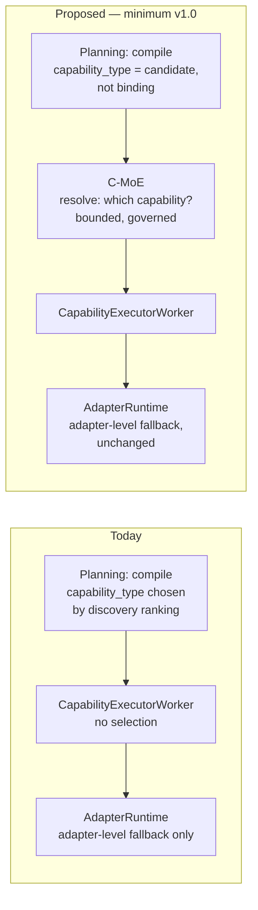

---

## B. Reliability Dependencies

What C-MoE requires from RS, stated as dependencies rather than re-derived:

1. **Durable Work Unit state (RS's DEBT-003, RS's #1 Critical Pre-Freeze item) is a hard prerequisite for any C-MoE decision surviving a restart.** [INFER] Until `EventStream`'s checkpoint mechanism is actually wired into `WorkflowRuntime` (RS §C.2, classified IMPORTANT POST-FREEZE, not blocking C-MoE's own freeze — see Section T below), a C-MoE routing decision lives in the same local-dict, restart-lossy state everything else does. This is not a new risk C-MoE introduces; it inherits RS's existing one. What C-MoE's contract must do at freeze time is make sure its own decision record (Section T, Diagram 17) is *shaped* to be checkpointable via the same mechanism once C.2 ships — not require a different one.
2. **The two unreconciled identifier families (RS §E.3, RS's #2 Critical Pre-Freeze item — `trace_id`/`operation_id`/`stage_tag` vs. `workflow_id`/`instance_id`/`session_id`) directly determine what a C-MoE routing decision can be keyed against.** [REC] A C-MoE decision record should reference whichever identity ends up canonical for a Work Unit's *attempt* — this study takes no position on which family wins, because RS already flagged that as needing an L2 read of `planner.py`/`compiler.py` this study also did not perform. C-MoE's contract (Section X) should reference "the Work Unit attempt identity, whatever RS's reconciliation decides" rather than naming a field.
3. **The idempotency-key contract (RS §I, RS's #3 Critical Pre-Freeze item) applies to C-MoE the moment redundant/parallel expert execution exists** (Section J below): two experts invoked for the same Work Unit against a `consequential` Adapter must not each independently trigger a real-world side effect. This study defers to RS's existing `idempotency_key = f(work_unit_id, attempt_id)` design rather than proposing a second one — parallel-expert idempotency is the same problem RS already specified, applied to more than one caller at once.
4. **The Scope-vs-Session decision (RS §E.1, RS's #4 Critical Pre-Freeze item) is a hard prerequisite for Section N (Concurrency) below** — see the Executive Summary and Section N for why this study treats it as shared, not independently resolvable.
5. **`OperationRecoveryBudget` (RS §J) is this study's literal seed for Section L (Think Harder)** — not a new mechanism, a generalization of an existing, tested, frozen one (`consume()`/`remaining`/`exhausted`, per H1's frozen-contract list — RS's Section 44 already confirmed this generalization does not require reopening it).
6. **`AdaptiveSemaphore`'s race-safe capacity drain (RS §A.4) is this study's precedent for graceful resource-pressure response** in Section M (Resource Model) — shrinking available parallelism under load without corrupting in-flight expert calls, the same mechanism RS recommends generalizing for update-path draining (RS §S.3.3).
7. **RS's Section S (Live System Evolution) applies to C-MoE directly and specifically**: an Expert is frequently a Model (RS §S.1's model-update row — `core/model_router.py`'s shadow-canary-and-auto-rollback is, by RS's own assessment, "the most sophisticated update-safety mechanism anywhere in this codebase"). Section U below treats model updates during active C-MoE routing as the *good* case to generalize from, not a new problem — RS already solved it for models specifically; C-MoE needs to inherit that pattern for its own expert-availability tracking, not invent a second one.

**[FACT]** RS's own Section R (Deferred Research) item 4 already names this study's central topic — "Full multidimensional Assurance Assessment and 'Think Harder' policy (Section J) — real seeds exist... the full model is future work" — and classifies it FUTURE RESEARCH from RS's side. This study's Section K/L do not contradict that classification; they specify the *contract shape* (Section 47's "freeze contracts, not algorithms") while confirming RS was correct that the full model remains open.

---

## C. Expert Architecture

**Starting hypothesis (from AED, Approved status):** "Capabilities are Cognitive Experts... This is NOT neural-network MoE... The Runtime dynamically selects one expert / multiple experts / redundant experts... The Kernel never contains expertise."

**Testing this against code and against this study's own Section 7 (heterogeneous experts — LLM, deterministic algorithm, solver, search system, external system, "another capability") surfaces one refinement AED's terse statement doesn't spell out:**

**[REC] Definitions, derived rather than assumed, per the directive's own instruction:**

- **Capability** = a registered `capability_type` in `CapabilityRegistry` — domain expertise or action, per Kernel Constitution Part VII ("Capabilities: units of work the kernel can schedule. May be backed by one adapter or composed of several"). This matches current code exactly.
- **Adapter** = one concrete backend for a Capability (Kernel Constitution: "disposable and replaceable by design"). `AdapterRuntime` already selects among these — a real, working, narrower selection layer than C-MoE.
- **Expert** = the *runtime-level resource C-MoE resolves a Work Unit to.* In the default case, Expert = a Capability (AED's equivalence holds, and this is the only case Kernel v1.0 needs to contract for). Two refinements this study adds, evidence-driven rather than speculative:
  1. **An Expert is not required to be an LLM, or even a model** — Section 7's list stands as written, and nothing in the codebase contradicts it; `AdapterRuntime` is already model-agnostic by construction (it dispatches to whatever the Adapter wraps).
  2. **A non-capability-backed deterministic/learned shortcut (Section 34 — cached plans, procedural memory) should be admitted as a new Capability with its own Adapter, not as a silent bypass of the Capability boundary.** This is not this study inventing a rule — it follows directly from AED's own Capability Model section ("Capabilities SHALL NEVER invoke another capability... Capabilities own expertise only") and from this project's standing principle that learning must never become directly executable logic. A "replay this cached plan" Adapter is a legitimate, governed Capability; a hidden fast-path that skips Capability invocation entirely is not, because it would remove the one place (Adapter boundary) where Law 3 (Separation of Concerns) and the idempotency-key contract (RS §I) currently apply.

**[REC] Answering the directive's Section 8 relationship questions directly, since it asks that they be derived rather than assumed:**

| Question | Answer | Basis |
|---|---|---|
| Is every Capability an Expert? | No — trivial/infrastructure capabilities may be invoked directly by the Runtime without full C-MoE selection (this is what keeps the simple-task path minimal, Diagram 2). | Section 5's "minimal cognitive path" requirement; nothing in AED contradicts routing bypass for the single-candidate case. |
| Is every Expert a Capability? | Yes, at the point of invocation — an Expert always terminates in a Capability call, even when the "expertise" is a deterministic shortcut. | AED's Capability Model; RS §I's idempotency boundary depends on this holding. |
| Can one Expert use multiple Capabilities? | Only across multiple C-MoE-routed steps within a recursively-expanding Work Graph — never via one Capability calling another. | AED: "Capabilities SHALL NEVER invoke another capability"; "Execution may recursively expand into additional Work Units." |
| Can multiple Experts share one Capability? | Yes, trivially — this is exactly what redundant-expert execution (Section J) against the same Capability, different Adapters or different invocations, already looks like. | Consistent with `AdapterRuntime`'s existing multi-adapter-per-capability-type design. |
| Can an Expert exist without a Capability? | No, by this study's recommendation above (learned shortcuts admitted as Capabilities, not bypasses). | Preserves Law 3 and RS §I's idempotency boundary as the single execution gate. |
| Can a Capability execute without an Expert (i.e., without C-MoE)? | Yes — the single-candidate / trivial case, dispatched directly, is the "no C-MoE needed" path Diagram 2 shows. | Section 5's stated goal; matches today's actual `CapabilityExecutorWorker` behavior for the common case. |

### Diagram 2 — Simple-task C-MoE (single candidate, minimal path)

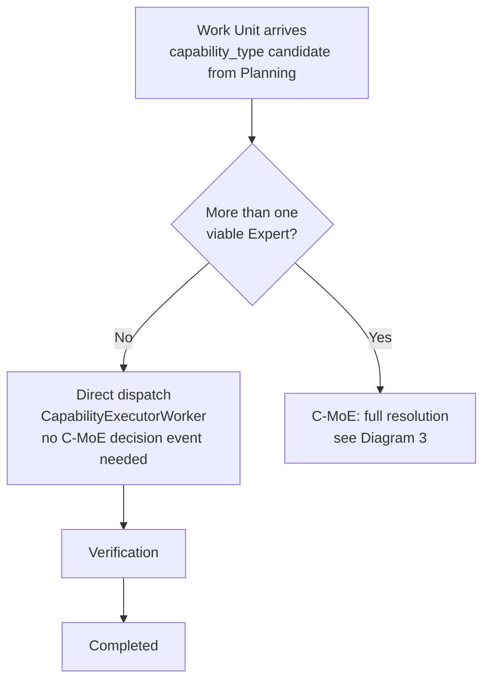

---

## D. Routing Architecture

**[REC] The minimum viable C-MoE routing function, matching AED's pipeline position exactly:** given a Work Unit whose `worker_type`/`capability_type` is a *candidate*, not binding (Planning's discovery output, per `IMPLEMENTATION_TRACKER.md`), decide: (a) is more than one Capability actually viable — if not, skip straight to dispatch (Diagram 2); (b) if so, select among the viable set using hard constraints (input/output compatibility, governance/privacy policy — Section 17's "hard constraints" bucket) first, then soft signals (historical verification success, latency, cost — Section 17's "soft signals" bucket, explicitly **not** frozen at v1.0, see Section D.2).

### D.1 Architectural Alternatives (directive §43)

Evaluated against the evidence gathered, not assumed:

| Model | Shape | Verdict for Kernel v1.0 |
|---|---|---|
| A — Flat Router | Work Unit → Expert selection | **This is what exists today, minus the selection step.** Correct floor. |
| B — Runtime + Optional Workers | Runtime → C-MoE → optional Workers → Experts | **Recommended v1.0 shape**, with "Workers" realized as metadata (Section G), not a new entity. |
| C — Runtime + mandatory Virtual Workers | Runtime → C-MoE → Workers (always) → Experts → Capabilities | **Rejected for v1.0** — no evidence of need (Section G); adds a mandatory hop the simple-task path (Diagram 2) doesn't require. |
| D — Organization-first | Mission → Organization → Workers → Experts → Capabilities | **Rejected for v1.0**, deferred to FUTURE RESEARCH (Section H) — nothing in the codebase or AED anticipates persistent multi-role organizations, and inventing the hierarchy before a real long-horizon mission exists to test it against would violate Law 8 (Evidence over Assumption). |
| E — Hybrid Adaptive | Start flat (A/B); escalate toward hierarchy only when justified | **This study's actual recommendation** — not a fifth model, but the *policy* governing when B's optional Worker layer activates. See Section F (Escalation). |

**[REC]** The recommended architecture is Model B operating under Model E's escalation policy: flat by default, C-MoE decides per-Work-Unit whether the "Worker" grouping metadata (Section G) is worth attaching, and nothing above Model B is admitted without a demonstrated multi-day-mission or multi-specialist case, per the directive's own default: "Workers and organizations are temporary Runtime structures unless there is a demonstrated reason for persistence."

### D.2 What must not be frozen (directive §47)

**[REC]** The exact scoring function for soft-signal expert selection (Section 17), the exact worker-grouping heuristic (Section G), the exact assurance-aggregation function (Section K), and the exact learning/routing-memory algorithm (Section O) are all explicitly **not** part of this study's Critical Pre-Freeze list (Section Y). What is frozen is the *shape*: a routing decision is a durable, provenanced event (Section X); it is bounded by hard constraints that Governance, not C-MoE's own heuristic, controls; and it degrades to direct dispatch when only one candidate exists. The algorithm computing which candidate wins among several is intentionally left open, consistent with the directive's own instruction not to prematurely freeze algorithms.

### D.3 Work Unit state machine — the reconciliation this study surfaces

**[FACT]** RS's Diagram 4 (recovery axis: `READY → RUNNING → {COMPLETED | FAILED | RETRYING} `, plus proposed `RECOVERY_REQUIRED → {RESUMING | RECONCILING}`, `FAILED → ABANDONED`) and AED's cooperative-execution sketch (routing axis: `READY → RUNNING → WAITING_FOR_INFORMATION → ROUTING → RUNNING → VERIFYING → COMPLETED`) are not the same state list, and neither source document says they're two dimensions of one object.

**[REC]** They should be specified as two orthogonal axes on the same Work Unit, in the single state-machine ADR RS already scheduled (RS Q.8, IMPORTANT POST-FREEZE — this study does not change that classification, only its required content):

- **Cognitive/routing axis (C-MoE-owned):** `READY → ROUTING → RUNNING → VERIFYING → {COMPLETED | NeedReplan | ...}`, using AED's own Capability Outcome Contract vocabulary (`Completed` / `Failed` / `PartialResult` / `NeedCapability` / `NeedInformation` / `NeedUserInput` / `NeedReplan` / `RetrySuggested`) as the terminal/branch values, not a new vocabulary.
- **Durability/recovery axis (WorkflowRuntime/future durability-layer-owned):** RS's Diagram 4 as-is — orthogonal, can be `RECOVERY_REQUIRED` regardless of which cognitive/routing state was last recorded, because a crash can happen mid-`ROUTING` exactly as easily as mid-`RUNNING`.

A Work Unit's true status is the pair, not either axis alone — "was mid-`ROUTING` when the crash happened, now `RECOVERY_REQUIRED`" is a materially different resume case than "was mid-final-`RUNNING`, now `RECOVERY_REQUIRED`," and only C-MoE's own contract (this study) knows that the `ROUTING` state exists at all — RS had no reason to know about it when it wrote Diagram 4.

### Diagram 3 — Full C-MoE resolution (multi-candidate case)

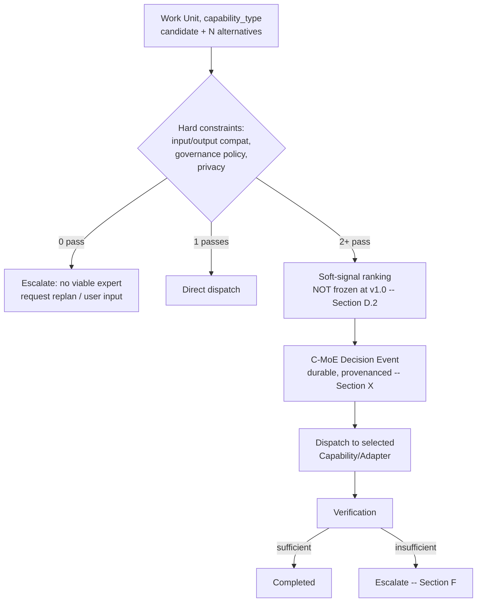

---

## E. Adaptive Scaling Architecture

**Testing the directive's core principle** ("allocate cognitive effort proportionally to task difficulty, uncertainty, risk, required assurance, available resources, and time constraints") **against `PROJECT_INSTRUCTIONS.md`'s existing, higher-authority priority order** (§4: `Governance → Replayability → Isolation → Observability → Reliability → Determinism → Extensibility → Performance → UX`; "if performance conflicts with governance or replayability, governance wins"):

**[REC]** The principle is directionally correct but silent on precedence when its own factors conflict — and §4 already supplies that precedence, so this study does not need to invent one:

- **Resource scarcity changes strategy, never acceptance criteria.** Under load, C-MoE should take longer, run fewer parallel candidates, or wait — never accept a result at a lower assurance bar than an unconstrained run would have required. This is §4's governance-over-performance rule applied to the cognitive-effort domain, not a new rule.
- **Urgency changes allocation, never the correctness floor**, for the identical reason — and RS's own Threat Model already names "deadline pressure causing unsafe shortcuts" as a scenario to guard against (directive's Scenario in RS's Threat Model 6/7/8 grouping), confirming this isn't a hypothetical concern.
- **User preference (explicit "Think Harder" or an explicit low-effort request) is a hard policy input, not a soft signal** — Kernel Law 5 (User Sovereignty) requires it be respected as a constraint the router operates under, distinct from learned routing history, which only fills in the default when the user hasn't specified.
- **Risk overrides speed by the same §4 ordering** (Reliability/Determinism rank above Performance).

**[REC] Complexity estimation (directive §11) does not need a new subsystem at v1.0.** Diagram 3's existing hard-constraint filter already produces a cheap, real complexity signal for free: the count of Capabilities surviving hard-constraint filtering (0 / 1 / 2+) is itself the first-pass complexity/uncertainty estimate — 0 means escalate immediately (no viable path), 1 means minimal path (Diagram 2), 2+ means a genuine selection problem exists and soft-signal ranking (Section D.2) applies. A dedicated complexity-scoring model — using dependency-graph depth, domain diversity, historical similarity, etc. — is real future work (classified ADVANCED C-MOE, Section Y), but nothing about Kernel v1.0 requires it; the discovery-then-filter pipeline that already exists produces a usable signal as a side effect.

**[FACT]** `PlannerResult.status` (`IMPASSE` / `READY_FOR_COMPILATION` / `REJECTED_PRECHECK`) and `CompilationResult.status` are exactly the "don't collapse to one number" precedent RS already identified (RS §J) — this study's complexity signal above is deliberately the same shape: a small discrete set, not a scalar.

### Diagram 4 — Adaptive scaling: signal to strategy

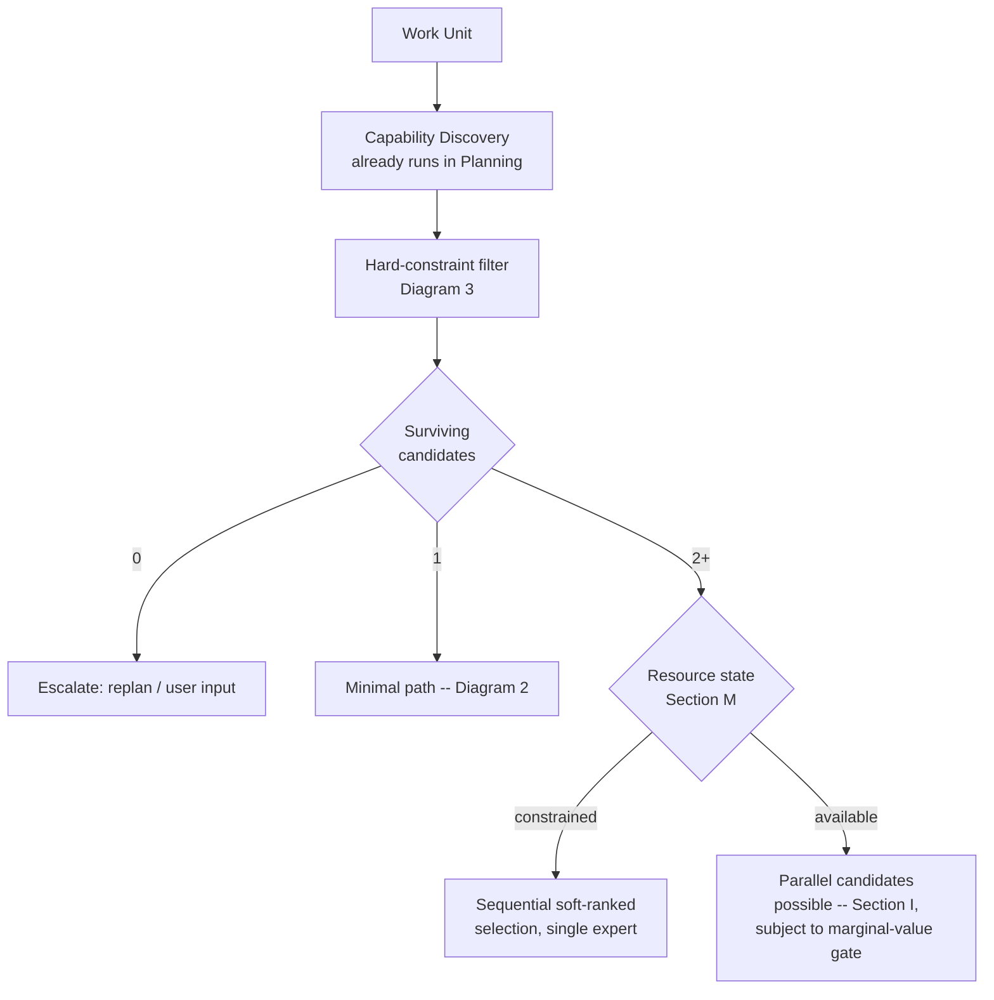

---

## F. Escalation Architecture

**[FACT] Escalation is not entirely new territory — two real, adjacent mechanisms already exist and this study reuses their shape rather than inventing a third:**

1. `SupervisorWorker` (Packet 08) already draws a real distinction between **retry** and **terminal escalation**: it retries failed *worker invocations* via `ExecutionRuntime.invoke()`, but explicitly does **not** retry on a `CompilationResult` `REJECT`/`ESCALATE` verdict — that is K4 §16's Runtime Invariant 9, already enforced. C-MoE's own escalation policy should compose with this distinction, not duplicate it: a verification failure that SupervisorWorker's existing retry can plausibly fix (transient worker failure) stays there; a verification failure that reflects a genuine capability/assurance gap is a C-MoE-level escalation, not a retry.
2. `RecursionGovernor` already enforces a depth bound (depth > 10 → REJECT, `CURRENT_STATE.md`'s Governance table) — **and RS already found its accumulation input is never populated today** (RS's new finding, RS's Critical Pre-Freeze item P.6: "wire real `RecursionGovernor` accumulation, or document why dormant-but-fail-closed is acceptable for now"). **This study's finding: C-MoE's own recursive escalation path (expanding a Work Unit into additional Work Units, per AED's "Execution may recursively expand into additional Work Units") is the first concrete mechanism that would actually need `RecursionGovernor`'s counter incremented.** Today the gap is safe only because nothing recurses. The moment C-MoE ships even the minimal escalation path below, RS's P.6 stops being a "document why it's fine to leave dormant" decision and becomes "this needs wiring" — this study elevates that dependency explicitly (Section X).

**[REC] Escalation triggers, evaluated against what actually exists today (not invented from the directive's list wholesale):**

| Trigger (directive §12) | Status today | This study's treatment |
|---|---|---|
| Verification failure | Verification's wiring is unconfirmed (RS L2) | Escalate only if SupervisorWorker's existing retry path is exhausted or inapplicable (terminal per Invariant 9) |
| Insufficient assurance | No assurance model exists (RS §J) | Section K defines the contract shape; threshold itself not frozen |
| Conflicting experts | No redundant execution exists yet | Section J |
| Novel problem | No novelty signal exists | Complexity-signal proxy (Section E) — 2+ candidates with low historical-success data is the nearest available proxy at v1.0 |
| High risk | No risk classification exists | Deferred to Governance policy (out of C-MoE's own scope — C-MoE consumes a risk *tier*, does not compute one) |
| Missing information | `NeedInformation` (AED's Capability Outcome Contract) | Already-named terminal branch — reuse directly |
| Capability failure | `AdapterRuntime` fallback already handles this one layer down | No new C-MoE mechanism needed unless fallback itself is exhausted |
| Stale plan | RS §L: no staleness detection exists (checkpoint-age heuristic proposed, RS's own item) | C-MoE does not own staleness detection; consumes RS's future signal if a `REPLAN` request arrives |
| Unexpected result | No signal exists | ADVANCED C-MOE |
| User "Think Harder" | No policy exists | Section L |

**[REC] Bounding, reusing `OperationRecoveryBudget`'s existing shape rather than inventing a parallel one:** a future Work-Unit-scoped effort ledger generalizes `consume()`/`remaining()`/`exhausted()` (RS confirms this generalization does not reopen the frozen contract, RS §44) to cover depth (already `RecursionGovernor`'s job, once wired), expert count, and — only once Section M's resource model exists — compute/time. **This study does not recommend a distinct "expert budget" object at v1.0**; it recommends the existing budget object grow an optional field, consistent with `PROJECT_INSTRUCTIONS.md`'s Extension over Modification principle and `ADR-K2-EXT-01`.

**[REC] The marginal-cognitive-value gate (directive §16) is the actual decision function behind every escalation step, not a separate mechanism:** before invoking an additional expert, the check is not "is there a mode called Think Harder" but "does the (still-unfrozen, Section D.2) expected-assurance-gain estimate exceed the cost, given remaining budget." At v1.0 this is stated as a required *gate* in the contract (Section X), with the estimate itself explicitly out of scope for freezing — this is exactly what prevents "use 50 experts because the machine has RAM" (directive §16's own example) without requiring this study to specify the estimator that prevents it.

### Diagram 5 — Escalation with bounded budget and marginal-value gate

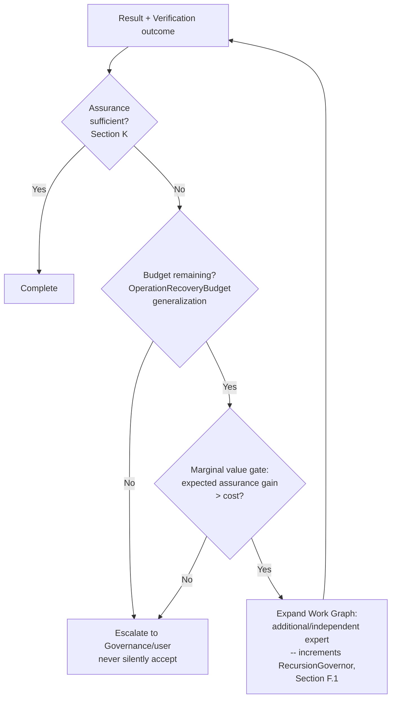

---

## G. Virtual Worker Study

**[FACT] No precedent exists in this codebase for the directive's "Virtual Worker" concept, and the word "Worker" already has a frozen, structurally incompatible meaning.** Embedded `ADR-003` (`KERNEL_ARCHITECTURE_v1.0.md` §21, frozen with the architecture spec): "New Worker instance per `ExecutionRuntime.invoke()` call. No state persists across invocations." Every existing Worker (`PlannerWorker`, `MemoryCuratorWorker`, `EvaluatorWorker`, `ReflectionWorker`, `SupervisorWorker`, `CapabilityExecutorWorker`) is stateless and ephemeral by this frozen contract. The directive's Section 9 definition of a Virtual Worker — "a temporary runtime organizational role with its own bounded objective, **context**, resource policy, and Work Units" — is stateful and persistent-within-a-mission by construction. These are not compatible meanings for the same word.

**[REC] If this concept is ever built, it must not be named "Worker."** This is a naming-collision risk this study surfaces per AED's own Authoritative Document Rule ("Every architectural concept SHALL have exactly one authoritative definition") — reusing "Worker" would violate that rule the moment it shipped. This study does not propose a replacement name (that is an API decision outside this study's scope) but flags the collision explicitly so a future ADR doesn't rediscover it after code already exists under the wrong name.

**[REC] Testing Models A–D (directive §9) against what a "Virtual Worker" would actually need to add over Model B (Section D.1):** the properties a Virtual Worker would supply — bounded objective, resource policy, grouping of related Work Units — are all expressible as **metadata attached to a Work Unit subtree** (a `parent_scope_ref` + an `objective` string + a resource-policy reference), not as a new runtime entity with its own lifecycle. The Work Graph already recursively expands (AED) and is already Runtime-owned end to end; grouping metadata over that existing structure gets context isolation and specialization framing without a second thing that can crash, need its own recovery path, or need its own identity scheme independent of RS's already-strained identifier reconciliation (Section B.2).

**[REC] Classification: Virtual Workers as a heavyweight entity are NOT REQUIRED for Kernel v1.0, and this study does not recommend building them speculatively.** The metadata-scoping alternative is a natural, small addition to the Work Unit event schema RS already scheduled (RS §C.2) — filed as ADVANCED C-MOE (a field, not a subsystem), revisited only if a real multi-day, multi-specialist mission is observed in practice (Law 8: Evidence over Assumption — no such mission exists yet to design against).

### Diagram 11 — Virtual Worker as metadata, not entity

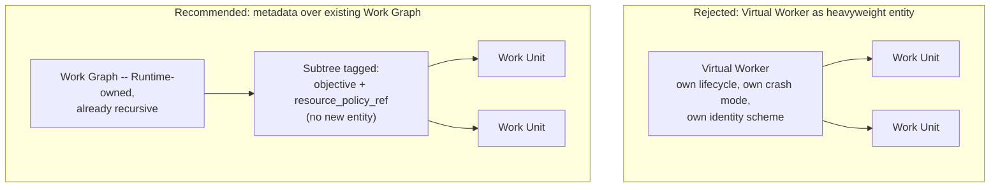

---

## H. Cognitive Organization Study

**[FACT]** Nothing in AED, RS, or the current codebase anticipates persistent multi-role organizations. AED's future-milestone table names five *runtime subsystems* (Cognitive Runtime/C-MoE, Execution Runtime, Verification Runtime, Reflection Runtime, Adaptive Learning) — all Kernel-managed, none organizational in the directive's Section 10 sense (a Mission owning a standing set of specialist Workers).

**[REC]** Comparing the directive's example hierarchy (Architecture/Research/Implementation/Testing/Review "Workers" under one Mission) against a flat C-MoE handling the same work as a sequence of Section G-style scoped subtrees: the flat version is strictly simpler, requires no new entity, and — per Section G's finding — the "hierarchy" is already achievable as nested subtree metadata (a subtree can itself contain scoped sub-subtrees without needing a distinct "Organization" concept layered on top). **This study finds no demonstrated need Model B cannot already satisfy once Section G's metadata is available**, and recommends against building a distinct Cognitive Organization concept at all, pending real evidence from a Kernel-v1.0-and-later mission that actually needs more than nested scoping.

**[REC] Classification: FUTURE RESEARCH, gated on evidence, per Law 8** — not because organizations are wrong in principle, but because nothing in this repository or its research corpus (subject to the L2 boundary on `OCBRAIN_EXTERNAL_REPO_STUDY*` noted in Methodology) currently demonstrates the need, and the directive's own default applies directly: "Workers and organizations are temporary Runtime structures unless there is a demonstrated reason for persistence."

### Diagram 12 — Cognitive Organization: rejected as a distinct concept

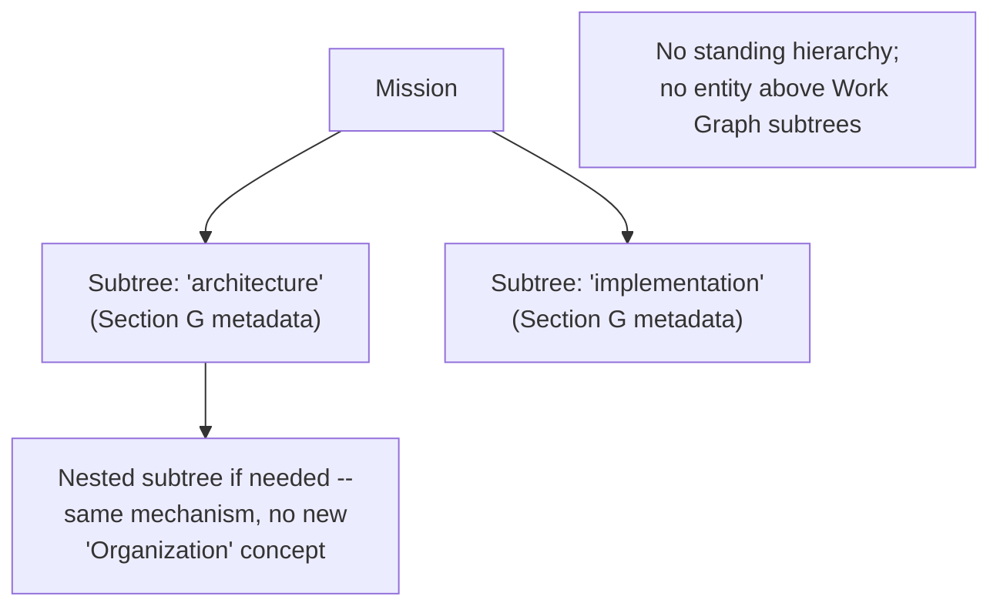

---

## I. Parallel Execution

**[REC] Parallelism is Work-Graph-dependency-aware by construction, because the Work Graph is already the Runtime's, per AED** ("The Runtime owns: node creation, dependency tracking, graph expansion, graph pruning, continuation routing, work completion"). C-MoE does not need its own parallelism mechanism — it needs to (a) decide *whether* parallel candidate execution clears the marginal-value gate (Section F) and the resource gate (Section M), and (b) hand the resulting independent branches to the Work Graph exactly as any other dependency-parallel nodes, using whatever synchronization/aggregation primitive the Work Graph already provides for independent branches converging on a synthesis step.

**[FACT]** `AdaptiveSemaphore` (RS §A.4) is real, tested, race-safe capacity control — the correct existing primitive for parallelism *limits* specifically (how many concurrent branches the current resource state allows), reused rather than reinvented, consistent with Section M.

**[REC] Cancellation/straggler handling reuses RS's own proposed pattern rather than a new one**: RS's Threat Model grouping 6/7/8 already specifies that a non-interruptible step finishes before honoring a cancellation, and that a cancel request should route through checkpoint-aware suspension where possible (RS §G, Diagram 3's RECONCILE path). A straggler among parallel experts is the same shape as a slow non-interruptible step — this study does not propose a distinct straggler-handling mechanism.

### Diagram 10 — Parallel Work Graph, dependency-aware

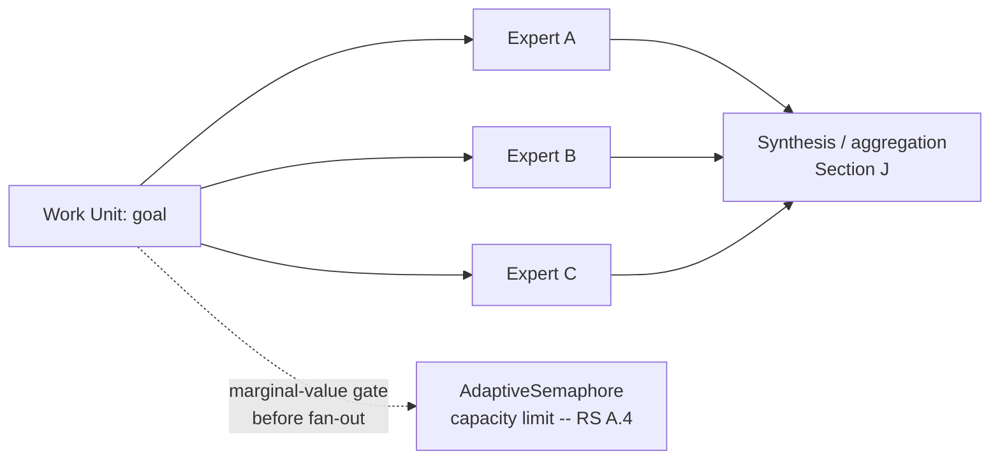

---

## J. Redundancy

**[REC] Distinguishing the directive's three redundancy concepts precisely, since it explicitly asks that they not be conflated:** "multiple experts" (any N ≥ 2 invoked) vs. "independent experts" (sufficiently different reasoning/data/model lineage to produce genuinely uncorrelated disagreement) vs. "redundant execution" (the *same* capability, run under independent conditions — e.g., re-invoked against a different Adapter for the same `capability_type`, which `AdapterRuntime`'s existing multi-adapter design already makes structurally possible today, even though nothing currently triggers it for this purpose).

**[REC] Redundancy increases assurance only when independence is real, not merely numeric** — the directive's own Section 20 concern (correlated error: "three experts trained on the same data may be wrong together") is not hypothetical for OCBrain specifically: two Adapters wrapping the same underlying model family, or two Capabilities both ultimately backed by the same provider, are not independent in the sense that matters, even though `AdapterRuntime` would report them as distinct adapters. **This study recommends independence be tracked as a property of the Expert Performance Profile (Section O), not assumed from adapter-count alone** — a concrete, checkable claim (shared model lineage, shared training data, shared provider) rather than a numeric redundancy factor.

**[REC] Disagreement handling (directive §20) explicitly does not default to majority vote**, per the directive's own instruction and consistent with correlated-error risk above: disagreement among genuinely independent experts is itself a signal that should *raise* the assurance requirement (feed Section K) and, if unresolved, escalate (Section F) rather than resolve by count.

### Diagram 9 — Redundant execution, distinct from mere disagreement handling

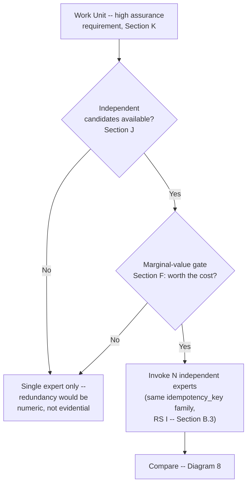

### Diagram 8 — Expert disagreement

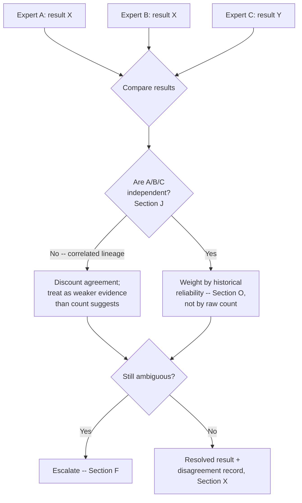

---

## K. Assurance Integration

**[FACT]** RS §J already establishes the starting point precisely: no multidimensional Assurance Assessment exists; `PlannerResult.status`/`CompilationResult.status` are the existing "discrete, not scalar" precedent; `OperationRecoveryBudget.max_total_recovery_attempts` is the effort-policy seed; `EventStream`'s arbitrary payload dict is the storage mechanism, needing no new persistence layer. This study inherits all four rather than re-deriving them.

**[REC] What C-MoE adds to RS's already-scoped shape, answering the directive's specific questions:**

- **Assurance is attached to the C-MoE decision and the verification result, not a fourth separate artifact — the Work Unit's assurance is the two combined.** A routing decision carries its own confidence-in-the-choice (evidence available at selection time: candidate count, historical success, hard-constraint margin); verification carries confidence-in-the-output. Neither alone answers "is this Work Unit adequately assured" — the combination does.
- **"Calculated" is the wrong word, per the directive's own prompt to question it.** This study recommends "assembled" — a structured record of the dimensions listed in directive §14 (evidence quality, coverage, provenance, structural/semantic verification, expert agreement, historical reliability, novelty, unresolved uncertainty, temporal validity, risk), stored as named event-payload fields (RS's existing mechanism), with aggregation into any single accept/reject decision remaining Governance's call, not C-MoE's — consistent with AED's own line: "Governance evaluates verified outputs only." **No numeric threshold is proposed here**, per the directive's explicit instruction against inventing one without evidence.
- **Assurance can decrease after new information arrives, and this study ties that directly to RS's own temporal-validity mechanism rather than inventing a second one.** RS §L already proposes a checkpoint-age staleness heuristic feeding `REPLAN` (RS's Diagram 15, post-freeze item Q.9). An Assurance Assessment computed against evidence that has since gone stale by that same heuristic should be treated as expired, not silently trusted — one staleness mechanism, two consumers (replan decisions and assurance validity), not two mechanisms.

**[REC] Classification: the contract shape (assurance is multidimensional, event-payload-backed, attached to decision+verification pairs, temporally bounded by RS's existing staleness mechanism) is the only part specified here. The aggregation function remains explicitly open — RS's own Deferred Research item 4 already classifies the full model FUTURE RESEARCH, and this study agrees.**

### Diagram 6 — Expert performance profile feeding assurance

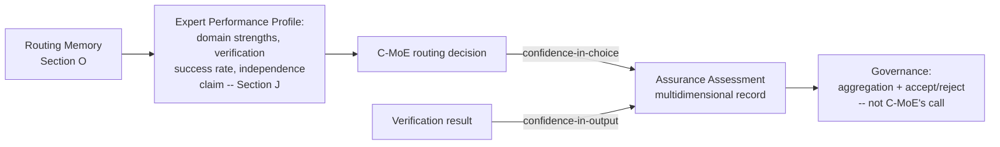

---

## L. Think Harder

**[REC] This is RS's own Diagram 9 (already-proposed `Fast`/`Balanced`/`Think Harder`/`Maximum Assurance` policy generalizing `OperationRecoveryBudget`) extended with one connection this study adds: Think Harder does not need its own escalation mechanism — it raises the assurance requirement and enlarges the budget feeding the same marginal-value-gated loop already specified in Section F.** This is deliberately not a second mechanism. Concretely: selecting a higher effort policy (a) raises the assurance bar Section K's Governance-side aggregation checks against, and (b) raises `OperationRecoveryBudget`'s ceiling, both consumed by Section F's existing gate — "does the next unit of cognitive effort still clear the marginal-value gate at this budget/requirement level." When it stops clearing that gate, additional computation has, by this contract's own definition, stopped producing meaningful assurance improvement — this directly answers directive §15's closing question without a separate formula.

**[REC] The MUST NOT list is inherited verbatim from the directive and reinforced by existing architecture, not just restated:** Think Harder must not bypass mandatory verification (Verification Runtime is architecturally independent per AED — nothing in a higher effort policy touches that boundary), must not bypass Governance (Section F's escalation path already routes every step through Governance), must not blindly consume all resources (bounded by the same budget object as any other escalation, Section F), and must not equate computation with correctness (the marginal-value gate is the enforcement point — a policy that ignores it would be a defect in implementation, not something this contract permits).

---

## M. Resource Model

**[REC] The logical task never changes across hardware; only the strategy does — this is Section E's resource-scarcity principle restated for the specific weak/strong/multi-node cases the directive asks about:**

| Environment | Strategy (not requirements) |
|---|---|
| Weak machine | Sequential experts, minimal/no parallel fan-out, `AdaptiveSemaphore` capacity kept low |
| Strong workstation | Parallel candidates where the marginal-value gate (Section F) clears, redundancy (Section J) more affordable |
| Multi-node (future) | **Explicitly deferred** — RS §O already scopes distributed recovery out, and this study's directive itself lists distributed execution among carried-forward "intentionally deferred" items. No multi-node resource strategy is specified here; doing so would violate the directive's own boundary. |

**[FACT] Model routing (directive §33) is already a real, separate, working layer below C-MoE, and should stay separate rather than being absorbed into Expert selection.** `core/model_router.py`'s bootstrap→shadow→native maturity lifecycle (RS §S.1) resolves *which model version* serves an already-selected, model-backed Adapter. This gives OCBrain three nested resolution layers, evidence-grounded rather than hypothesized:

```text
C-MoE            -- which Capability/Expert? (this study, greenfield)
  └─ AdapterRuntime  -- which Adapter for that capability_type? (exists, health-ranked)
       └─ model_router -- which model version/maturity stage, if the Adapter is model-backed? (exists, canary + auto-rollback)
```

**[REC]** C-MoE should treat `model_router`'s maturity/health state as an *input* to Adapter-level selection (already `AdapterRuntime`'s concern) — not duplicate it. This keeps the layering AED implies ("Kernel never contains expertise") intact at every level, not just the top one.

### Diagram 13 — Resource-aware C-MoE, three nested resolution layers

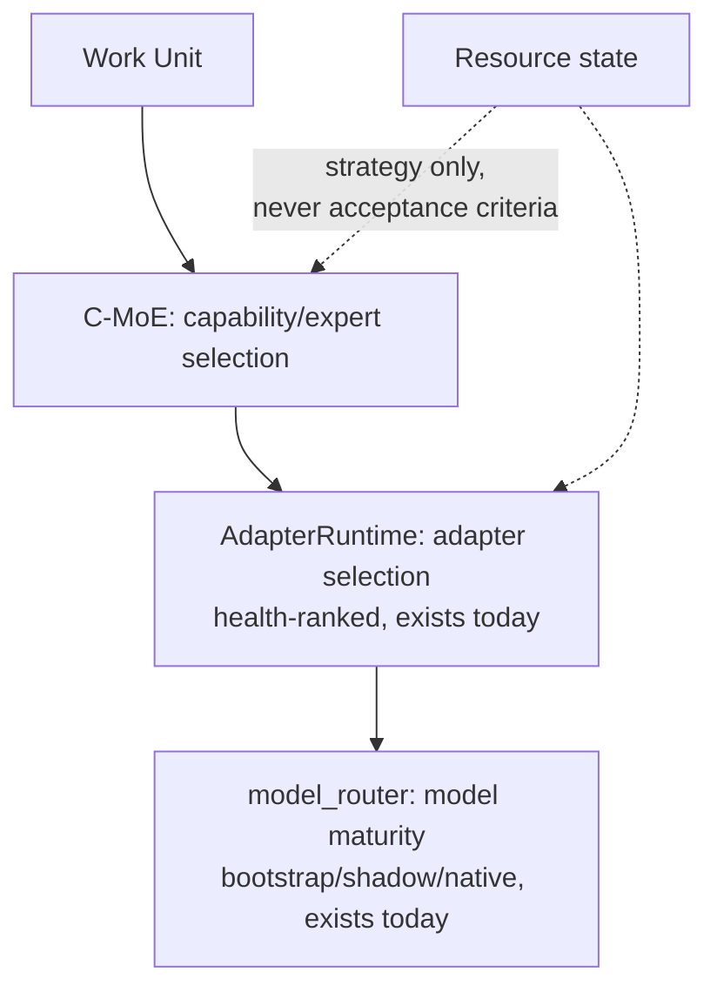

---

## N. Concurrency

**[FACT] This section is structurally blocked on the same open item RS already flagged and explicitly deferred to Moncif: the Scope-vs-"Session"-vs-Constitution-Non-Goal question (RS §E.1, RS's Critical Pre-Freeze item #4).** The Kernel Constitution's Non-Goal ("the kernel has no concept of 'conversation' as a primitive") and the directive's own concurrent-session questions (resource arbitration, isolation, "a task in Session A must never accidentally consume Session B's cognitive context") describe the identical missing boundary RS already surfaced from the durability side. This study does not propose a second reading of that tension — it states what C-MoE specifically needs from whichever resolution is chosen, so both studies' dependent items close together:

- **Whatever "Scope" (RS's proposed term, avoiding "Session") ends up meaning, C-MoE needs it to be the unit that shared expert/model pools are arbitrated across** — i.e., `AdaptiveSemaphore` capacity (Section I) and Governance budget (Section F) should be evaluated *per Scope*, not per-process globally, once Scope exists as a first-class identity. Until it does, this study notes (consistent with RS §H) that concurrent missions today share the entire in-process execution namespace by omission, not by design — the same gap RS already named, not a new one C-MoE introduces.
- **Priority/deadline changes must affect allocation, never correctness** — restating Section E's resource-scarcity principle for the explicitly time-varying case the directive asks about (directive §31: "priority MUST NOT affect minimum correctness, security, mandatory verification, Governance, acceptance requirements"). `PROJECT_INSTRUCTIONS.md` §4 already supplies this precedence; this study does not add a new rule, only confirms priority-handling must obey the existing one.
- **No `SchedulerService` or dynamic priority mechanism exists** (RS §M, correctly deferred per `KNOWN_ISSUES.md`, RS found no new evidence to revisit that deferral) — **C-MoE does not propose building one.** It specifies that *when* one exists, priority is an input to Section F's marginal-value gate (more urgent work gets a lower bar for "worth escalating," never a lower bar for "worth accepting") — not that C-MoE needs its own scheduler.

**[REC] Classification: the Scope/Session resolution itself is RS's Critical Pre-Freeze item, unchanged by this study. What C-MoE adds is a dependent, IMPORTANT POST-FREEZE item — "arbitrate shared expert/model pools per Scope once Scope exists" — which cannot be specified more concretely until RS's #4 is resolved, and should not be guessed at in the meantime.**

### Diagram 14 — Concurrent missions, resource arbitration once Scope exists

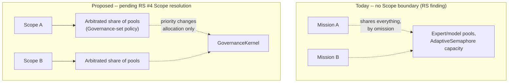

---

## O. Learning & Routing Memory

**[FACT] AED already states the exact gate this study's directive independently arrives at**: "Learning occurs ONLY when BOTH conditions are satisfied: Verification Approved, Governance Approved." This matches this project's own standing principle (learning candidates remain evidence — retrievable, governed, replayable; never directly executable) exactly, from a third, independent direction. All three — AED, this study's directive, and the project's standing rule — agree without needing reconciliation, which this study treats as strong confirmation rather than coincidence.

**[REC] Routing Memory belongs to C-MoE specifically, not to `CapabilityRegistry` (metadata-only, does not execute or track performance, per `CURRENT_STATE.md`) and not to a future Self-Model (K5 §2's own minimal field set — "provider health, budget remaining" — is system-level, not per-expert selection history).** This directly answers the directive's §19 instruction not to duplicate responsibility: the **Expert Performance Profile** (domain strengths, verification success rate, independence claims for Section J's redundancy question, latency, failure patterns) is Routing Memory's own record, keyed by Expert, distinct from both neighbors.

**[REC] Poisoning/staleness/bias protections (directive §18) reuse two existing defenses rather than inventing new ones:**
- Every Routing Memory entry is itself a Learning Candidate, so it inherits the Verification+Governance gate above — a poisoned entry would have had to pass both, which is the existing defense-in-depth, not a new mechanism this study adds.
- Provenance is mandatory per `PROJECT_INSTRUCTIONS.md` §8.2's existing episodic-memory rule ("No memory without provenance") — a Routing Memory record with no traceable `source_event_id` is invalid by the same standard already applied to `EpisodicMemory`, not a C-MoE-specific rule.

**[REC]** Staleness specifically (an Expert's profile reflecting a since-superseded model version, per Section M's `model_router` maturity lifecycle) is handled by the same mixed-version discipline RS already found and recommends generalizing (RS §S.3.6, `use_k42_frontend`'s proven pattern) — a Routing Memory entry should carry the `app_version`/`schema_version`/model-maturity-stage it was recorded under (RS's own §S.3.1 recommendation, generalized), so stale entries are detectable rather than silently trusted.

### Diagram 20 — C-MoE learning feedback loop

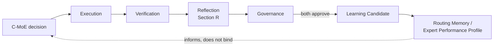

---

## P. Self-Model — deliberately narrow, FUTURE RESEARCH

**[FACT]** Per the Orientation Note, Self Model is a named K5 concept (`OCBRAIN_K5_FUTURE_COGNITIVE_EVOLUTION_ARCHITECTURE.md` §2, status "Recommended, K5 early"), and K5 is frozen, reference-only, by standing project convention. This study answers the directive's §28/Q29 at the shallowest depth that doesn't require designing into that boundary:

**[REC]** *If* a Self-Model exists in the future, the only interface point this study identifies without touching K5-internal design is: C-MoE would be one *consumer* of whatever advisory hint K5 §2 already scopes ("provider health, budget remaining" — its own stated minimal field set), through the same `PlannerHint`-style advisory extension point K5 §2 itself already proposes for every other K5 concept ("`PlannerHint` is almost always the right minimal extension point... Self Model, urgency, and reasoning-strategy selection all resolve to 'feed an existing advisory mechanism.'"). This study adds nothing to that — K5 §2 already anticipated a routing-adjacent consumer in general terms; it does not need C-MoE to specify anything further.

**[REC] Classification: FUTURE RESEARCH, explicitly gated on K5 unfreezing — not Advanced C-MoE, not Post-Freeze.** No pre-freeze contract depends on this section.

---

## Q. Verification Integration

**[FACT]** AED already draws the independence boundary the directive's §25 asks this study to determine: "Execution never completes a Work Unit. Verification completes a Work Unit... Verification remains independent from execution." RS confirms Verification's actual wiring status is unconfirmed this pass (L2) — this section is evaluated against the *proposed* model, consistent with RS's own Threat #12 treatment.

**[REC] Answering the directive's specific question — should Verification itself use C-MoE, and if so, what bounds it:** Yes, Verification may internally select among verifiers (structural / constraint / deterministic / specialized / semantic / independent-expert, per the directive's layered list) using C-MoE-style expert selection — **but as a structurally separate invocation with its own budget, never a recursive call back into the same C-MoE decision that produced the work being verified.** This is the specific boundary that prevents the directive's own named threat (§13: "verification loops," "planner/runtime feedback loops"): verification's expert-selection budget is drawn fresh, scoped to the verification step alone, and does not inherit or extend the escalation budget (Section F) of the Work Unit it is checking. A verifier that itself needs escalation escalates *verification*, which is a Governance-visible event distinct from escalating the original work.

### Diagram 18 — C-MoE + Verification, bounded to prevent recursion

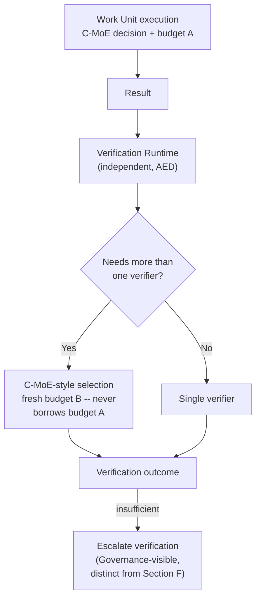

---

## R. Reflection Integration

**[FACT]** AED already states, verbatim, exactly what the directive's §26 asks this study to determine: "Reflection is independent from Verification... Reflection never modifies historical execution records." No new design is required here — this study's only addition is what Reflection needs *from* C-MoE to do its job (directive §26's list: expert choice, worker organization, decomposition, parallelism, escalation, verification strategy, resource efficiency).

**[REC]** All seven of those are already covered by this study's own event/provenance requirements (Section X) — C-MoE's decision event (Section X) already carries expert choice, the Section D.2 soft-signal inputs, escalation steps (Section F), and resource state (Section M) at decision time. **Reflection's evaluability is a consequence of C-MoE's own replayability requirement (Kernel Law 4), not a separate feature C-MoE builds for Reflection's benefit.** This is the correct relationship per Kernel Law 3 (Separation of Concerns) — C-MoE does not know Reflection exists; it simply leaves a complete enough trace that Reflection, whenever it ships, has something to evaluate.

---

## S. Long-Horizon Missions

**[FACT]** C-MoE can do none of this today, for exactly RS's central reason: nothing survives a restart yet (DEBT-003). This is not a C-MoE-specific gap — it is RS's already-identified gap, inherited. **[REC]** This study adds only what is C-MoE-specific to what RS's Section C.2 (Work Unit event schema, RS's #1 Critical Pre-Freeze item) must eventually carry: a C-MoE routing decision (Section X's event shape), which experts were already tried this Work Unit (needed so a resumed mission doesn't blindly re-try an already-exhausted candidate), the escalation level and remaining budget at suspension (Section F), and the assurance-so-far (Section K). None of this requires a distinct long-horizon mechanism — it requires that C-MoE's decision record ride on the same durability substrate RS already designed, once wired.

**[REC]** A mission resuming after days offline should not silently continue with a stale routing decision (RS §L's staleness heuristic applies to C-MoE decisions exactly as it applies to any other Work Unit state — Section K already makes this connection for assurance specifically; the same connection holds for the underlying routing choice itself, which may no longer be the best available Expert if a model update, per Section U, occurred during the gap).

### Diagram 15 — Long-running mission, C-MoE decisions as one more checkpointed thing

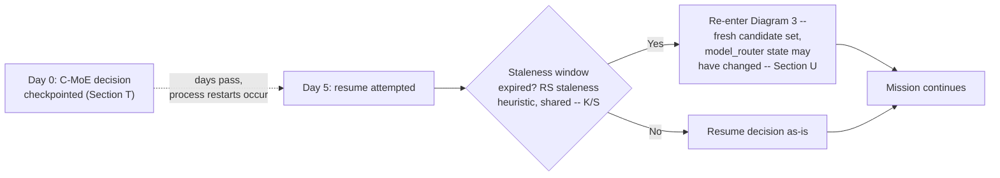

---

## T. Recovery

**[REC] What must be durable for C-MoE recovery, stated as the fields a future Work Unit event schema (RS §C.2) needs to carry for C-MoE's sake — contract content, not a concrete type definition, per the directive's own instruction not to invent schemas prematurely:**

- The routing decision itself and which Expert(s) it selected
- The candidate set considered and which hard constraints eliminated the rest (Diagram 3) — needed so a resumed mission can tell "already ruled out" from "not yet considered"
- The escalation level and remaining budget at last checkpoint (Section F)
- The assurance assessment as of last checkpoint, and its temporal-validity window (Section K)
- The resource-state assumptions the decision was made under (Section M) — needed to detect whether resuming under a materially different resource state should trigger re-evaluation rather than blind resume

**[REC]** Recovery follows RS's existing decision tree (RS Diagram 3, RESUME / RETRY / RECONCILE / REPLAN / ABORT / ESCALATE) without needing a C-MoE-specific variant: a checkpointed C-MoE decision whose assurance/staleness window hasn't expired RESUMEs; one whose resource assumptions changed materially or whose staleness window expired REPLANs (re-enters Diagram 3's routing flow fresh); one against a `consequential` Adapter mid-side-effect RECONCILEs using RS's existing idempotency-key mechanism (Section B.3). **This study does not propose a seventh disposition** — RS's six already cover every case a recovering C-MoE decision can be in.

---

## U. Live System Evolution

**[FACT] This section applies RS's Section S directly to C-MoE-specific update scenarios rather than re-deriving update safety.** Three of RS's four update-mechanism rows (RS §S.1's table) are directly relevant to what C-MoE routes to:

| Update surface | RS's finding | C-MoE-specific consequence |
|---|---|---|
| Model | Already solved — shadow-canary + auto-rollback, live, no restart | **A model-backed Expert's promotion/rollback is `model_router`'s job, already working (Section M's third layer). C-MoE consumes the resulting maturity state; it does not duplicate the mechanism.** |
| Capability / Kernel code | No mechanism distinct from a full code update — requires restart, `os.execv()` bypasses graceful shutdown (RS §S.2, the sharpest finding in RS) | **A Capability update during active C-MoE routing has the identical crash-equivalence problem RS already found for everything else — not a new, C-MoE-specific risk.** Until RS's S.3.8/S.3.9 (active-mission protection, Governance-routed updates — RS's #8/#9 Critical Pre-Freeze items) ship, an in-flight C-MoE decision is lost on any Capability/Kernel update exactly as it would be on a crash. |
| Runtime (config) | Hot-reload, no restart, known DEBT-010 race | Soft-signal weights (Section D.2, if ever config-driven) would hot-reload under the same known race RS already tracks — not a new risk this study introduces. |

**[REC] Answering the directive's §37 scenario (C-MoE v1 routing, Kernel update, C-MoE v2 available, active Work Units) directly, using RS's already-proposed mechanisms rather than inventing new ones:** once RS's C.2 exists, a checkpointed C-MoE decision is "just another persisted contract" subject to RS's already-scheduled schema-versioning discipline (RS §S.3.2, post-freeze item Q.12) — v2 checks compatibility before resuming a v1-authored decision; if incompatible, RS's checkpoint-boundary draining generalization of `AdaptiveSemaphore` (RS §S.3.3) applies to C-MoE decisions exactly as it would to any other in-flight Work Unit. **This study does not propose a C-MoE-specific update mechanism — it confirms C-MoE's decision events need no exemption from RS's general one, provided they're specified to be checkpointable in the first place (Section T).**

### Diagram 22 — Capability update during an active C-MoE decision

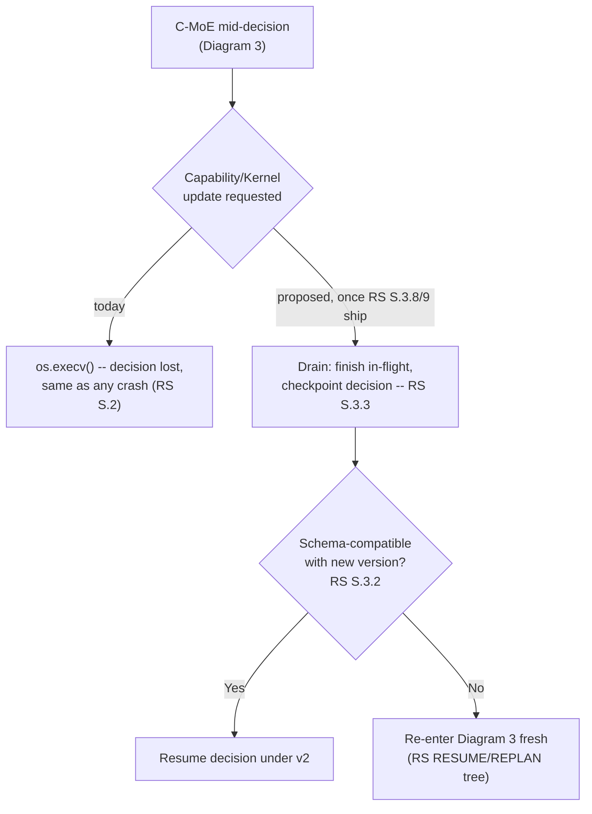

---

## V. Security / Threat Model

Grouped where a shared root cause makes separate write-ups redundant, matching RS's own grouping convention — every named threat from the directive's §40 list is addressed explicitly, none silently merged away.

### Recursive expert loops, recursive verifier loops, infinite escalation, routing oscillation

- **Detection:** Section F's budget (`OperationRecoveryBudget` generalization) and marginal-value gate; Section Q's separately-budgeted verification prevents a verifier recursing into the work it's checking.
- **Containment:** A gate that returns "no further value" is a hard stop, not a suggestion — escalation cannot silently continue once the budget is exhausted (Section F, Diagram 5).
- **Recovery:** Escalate to Governance/user (Diagram 5's explicit terminal branch) rather than looping.
- **Verification/Governance:** Every escalation step is Governance-visible (routes through the same `evaluate_action()` path as any other governed action, per Law 1).
- **Audit Trail:** Each escalation step and its marginal-value evaluation is a durable event (Section X).

### Worker explosion

- **Grounding:** N/A as a distinct threat under this study's own recommendation — Section G rejects heavyweight Virtual Workers for v1.0. If subtree-scoping metadata (Diagram 11) is later built, creating a new scope is itself a `GovernanceAction`, bounded by the same budget as any other escalation — there is no separate "worker creation" path to explode.

### Model disagreement cascades, correlated expert errors

- **Grounding:** Section J's independence-tracking requirement exists specifically because correlated models can be wrong together; agreement among non-independent Experts is discounted, not treated as consensus (Diagram 8).
- **Detection/Containment/Recovery:** Diagram 8's flow — discount correlated agreement, escalate unresolved disagreement.
- **Verification/Governance:** A disagreement record is itself Governance-visible evidence, not silently resolved by count.
- **Audit Trail:** The disagreement and the independence assessment that resolved (or didn't resolve) it are both durable events.

### Resource exhaustion

- **Grounding:** `AdaptiveSemaphore` (RS §A.4) is real, tested, race-safe capacity control — reused directly (Section I/M), not reinvented.
- **Detection/Containment:** Existing AIMD backoff.
- **Recovery:** Shrink parallelism (Section M's weak-machine strategy), never lower acceptance criteria (Section E's precedence rule).

### Corrupted routing memory, poisoned performance history, stale expert profiles

- **Grounding:** Section O's triple defense — Verification+Governance gate on every Learning Candidate, mandatory provenance (`PROJECT_INSTRUCTIONS.md` §8.2), and version/maturity tagging against RS's mixed-version discipline.
- **Detection:** A Routing Memory entry with no traceable `source_event_id`, or one tagged with a superseded `app_version`/model-maturity stage, is treated as untrustworthy by the same standard, not silently used.
- **Recovery:** Fall back to hard-constraint-only selection (Diagram 3) when soft-signal history is untrusted — degrades to a safer, dumber default rather than failing closed entirely.

### Malicious/impersonating capabilities, model supply-chain compromise

- **Grounding:** **Explicitly out of C-MoE's own scope.** C-MoE consumes `CapabilityRegistry`'s already-admitted set; it does not itself vet capabilities or models — that admission gate belongs one layer below (Capability/Adapter registration, Section M's third layer for models specifically). This study does not propose C-MoE duplicate that gate; duplicating it would itself violate Law 3 (Separation of Concerns) by giving C-MoE a second, redundant trust boundary to maintain.

### Version mismatch

- **Grounding:** RS §S.3.2's schema-versioning discipline, applied to C-MoE decision events exactly as to any other persisted contract (Section U).

### Context contamination (cross-Mission)

- **Grounding:** Blocked on RS's #4 Critical Pre-Freeze item (Scope resolution), per Section N. Not resolved here; explicitly flagged as shared, unresolved dependency rather than papered over.

### Hidden shared state

- **Grounding:** Kernel Law 2 (Explicit State) applies to C-MoE's own decision record directly: it must not live in a local dict the way `WorkflowRuntime`'s node state does today (RS's DEBT-003) — this study's Section X specifies C-MoE decisions as `EventStream` events from the start, deliberately avoiding reintroducing the exact bug class RS just spent an entire study finding.

### Update during active mission, conflicting priorities, deadline pressure causing unsafe shortcuts

- **Grounding:** Sections U, N, and E respectively — each already answered above; listed here only to confirm the directive's full §40 list has an explicit home in this study, none silently dropped.

### Diagram 25 — C-MoE threat containment, single point of enforcement

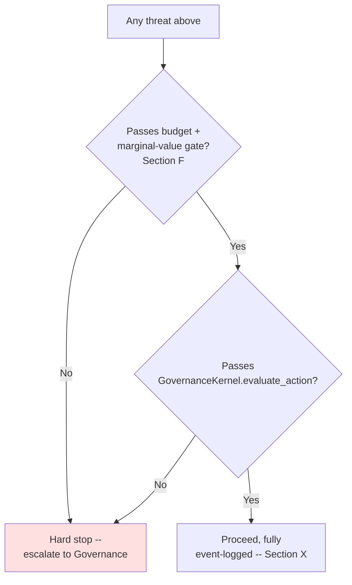

---

## W. Performance Model

**[REC]** Consistent with the directive's own instruction not to measure C-MoE by benchmark accuracy alone, and with `PROJECT_INSTRUCTIONS.md` §16.2's existing evaluation standards (`correctness, safety, efficiency, reproducibility, latency, resource usage`) — this study does not invent a parallel metrics framework. C-MoE-specific additions to that existing list, all derivable from Section X's event trail without a new instrumentation layer:

- **Routing quality** — did hard-constraint filtering correctly reduce to the actual-best candidate set (retrospectively checkable once Verification/Reflection exist).
- **False/missed escalation rate** — how often the marginal-value gate (Section F) escalated without assurance actually improving, or failed to escalate when it should have (both computable from Section X's event trail once Reflection exists — this study does not propose C-MoE compute its own success rate; that is Reflection's job, per Section R).
- **Expert utilization vs. task success** — whether additional experts (Section I/J) actually improved outcomes, the direct test of the directive's own "don't use 50 experts because the machine has RAM" concern (§16).

**[REC] Classification: metrics collection is a consequence of Section X's event trail existing (no new work); metrics *analysis* is Reflection/Learning's job (ADVANCED C-MOE, depends on those future milestones), not C-MoE's own.**

---

## X. Contract Registry Impact

**[REC] Necessity, ownership, and pre-freeze status for each contract the directive's §45 asks this study to consider — deliberately without inventing concrete field schemas, per §45's own instruction:**

| Contract | Necessary? | Owner | Pre-freeze? |
|---|---|---|---|
| C-MoE Decision Event | Yes — the central artifact this whole study is about | C-MoE | **Contract shape: CRITICAL PRE-FREEZE.** Full field list: post-freeze. |
| Expert Contract | Yes, minimal (today: `capability_type` string, per `IMPLEMENTATION_TRACKER.md`) | Shared with Capability/Adapter contracts, not new | Already exists in embryonic form; formalizing it is post-freeze |
| Expert Selection Result | Yes | C-MoE | Post-freeze (depends on Decision Event shape) |
| Expert Performance Profile | Yes (Section O) | C-MoE's Routing Memory | Post-freeze |
| Assurance Requirement / Assurance Assessment | Yes, shape only (Section K) | Shared: C-MoE (decision confidence) + Verification (output confidence) + Governance (aggregation) | Shape: post-freeze. Aggregation algorithm: explicitly not frozen (Section D.2). |
| Worker/Cognitive Organization Contract | **Not required** (Sections G/H) | — | Not applicable |
| Escalation Policy | Yes (Section F) | C-MoE, composing with existing `OperationRecoveryBudget` | Post-freeze — extend existing contract, don't create a parallel one |
| Resource Requirement | Partial — strategy-selection only (Section M), no new scheduling contract | Shared with `AdaptiveSemaphore` | Post-freeze |
| Aggregation Result | Yes (Section J/Diagram 8) | C-MoE (disagreement record) / Verification (final aggregation) | Post-freeze |
| Routing Memory record | Yes (Section O) | C-MoE | Post-freeze |
| C-MoE provenance record | **This is the same thing as the Decision Event above, not a separate contract** — this study explicitly does not recommend a distinct provenance artifact layered on top of the decision event that already carries provenance by construction (`EventStream`'s existing model). | — | — |

**[REC] The one genuinely CRITICAL PRE-FREEZE contract question:** does the Work Unit event schema RS already scheduled (RS §C.2, RS's #1 item) need to reserve a field/event-type family for C-MoE decisions specifically, so that C-MoE's own event shape doesn't have to retrofit onto a schema frozen without it in mind? **Yes** — this is this study's one genuinely new pre-freeze requirement, and it is additive to RS's existing item, not a competing one (Section Y).

### Diagram 17 — C-MoE decision provenance: what the record links to, not what it locks in

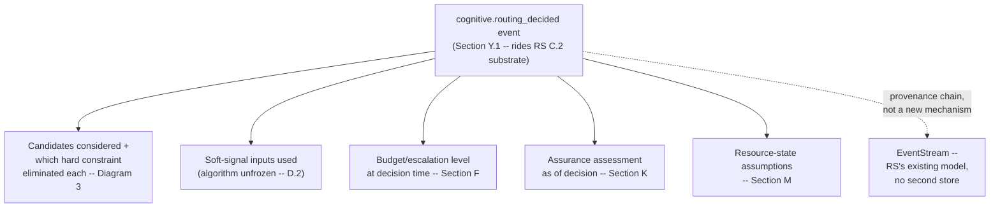

---

## Y. Critical Pre-Freeze Requirements

**These are contracts to specify, not features to build, matching RS's own framing exactly:**

1. **Reserve a `cognitive.routing_decided` (or equivalent) event-type family within RS's own Work Unit event schema (RS §C.2)**, so C-MoE's decision record has a home in the schema RS is already scheduling, rather than needing a second durability mechanism. This is additive to RS's #1 item, not a new one competing with it.
2. **State explicitly, in whatever ADR eventually formalizes the Work Unit state machine (RS's post-freeze item Q.8), that the cognitive/routing axis (this study, Section D.3) and the recovery axis (RS Diagram 4) are two orthogonal dimensions of one Work Unit, not one merged enum.** Cheap to specify now; expensive to retrofit once a state machine ships with the wrong shape (the same reasoning RS itself used for identifier reconciliation, RS §E.3).
3. **Confirm the three-layer resolution stack (C-MoE → AdapterRuntime → model_router, Section M) as the frozen *ownership* boundary**, even though none of the three's internal algorithms are frozen — this prevents a future implementation session from collapsing AdapterRuntime's existing, working adapter-fallback logic into a new C-MoE mechanism by accident, which would be exactly the kind of "silently move responsibilities between milestones" AED's own Mandatory Rules forbid.
4. **Verification's expert-selection budget (Section Q) must be specified as structurally separate from the Work Unit's own escalation budget (Section F) before either is implemented** — this is the specific, concrete mechanism that prevents the directive's own named verification-loop threat, and is cheap to state as a contract now, expensive to discover missing after both are built independently and turn out to share state.
5. **C-MoE must not be exempted from RS's persisted-contract schema-versioning discipline (RS §S.3.2)** — stated explicitly here so a future C-MoE implementation session doesn't treat its own decision event as a special case needing its own versioning scheme.
6. **The naming collision between this study's rejected "Virtual Worker" concept and the frozen `ADR-003` "Worker" contract (Section G) should be recorded** — not because Virtual Workers are being built, but so a future session proposing *any* stateful, persistent worker-like entity checks this study first rather than rediscovering the collision after code exists.

**[REC] Deliberately not on this list, despite the directive exploring them at length: exact routing/scoring algorithms, exact assurance aggregation, exact worker-grouping heuristic, exact learning algorithm, the Scope/Session identity resolution itself (RS's item, not duplicated here), and anything Self-Model-adjacent (Section P).** Each is either explicitly-not-frozen by this study's own Section D.2/§47 reasoning, or a dependency on a decision this study does not own.

---

## Z. Deferred Decisions

Explicitly left open, matching the directive's own instruction that some things should remain unresolved rather than prematurely settled:

1. **Virtual Worker / Cognitive Organization naming and existence** (Sections G/H) — revisit only against a real multi-day, multi-specialist mission, not speculatively.
2. **Exact soft-signal expert-scoring function** (Section D.2) — algorithm, not contract; deliberately unfrozen.
3. **Exact multidimensional Assurance aggregation** (Section K) — RS's own Deferred Research item 4, unchanged by this study.
4. **Exact marginal-cognitive-value estimator** (Section F) — the *gate* is specified; the estimator behind it is not.
5. **Distributed / multi-node C-MoE** (Section M) — out of scope per this study's own directive and RS §O alike; not touched.
6. **Self-Model integration depth** (Section P) — gated on K5 unfreezing, not a Kernel-v1.0-era decision at all.
7. **Whether Reflection/Learning eventually need their own C-MoE-style selection mechanism internally** — noted as a live possibility (Section Q already answers this for Verification specifically) but not designed here for Reflection/Learning, which remain their own future milestones per AED.

---

## Comparison Table

The directive's own starting table, corrected against repository evidence per its explicit instruction ("do not force the table's assumptions... correct them and explain") — changes bolded, with the reason inline:

| Concept | Purpose | Persistent? | Owner | Can communicate directly? |
|---|---|---|---|---|
| Kernel | System substrate | Yes | Kernel | Controlled |
| Cognitive Runtime | Cognitive orchestration | Yes | Runtime | Via contracts |
| C-MoE | Expertise composition/routing | **The function is stateless; its *decisions* persist via `EventStream` once RS §C.2 ships (Section T) — corrected from the directive's ambiguous "Runtime" entry, which conflated the two.** | Runtime (Kernel-managed subsystem, per AED + Kernel Constitution Part VII's "capability resolution" layer assignment, Section 57) | Via Runtime |
| Expert | Specialized cognition | Usually not itself; **always terminates in a Capability invocation (Section C's refinement of AED)** | Capability/Model ecosystem | No direct orchestration |
| Capability | Domain expertise/action | Yes (registered in `CapabilityRegistry`) | Capability | No (AED: "Capabilities SHALL NEVER invoke another capability") |
| Virtual Worker | **Rejected as a heavyweight entity for Kernel v1.0 (Section G)** — realized as metadata over Work Graph subtrees instead | No (by this study's recommendation) | Runtime | N/A — not a communicating entity under this recommendation |
| Cognitive Organization | **Not required (Section H)**, no demonstrated need over nested subtree metadata | No | Runtime | N/A |
| Verification | Correctness assessment | Runtime subsystem | Verification | Via contracts; **may use C-MoE-style selection internally with a structurally separate budget (Section Q)** |
| Reflection | Strategy evaluation | Runtime subsystem | Reflection | Via contracts; **never mutates historical execution (AED, confirmed verbatim, Section R)** |
| Learning | Experience optimization | Long-lived | Learning | Governed — **requires both Verification AND Governance approval (AED, confirmed verbatim, Section O)** |
| Memory | Retained state/knowledge | Yes by tier | Memory | Governed; **Routing Memory is C-MoE's own tier-adjacent record, distinct from `CapabilityRegistry` and any future Self-Model (Section O)** |

---

## Critical Questions — Direct Answers

Cross-referenced rather than re-argued, matching RS's own convention — full reasoning is in the section cited.

1. **Is C-MoE actually necessary as a distinct subsystem?** Yes, as a thin, bounded resolution function — not the full adaptive-scaling system explored throughout this study (Executive Summary, Section A).
2. **What does C-MoE own that the Cognitive Runtime does not?** The candidate-resolution decision itself (Section D) — not the Work Graph, not continuation, not execution invocation.
3. **What does the Cognitive Runtime own that C-MoE must never own?** Work Graph node creation/expansion/pruning and continuation routing (AED, Section D.1).
4. **Is one Expert enough for most tasks?** Yes — today's live path uses exactly one, unconditionally, and Diagram 2's minimal path keeps that the default (Section A).
5. **When should C-MoE use multiple Experts?** When hard-constraint filtering yields 2+ candidates *and* the marginal-value gate clears (Sections E, F).
6. **When does redundancy improve assurance?** Only under genuine, tracked independence — not from count alone (Section J).
7. **When does additional computation stop being useful?** When the marginal-value gate returns "no" (Sections F, L).
8. **Are Virtual Workers necessary?** No, for Kernel v1.0 (Section G).
9. **Are Cognitive Organizations necessary?** No (Section H).
10. **Can the same result be achieved without them?** Yes — Work Graph subtree metadata (Section G, Diagram 11).
11. **How does C-MoE avoid becoming a swarm?** The marginal-value gate and budget prevent default fan-out (Section F).
12. **How does C-MoE avoid recursive explosion?** `RecursionGovernor`, once wired — and this study's finding that C-MoE's own escalation path is the first thing that would actually need it wired (Section F.1).
13. **How does C-MoE avoid resource starvation?** Reuses `AdaptiveSemaphore` (Sections I, M).
14. **How does C-MoE handle expert disagreement?** Independence-weighted, not majority vote (Section J, Diagram 8).
15. **How does C-MoE handle correlated expert failure?** Independence is tracked as an explicit Expert Performance Profile property (Sections J, O).
16. **How does C-MoE integrate Assurance Assessment?** As a decision-confidence + verification-confidence pair, event-payload-backed, no numeric threshold invented (Section K).
17. **How does Think Harder change execution?** Raises the requirement and the budget feeding the *same* escalation gate — not a separate mechanism (Section L).
18. **How does C-MoE respond to priority changes?** Allocation only, never acceptance criteria — inherited from `PROJECT_INSTRUCTIONS.md` §4's existing precedence, not a new rule (Sections E, N).
19. **How does C-MoE behave under deadlines?** Same precedence rule as priority (Section E).
20. **How does C-MoE survive power failure?** It doesn't yet — inherits RS's DEBT-003 gap entirely; no C-MoE-specific exposure beyond that (Section T).
21. **How does C-MoE recover its last routing decision?** Via RS's existing six-way RESUME/RETRY/RECONCILE/REPLAN/ABORT/ESCALATE tree — no seventh disposition needed (Section T).
22. **How does C-MoE handle stale state?** Shares RS's checkpoint-age staleness heuristic as a second consumer, not a new mechanism (Sections K, S).
23. **How does C-MoE behave during Kernel updates?** Crash-equivalent today (RS §S.2); protected once RS's S.3.8/S.3.9 ship (Section U).
24. **How does C-MoE behave during capability updates?** Identical to a Kernel update today — no distinct mechanism (Section U).
25. **How does C-MoE behave during model updates?** Already solved one layer down by `model_router`'s live canary/rollback — C-MoE only consumes the result (Sections M, U).
26. **How does C-MoE preserve active missions?** Not independently — it inherits whatever RS's C.2/S.3.8/S.3.9 provide (Sections S, U).
27. **How does routing learn?** Through the standard Verification+Governance-gated Learning Candidate loop, already mandated by AED (Section O).
28. **How is routing learning protected from poisoning?** Triple defense: the same gate, mandatory provenance, and version/maturity tagging (Section O).
29. **How does the Self-Model influence routing?** Deliberately not designed here — FUTURE RESEARCH, gated on K5 unfreezing (Section P).
30. **How does C-MoE avoid unnecessary LLM calls?** The minimal-path default (Diagram 2) and non-LLM Expert admission (Section C) mean an LLM is invoked only when hard-constraint filtering actually requires selecting among viable LLM-backed candidates.
31. **How does C-MoE decide when a deterministic capability is enough?** The same hard-constraint filter that ranks any other candidate — no separate "good enough" step (Section C).
32. **How does C-MoE interact with Verification?** Verification may invoke C-MoE-style selection internally, under a structurally separate budget that never borrows from the Work Unit's own (Section Q).
33. **How does C-MoE interact with Reflection?** Only through the event trail C-MoE already produces for its own replayability — no direct coupling (Section R).
34. **How does C-MoE interact with Governance?** Every escalation step and every decision routes through `GovernanceKernel.evaluate_action()` (Sections F, V).
35. **What must be frozen before Kernel v1.0?** Six items (Section Y).
36. **What should deliberately remain flexible?** Seven items (Section Z).

---

## Adversarial Architecture Test

All 20 scenarios from the directive, grouped by shared root cause where the analysis is identical — every scenario still named explicitly, matching RS's own grouping convention. Format per group: **Detection → Decision → Resource allocation → Execution → Verification → Recovery → Governance → Learning → Auditability.**

### 1, 2, 3 & 4 — Simple task / complex software task / high-risk task / novel task

- **Detection:** Candidate count after hard-constraint filtering (Section E, Diagram 4) is the first-pass signal for all four — 1 candidate (simple), 2+ across independent domains (complex), 2+ with an elevated required-assurance tier from Governance policy (high-risk), 2+ with weak/absent historical Routing Memory data (novel, the nearest available proxy — Section E).
- **Decision:** Simple → direct dispatch (Diagram 2). Complex → parallel dependency-aware fan-out if the marginal-value gate clears (Section I). High-risk → redundancy considered, independence-checked (Section J), assurance requirement raised by Governance policy, not by C-MoE itself. Novel → same selection path, but Routing Memory contributes little, so hard constraints and structural checks carry more weight by construction (there's simply less soft signal to weight).
- **Resource allocation:** Section M — strategy scales with available resources in all four; acceptance criteria never does.
- **Execution:** Diagram 3 for all four; only the candidate count and constraint profile differ.
- **Verification:** Section Q, structurally separate budget in all four; high-risk correctly gets more verification depth because Governance's assurance requirement, not C-MoE's own decision, raised the bar.
- **Recovery:** Section T's schema, identical across all four.
- **Governance:** Every path routes through `evaluate_action()`; high-risk's elevated requirement is a Governance policy input, not a C-MoE self-assessment.
- **Learning:** Section O, identical mechanism; novel tasks are exactly the case that most needs Verification+Governance-gated learning to eventually reduce their own novelty.
- **Auditability:** Diagram 3's decision event captures the candidate count and constraint profile for all four — a novel task's *lack* of Routing Memory support is itself a durable, inspectable fact, not silently absent.

### 5 & 17 — Expert disagreement / correlated expert failure

- Fully addressed in Section V and Diagram 8: independence-weighted resolution, not majority vote; correlated agreement is discounted, not trusted at face value.

### 6 & 7 — Expert failure / resource exhaustion

- **Detection/Containment:** Already-existing `AdapterRuntime` health-ranked fallback (expert/capability failure, one layer down) and `AdaptiveSemaphore` (resource exhaustion) — RS §A.4, reused directly (Sections I, M, V).
- **Recovery:** Fallback to next-ranked Adapter (existing mechanism); shrink parallelism under resource pressure (Section M) — never lower acceptance criteria.
- **Governance/Learning/Auditability:** No new mechanism — both failure modes are already covered one layer below C-MoE's own decision.

### 8 — User says "Think Harder"

- Fully addressed in Section L: raises requirement and budget into the existing marginal-value-gated escalation loop (Section F); does not create a parallel path.

### 9 — User changes priority

- Fully addressed in Section N: affects allocation only, never correctness/verification/governance/acceptance requirements — the same precedence `PROJECT_INSTRUCTIONS.md` §4 already establishes.

### 10, 11, 12, 13 & 14 — C-MoE crashes / power loss / capability update / Kernel update / model update

- **Detection:** All five reduce to the same detectable state: was a C-MoE decision `RUNNING`/`ROUTING` (Section D.3's cognitive axis) when the interruption occurred.
- **Decision/Recovery:** RS's existing six-way disposition tree (Section T) — no scenario-specific branch needed; a Kernel update and a crash are architecturally indistinguishable today (RS §S.2) and get the identical recovery treatment until RS's S.3.8/S.3.9 ship (Section U), at which point Kernel/capability updates specifically gain the drain-and-checkpoint path (Diagram 22) a bare crash cannot get (nothing to drain toward). Model updates are the one member of this group already solved live, without restart, by `model_router` (Section M/U) — genuinely the easy case among the five.
- **Governance:** Update-triggered restarts specifically route through `GovernanceKernel.evaluate_action()` once RS's S.3.9 ships — today they do not (RS's central Section S finding, inherited here without modification).
- **Auditability:** `system.update_started`/`update_installed`/`rollback`/`restart` events (RS's own S.3.7 recommendation) let a future investigation distinguish "C-MoE's decision was lost to a deliberate update" from "lost to a crash" — a distinction that does not exist today for any subsystem, C-MoE included.

### 15 — Long-running mission

- Fully addressed in Section S: C-MoE's decision record rides RS's C.2 substrate; no separate long-horizon mechanism.

### 16 — Worker explosion attempt

- **Grounding:** Not applicable under this study's own recommendation (Section G rejects heavyweight Virtual Workers). If subtree-scoping metadata is later built, creating a scope is itself a `GovernanceAction`, bounded by the same Section F budget as any other escalation step — there is no separate creation path capable of "exploding."

### 18 — Poisoned routing memory

- Fully addressed in Section V/O: the Verification+Governance gate every Learning Candidate already passes through, mandatory provenance, and version/maturity tagging together mean a poisoned entry has to defeat three independent checks, not evade a single heuristic.

### 19 — Concurrent missions

- Fully addressed in Section N: blocked on RS's #4 Critical Pre-Freeze item (Scope resolution); this study specifies what C-MoE needs from that resolution without attempting to resolve it independently.

### 20 — Persistent Cognitive Service creates a Work Unit while interactive tasks run

- **Grounding:** RS §N already found no Persistent Cognitive Service abstraction exists yet, and that `EventStream.replay()` already provides the recovery mechanism a future one would need (RS's Critical Question 17). C-MoE's own angle is narrow: a background-created Work Unit is arbitrated through the *same* Scope-level resource policy (Section N) as any interactive one, once Scope exists — it does not get a privileged channel, and it does not get deprioritized by default either; that is a Governance policy input (priority tier), not a structural distinction C-MoE makes on its own.

---

## Final Classification of All Recommendations

| # | Recommendation | Classification | Section |
|---|---|---|---|
| 1 | C-MoE as a thin, bounded resolution function (not the full adaptive-scaling system) is the correct Kernel v1.0 shape | **CRITICAL PRE-FREEZE** | Exec. Summary, A |
| 2 | Reserve a `cognitive.routing_decided` event-type family within RS's own Work Unit event schema (RS §C.2) | **CRITICAL PRE-FREEZE** | X, Y.1 |
| 3 | Work Unit state machine: cognitive/routing axis and recovery axis specified as orthogonal, not merged | **CRITICAL PRE-FREEZE** | D.3, Y.2 |
| 4 | Freeze the three-layer resolution *ownership* boundary (C-MoE / AdapterRuntime / model_router), algorithms unfrozen | **CRITICAL PRE-FREEZE** | M, Y.3 |
| 5 | Verification's expert-selection budget structurally separate from the Work Unit's own escalation budget | **CRITICAL PRE-FREEZE** | Q, Y.4 |
| 6 | C-MoE decision events are not exempt from RS's persisted-contract schema-versioning discipline | **CRITICAL PRE-FREEZE** | U, Y.5 |
| 7 | Record the "Virtual Worker" / frozen `ADR-003` "Worker" naming collision | **CRITICAL PRE-FREEZE** | G, Y.6 |
| 8 | Deterministic/learned shortcuts admitted as new Capabilities, never as a silent execution-path bypass | IMPORTANT POST-FREEZE | C |
| 9 | Two-stage selection: hard constraints first, then unfrozen soft-signal ranking | IMPORTANT POST-FREEZE | D |
| 10 | Single-candidate case bypasses C-MoE entirely (direct dispatch) | IMPORTANT POST-FREEZE | A, D (Diagram 2) |
| 11 | Exact soft-signal scoring algorithm | **ADVANCED C-MOE / explicitly not frozen** | D.2 |
| 12 | Complexity signal = post-filter candidate count; no new estimation subsystem | IMPORTANT POST-FREEZE | E |
| 13 | `OperationRecoveryBudget` grows an optional expert-count field rather than a parallel budget object | IMPORTANT POST-FREEZE | F |
| 14 | `RecursionGovernor` wiring (RS's dormant finding) becomes urgent once C-MoE's recursive escalation ships | IMPORTANT POST-FREEZE (elevates RS's own P.6 priority) | F.1 |
| 15 | Marginal-cognitive-value gate is a required contract element; the estimator behind it is not | Gate: IMPORTANT POST-FREEZE. Estimator: **ADVANCED C-MOE** | F, L |
| 16 | Virtual Worker as a heavyweight, stateful entity | **NOT REQUIRED** | G |
| 17 | Virtual-Worker-equivalent as Work Graph subtree metadata | ADVANCED C-MOE | G |
| 18 | Cognitive Organization as a distinct concept | **NOT REQUIRED / FUTURE RESEARCH**, gated on real multi-specialist mission evidence | H |
| 19 | Parallelism reuses the existing Runtime-owned Work Graph; no new C-MoE-owned mechanism | IMPORTANT POST-FREEZE | I |
| 20 | Independence tracked as an explicit, checkable Expert Performance Profile property | IMPORTANT POST-FREEZE | J |
| 21 | Disagreement resolved by independence-weighting, never by raw count | IMPORTANT POST-FREEZE | J |
| 22 | Assurance Assessment contract shape (multidimensional, event-payload-backed, decision+verification pair) | IMPORTANT POST-FREEZE (shape). Aggregation algorithm: **FUTURE RESEARCH** (RS's existing classification, unchanged) | K |
| 23 | Assurance temporal validity shares RS's staleness heuristic rather than a second one | IMPORTANT POST-FREEZE | K, S |
| 24 | Think Harder generalizes the existing gate/budget rather than adding a parallel mechanism | IMPORTANT POST-FREEZE | L |
| 25 | Resource state changes strategy, never acceptance criteria (restated explicitly in C-MoE's own contract text) | IMPORTANT POST-FREEZE (principle already frozen elsewhere, `PROJECT_INSTRUCTIONS.md` §4) | E, M, N |
| 26 | Shared expert/model pool arbitration per Scope, once Scope exists | IMPORTANT POST-FREEZE, **blocked on RS's #4 Critical Pre-Freeze item** | N |
| 27 | Routing Memory owned by C-MoE, explicitly distinct from `CapabilityRegistry` and any future Self-Model | IMPORTANT POST-FREEZE | O |
| 28 | Routing-memory poisoning defense via existing Learning-Candidate gate + provenance + version tagging | IMPORTANT POST-FREEZE | O |
| 29 | Self-Model integration | **FUTURE RESEARCH**, gated on K5 unfreezing | P |
| 30 | Verification-internal expert selection, separately budgeted, non-recursive | Same item as #5 | Q |
| 31 | Reflection requires no new C-MoE-side feature beyond the existing event trail | **NOT REQUIRED** as new work — confirmed sufficient as-is | R |
| 32 | C-MoE decision record rides RS's C.2 durability substrate; no separate long-horizon mechanism | IMPORTANT POST-FREEZE | S |
| 33 | RS's existing six-way recovery disposition tree suffices for C-MoE decisions; no seventh needed | IMPORTANT POST-FREEZE | T |
| 34 | Malicious-capability / model-supply-chain vetting explicitly out of C-MoE's own scope | IMPORTANT POST-FREEZE (boundary statement) | V |
| 35 | Performance metrics extend `PROJECT_INSTRUCTIONS.md` §16.2's existing framework; three C-MoE-specific additions | IMPORTANT POST-FREEZE | W |
| 36 | Distributed / multi-node C-MoE | **FUTURE RESEARCH**, deferred per RS §O and this study's own directive alike | M, Z |
| 37 | Cross-check C-MoE routing/expert patterns against `OCBRAIN_EXTERNAL_REPO_STUDY` V1–V3 (L2 boundary this pass, currently filed under `docs/archive/research/`) | FUTURE RESEARCH — recommended follow-up, not performed this pass | Methodology, X.4 |

---

## Cross-Study Consistency Check

Explicit, per this study's own directive §56 — not silently folded into the sections above.

**Compatible decisions (RS and this study agree without needing reconciliation):** the idempotency-key model (RS §I) applies unmodified to redundant-expert execution (Section J); `OperationRecoveryBudget` generalizes cleanly for Think Harder (RS §J, this study's Section L) without reopening its frozen contract (RS §44); `AdaptiveSemaphore` generalizes cleanly for both parallelism limits (Section I) and update-path draining (RS §S.3.3, this study's Section U); AED's Verification/Reflection/Learning independence rules match this study's Sections Q/R/O exactly, from a source RS never needed to consult.

**New dependency this study surfaces that RS could not have (C-MoE didn't exist when RS was written):** RS's P.6 (`RecursionGovernor` wiring, currently "dormant-but-safe, document why or wire it") stops being a documentation-only decision the moment C-MoE's recursive escalation path ships — this study elevates it from "acceptable to leave dormant" to "needs wiring," without changing RS's own text (Section F.1, Final Classification #14).

**New contract requirement:** RS's §C.2 Work Unit event schema should reserve a `cognitive.routing_decided` event-type family for C-MoE (Section X, Y.1) — additive to RS's existing #1 Critical Pre-Freeze item, not competing with it.

**Genuine near-conflict, resolved rather than left open:** RS's Diagram 4 (recovery-axis Work Unit states) and AED's cooperative-execution sketch (routing-axis states) are two different, unreconciled state lists neither source document flagged as such. This study resolves it as two orthogonal axes (Section D.3) rather than reporting it as a blocking conflict, because the resolution is additive to RS's already-scheduled Q.8 ADR, not a change to anything already frozen.

**Concept removed from this study's proposal because Reliability cannot yet safely support it:** distributed/multi-node C-MoE (Final Classification #36) — RS §O explicitly defers distributed recovery, and a distributed C-MoE routing decision would need exactly the cross-node consistency RS says is not designed yet. This study does not attempt to design around that gap.

**Shared, unresolved blocker (not new, but now shared by two studies instead of one):** the Scope-vs-"Session" identity decision (RS §E.1, RS's #4) is now also a hard prerequisite for this study's Section N. Resolving it once closes both studies' dependent items.

---

## Kernel Constitution Test

Every load-bearing C-MoE responsibility proposed above, run through the three-gate Admission Test (`OCBRAIN_KERNEL_CONSTITUTION.md` Part V):

**Gate 1 — Necessity.** C-MoE strengthens Invariant 6 ("every capability has, at minimum, a defined contract more than one implementation could satisfy" — redundant/independent experts, Section J, realize this directly) and Invariant 4 (resource identity/lifecycle/provenance — Section X's decision-event contract). It upholds Law 1 (Bounded Autonomy — every escalation step is Governance-gated, Section F/V) and Law 7 (Replaceability — Section C's Expert/Capability/Adapter layering keeps every layer swappable). **Pass.**

**Gate 2 — Placement.** Could this be a Capability, Workflow, or External Service instead? No — the Kernel Constitution's own Architectural Layers table (Part VII) already assigns "capability resolution" to the **OCBrain Kernel** layer specifically, not to Capabilities, Adapters, or Applications/Workflows. This is direct, existing textual evidence — not this study's inference — that C-MoE (which *is* capability/expert resolution) belongs inside the Kernel-managed Cognitive Runtime, exactly where AED independently places it. **Pass.**

**Gate 3 — Durability.** Is this stated as the problem it solves, not the technology that currently solves it? This study's own Section D.2/§47 discipline (freeze the contract shape, not the algorithm) is precisely what Gate 3 asks for — "given a Work Unit, resolve to the smallest sufficient set of expertise" describes the right shape of solution regardless of which scoring algorithm, which model generation, or which resource envelope implements it in ten years. **Pass.**

**Non-Goals check:** No proposal above contradicts a Non-Goal. C-MoE has no concept of "conversation" (it resolves Work Units, not chat turns — the Scope boundary, Section N, is explicitly *not* a conversation primitive, matching RS §E.1's own careful framing). Models remain Adapters, never privileged (Section C's heterogeneous-Expert principle). C-MoE is not a workflow-automation product — it is a Kernel-managed subsystem AED already scopes as such. No proposal grants autonomy without governance (every escalation and every decision routes through `GovernanceKernel.evaluate_action()`, Sections F/V). No proposal requires cloud dependency (Section M's resource model is explicitly hardware-tier-agnostic, weak-machine-first).

---

## Final Validation Checklist

| Item | Status |
|---|---|
| C-MoE is clearly separated from the Kernel | ✅ Kernel Constitution Part VII: Kernel owns "capability resolution" as an abstraction; C-MoE is the Cognitive-Runtime-owned realization of it, not a second Kernel |
| C-MoE is clearly separated from the Cognitive Runtime | ✅ Section D: C-MoE owns candidate resolution; Runtime owns the Work Graph itself |
| Capabilities remain domain experts, not orchestrators | ✅ Section C: Capabilities never invoke other capabilities (AED, unmodified) |
| Capabilities never communicate directly | ✅ Confirmed, no proposal above changes this |
| Planning remains K4.2-owned | ✅ Not touched anywhere in this study — confirmed via `IMPLEMENTATION_TRACKER.md`, not assumed |
| K4.2 scope is unchanged | ✅ Same basis |
| C-MoE begins after Planning | ✅ AED's own pipeline; Section A confirms this matches the actual current seam (`WorkflowNode.worker_type`, unresolved) |
| Expert selection belongs to the Runtime/C-MoE boundary | ✅ Section D |
| Virtual Workers are not assumed mandatory | ✅ Section G explicitly rejects the heavyweight version |
| Cognitive Organizations are not assumed mandatory | ✅ Section H |
| Adaptive scaling is explicit | ✅ Section E, tied to `PROJECT_INSTRUCTIONS.md` §4's existing precedence rather than invented |
| Escalation is bounded | ✅ Section F — budget + marginal-value gate + (once wired) `RecursionGovernor` |
| Parallelism is dependency-aware | ✅ Section I — reuses the Runtime-owned Work Graph |
| Redundancy is justified by assurance/risk | ✅ Section J — independence-gated, not automatic |
| More experts does not automatically mean more correctness | ✅ Section F's marginal-value gate exists precisely to prevent this |
| Assurance is multidimensional | ✅ Section K, no scalar collapse |
| Think Harder raises assurance requirements rather than bypassing safety | ✅ Section L's explicit MUST-NOT list, enforced structurally, not just stated |
| Resource limits do not lower correctness requirements | ✅ Sections E/M/N, inherited from `PROJECT_INSTRUCTIONS.md` §4 |
| C-MoE can recover after restart | ⚠️ **Not yet — inherits RS's DEBT-003 gap entirely.** This study specifies what must be true once RS's C.2 ships (Section T); it does not claim recovery works today. |
| C-MoE decisions have durable identity/provenance | ⚠️ **Contract specified (Section X), not yet implemented** — same caveat as above |
| Active missions survive updates | ⚠️ **Not yet** — inherits RS §S.2's central finding entirely; Section U specifies the dependency on RS's S.3.8/S.3.9, does not claim it's solved |
| Version compatibility is explicit | ✅ Section U — C-MoE decisions treated as "just another persisted contract" under RS's existing S.3.2 discipline |
| C-MoE does not become an autonomous second Kernel | ✅ Kernel Constitution Test, Gate 2 |
| C-MoE cannot bypass Verification | ✅ Section Q |
| C-MoE cannot bypass Governance | ✅ Sections F/V — every step gated |
| Learning requires Verification + Governance | ✅ Confirmed via AED verbatim, Section O |
| Routing memory is protected from poisoning | ✅ Section O's triple defense |
| Infinite escalation is prevented | ✅ Section F |
| Worker explosion is prevented | ✅ N/A under this study's own recommendation (Section G); would be Governance-gated if ever built |
| Long-running missions are supported conceptually | ✅ Section S — conceptually, not yet operationally (same DEBT-003 caveat) |
| Concurrent missions remain isolated | ⚠️ **Blocked on RS's #4 (Scope resolution) — explicitly not resolved by this study**, per Section N |
| No implementation work is introduced | ✅ No code, no pseudocode, produced or modified this session |
| No completed milestone is redesigned | ✅ K4.2-H1 (frozen) and K4.2 generally untouched throughout |
| No current K4.2 implementation is expanded | ✅ Confirmed against `IMPLEMENTATION_TRACKER.md`'s own scope statements throughout |
| Critical pre-freeze contracts are explicitly identified | ✅ Section Y, seven items |
| Algorithms remain flexible where appropriate | ✅ Section Z, seven items explicitly left open |

**Three items above are marked ⚠️ rather than ✅ deliberately** — they are honest statements of "specified, not yet true," consistent with this study's Executive Summary and with RS's own equivalent honesty about DEBT-003 in its Design Principles Assessment. Marking them ✅ would misrepresent what this study actually establishes.

---

## C-MoE Architecture Readiness Assessment

1. **Current C-MoE maturity:** Zero code, and that is the correct state to be in. The seam C-MoE will eventually fill (`WorkflowNode.worker_type`, unresolved since Planning's design deliberately leaves it that way) is precisely bounded and already documented in `IMPLEMENTATION_TRACKER.md` as reserved for this exact purpose. One layer below, real infrastructure already exists and works: `AdapterRuntime`'s health-ranked adapter fallback and `model_router`'s live canary-and-auto-rollback are both genuine precedents for pieces of what a fuller C-MoE will eventually need, neither of which C-MoE should duplicate.

2. **What the repository already provides:** A clean architectural answer to where C-MoE sits (AED, Approved, cited verbatim throughout this study) and a documented, deliberate gap for it to fill (`CapabilityExecutorWorker`'s "no capability selection logic, still C-MoE future work"). A frozen Worker contract (`ADR-003`) that any future Virtual-Worker-like concept must not collide with by name. A working three-layer resolution precedent (Section M) that C-MoE should extend downward from, not reinvent.

3. **What the Reliability Study enables:** The entire durability substrate (`EventStream`, once RS's C.2 checkpoint wiring ships) that a C-MoE decision needs to survive a restart; the idempotency-key discipline that redundant-expert execution needs (Section J); the update-safety patterns (`model_router`'s canary/rollback, `use_k42_frontend`'s mixed-version discipline) C-MoE's own live-evolution story generalizes from rather than invents; and one still-open, shared blocker (Scope-vs-Session, RS §E.1) that both studies now depend on.

4. **What C-MoE actually needs, at Kernel v1.0:** A reserved event-type family in RS's schema (Y.1), an explicit statement that the Work Unit state machine has two orthogonal axes (Y.2), a frozen three-layer ownership boundary with unfrozen algorithms beneath it (Y.3), a structurally separate verification-selection budget (Y.4), inclusion under RS's existing versioning discipline rather than an exemption (Y.5), and a recorded naming-collision warning (Y.6). That's the entire pre-freeze list — six items, all additive to RS's existing nine, none competing with them.

5. **Whether Virtual Workers are necessary:** No — not for Kernel v1.0, and not demonstrated as necessary by anything in this repository or its research corpus consulted this pass. The properties they'd provide are available today as Work Graph subtree metadata (Section G).

6. **Whether Cognitive Organizations are necessary:** No, for the same reason, one level up (Section H) — nested subtree metadata already provides what a flat hierarchy of specialist "Workers" would.

7. **The recommended C-MoE architecture:** Model B (Runtime + optional, metadata-realized Workers) operating under Model E's escalation policy (start flat, escalate only when the marginal-value gate and hard-constraint filtering actually demand it) — Section D.1. Not Model C or D. Not the adaptive-scaling system the directive spends most of its length exploring, at least not yet — that system remains real, motivated future work, sequenced as Section Y's six items ship first.

8. **Critical pre-freeze contracts:** Seven, listed in full in Section Y — none requiring new implementation, all requiring an explicit decision recorded before Kernel v1.0 freezes.

9. **Critical pre-freeze implementation foundations:** None, by this study's own finding — every pre-freeze item is a contract to specify, not code to write, matching the directive's own instruction (§48) not to conflate "contract required" with "implementation required."

10. **Post-freeze implementation milestones:** The bulk of this study's ~30 IMPORTANT POST-FREEZE recommendations (Final Classification), led by the actual resolution function itself (Diagram 3), the Expert Performance Profile / Routing Memory (Section O), and the marginal-value gate as a real, callable mechanism (Section F).

11. **Advanced C-MoE research:** Work Graph subtree metadata as the Virtual-Worker substitute (Section G), the soft-signal scoring algorithm (Section D.2), and the marginal-cognitive-value estimator behind Section F's gate (Section L).

12. **Unresolved architectural decisions:** The Scope-vs-Session identity question (RS's, now shared — Section N); the full multidimensional Assurance aggregation function (RS's own Deferred Research item, unchanged — Section K); whether Reflection/Learning will eventually need their own internal C-MoE-style selection the way Verification does (Section Z.7).

13. **New risks discovered:** The Worker/`ADR-003` naming collision (Section G) — cheap to record now, expensive to discover after code ships under the wrong name. `RecursionGovernor`'s dormant accumulation gap (RS's own finding) becoming a live risk the moment C-MoE's recursive escalation exists (Section F.1) — this study elevates RS's own P.6 rather than leaving it as a "document why it's fine to leave dormant" decision.

14. **New dependencies discovered:** C-MoE's Section N is now formally dependent on RS's #4 (Scope resolution) — not a new decision, but a newly-shared one. Verification's expert-selection budget must be specified as separate from the Work Unit's own before either is built (Y.4) — a dependency that did not need stating before C-MoE existed to create the risk of them merging by accident.

15. **New requirements for the Kernel v1.0 Freeze Audit:** Confirm Section Y's seven items alongside RS's existing nine (sixteen total Critical Pre-Freeze items across both studies) before considering Kernel v1.0 ready to freeze. **This study, like RS, is a "no stop" outcome — nothing found here requires reopening a frozen H1 contract, redesigning K4.2, or expanding its scope.** What Kernel v1.0 needs from C-MoE specifically is small, additive, and already has a home in RS's existing schema plan — the fuller adaptive-scaling system this study's directive explores at length is real, well-motivated, evidence-grounded future work, correctly sequenced *after* a freeze this study finds no reason to delay.

---

*End of study. Per the governing directive: this document proposes architecture; it does not implement it. No production code was modified in this session.*
