# OCBrain — Cognitive Reliability & Durable Execution Architecture Study

**Status:** Research / Architecture Study — NOT an implementation specification. No production code was modified to produce this document.
**Date:** August 21, 2026
**Scope:** Feeds the Kernel v1.0 Freeze & Contract Audit. Governed by the directive `OCBrain — Cognitive Reliability & Durable Execution Architecture Study`.
**Repository state studied:** `1h0lde4/ocbrain-v4.1`, HEAD `21f7868` ("Merge PR #10 from revert-8-h2/d3-capability-discrimination"), branch `main`.
**Precedence:** Subordinate to `OCBRAIN_KERNEL_CONSTITUTION.md` (Laws, Invariants, Non-Goals, Admission Test) and `PROJECT_INSTRUCTIONS.md`. Where this study's conceptual vocabulary (borrowed from the study directive) appears to strain against a Constitutional Non-Goal, that tension is surfaced explicitly rather than resolved silently — see Section E.

---

## Orientation Note (Phase 0)

Two things are true as of HEAD that `CURRENT_STATE.md` (last synchronized Aug 18) does not yet reflect:

1. **H2/D3 (Capability Discrimination) and H2/D12 (Tracking Hardening) were merged and then fully reverted** on the current branch (`4f0e8d1`/`21f7868` revert D3 — 793 deleted insertions net; `c6fc915`/`5abd36d` revert D12 — 244 deleted insertions net). D7 and D11 remain open, unmerged feature branches. This study treats **code at HEAD as ground truth** per Kernel Constitution Law 9 (Single Source of Truth: "when documentation and reality disagree, reality wins") and does not treat D3/D12 as landed.
2. A root-level `PROJECT_INSTRUCTIONS.md` (129 bytes) exists alongside the authoritative `docs/architecture/PROJECT_INSTRUCTIONS.md` (~25 KB). This study used the content supplied directly in-session, which is consistent with the `docs/architecture/` version's content as cited throughout the codebase (e.g. `core/events/event_stream.py`'s `PI LAW 2` references).

Neither fact changes this study's conclusions; both are noted per the "no silent resolution" discipline rather than left for a future session to rediscover.

---

## Methodology & Evidence Boundaries

This study used a minimum-context pass, not a full-repository read:

- **L0 (read in full):** `OCBRAIN_KERNEL_CONSTITUTION.md`, `CURRENT_STATE.md`, `IMPLEMENTATION_ROADMAP.md`, `KNOWN_ISSUES.md`, `core/events/event_stream.py`, `core/workflow/runtime.py`, `core/cognitive/recovery.py`, `core/runtime/state.py`, `core/runtime/resilience.py`, `core/governance/governance_kernel.py`, `tests/test_orchestrator_recovery.py`.
- **L1 (grepped / partially read):** `OCBRAIN_FUTURE_ARCHITECTURE.md` (durable-execution and saga/compensation sections), `core/capabilities/adapter_runtime.py`, `core/orchestrator.py` (identity fields only), `main.py` (process model), `data/context.sqlite` (schema only), the `tests/break_*.py` / `chaos_monkey.py` fault-injection scripts (existence, size, pytest-collection status).
- **L2 (not read):** `core/cognitive/planner.py`, `core/cognitive/compiler.py`, `core/memory/unified_memory.py` internals beyond backend file inventory, `OCBRAIN_K4_2_*` specification documents beyond what's cited in code comments, the six other governors' full bodies beyond `RecursionGovernor`/`BudgetGovernor`/`EvolutionGovernor`.

Findings below are marked **[FACT]** (directly confirmed by reading code/docs in this session), **[INFER]** (a reasonable conclusion from what was read, not independently re-verified), or **[REC]** (this study's recommendation, not a claim about current state). Where L2 material would be needed to fully confirm something, that is stated rather than guessed.

---

## Executive Summary

**The primary question this study answers:** *what does it mean for an OCBrain task to be reliably executing for 10 minutes, 10 days, or 10 months?* Today, the honest answer is: **for 10 minutes, mostly yes, with real gaps. For 10 days or 10 months, no — not because the pieces are absent, but because the durable pieces that exist (EventStream's WAL, StateStore's SQLite-backed maturity store, UnifiedMemory's L1/L3/L4 backends) are not yet the pieces that carry cognitive execution state (Work Graphs, Work Units, plans, in-flight retries). The load-bearing execution state lives in plain Python dictionaries inside `WorkflowRuntime.execute()` and is lost the instant the process exits.**

This is not a new discovery — `KNOWN_ISSUES.md` DEBT-003 already names it ("long-running workflows cannot survive process restart") — but this study traces its full blast radius: identity, concurrency, side-effect safety, and provenance all inherit the same gap, because they all currently assume a single, continuously-running process.

The good news, and the reason this study is optimistic about the path forward: OCBrain already has the *primitive* this reliability model needs. `EventStream` (`core/events/event_stream.py`) is a genuine, working, WAL-backed, checkpoint-capable, replayable event log — `EventStream.create_checkpoint()` / `get_checkpoint()` already exist and work; they are simply never called by anything today. `OperationRecoveryBudget` demonstrates, in miniature and under excellent test coverage, exactly the shared-instance, bounded-termination discipline a future Work Unit recovery model needs at scale. `StateStore` demonstrates a correctly-scoped (post-BUG-03) durable-state pattern with an honest, bounded data-loss window on hard crash. The architecture doesn't need a new reliability paradigm; per the project's own `OCBRAIN_FUTURE_ARCHITECTURE.md` (Pattern 2, ★10/10 cross-repository prevalence), it needs the existing EventStream WAL wired into `WorkflowRuntime` as durable checkpoints — precisely the v4.4.8 "Durable Workflow Runtime" step that document already prescribes, before anything resembling a distributed or multi-node story is worth discussing.

No finding in this study requires reopening a frozen H1 contract (`RawRequest`, `CapabilityMatch`/`CapabilityDiscoveryResult`, `OperationRecoveryBudget`'s `consume()`/`remaining`/`exhausted`, `derived_from`/`caused_by`, `trace_id`/`operation_id`/`stage_tag`, the three-entrypoint signatures, or the `cognitive.planner_impasse_terminal` event shape). Section 44 (Stop-Condition Check) walks through why. This study is a **Section 44 "no stop"** outcome — Kernel v1.0 can proceed toward freeze once the Critical Pre-Freeze items in Section P are addressed as explicit contracts (not full implementations).

---

## A. Current-State Reliability Audit

### A.1 The Event Backbone — durable, but not yet load-bearing for execution state

**[FACT]** `core/events/event_stream.py` (539 lines) implements `EventStream`, a single-per-process, `asyncio`-safe wrapper around `SQLiteEventStore`. Every `append()` call runs the SQLite write on a thread-pool executor, `INSERT`s into a `journal_mode=WAL` database, and calls `conn.commit()` explicitly before returning — by the time `append()` resolves, the event is durable, not just buffered. Sequence numbers come from SQLite's native `AUTOINCREMENT` (`cursor.lastrowid`), not from an in-process counter — the in-memory `self._sequence` is a logged cache only, so restart-safety of ordering is real, not accidental. In-process pub/sub notification (`_notify()`) happens *after* persistence and isolates subscriber exceptions from each other and from the append path.

**[FACT]** `create_checkpoint(name, payload)` and `get_checkpoint(name)` are fully implemented: a checkpoint is simply an event of type `system.checkpoint` with a `checkpoint` field, retrieved by `ORDER BY sequence DESC LIMIT 1`. This is a real, generic, working durable-checkpoint primitive.

**[FACT]** `KNOWN_ISSUES.md` DEBT-003 confirms `create_checkpoint()` "is never called by `WorkflowRuntime`" and DEBT-008 confirms there is no dedicated test coverage for checkpoint/replay/WAL persistence specifically — the primitive is unexercised by any test that would catch a regression in it.

**[INFER]** `query()`/`replay()` both materialize their full SQLite result set via `fetchall()` before yielding — `replay(since_sequence=0)` over a long event history would load the entire history into process memory at once. For the 10-day/10-month horizon this study is chartered to reason about, this is a real scaling boundary, not yet a problem at today's volumes.

**[FACT]** `event_id` on every `StreamEvent` defaults to a freshly generated `uuid.uuid4()`. The store enforces `event_id TEXT UNIQUE NOT NULL`, which is a working idempotency primitive — but nothing in the codebase currently supplies a deterministic `event_id` derived from an idempotency key, so the constraint currently guards against nothing. A caller-side retry after an ambiguous append failure produces a second, distinct event, not a deduplicated one. See Section I.

**[FACT]** `SQLiteEventStore._init_db` sets `PRAGMA journal_mode=WAL` but does not set `PRAGMA synchronous`. This is a real inconsistency worth an explicit decision: `core/runtime/state.py`'s `StateStore._init_db` **does** explicitly set `PRAGMA synchronous=NORMAL` for its own database. Two SQLite-backed durability primitives in the same codebase currently make different, undocumented choices about the same durability/performance tradeoff.

**[FACT]** `core/runtime/state.py` (`StateStore`, 241 lines) monkey-patches the global `sqlite3.connect` function at import time (`ClosingConnection` factory, applied process-wide, not scoped to `StateStore`'s own connections). Because `EventStream` opens its own connections via `contextlib.closing(sqlite3.connect(...))` rather than the native connection context-manager protocol, this monkeypatch currently has no functional effect on `EventStream`. It is nonetheless exactly the "hidden framework behavior" `PROJECT_INSTRUCTIONS.md` LAW 4 forbids: whether a future piece of code using `with sqlite3.connect(path) as conn:` gets auto-close-on-exit behavior depends entirely on whether `core.runtime.state` happened to be imported first, elsewhere, for unrelated reasons. `main.py` imports it at module scope, so in the running application this patch is always active; a script or test that doesn't import that module would see stock `sqlite3` behavior. Zero current functional bugs traced to this, but it is a landmine for the next person who writes SQLite code the "normal" way.

### A.2 Workflow execution — the central gap this study is chartered to examine

**[FACT]** `core/workflow/runtime.py` (412 lines) implements `WorkflowRuntime.execute()`. `node_states: Dict[str, WorkflowNodeState]` is a **local variable** created fresh on every `execute()` call — never written to `EventStream`, `UnifiedMemory`, or anywhere else durable. `WorkflowNodeState` (status, result, attempts, timestamps) lives purely in process memory for the duration of one `execute()` call. This is DEBT-003, confirmed directly: if the process dies mid-DAG, every node's state — including which nodes had already completed — is gone. There is nothing to resume from.

**[FACT]** Execution walks the DAG recursively (`_execute_from` calls itself over `node.successors` and `node.error_branch`), with exponential-backoff retry per node (`RetryPolicy`, bounded by `max_backoff_seconds`) and disciplined failure containment (`_execute_node_with_retry` always returns a `WorkerResult`, never raises — confirmed by direct read, matching `PROJECT_INSTRUCTIONS.md` §7.2's requirement).

**[FACT]** Only two workflow-level lifecycle events are durably emitted by `WorkflowRuntime` itself: `workflow.started` and `workflow.completed`. No `node.started` / `node.completed` events are emitted at this layer. Whatever per-node observability exists, if any, would have to come independently from `ExecutionRuntime` or individual workers — this study did not trace that far (L2). Practically: **the EventStream, as currently populated, cannot answer "which nodes had completed at the moment of the crash"** for an in-flight workflow, because that information was never durably recorded at node granularity in the first place, independent of the checkpoint-wiring gap.

**[FACT]** `WorkflowRuntime` already distinguishes **logical identity from attempt identity** in exactly the way Section 6 of the study directive asks for: `workflow_id` (the DAG definition's stable identity, reusable across many runs) vs. `instance_id` (a fresh UUID per `execute()` call). `session_id` is also threaded through to `ExecutionContext`. This is a real, usable foundation — see Section E for why it isn't yet sufficient on its own.

**[FACT]** No idempotency key of any kind is threaded into node execution or into `ExecutionRuntime.invoke()`. A retried node re-invokes its worker with no signal that this is attempt N of a possibly-already-executed action.

### A.3 Governance — correctly designed, partially unwired

**[FACT]** `core/governance/governance_kernel.py` (450 lines, read in full) implements the canonical seven-governor set exactly as `PROJECT_INSTRUCTIONS.md` §6.1 and `CURRENT_STATE.md` describe: `RecursionGovernor`, `BudgetGovernor`, `EvolutionGovernor`, `OrchestrationGovernor`, `AgentGovernor`, `ConversationGuardrails`, `MemoryGovernor`, registered and evaluated in that fixed order — first `REJECT` or `ESCALATE` short-circuits the rest. **A governor that raises an exception is converted to a `REJECT`**, not silently swallowed — this is a deliberate fail-closed design and one of the strongest positive findings in this audit; it should be the template for how future recovery/reconciliation logic handles its own internal failures.

**[FACT]** `BudgetGovernor`'s docstring documents its own history precisely: the pre-fix version accumulated `_step_count`/`_token_spend` on the `GovernanceKernel` *singleton*, so after 100 evaluations across the *entire process lifetime*, every subsequent action was permanently rejected until restart ("BUG-03"). The fix moved budget state into caller-supplied `GovernanceAction.metadata`, which is architecturally correct (per-workflow rather than per-process scope) — but per `KNOWN_ISSUES.md` DEBT-007, **nothing currently populates that metadata**, so the correctly-designed `REJECT` branch is presently unreachable by any real caller.

**[FACT, new finding]** `RecursionGovernor.evaluate()` checks `action.recursion_depth > self.max_depth` (default 10) — correctly implemented. A repository-wide search found **no call site that increments `recursion_depth`**; every `GovernanceAction`/`ExecutionContext` construction found in this session hardcodes `recursion_depth: 0`. This is structurally the same class of gap as DEBT-007 (a correctly-evaluated governor whose input is never populated) but for recursion depth rather than budget, and **it is not yet in `KNOWN_ISSUES.md`**. Recommended as a new DEBT entry — see Section P.

**[INFER]** `evaluate_action()` is synchronous and does not itself write to `EventStream`. Whether governance verdicts are durably recorded depends entirely on whether each *caller* separately chooses to emit an event alongside its own action — this was not confirmed either way for most call sites in this pass (L2). If unconfirmed broadly, this is a provenance gap: Kernel Invariant 3 ("every completed execution can be replayed and explained after it runs") implicitly requires that governance's role in that execution be part of what's replayable.

### A.4 Recovery-adjacent primitives that already exist and work

**[FACT]** `core/cognitive/recovery.py` (78 lines) implements `OperationRecoveryBudget` — a small, frozen (H1), well-designed dataclass: one shared instance per user operation, scoped by `trace_id`, consumed cooperatively by the Planner's re-plan loop and `SupervisorWorker`'s retry path, with `consume()`/`remaining`/`exhausted` as the frozen contract. It is deliberately **not durable** — it lives only for the lifetime of one in-process `handle()` call — and that is the *correct* scope for what it does; nothing here argues for persisting it.

**[FACT]** `tests/test_orchestrator_recovery.py` (272 lines, read in full) is genuinely excellent adversarial test design: it specifically defends against the failure mode where two independently-constructed budget objects with identical-looking counters would still violate the sharing invariant (only proving *instance* sharing, via count propagation, actually verifies it); it proves bounded termination precisely (`max_recovery_attempts=2` → `plan()` called exactly 3 times, never more, regardless of how many times `IMPASSE` recurs); and it proves deterministic outcomes (`REJECTED_PRECHECK`) are never retried, since retrying a deterministic rejection can't produce a different result. **This is the quality bar this study recommends the future Work Unit recovery model be held to.**

**[FACT]** This entire recovery-budget path only runs when `use_k42_frontend=True` (still off by default per `CURRENT_STATE.md`). The *default*, live behavior for "what happens when something fails" today is still `WorkflowRuntime`'s in-process exponential-backoff retry — non-durable, non-idempotent, uniform across node types regardless of side-effect character.

**[FACT]** `core/runtime/resilience.py` (132 lines, read in full) implements a genuine `CircuitBreaker` (CLOSED/OPEN/HALF_OPEN, `asyncio.Lock`-guarded transitions, single-probe-at-a-time during HALF_OPEN) and an `AdaptiveSemaphore` (EMA-smoothed AIMD concurrency control with a race-safe drain mechanism for shrinking capacity without disrupting in-flight tasks). **[FACT]** `CircuitBreaker` is instantiated in exactly one place: `modules/base.py` (the legacy module system), not in `AdapterRuntime` (the newer capability system). `AdapterRuntime`'s own resilience — health-score-ranked adapter selection with automatic fallback — is a direct, explicitly-documented generalization of `core/provider_mesh.py`'s existing `generate_with_fallback()`, not a use of `CircuitBreaker`. Two independent failure-isolation mechanisms exist in the codebase today, at two different layers, that don't share state or a common contract.

### A.5 Memory durability is tiered, and one tier is explicitly volatile

**[INFER, from `CURRENT_STATE.md` + backend file inventory]** `UnifiedMemory`'s L1 (episodic), L3 (procedural), and L4 (archive) tiers are SQLite-backed (`sqlite_storage.py`, `sqlite_archive.py`) and durable. **[FACT, `KNOWN_ISSUES.md` DEBT-006]** L2 (semantic) currently uses `InMemoryVectorBackend` — embeddings are volatile and fully recomputed on every restart, with startup cost scaling with entry count. `OCBRAIN_FUTURE_ARCHITECTURE.md` independently rates this **CRITICAL**, so this is not a novel finding, but this study confirms it sits squarely inside the "what must survive a power failure" question Section 7 of the directive asks about, and today the honest answer for L2 specifically is "nothing survives; it's rebuilt."

### A.6 Persistence is fragmented across independent SQLite files with no shared transaction boundary

**[FACT]** This session directly read the connection-handling code for at least three independent SQLite-backed subsystems (`EventStream`'s event log, `StateStore`'s model-router state, and `UnifiedMemory`'s backend files) plus confirmed a fourth by direct schema query: **`data/context.sqlite`** (tables `turns`, `entities`, `preferences`, `schema_meta` — a flat, session-agnostic conversation-turn log with no session/discussion boundary column of any kind). None of these four share a connection, a transaction, or a commit protocol with any other. **[REC]** A single logical operation that needs to durably affect two of these stores (e.g., "append an event AND write a memory") has no atomicity guarantee across the two; a crash between the two commits can leave them inconsistent with each other, and nothing currently detects or reconciles that. This is explored further in Section F.

### A.7 There is no session/discussion identity anywhere in durable storage

**[FACT]** A repository-wide search for `class.*Session\b`, `SessionState`, `SessionManager` returned nothing. **[FACT]** The only place `session_id` appears as a live value is `core/orchestrator.py`, where it is set to `interaction_id` — i.e., today's "session" is really "this one request/response interaction," not a multi-turn, multi-day conversational or mission-level identity. **[FACT]** `data/context.sqlite`'s `turns` table has no session-scoping column at all. There is currently no durable construct anywhere that spans more than one interaction. See Section E for why this is not automatically a defect — the Kernel Constitution has something specific to say about it.

### A.8 Process model and isolation

**[FACT]** `main.py` contains no `multiprocessing`, `subprocess`, or process-class usage; it is a single `asyncio.run(main())` event loop. **[INFER]** `PROJECT_INSTRUCTIONS.md` §3's mandatory four-process runtime model (Main Process / Worker Pool / Webhook Process / Task Runner) is not implemented as literal OS-level process separation today. Workers execute as `asyncio` tasks inside the one process. This means a single process crash currently takes down all in-flight work, of any kind, simultaneously — there is no process boundary yet for the isolation LAW 3 (`PROJECT_INSTRUCTIONS.md`) or Kernel Law 3 (Separation of Concerns) to lean on beyond in-language `try`/`except` containment.

### A.9 Fault-injection tests exist and are well-targeted, but are not part of the automated regression baseline

**[FACT]** `tests/chaos_monkey.py` (108 lines) and four `tests/break_*.py` scripts — `break_adaptive_thrash.py`, `break_cancellation.py`, `break_circuit_race.py`, `break_ordering.py` (43–61 lines each) — exist, and their names map precisely onto this study's own concerns (circuit-breaker races, event/execution ordering, cancellation safety, adaptive-concurrency thrash). **[FACT]** `pyproject.toml`'s pytest config sets `testpaths = ["tests"]` and does not override `python_files`, so pytest uses its default `test_*.py` collection pattern. None of the four `break_*.py` scripts match that pattern — **they are not collected or run by the automated suite** (the "1174 passed / 34 failed" baseline in `CURRENT_STATE.md`); they exist as scripts that must be invoked manually. `PROJECT_INSTRUCTIONS.md` §16 explicitly requires "failure recovery tests" as part of every major subsystem's test support — today that requirement is satisfied by scripts that exist but don't gate anything.

---

## B. Reliability Gaps

Ranked roughly by how directly each blocks the "10 days / 10 months" horizon:

1. **No durable Work Unit / Work Graph state (DEBT-003).** The central gap. `EventStream`'s checkpoint mechanism exists and works; it is simply unused by `WorkflowRuntime`.
2. **No idempotency-key discipline anywhere in the execution path.** `EventStream`'s `UNIQUE(event_id)` constraint is a dormant primitive. `AdapterRuntime`'s fallback-on-failure retry has no dedup contract — currently harmless only because no side-effecting (non-idempotent) Adapter exists yet.
3. **No session/mission-level identity.** `session_id` is really `interaction_id`. There is no durable construct spanning more than one request.
4. **RecursionGovernor and BudgetGovernor both evaluate correctly against inputs nothing currently populates.** Two structurally identical accumulation gaps (one tracked as DEBT-007, one newly surfaced by this study).
5. **L2 semantic memory is volatile by design** (DEBT-006, independently rated CRITICAL by `OCBRAIN_FUTURE_ARCHITECTURE.md`).
6. **Four independent SQLite stores with no cross-store transaction boundary.** No atomicity guarantee when a logical operation must durably affect more than one of them.
7. **Checkpoint/replay/WAL logic has no dedicated test coverage** (DEBT-008) — a regression here would not be caught today.
8. **Fault-injection scripts exist but aren't wired into automated CI** — `break_*.py` is invisible to the regression baseline.
9. **No process-level isolation.** A single crash takes down every in-flight session/workflow simultaneously; `PROJECT_INSTRUCTIONS.md`'s four-process model is not yet built.
10. **No formal Work Unit state machine.** `WorkflowNodeState`'s status set is ad hoc, not a governed, documented lifecycle with explicit legal-transition rules (Section 12 of the directive).
11. **Cognitive-path identifiers (`trace_id`/`operation_id`/`stage_tag`, frozen H1) and execution-path identifiers (`workflow_id`/`instance_id`/`session_id`, `WorkflowRuntime`) are two parallel, unreconciled ID families.** Whether `operation_id` is threaded into `WorkflowRuntime.execute()` was not confirmed in this pass (L2 — `core/cognitive/planner.py`/`compiler.py` unread).
12. **No dynamic priority/deadline mechanism, and no `SchedulerService`** — confirmed deliberately deferred per `KNOWN_ISSUES.md`, correctly scoped as post-K3, but genuinely absent, which matters for Sections H/M below.
13. **Governance verdicts are not confirmed to be durably event-logged at every call site** — a provenance gap for Kernel Invariant 3 if broadly true (L2, unconfirmed).

---

## C. Future Reliability Architecture (conceptual)

**This study's central recommendation is deliberately unoriginal: extend the primitive that already works, rather than design a new one.** `OCBRAIN_FUTURE_ARCHITECTURE.md` already reaches the same conclusion independently — its Pattern 2 ("Durable Execution with Event Sourcing") is rated ★10/10 for cross-repository prevalence across the ~90 repositories that document studies this codebase, and its own v4.4.8 milestone ("Durable Workflow Runtime") explicitly prescribes: *"Implement checkpoint/resume on top of existing EventStream WAL first (simpler, 80% of value). Full Temporal integration only at Phase 4.8+."* This study concurs and makes the mechanism concrete enough to be contracted.

### C.1 Mapping the directive's conceptual pipeline onto OCBrain's actual vocabulary

```text
Request                  → RawRequest (EXISTS, frozen H1)
Scope                    → NEW — see Section E before naming this "Session"
Mission                  → NEW — persistent objective, may outlive many Scopes
Goal                     → EXISTS: core.cognitive.intent.Goal (resource_id)
Work Graph               → EXISTS in substance (WorkflowDefinition's DAG);
                            needs a durable INSTANCE identity distinct from
                            workflow_id, which names the template, not a run
Work Unit                → EXISTS in substance (WorkflowNode / WorkflowNodeState);
                            durable in name only today — see B.1
Attempt                  → PARTIAL: WorkflowNodeState.attempts and
                            OperationRecoveryBudget.internal_recovery_used are
                            both bare counters, at two different layers,
                            neither individually addressable or durable
Capability / Expert      → EXISTS: Adapter, CapabilityMatch (frozen H1 shape)
Result                   → EXISTS: WorkerResult
Verification             → STATUS UNCLEAR — EvaluatorWorker is named in
                            PROJECT_INSTRUCTIONS.md §7.1; wiring not
                            confirmed this pass (L2)
Governance                → EXISTS: GovernanceKernel.evaluate_action()
Commit                    → PARTIAL: EventStream.append() commits one event
                            durably; no unified multi-store commit exists
```

### C.2 The mechanism: EventStream as the durability substrate for Work Unit state

Concretely, this study recommends (as a **contract to specify before Kernel v1.0 freeze**, not an implementation to build now):

1. **Every Work Unit status transition becomes an appended event**, not just workflow-level start/complete. Payload carries `(work_graph_id, work_unit_id, attempt_id, from_status, to_status, ts)`. This alone closes the "cannot answer which nodes had completed" gap in A.2, using the write path that already exists.
2. **`create_checkpoint()`/`get_checkpoint()` are called periodically** (by transition count or wall-clock interval — a policy decision, not an architecture decision) to snapshot full Work Graph state, so recovery does not require `replay()`-ing the entire event history from sequence 0 — directly addressing the `fetchall()`-materializes-everything scaling concern in A.1.
3. **Startup recovery becomes:** load the latest checkpoint for each non-terminal Work Graph → `replay(since_sequence=checkpoint.sequence)` → reconstruct `node_states` → hand off to the Resume/Retry/Reconcile decision procedure in Section G, rather than either silently resuming or silently re-running from scratch.

This is a **[REC]**, evaluated against the Kernel Admission Test (`OCBRAIN_KERNEL_CONSTITUTION.md` Part V) explicitly, since it is exactly the kind of proposal that test exists to screen:

- **Gate 1 (Necessity):** Strengthens Invariant 3 ("every completed execution can be replayed and explained") and Law 2 (Explicit State). Passes.
- **Gate 2 (Placement):** This is resource-lifecycle and event-routing — the kernel's own job, not something an Adapter, Capability, or external service could cleanly own. Passes as kernel-resident.
- **Gate 3 (Durability):** Framed as "workflow state must survive restart," not "use SQLite" — the checkpoint/replay *contract* would survive a future migration to a distributed event backend (`OCBRAIN_FUTURE_ARCHITECTURE.md`'s own v4.5.5 Redpanda direction) because checkpointing is a logical operation on the `EventStore` interface, not tied to SQLite specifically. Passes.

### Diagram 1 — Durable cognitive execution (layered)

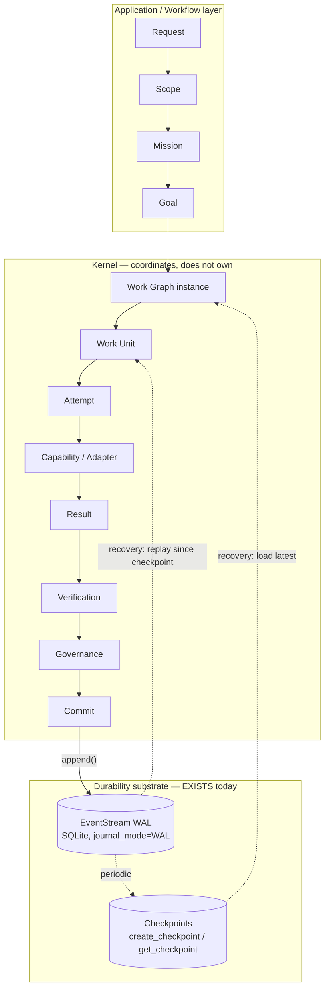

---

## D. State Ownership Model

| State | Owner today | Durable today? | Scope | Note |
|---|---|---|---|---|
| Instance policy / global config | `main.py` / `core/config.py` | Partial (file-based) | Process | Not deeply audited this pass (L2) |
| Shared long-term memory (facts, procedures) | `UnifiedMemory` L1/L3/L4 backends | Yes (SQLite) | Instance-wide | |
| Semantic memory (L2) | `InMemoryVectorBackend` | **No** (DEBT-006) | Process | Independently rated CRITICAL in `OCBRAIN_FUTURE_ARCHITECTURE.md` |
| Model-router maturity / training pairs | `StateStore` | Yes, correctly scoped, bounded in-flight-queue loss window on hard crash | Instance-wide | Good pattern to extend, not replace |
| Conversation turns | `data/context.sqlite` (`turns`) | Yes, but flat — no session-scoping column | Instance-wide | |
| Work Graph instance state | `WorkflowRuntime.execute()` local dict | **No** (DEBT-003) | One `execute()` call | The central gap |
| Attempt / retry counters | `WorkflowNodeState.attempts`; `OperationRecoveryBudget` | No (intentionally, for the latter) | One operation | Correctly ephemeral for `OperationRecoveryBudget`; incorrectly ephemeral for the former |
| Governance verdicts | `GovernanceKernel` (`stats()` counters, in-memory) | Uncertain per call site | Process | See A.3 |
| Event log itself | `EventStream` / `SQLiteEventStore` | Yes | Instance-wide, single WAL file | Fit for purpose already |
| Scope / Mission (multi-turn) | **Nothing** | N/A — does not exist | N/A | See Section E |

### Diagram 7 — Shared vs. isolated state, by scope

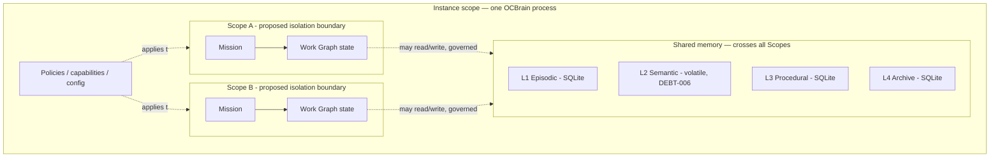

Shared memory is intentionally instance-wide — that's what makes it "shared." The gap this study is pointing at is narrower: Work Graph/Work Unit *execution* state has no Scope-level boundary at all today, so two concurrently-running Missions currently share not just memory (by design) but the entire in-process execution namespace (not by design — nothing draws that line yet).

The pattern worth naming explicitly: **every durability failure in this audit is a scope-of-ownership problem, not a missing-technology problem.** `StateStore` shows what "correctly scoped and durable" looks like in this codebase today; `WorkflowRuntime`'s node state shows what "correctly scoped in principle, durable in nothing" looks like. The fix is the same shape in both cases — write through `EventStream` instead of holding state only in a local variable — `StateStore` just happens to use its own dedicated table instead of the shared event log, which is a reasonable choice for high-frequency, single-purpose state and not something this study recommends changing.

---

## E. Identity Model

### E.1 A tension worth surfacing explicitly, not resolving silently

The study directive's own vocabulary (`Request → Session → Mission/Goal → Work Graph → Work Unit → Attempt`) treats **Session** as a load-bearing identity layer. `OCBRAIN_KERNEL_CONSTITUTION.md` Part VI (Non-Goals) states plainly: *"the kernel has no concept of 'conversation' as a primitive, only Intent and Resources."* Per `PROJECT_INSTRUCTIONS.md`'s own instruction ("when documents conflict: stop, identify both locations, explain the contradiction, wait for Moncif's decision"), this is flagged rather than quietly interpreted away.

**This study's reading — offered as a recommendation, not a resolution — is that these are reconcilable, provided the future identity layer is specified carefully:** a **Scope** (this study avoids the word "Session" for exactly this reason) can be a kernel-owned *Resource* — with identity, lifecycle, and provenance per Invariant 4 — whose job is **execution isolation and concurrency/governance boundary-drawing among concurrently-active Missions and Work Graphs**. It would *not* be a conversational or chat-history primitive; that stays an Application/Workflow-layer concern per the Constitution's own layering table (Part VII). Under this framing, the kernel still has "no concept of conversation" — it has a concept of an execution scope, which is a different thing wearing a similar-sounding name. **This distinction should be made explicit in whatever architecture specification eventually formalizes it**, precisely so "Scope" doesn't quietly grow into "conversation" through the back door of concurrency work. This is this study's one recommendation that most directly touches the Constitution's framing, and it is called out here for that reason rather than folded into the rest of the prose.

### E.2 Logical identity vs. attempt identity — what exists, what doesn't

| Concept | Logical (stable) identity | Attempt / execution identity | Status |
|---|---|---|---|
| Workflow / Work Graph | `workflow_id` | `instance_id` | **EXISTS** — a genuinely correct pattern already |
| Work Unit | `node.id` (within a workflow definition) | *(none — only a bare `attempts` int counter)* | **PARTIAL** |
| Cognitive operation | `operation_id` (frozen H1) | `trace_id` (frozen H1) — relationship between the two not independently re-derived this pass | **EXISTS**, see E.3 |
| User interaction | `interaction_id` (aliased today as `session_id`) | — | **EXISTS**, narrowly scoped to one request |
| Mission | — | — | **DOES NOT EXIST** |
| Scope (multi-turn, multi-day) | — | — | **DOES NOT EXIST** |

### E.3 Two parallel, unreconciled identifier families

**[FACT]** The cognitive/planning path uses `trace_id` / `operation_id` / `stage_tag` (frozen as of the H1 diagnostic-identifier contract). **[FACT]** The workflow-execution path uses `workflow_id` / `instance_id` / `session_id` (`WorkflowRuntime`). **[INFER, L2 — not independently confirmed]** These do not appear, from what this pass read, to be formally unified: nothing in `core/workflow/runtime.py` references `operation_id`, and nothing in the test-mocked cognitive path (`test_orchestrator_recovery.py`) shows `operation_id` flowing into a `WorkflowRuntime.execute()` call. **[REC]** Before any Work Unit persistence contract is frozen, this needs a direct check of `core/cognitive/planner.py` and `core/cognitive/compiler.py` (both unread this pass) to confirm whether `operation_id` is already threaded through to workflow execution, or whether these remain two disconnected ID spaces that a future Work Unit identity would need to explicitly bridge. Identity schemes are unusually expensive to retrofit once data exists under them — this is flagged **CRITICAL PRE-FREEZE** for that reason alone, independent of how much implementation work eventually follows.

### Diagram 10 — Long-horizon mission / identity hierarchy

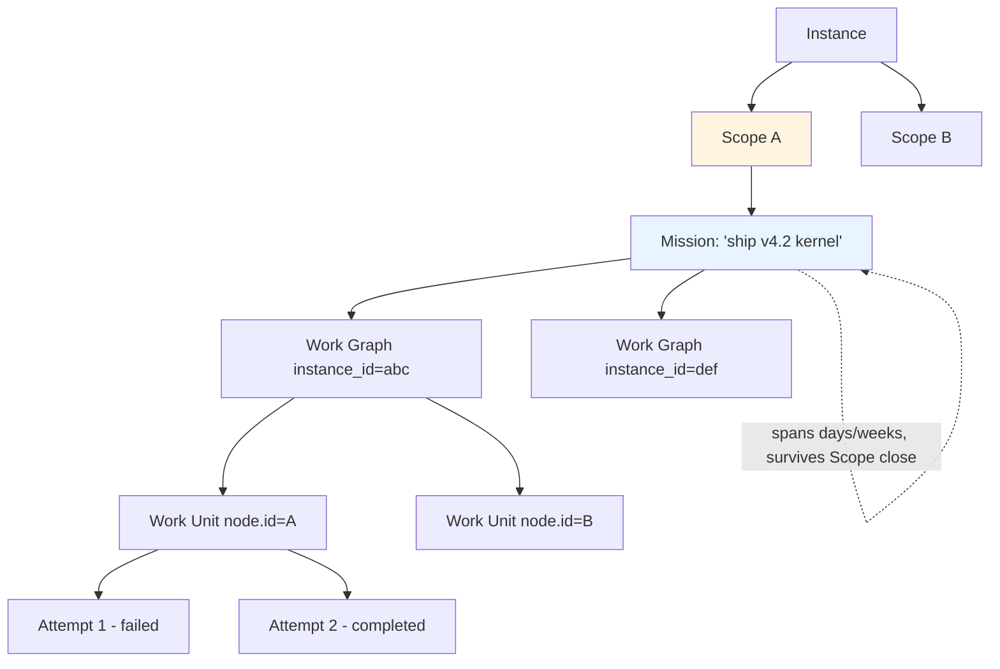

Mission outlives any single Scope; Scope outlives any single Work Graph run — this is what "resume a mission after days offline" (Section L) actually requires structurally.

---

## F. Durability Model

### F.1 What must survive an unexpected shutdown — today vs. proposed

| Must survive | Exists today? | Mechanism today | Mechanism proposed (C.2) |
|---|---|---|---|
| Goal / constraints | Partial — `Goal.structured_form` exists; not deeply audited (L2) | In-memory during `handle()` | Event on Goal creation |
| Work Graph definition | Yes (it's code/config) | N/A — templates aren't runtime state | Unchanged |
| Work Graph *instance* state | **No** (DEBT-003) | Local dict | Checkpoint + transition events |
| Completed Work Units | **No** | Local dict, lost on exit | Transition events (durable per-unit) |
| Active Work Units | **No** | Local dict | Transition events |
| Partial results | **No** | `WorkflowNodeState.result`, in-memory only | Event payload |
| Verification results | Unclear (L2) | — | Event payload, once Verification stage is confirmed wired |
| Governance decisions | Uncertain per call site (A.3) | `GovernanceKernel.stats()`, in-memory aggregate only | Event per `evaluate_action()` call, or at minimum per REJECT/ESCALATE |
| Execution attempts | Partial | Bare counters (`attempts`, `internal_recovery_used`) | Individually addressable attempt events |
| External side effects | N/A — none exist yet | — | Idempotency-keyed event, see Section I |
| Recovery budget state | Correctly **not** durable | In-memory, scoped to one `handle()` call | No change recommended — this scope is correct |

### F.2 Persistence fragmentation — the cross-store consistency question

Section A.6 already established that at least four independent SQLite files exist with no shared transaction boundary. This matters most exactly at the durability boundary: a Work Unit transition that needs to *both* append an event *and* write a memory entry (e.g., "this Work Unit's result becomes a new episodic memory") has no atomic two-store guarantee today, and would not gain one automatically just by adopting the C.2 mechanism for events alone. **[REC]** This should be resolved by convention rather than by introducing distributed-transaction machinery: treat `EventStream` as the single source of truth for "did this logically happen," and treat every other store's write as *derived* from an event, re-appliable by replaying that event if the derived write is found missing on recovery (an idempotent projection, not a two-phase commit). This keeps the Kernel Constitution's "kernel coordinates, does not own" framing intact — `EventStream` coordinates; `UnifiedMemory`/`StateStore` each still own their own data.

### F.3 The `synchronous` PRAGMA inconsistency deserves an explicit decision, not necessarily a "fix"

`StateStore` sets `PRAGMA synchronous=NORMAL` explicitly; `EventStream`'s store does not set it at all, relying on SQLite's compiled default. **[REC]** This should become one explicit, documented decision applied consistently to every SQLite-backed durability primitive — `NORMAL` is the standard recommendation for WAL-mode workloads and is very likely already the right choice, but "very likely already right, undocumented" is exactly the kind of implicit state Kernel Law 2 and `PROJECT_INSTRUCTIONS.md` LAW 4 ask to be made explicit rather than left as an accident of two files never being reconciled.

### Diagram 5 — Work Graph recovery with partial completion

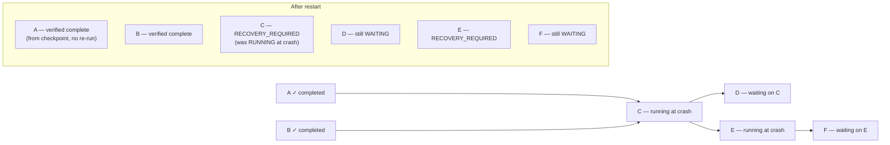

`A` and `B` need no action — their COMPLETED transition event is already durable. `C` and `E` were mid-flight: whether they RESUME, RETRY, or RECONCILE depends on whether their work was pure computation, idempotent, or side-effecting (Section G). `D` and `F` are untouched; their dependencies simply haven't resolved yet, crash or no crash.

---

## G. Recovery Model

### G.1 What exists today, mapped onto Resume / Retry / Reconcile / Replan / Abort / Escalate

| Directive's category | Exists today? | Grounding |
|---|---|---|
| **RESUME** (pure computation, checkpointed) | **No** | Nothing to resume from — DEBT-003. Enabled by Section C.2. |
| **RETRY** (idempotent operation) | Partial | `WorkflowRuntime`'s bounded exponential-backoff retry exists, but is applied uniformly regardless of whether the node is actually idempotent — no node-type-aware safety classification found. |
| **RECONCILE** (external side effect, outcome unknown) | **No** | No side-effecting Adapter exists yet to reconcile against, and no read-after-write verification pattern was found anywhere in this pass. |
| **REPLAN** (stale task) | Partial | `OperationRecoveryBudget`'s Planner re-plan loop is the right *mechanism*, proven under excellent test coverage — but the *trigger* ("is the old plan still valid?") doesn't exist; today re-planning fires only on `IMPASSE`, never on staleness. See Section L. |
| **ABORT** | Partial | Terminal failure returns a plain string ("could not form a plan"); no formal, governed ABORT/CANCELLED state transition at Work Unit granularity. |
| **ESCALATE** | **Yes** | `GovernanceVerdict.ESCALATE` and `CompilationStatus.ESCALATED` are real, first-class, HITL-routing terminal states already. This is the strongest existing piece of the recovery model — it should be the template the others are built to match, not a special case. |

### G.2 Recommended decision criteria (extends the directive's own example with what's actually here)

| Situation | Action | Why |
|---|---|---|
| Pure computation, checkpointed | RESUME | Cheapest, safest — needs Section C.2 |
| Confirmed-idempotent operation | RETRY | `WorkflowRuntime`'s existing bounded backoff is already correct *for this case specifically* |
| Side effect, ambiguous outcome | RECONCILE | Needs an idempotency key + read-after-write or provider-side query (Section I) — does not exist |
| World plausibly changed since planning | REPLAN | Mechanism exists (`OperationRecoveryBudget`); staleness trigger doesn't (Section L) |
| Deterministic rejection, retry cannot help | ABORT, no retry | Already proven correct — `REJECTED_PRECHECK` short-circuits in the tested code path |
| Recovery state itself is inconsistent or unrecognized | ESCALATE | Reuse the existing `ESCALATE` verdict rather than inventing a new terminal state |

### Diagram 2 — Crash recovery, restart to resumed execution

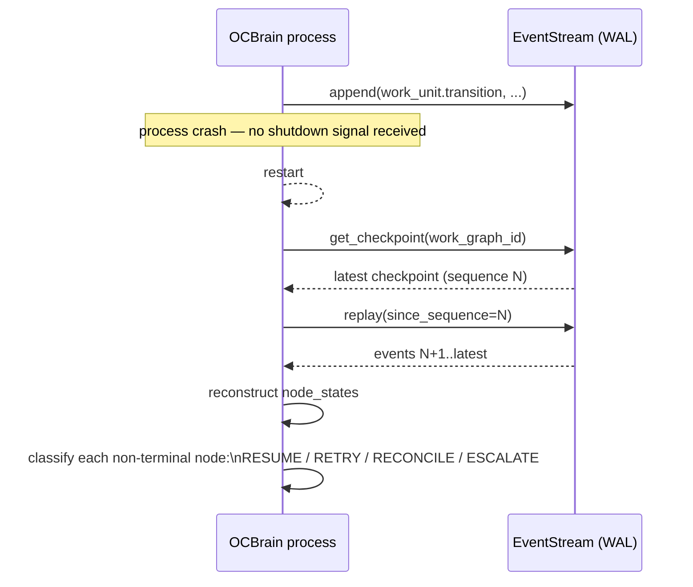

### Diagram 3 — Resume / Retry / Reconcile / Replan / Abort / Escalate decision tree

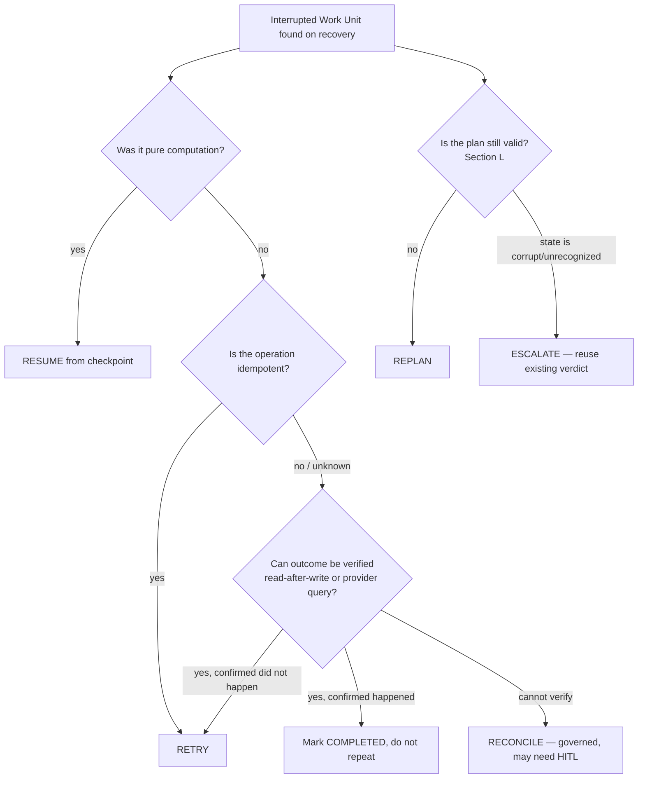

### Diagram 4 — Work Unit lifecycle (adapted from the directive's proposed state set; states marked `[today]` exist now as an ad hoc set inside `WorkflowNodeState`, the rest are proposed)

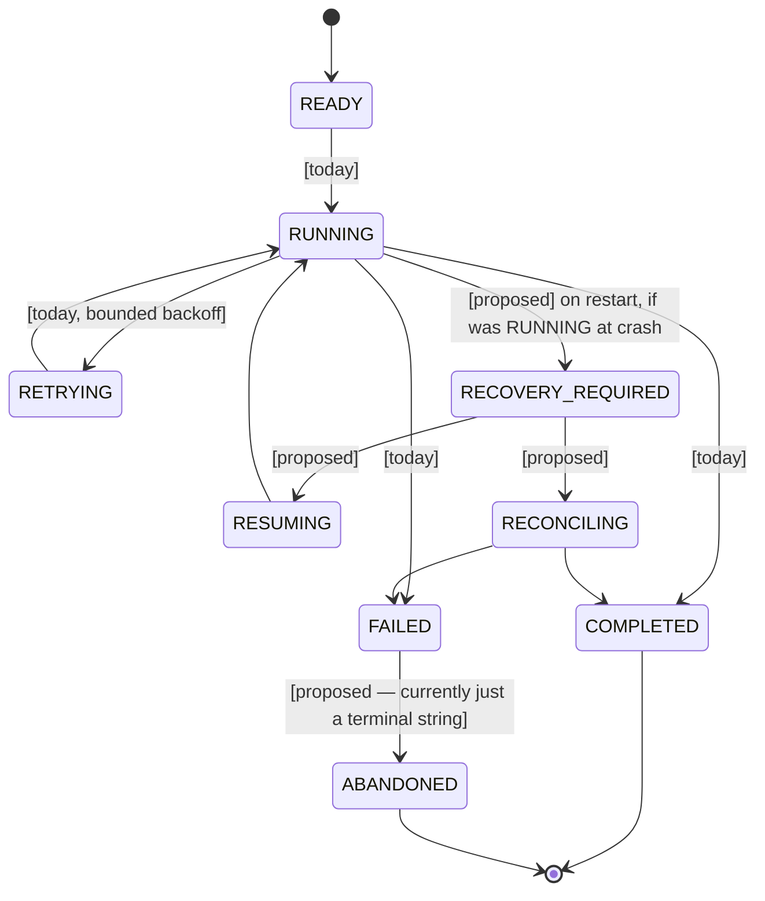

---

## H. Concurrency Model

**[FACT]** OCBrain runs as a single `asyncio` event loop process (A.8) — there is no OS-level process boundary between concurrently-active work today. **[FACT]** No Session/Scope construct exists (Section E), so there is no structural boundary anywhere that could isolate "Session A → software development" from "Session B → research" the way the directive's Section 15 envisions; if two such flows ran today, their isolation would depend entirely on application-layer care in how context is constructed per request, not on anything the kernel itself enforces.

**[FACT]** What concurrency-safety machinery *does* exist: `resilience.py`'s `CircuitBreaker` guards its own state transitions with an `asyncio.Lock`; `AdaptiveSemaphore` provides a race-safe mechanism for shrinking concurrent-request capacity without disrupting in-flight tasks. **[INFER]** `StateStore`'s single async write-behind queue naturally serializes its own writes (no concurrent-write race there), but this also means it is a single serialization point — fine at today's scale, worth revisiting if many concurrent Scopes eventually share it.

**[INFER, L2 — `core/memory/unified_memory.py` internals unread]** `UnifiedMemory` is governance-gated on write/update/delete per `CURRENT_STATE.md`, but access governance ("is this write allowed") is a different concern from concurrency control ("what happens when two concurrent writers touch the same entry"). This pass did not confirm the presence or absence of optimistic-concurrency versioning, conflict detection, or causal ordering for concurrent memory writes — flagged as an open question rather than assumed either way.

**Core invariant from the directive — "concurrent execution must not cause semantic context mixing" — currently has no structural enforcement mechanism**, because there is no Scope boundary for it to attach to. This is the concurrency-side argument for why Section E's Scope proposal matters: without it, this invariant can only be upheld by discipline, not by architecture.

### Diagram 6 — Concurrent sessions: today vs. proposed

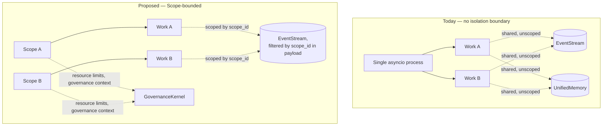

---

## I. Side-Effect Model

**[FACT, recapped from A.1/A.2]** Two concrete, code-level facts anchor this section: (1) `EventStream`'s `UNIQUE(event_id)` constraint is a dormant idempotency primitive — `event_id` is always a fresh `uuid.uuid4()`, so nothing currently exploits it for deduplication; (2) `AdapterRuntime`'s fallback-on-failure logic (try the next healthy adapter, ranked by `health_score`) carries no idempotency-key concept at all.

**[REC]** No side-effecting (non-idempotent, externally-consequential) Adapter exists in this codebase yet — this section is therefore preventive, not remedial. But the risk it prevents is concrete: **the moment a first side-effecting Adapter is added (an email-send, a trade-execution, a repository-mutation), `AdapterRuntime`'s existing fallback design will, on an ambiguous failure (e.g., a timeout where the external system actually succeeded), retry against a *different* adapter for the same logical action with no signal that this might be a repeat** — a duplicate side effect, not a duplicate log entry. This should be closed **before** the first such Adapter is admitted, not after, because retrofitting idempotency discipline onto a live, side-effecting integration is materially riskier than specifying it up front.

**[REC]** Concretely: extend the Adapter/`CapabilityMatch` contract additively (this does not require reopening the frozen H1 shape — it can be an optional field, not a change to what's already frozen) with:
- An `idempotency_key`, deterministically derived from `(work_unit_id, attempt_id)` rather than randomly generated, threaded from `WorkflowRuntime` through `ExecutionRuntime.invoke()` into the Adapter call.
- A `consequential: bool` (or similar) declaration on Adapters that perform irreversible external effects, so `AdapterRuntime`'s ranked-fallback logic can treat them differently: **no blind fallback-retry for a consequential Adapter following an ambiguous failure** unless the specific adapter can prove the action didn't happen (read-after-write check or provider-side idempotency-key support).

### I.1 What OCBrain can actually guarantee — avoiding "exactly once" as a casual claim

Per the directive's own instruction not to use "exactly once" loosely:

- **For OCBrain's own event log**, once `event_id` is derived deterministically from an idempotency key instead of randomly, the existing `UNIQUE` constraint gives **effectively-once** semantics for the append itself (at-least-once delivery from the caller, deduplicated at commit) — cheap, because the storage-level primitive already exists and works; only the application-layer discipline of supplying a stable key is missing.
- **For external side effects**, the achievable guarantee depends entirely on what the external system supports, and should be stated per-Adapter, not claimed globally:
  - Systems that accept an idempotency key natively (e.g., many payment/infrastructure APIs) → effectively-once, enforced by the external system.
  - Systems without native idempotency support but that allow a read-after-write query → best-effort reconciliation (Section G's RECONCILE path) — not a guarantee, a verification step.
  - Systems with neither → **at-least-once, with a documented, governed risk of duplication** that Governance (not silent retry logic) should own the decision to accept, per node/Adapter. This is the honest ceiling, and it should be recorded as such rather than implied away.

### Diagram 13 — External side-effect lifecycle with idempotency key

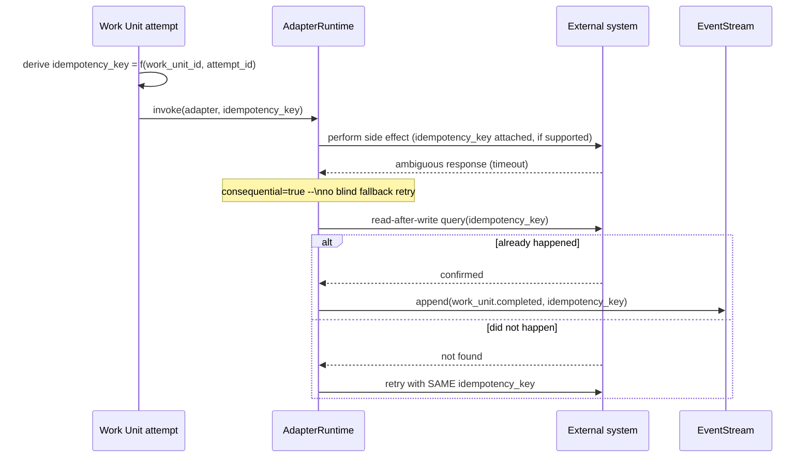

---

## J. Assurance Model

**[FACT]** This pass found no multidimensional "Assurance Assessment" replacing a single confidence score anywhere in the codebase — the directive's Section 20 concern is largely greenfield here. **[FACT]** What does exist, and is a genuine (if narrower) precedent for "don't collapse to one probability": `PlannerResult.status` (`IMPASSE` / `READY_FOR_COMPILATION` / `REJECTED_PRECHECK`) and `CompilationResult.status` (`REJECTED` / `ESCALATED` / etc.) are both **discrete, structured, categorical signals**, not a single float — the instinct to avoid a bare confidence number is already present in the codebase's design vocabulary, even though it isn't yet the rich, multidimensional model this study's directive envisions.

**[REC]** Two concrete, low-cost extension points, both consistent with reusing existing mechanisms rather than inventing new ones:

1. **"Think Harder" seed:** `OperationRecoveryBudget.max_total_recovery_attempts` is already a per-operation, caller-configurable "how much recovery effort is this operation allowed to spend" knob. A future assurance-effort policy (`Fast` / `Balanced` / `Think Harder` / `Maximum Assurance`) is a natural generalization of this existing, tested, frozen contract — not a new mechanism.
2. **Assurance dimensions as event payload:** `EventStream` events already carry an arbitrary payload dict. A future `AssuranceAssessment` doesn't need new storage — it can be captured as named fields (`evidence_quality`, `provenance`, `structural_verification`, `expert_agreement`, etc.) in an event payload, preserving the directive's requirement that internal architecture keep the contributing dimensions rather than collapsing them, using infrastructure that already exists.

### Diagram 9 — Think Harder / assurance escalation

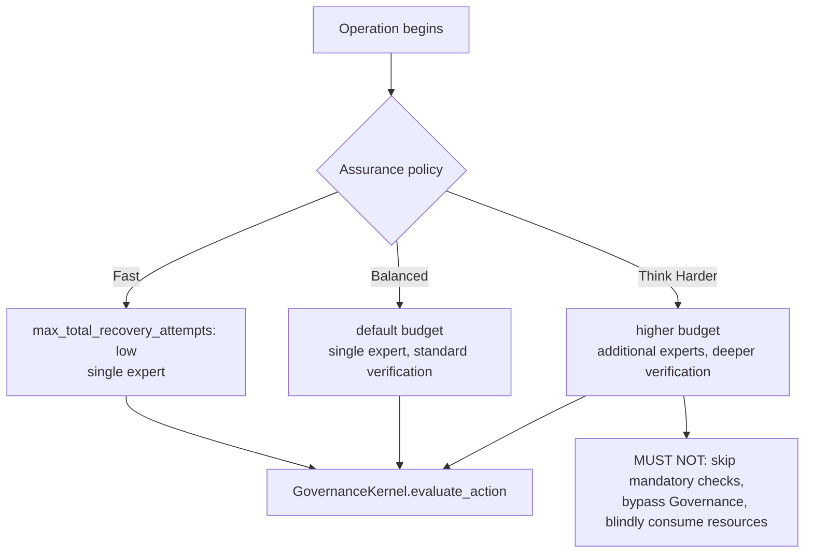

---

## K. Observability Model

**[FACT, `KNOWN_ISSUES.md` DEBT-004/DEBT-005]** Three separate event mechanisms coexist: `EventStream` (durable, WAL-backed, the focus of this study), `KnowledgeEvent` (L4 archive-specific), and `EventBus` (in-process pub/sub, no persistence). A consumer needing the full picture of "what happened" must currently query more than one of these. **[FACT, from A.2]** `WorkflowRuntime` itself durably emits only `workflow.started`/`workflow.completed` — no per-node events at that layer, which independently limits how much of the causal chain is reconstructable from `EventStream` alone regardless of the three-mechanism fragmentation.

**[FACT]** The directive's Section 27 causal chain (`Trigger → Intent → Goal → Constraints → Plan → Work Graph → Worker/Expert → Capability → Attempt → Evidence → Verification → Governance → Result`) already has a real, frozen (H1) conceptual precedent in this codebase: **`derived_from` (artifact lineage) is explicitly kept separate from `caused_by` (causal/event provenance)** on `Intent`/`Goal`/`ExecutionPlan`/`LearningRecord`/`CognitiveDecision`. This is exactly the right distinction (what an artifact was built *from* vs. what *caused* it to be built) and is one of this audit's strongest positive findings for the Observability Model — it should be the vocabulary the rest of the provenance chain is built in, not reinvented.

**[FACT, not found this pass]** No formal "EMS" (error-management/diagnosability) record type matching the directive's Section 29 shape (`Correlation ID, Mission, Session, Work Graph, Work Unit, Attempt, Worker, Expert, Capability, Input state, Expected state, Observed state, Error class, Recovery action, Recovery result, Final disposition`) was found in this pass. **[REC]** That shape is a good target once Sections C, E, and G's identifiers exist to populate it — it should not be built before them, since most of its fields don't have a stable source yet.

### Diagram 14 — Causal provenance chain: durable today vs. proposed


Green links have a durable, addressable identity today (`Goal.resource_id`, `CapabilityMatch`, frozen H1). Red links are either non-durable (Work Graph/Attempt — DEBT-003), unconfirmed (Verification — L2), or durable only in aggregate rather than per-decision (Governance — A.3).

---

## L. Temporal Model

**[FACT]** No stale-plan detection ("is the old plan still valid?") or intent/goal-drift detection was found in this pass — both are greenfield. **[FACT]** `OperationRecoveryBudget`'s re-plan loop is a **reactive** trigger (fires on `IMPASSE` — the plan failed to compile) — it is not a **proactive** staleness check (the plan compiled fine, but the world has since changed). These are easy to conflate and this study wants that distinction on the record: today, re-planning happening at all should not be read as evidence that staleness is being detected, because it isn't — it's evidence that compilation failed for an unrelated reason.

**[REC]** The cheapest correct default, worth specifying now rather than deferring: fold a validity check into the `RECOVERY_REQUIRED` state from Diagram 4, before `RESUMING` — a simple elapsed-time-since-checkpoint heuristic ("this checkpoint is older than N hours/days") routes to `REPLAN` instead of blind `RESUME`. This is not a full world-model; it is a pragmatic tripwire, reusing the already-tested `OperationRecoveryBudget` re-plan mechanism as its action once triggered, rather than building new re-planning machinery.

### Diagram 15 — Temporal validity / replan

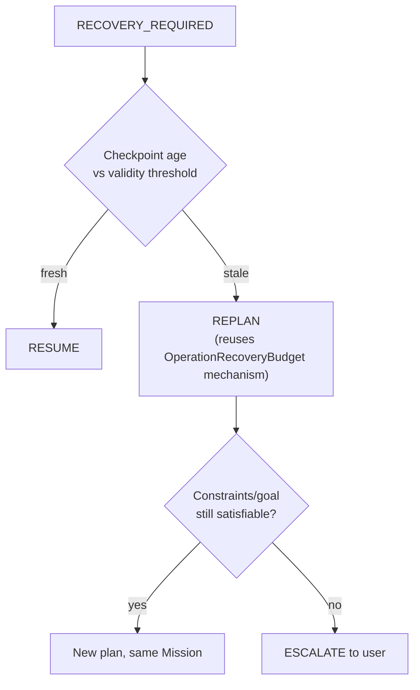

---

## M. Resource Model

**[FACT]** `AdaptiveSemaphore` (`resilience.py`) is a genuine, working resource-aware pattern — EMA-smoothed AIMD concurrency limiting keyed to observed latency. It is scoped to concurrency/latency, not the fuller CPU/GPU/VRAM/RAM/energy/external-service budget model the directive's Section 22 envisions, but it is real evidence the codebase already has the right instincts for this problem class.

**[FACT, `KNOWN_ISSUES.md`]** No `SchedulerService` exists; this is **confirmed as a deliberate scoping decision** ("`asyncio.gather()` sufficient at single-process scale"), not an oversight. Per `PROJECT_INSTRUCTIONS.md`'s Architecture Freeze Principle, this study does not recommend revisiting that decision — it has no new evidence that it was wrong, only that a scheduler's absence is relevant context for the rest of this section.

**[REC]** Dynamic priority/deadline changes (directive Section 18, "make Task C urgent") are correctly greenfield given no scheduler exists yet for such concepts to attach to. **The one thing worth specifying now, before any scheduler is built, because it is much harder to retrofit than to design in from the start:** a future `SchedulerService` should be able to change **timing and resource allocation** but must have **no path to alter a `GovernanceAction`'s evaluation**. `GovernanceKernel.evaluate_action()` today has no awareness of scheduling at all — that separation is free and should be preserved explicitly as a boundary, not merely as an accident of the two subsystems not existing yet.

### Diagram 8 — Dynamic priority change

```mermaid
flowchart LR
    USER["User: 'make Task C urgent'"] --> SCHED[Future SchedulerService]
    SCHED -- "may change" --> TIMING[Execution timing]
    SCHED -- "may change" --> ALLOC[Resource allocation]
    SCHED -.. "MUST NOT touch" ..-> GOV[GovernanceKernel.evaluate_action]
    GOV --> VERDICT[APPROVE / REJECT / ESCALATE\nunchanged by scheduling policy]
```

---

## N. Persistent Service Recovery

**[FACT, not found this pass — dedicated search not run]** No persistent/always-on service abstraction was identified among the subsystems read directly (`core/runtime`, `core/workflow`, `core/cognitive`, `core/governance`). This is stated as "not found in what was read," not as a confirmed absence — a targeted search for this specific concept was not performed and would be a reasonable first step in any follow-up session before treating Section N as fully greenfield.

**[FACT]** The primitive a persistent service's "missed-interval reconciliation" (directive Section 30) would need already exists: `EventStream.replay(since_sequence)`. **[INFER, unconfirmed]** Whether any current consumer actually performs a startup catch-up replay was not verified in this pass either way.

**[REC]** This section can remain genuinely deferred — not because it's unimportant, but because `EventStream.replay()` already provides the core mechanism a future persistent service would build on, and no persistent services exist yet to need it. This is a **FUTURE RESEARCH** item, not a Pre-Freeze one, precisely because building it now would be speculative in the absence of a first real persistent-service consumer.

### Diagram 11 — Persistent service recovery (missed-interval reconciliation)

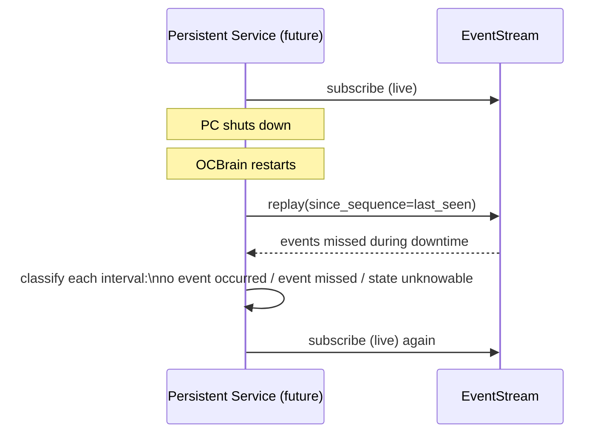

---

## O. Distributed Recovery (future — not designed here, per directive Section 31)

**[FACT]** One concrete, present-day architectural ceiling is worth recording now even though multi-node design is explicitly out of scope: `EventStream`'s sequence numbers come from SQLite's `AUTOINCREMENT`, which is inherently single-file, single-writer. The current event backbone cannot be naively distributed across nodes without redesigning sequencing — global ordering from independent `AUTOINCREMENT` counters on different machines doesn't compose. **[FACT]** `OCBRAIN_FUTURE_ARCHITECTURE.md` has already identified this and planned around it: its v4.5.5 milestone is an explicit migration to a distributed log (Redpanda), specifically because of this ceiling. This study's contribution is confirming, from the actual `EventStream` code, that the ceiling is real and precisely where it sits — not proposing a solution, which the directive correctly reserves for later.

Everything the directive's Section 31 asks about — node failure, network partitions, duplicate execution across nodes, ownership transfer, checkpoint migration, remote side-effect ambiguity, node trust, state synchronization — remains **FUTURE RESEARCH** here, deliberately undesigned, consistent with the directive's own instruction not to implement multi-node architecture during this study.

### Diagram 12 — Distributed failure recovery (conceptual only)

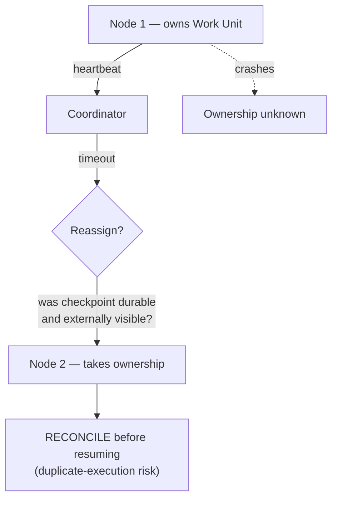

---

## P. Critical Pre-Freeze Requirements

Full rationale for each is in the sections cited; this is the pointer list, not a duplicate of the argument. **These are contracts to specify, not features to build, before Kernel v1.0 freezes:**

1. Work Unit / Work Graph durable state-transition event schema, extending `EventStream` (Section C.2, F.1).
2. Reconciliation of the two parallel identifier families — `trace_id`/`operation_id`/`stage_tag` vs. `workflow_id`/`instance_id`/`session_id` — or an explicit, documented decision to keep them separate (Section E.3). This needs an L2 read of `planner.py`/`compiler.py` this study did not perform.
3. Idempotency-key contract for Adapters, additive to the frozen `CapabilityMatch` shape, before any side-effecting Adapter is admitted (Section I).
4. Explicit resolution of the Scope-vs-"Session"-vs-Constitution-Non-Goal question (Section E.1) — **this specifically needs Moncif's decision, not just this study's proposed reading.**
5. One documented `PRAGMA synchronous` decision, applied consistently across every SQLite-backed durability primitive (Section F.3).
6. A decision on `RecursionGovernor`/`BudgetGovernor`: wire real accumulation, or explicitly document why leaving them dormant (inert-but-safe, per their fail-closed design) is acceptable for now (Section A.3, new finding on `RecursionGovernor`).
7. A decision on whether every `evaluate_action()` call site durably logs its verdict — closing the A.3 provenance uncertainty against Kernel Invariant 3.

## Q. Post-Freeze Work

1. Actually wire checkpoint/resume into `WorkflowRuntime` per the Section C.2 contract.
2. Per-node (`node.started`/`node.completed`) durable event emission in `WorkflowRuntime`.
3. Cross-store consistency convention: `EventStream` as source of truth, other stores as idempotent, replay-derived projections (Section F.2).
4. Split Adapter fallback semantics for consequential vs. non-consequential Adapters (Section I).
5. L2 semantic memory durability (DEBT-006) — already independently rated CRITICAL in `OCBRAIN_FUTURE_ARCHITECTURE.md`; this study concurs with that existing rating.
6. Dedicated test coverage for checkpoint/replay/WAL persistence (DEBT-008).
7. Wire `tests/break_*.py` into automated pytest collection, or document explicitly why they remain manual-only.
8. Formal Work Unit state machine (Diagram 4) as an ADR, with legal-transition rules and ownership per state.
9. Temporal-validity heuristic (checkpoint-age threshold triggering REPLAN) — Section L.
10. Converge `CircuitBreaker` usage between `modules/base.py` and `AdapterRuntime` into one resilience contract (Section A.4).

## R. Deferred Research

1. Distributed / multi-node recovery (Section O) — explicitly out of scope per the directive.
2. `SchedulerService` and dynamic priority/deadline changes (Section M) — correctly deferred already; no new evidence surfaced to revisit that decision.
3. Persistent service recovery (Section N) — no consumer exists yet to design against.
4. Full multidimensional Assurance Assessment and "Think Harder" policy (Section J) — real seeds exist (`OperationRecoveryBudget`, structured plan statuses); the full model is future work.
5. `EventStream.replay()` streaming/chunked delivery for very large event histories — a real scaling boundary (Section A.1), not urgent at current volumes.
6. Migration of the event backbone to a distributed log (`OCBRAIN_FUTURE_ARCHITECTURE.md`'s own v4.5.5 Redpanda direction).

---

## Critical Questions — Direct Answers

Cross-referenced rather than re-argued; full reasoning is in the section cited.

1. **What state must survive a power failure?** Goal/constraints, Work Graph instance state, completed and active Work Unit status, partial results, governance decisions, execution attempts (target list — Section F.1). Today, only the event log itself and the L1/L3/L4 memory tiers actually do.
2. **What state may safely be reconstructed rather than persisted?** Anything derivable by replaying `EventStream` from a checkpoint (Section C.2) — that's the whole point of event sourcing. L2 semantic embeddings are already handled this way today (recomputed on restart) — a legitimate strategy for that specific case, not automatically a defect, though the cost scales with entry count (DEBT-006).
3. **What constitutes a durable commit?** An `EventStream.append()` call that has returned — `conn.commit()` has executed against the WAL (Section A.1).
4. **How does OCBrain know a Work Unit was completed?** Today: an in-memory status flag, lost on restart (DEBT-003). Proposed: a durable `work_unit.completed` transition event (Section C.2).
5. **How does it avoid duplicate side effects?** Today, it can't — no idempotency-key mechanism exists (Section I). Proposed: deterministic `idempotency_key` derivation + `consequential` Adapter flag, before the first side-effecting Adapter is admitted.
6. **How does it recover an ambiguous external operation?** No mechanism today (Section G.1). Proposed: read-after-write / provider-side query, RECONCILE path (Diagram 3).
7. **How does it recover a partially completed Work Graph?** Diagram 5 — natural once per-node transition events and checkpoints exist (C.2); not possible today (DEBT-003).
8. **How does it isolate simultaneous sessions?** It doesn't, structurally, today — single process, no Scope boundary (Section H). Proposed: Scope as a kernel-owned Resource (Section E.1), pending explicit reconciliation with the Constitution's conversation Non-Goal.
9. **How does it safely preempt a running task?** No mechanism found this pass; `AdaptiveSemaphore`'s race-safe capacity-drain (A.4) is the closest existing precedent for "shrink safely without disrupting in-flight work."
10. **How do priority/deadline changes propagate?** No mechanism — no `SchedulerService` exists yet, correctly deferred per `KNOWN_ISSUES.md` (Section M).
11. **How does "Think Harder" alter execution?** No such policy exists. `OperationRecoveryBudget.max_total_recovery_attempts` is the closest existing seed to generalize from (Section J).
12. **How is assurance assessed?** No multidimensional model exists. `PlannerResult`/`CompilationResult`'s discrete status enums are the closest existing precedent for "don't collapse to one number" (Section J).
13. **How does OCBrain detect stale plans?** It doesn't — the re-plan loop is reactive (fires on `IMPASSE`), not proactive (fires on elapsed time or world-change signal) (Section L).
14. **How does it detect intent drift?** Not found this pass; greenfield, same root cause as Q13.
15. **How does it resume long missions after days offline?** It can't yet — no Mission/Scope identity exists to resume *from* (Section E), independent of the fact that Work Graph state doesn't survive restart at all yet either (DEBT-003).
16. **How does EMS reconstruct failures?** No formal EMS record type was found this pass (Section K); `derived_from`/`caused_by` is the right vocabulary foundation to build it on.
17. **How do Persistent Cognitive Services recover?** No such abstraction was found among what was read (not exhaustively searched); `EventStream.replay()` already provides the mechanism a future one would need (Section N).
18. **How does distributed recovery work later?** Not designed here, per the directive. One concrete ceiling was confirmed: `AUTOINCREMENT`-based sequencing is single-file/single-writer (Section O); `OCBRAIN_FUTURE_ARCHITECTURE.md`'s own v4.5.5 direction already anticipates this.
19. **How do we distinguish legitimate world changes from execution inconsistency?** Not found this pass — this is precisely the Section L staleness-detection gap.
20. **What MUST be implemented before Kernel v1.0?** See Section P — stated as contracts to specify, not features to fully build.
21. **What should explicitly remain post-freeze?** See Section Q.
22. **Which contracts must be frozen before parallel implementation?** The identifier reconciliation (E.3) and the Work Unit event schema (C.2) — getting either wrong is expensive to retrofit once data exists under it, which is exactly why H1 froze `trace_id`/`operation_id`/`stage_tag` in the first place.

---

## Design Principles Assessment

| Principle | Supported today? | Evidence | Gap |
|---|---|---|---|
| Cognitive Integrity | Partial | `derived_from`/`caused_by` distinction exists (frozen H1) | No per-node events (A.2) breaks full chain traceability |
| Durable Progress | **No** | — | DEBT-003, the central finding |
| Safe Continuation | **No** | — | Nothing to resume from; a naive restart today would re-run from scratch, not resume |
| Side-Effect Safety | **No** | `UNIQUE(event_id)` exists as a dormant primitive | Never populated with a real idempotency key (Section I) |
| Context Isolation | **No** | — | No Scope boundary exists (Section H) |
| Adaptive Effort | Partial | `OperationRecoveryBudget`, `AdaptiveSemaphore` both real and tested | No unified effort/assurance policy yet (Section J) |
| Temporal Validity | **No** | — | Re-plan loop is reactive, not proactive (Section L) |
| Governed Mutation | **Yes, structurally** | `GovernanceKernel`'s fail-closed exception handling (A.3) is genuinely strong | Untested against recovery mechanisms that don't exist yet to bypass |
| Explainable Recovery | **No** | — | No recovery mechanism exists yet to explain |
| Reproducibility | Partial | `EventStream.replay()`; Kernel Law 4 requires it explicitly | Per-node event gap + real-time (non-seeded) retry backoff limit it today |
| Graceful Degradation | Partial | `CircuitBreaker`, `AdapterRuntime` fallback both real (A.4) | Scoped to individual Adapter calls; nothing at Work Graph/Mission granularity |

---

## Architectural Threat Model

All 25 scenarios from the directive are addressed below, grouped where they share a root cause (each grouping still names every scenario explicitly). Format per group: **Grounding** (what's actually relevant in OCBrain today, where known) → **Detection** → **Containment** → **Recovery** → **Verification/Governance** → **Audit Trail**.

### 1 & 4 — Power loss during a side effect / crash after external success but before local commit

- **Grounding:** No side-effecting Adapter exists yet (Section I) — this is entirely forward-looking today.
- **Detection:** On restart, any Work Unit whose last durable transition is `RUNNING` against a `consequential: true` Adapter is flagged, never assumed complete or incomplete.
- **Containment:** No further attempts against that Adapter for that `idempotency_key` until reconciled.
- **Recovery:** RECONCILE path (Diagram 3) — read-after-write or provider-side query using the same `idempotency_key`.
- **Verification/Governance:** Reconciliation outcome itself becomes a governed action (`GovernanceKernel.evaluate_action`), not a silent retry — especially if the external system can't confirm either way.
- **Audit Trail:** Durable event at every stage: attempt, ambiguous-failure, reconciliation-query, final disposition.

### 2 & 3 — Duplicate event delivery / duplicate Work Unit execution

- **Grounding:** `EventStream`'s `UNIQUE(event_id)` constraint already exists (Section A.1) but guards nothing today because `event_id` is always a fresh random UUID.
- **Detection:** Once `event_id` is derived deterministically from an idempotency key (Section I), a duplicate append fails on the `UNIQUE` constraint — detection is free, at the storage layer.
- **Containment:** `IntegrityError` on duplicate insert is caught and treated as "already recorded," not as a fatal error.
- **Recovery:** Return the existing event/result rather than re-executing.
- **Verification/Governance:** No governance action needed for a clean dedup — it's the failure-to-dedup case (ambiguous, ID not deterministic) that needs escalation.
- **Audit Trail:** The rejected duplicate insert is itself worth logging at debug level for observability, even though it changes no state.

### 5 & 25 — Stale Work Graph after multi-day downtime / legitimate external-world changes during execution

- **Grounding:** No staleness detection exists today (Section L) — the re-plan loop is reactive to compilation failure, not to elapsed time or world-change signals.
- **Detection:** Checkpoint-age heuristic (Diagram 15) as a cheap first pass; richer world-change detection is future research.
- **Containment:** Do not blindly `RESUME` a Work Graph whose checkpoint exceeds the validity threshold.
- **Recovery:** REPLAN, reusing the existing, tested `OperationRecoveryBudget` mechanism.
- **Verification/Governance:** If constraints are no longer satisfiable under the new plan, ESCALATE rather than silently narrowing scope.
- **Audit Trail:** The staleness determination itself (checkpoint age, threshold, decision) is logged as an event — this is exactly the kind of decision Kernel Invariant 3 requires to remain explainable later.

### 6, 7 & 8 — Simultaneous user commands / priority change during execution / cancellation during non-interruptible work

- **Grounding:** No Scope isolation (Section H), no scheduler (Section M), no formal preemption/cancellation classification (safely-interruptible vs. checkpointable vs. non-interruptible vs. already-committed) was found this pass.
- **Detection:** Simultaneous commands against the same Mission/Scope are detectable once Scope exists as a first-class identity (Section E) — today, nothing marks them as related at all.
- **Containment:** A priority change must route through the boundary in Diagram 8 (may affect timing/allocation, never governance). A cancel request against a non-interruptible step must not interrupt it mid-side-effect — it should be queued to take effect at the next safe checkpoint.
- **Recovery:** For cancellation: `RUNNING → CHECKPOINT → SUSPENDED` where possible (per the directive's own Section 19 pattern); genuinely non-interruptible steps finish before honoring cancellation.
- **Verification/Governance:** Cancellation of a step with an in-flight side effect should require the same reconciliation discipline as scenario 1/4, not a bare "stop."
- **Audit Trail:** Every priority change and cancellation request is a durable event, independent of whether it was honored immediately.

### 9, 10 & 11 — Worker crash / capability crash / model failure

- **Grounding:** `_execute_node_with_retry` already never raises and always returns a `WorkerResult` (A.2) — strong existing containment discipline. `AdapterRuntime`'s health-ranked fallback (A.4) already provides real graceful degradation for capability-level failure specifically.
- **Detection:** Worker/capability failure surfaces as a non-success `WorkerResult`; model failure surfaces through the same path if the model is wrapped as an Adapter.
- **Containment:** Failure containment is already solid at this layer — the gap is upstream (Work Unit durability), not here.
- **Recovery:** RETRY (if idempotent) via existing bounded backoff; fallback to next-ranked Adapter for capability/model failure specifically, subject to the consequential-Adapter caveat in scenario 1/4 if the failed call may have had a side effect.
- **Verification/Governance:** `EvolutionGovernor`/other governors as appropriate; no change needed here.
- **Audit Trail:** Already reasonably strong — `WorkerResult` and workflow-level events exist; per-node events (Section K) would close the remaining gap.

### 12 — Verification failure after partial completion

- **Grounding:** Verification's wiring status is unconfirmed this pass (L2) — this scenario is evaluated against the *proposed* model, not confirmed current behavior.
- **Detection:** A Work Unit reaching `VERIFYING` and failing does not need to invalidate sibling Work Units that already passed verification independently (directive Section 14, partial completion).
- **Containment:** Failure is scoped to the specific Work Unit and its dependents, not the whole Work Graph.
- **Recovery:** RETRY or REPLAN for the failed unit only; completed-and-verified siblings are reused, not re-run (this falls directly out of the per-node durability model in Section C.2 — no separate mechanism needed).
- **Verification/Governance:** A verification failure on a `consequential` Work Unit should ESCALATE rather than silently retry, if the underlying side effect may already have occurred.
- **Audit Trail:** Verification result — pass or fail, and why — as a durable event per Work Unit, not just an aggregate.

### 13 — Event storm

- **Grounding:** `AdaptiveSemaphore` (A.4) already exists as a real, tested throttling mechanism for exactly this class of problem, though scoped to concurrent-request latency rather than event-append rate specifically.
- **Detection:** Sustained high `append()` rate, or governance-evaluation rate exceeding a threshold.
- **Containment:** `AdaptiveSemaphore`'s existing AIMD backoff generalizes naturally here; `BudgetGovernor`, once actually wired (Section P.6), is the natural governed backstop.
- **Recovery:** Shed load at the least-important priority tier once a scheduler exists (Section M); until then, bounded queues plus the existing retry backoff are the only defense.
- **Verification/Governance:** An event storm should itself become a governed, escalatable condition, not just a performance problem.
- **Audit Trail:** Rate itself, and any shedding decisions, as events.

### 14 — Memory inconsistency

- **Grounding:** L1/L3/L4 are SQLite-backed and durable; L2 is volatile by design (DEBT-006). Concurrent-write conflict handling for `UnifiedMemory` was not confirmed this pass (Section H).
- **Detection:** Depends on whatever conflict-detection mechanism `UnifiedMemory` does or doesn't have internally — flagged as an open question (L2), not resolved here.
- **Containment/Recovery/Verification/Audit Trail:** Cannot be responsibly specified without the L2 read this study didn't perform — recommended as a direct follow-up before this scenario can be closed out.

### 15, 16 & 17 — Race conditions / deadlock / resource starvation

- **Grounding:** `KNOWN_ISSUES.md` DEBT-010 documents a **real, already-found** race condition (a config-watcher thread), confirming this class of bug is not hypothetical in this codebase. `CircuitBreaker`'s `asyncio.Lock`-guarded transitions and `AdaptiveSemaphore`'s race-safe drain (A.4) are real, working defenses against exactly this class of problem, where they're applied.
- **Detection:** `tests/break_circuit_race.py` and `tests/break_adaptive_thrash.py` (A.9) are purpose-built for this — but are not part of the automated regression baseline today, so a regression here would not be caught automatically.
- **Containment:** Existing locking in `resilience.py` is sound where used; `StateStore`'s single-queue write-behind design (A.1/D) sidesteps write races by construction rather than by locking.
- **Recovery:** Case-by-case; no general deadlock-recovery mechanism exists or is recommended beyond avoiding lock-ordering hazards by design.
- **Verification/Governance:** N/A directly — this is an implementation-correctness concern more than a governance one.
- **Audit Trail:** Wire `break_*.py` into CI (Section Q.7) so a regression here produces a test failure, not a production incident.

### 18 & 19 — Node failure / network partition

- **Grounding:** Single-process, single-node today (A.8) — genuinely not applicable yet.
- **Detection/Containment/Recovery/Verification/Audit Trail:** Deferred to Section O, per the directive's explicit instruction not to design multi-node architecture in this study.

### 20, 21, 22, 23 & 24 — Poisoned recovery state / corrupted journal / incompatible capability version / malicious capability / invalid shared learning

- **Grounding:** `GovernanceKernel`'s fail-closed exception handling (A.3 — a governor that raises is converted to `REJECT`, never silently ignored) is the single strongest piece of existing architecture this cluster of scenarios can lean on. `PROJECT_INSTRUCTIONS.md` §13 already restricts autonomous evolution from deploying automatically or bypassing approval, which directly bounds scenario 24 (invalid shared learning) — learning candidates remain evidence, never directly executable, per this project's own standing rule.
- **Detection:** A checkpoint or journal entry that fails to deserialize, or a capability whose declared version doesn't match what's registered, should fail *loud*, not silently skip — consistent with the fail-closed pattern already established in `GovernanceKernel`.
- **Containment:** Quarantine, don't discard — a corrupted or suspicious recovery record should be preserved for inspection, not deleted, mirroring the existing knowledge-acquisition quarantine pipeline (`PROJECT_INSTRUCTIONS.md` §11).
- **Recovery:** ESCALATE (reuse the existing verdict) rather than attempting automatic repair of anything security-adjacent.
- **Verification/Governance:** Route through `GovernanceKernel` explicitly for all five of these — none should have a code path that bypasses it, per Law 1.
- **Audit Trail:** The detection event itself (what looked wrong, and why) is at least as important to log durably as the eventual resolution.

---

## Final Classification of All Recommendations

| # | Recommendation | Classification | Section |
|---|---|---|---|
| 1 | Work Unit / Work Graph durable state-transition event schema, extending `EventStream` | **CRITICAL PRE-FREEZE** | C.2 |
| 2 | Reconcile `trace_id`/`operation_id`/`stage_tag` vs. `workflow_id`/`instance_id`/`session_id` into one identity model (or explicitly decide to keep them separate) | **CRITICAL PRE-FREEZE** | E.3 |
| 3 | Idempotency-key contract for Adapters, before any side-effecting Adapter is admitted | **CRITICAL PRE-FREEZE** | I |
| 4 | Resolve Scope-vs-"Session"-vs-Constitution-Non-Goal framing — needs Moncif's explicit decision | **CRITICAL PRE-FREEZE** | E.1 |
| 5 | One documented `PRAGMA synchronous` decision, applied consistently across all SQLite-backed durability primitives | **CRITICAL PRE-FREEZE** | F.3 |
| 6 | Decide: wire real `RecursionGovernor`/`BudgetGovernor` accumulation, or document why dormant-but-fail-closed is acceptable for now | **CRITICAL PRE-FREEZE** | A.3, P.6 |
| 7 | Decide whether every `evaluate_action()` call site durably logs its verdict | **CRITICAL PRE-FREEZE** | A.3, P.7 |
| 8 | Wire checkpoint/resume into `WorkflowRuntime` per the Section C.2 contract | IMPORTANT POST-FREEZE | C.2, Q.1 |
| 9 | Per-node (`node.started`/`node.completed`) durable event emission | IMPORTANT POST-FREEZE | K, Q.2 |
| 10 | Cross-store consistency convention: `EventStream` as source of truth, other stores as replay-derived projections | IMPORTANT POST-FREEZE | F.2, Q.3 |
| 11 | Split Adapter fallback semantics for consequential vs. non-consequential Adapters | IMPORTANT POST-FREEZE | I, Q.4 |
| 12 | L2 semantic memory durability (DEBT-006) | IMPORTANT POST-FREEZE | A.5, Q.5 |
| 13 | Dedicated test coverage for checkpoint/replay/WAL persistence (DEBT-008) | IMPORTANT POST-FREEZE | A.1, Q.6 |
| 14 | Wire `tests/break_*.py` into automated pytest collection | IMPORTANT POST-FREEZE | A.9, Q.7 |
| 15 | Formal Work Unit state machine as an ADR (Diagram 4) | IMPORTANT POST-FREEZE | G, Q.8 |
| 16 | Temporal-validity heuristic (checkpoint-age threshold → REPLAN) | IMPORTANT POST-FREEZE | L, Q.9 |
| 17 | Converge `CircuitBreaker` usage between `modules/base.py` and `AdapterRuntime` | IMPORTANT POST-FREEZE | A.4, Q.10 |
| 18 | Direct L2 investigation of `UnifiedMemory` concurrent-write conflict handling | IMPORTANT POST-FREEZE | H, Threat #14 |
| 19 | Distributed / multi-node recovery | FUTURE RESEARCH | O |
| 20 | `SchedulerService` and dynamic priority/deadline changes | FUTURE RESEARCH | M |
| 21 | Persistent service recovery | FUTURE RESEARCH | N |
| 22 | Full multidimensional Assurance Assessment + "Think Harder" policy | FUTURE RESEARCH | J |
| 23 | `EventStream.replay()` streaming/chunked delivery for very large histories | FUTURE RESEARCH | A.1 |
| 24 | Migration of the event backbone to a distributed log (Redpanda) | FUTURE RESEARCH | O |
| 25 | New distributed-transaction/2PC layer across the four SQLite stores | **NOT REQUIRED** | F.2 |
| 26 | Full Temporal-server integration now | **NOT REQUIRED** | C.2 |
| 27 | A literal "Session" class matching the directive's raw vocabulary, without the Scope reframing | **NOT REQUIRED** | E.1 |
| 28 | Revisiting the `SchedulerService` deferral decision | **NOT REQUIRED** | M |

---

## Section 44 — Final Stop-Condition Check

The directive requires an explicit stop if this study finds that current architecture cannot safely support durable execution *without changing a completed milestone*. This was checked directly against every H1-frozen contract:

| Frozen H1 contract | Does any recommendation here require changing it? |
|---|---|
| `RawRequest` immutability | No — not implicated by any finding |
| `CapabilityMatch` / `CapabilityDiscoveryResult` shape | No — the idempotency-key recommendation (I) is additive, not a modification of the frozen shape |
| `OperationRecoveryBudget`'s `consume()`/`remaining`/`exhausted` | No — this study recommends *generalizing the pattern* to a future Work-Unit-scoped ledger, composing alongside the existing object, not modifying it |
| `derived_from`/`caused_by` separation | No — this study explicitly recommends *reusing* this vocabulary as-is |
| `trace_id`/`operation_id`/`stage_tag` semantics | No — the identity reconciliation recommendation (E.3) is about *connecting* this family to the workflow-execution family, not changing what's frozen |
| Three-entrypoint signatures | No — not implicated |
| `cognitive.planner_impasse_terminal` event shape | No — not implicated |

**No stop is triggered.** Every gap this study found is either additive to what's frozen (idempotency keys, per-node events, a new Scope resource, a new Work Unit event schema) or a decision that needs to be made explicit rather than a contradiction that needs to be resolved by changing something already shipped. The one item that most needs Moncif's direct attention before proceeding — the Scope-vs-Constitution-Non-Goal framing (E.1) — is a terminology and scope-of-ownership question, not evidence that a frozen contract is unsafe.

---

## Reliability Readiness Assessment

1. **Current reliability maturity:** Solid at the primitive level, absent at the composition level. `EventStream` is a genuinely well-built, working, tested-at-the-margins WAL and checkpoint mechanism. `OperationRecoveryBudget` and its test suite are excellent examples of bounded, governed recovery discipline. `GovernanceKernel`'s fail-closed exception handling is a real architectural strength. None of these are yet connected to the thing that actually needs to survive a restart: `WorkflowRuntime`'s in-flight Work Graph state, which today lives entirely in a local Python dictionary.

2. **Critical gaps:** No durable Work Unit/Work Graph state (DEBT-003) is the central one; everything else in this study — concurrency isolation, side-effect safety, provenance, temporal validity — inherits from it or compounds it. Two previously-untracked findings surfaced during this pass: a `RecursionGovernor` accumulation gap structurally identical to the already-known DEBT-007, and a global, unscoped `sqlite3.connect` monkeypatch with no current functional impact but real latent-coupling risk.

3. **Required pre-freeze foundations:** Seven items (Section P), all *contracts to specify*, not full implementations — identity reconciliation, a Work Unit event schema, an idempotency-key contract, an explicit Scope decision, a `PRAGMA synchronous` decision, and explicit dispositions for the two dormant governors and for governance-decision durability. None of these require touching a frozen H1 contract (Section 44).

4. **Major post-freeze work:** Eighteen items (Section Q), led by actually wiring checkpoint/resume into `WorkflowRuntime` — the single highest-leverage piece of implementation work this study identified, because the primitive it depends on already exists and works.

5. **Unresolved research questions:** Whether `operation_id` already reaches `WorkflowRuntime.execute()` (needs an L2 read of `planner.py`/`compiler.py`); whether `UnifiedMemory` has any concurrent-write conflict handling; whether any consumer currently does startup catch-up replay against `EventStream`; how "Scope" should be worded so it satisfies Section H's isolation needs without drifting into the Constitution's "conversation" Non-Goal — this last one is a decision for Moncif, not a research question this study can close on its own.

6. **Is the architecture ready to proceed toward Kernel v1.0 freeze once the critical items are addressed?** **Yes.** This study found no contradiction that requires reopening a completed milestone, and the path forward is unusually cheap relative to most reliability retrofits: the durability substrate (`EventStream`) already exists, works, and is exactly the mechanism the project's own `OCBRAIN_FUTURE_ARCHITECTURE.md` research independently recommends. What's missing is specification and wiring, not invention.

---

*End of study. Per the governing directive: this document proposes architecture; it does not implement it. No production code was modified in this session.*
