> **SUPERSEDED — DO NOT USE FOR IMPLEMENTATION**
> This document has been superseded by `docs/architecture/WORKSPACE_ARCHITECTURE.md` in the OCBrain repository.
> All corrections have been applied in the canonical document. This file is retained for historical reference only.

---

# OCBrain Architecture — Final Correction Pass [SUPERSEDED]

**Repository:** HEAD `977ebcc` (reconfirmed 2026-09-15T16:26)
**Baseline:** OCBrain UX/UI & Workspace Architecture report (§A–§BO)
**Scope:** 20 targeted corrections. No new features. No scope expansion.

---

## A. Corrections Made

### Correction 1 — Dependency Graph: Computational Level Independent of C-MoE

**Error in baseline:** The dependency graph placed Computational Level (P2) after C-MoE (P3), implying full C-MoE is required for basic computational control.

**Correction:** Computational Level → Resource Policy → Resource Envelope is a standalone subsystem. It requires:
- Resource Policy Engine (new, can be built pre-freeze)
- Router enhancement (existing ModelRouter)
- ExecutionBudget extension (existing)

It does **not** require C-MoE. C-MoE can later *recommend* computational levels, but the policy/envelope/routing chain works without it.

Additionally: distinguish **basic C-MoE** (single-expert mediation, intent interpretation — essentially the K4.2 Cognitive Front-End already partially implemented) from **advanced C-MoE** (multi-expert selection, dynamic expert routing — post-freeze research). Basic C-MoE interaction belongs in P1, not P3.

---

### Correction 2 — Source-of-Truth Semantics

**Error in baseline:** The Source-of-Truth Matrix implied projections are authoritative for the underlying domain fact.

**Correction:** A projection is authoritative **as a workspace read model** — it is the correct thing for the UI to display. It is NOT authoritative for the underlying domain fact. The authority hierarchy:

| Truth Domain | Authoritative Source | Projection Role |
|-------------|---------------------|----------------|
| Historical truth | EventStream (immutable, append-only) | Derived from events |
| Execution truth | Runtime (ExecutionRuntime, WorkflowRuntime) | Reflects runtime state |
| Authorization truth | GovernanceKernel (evaluate_action) | Never projected as overridable |
| Verification truth | Verification system (when implemented) | Read-only display |
| File-content truth | File storage / File Adapter | Metadata projection, not content |
| Memory truth | UnifiedMemory (L0–L4) | Not projected; queried directly |
| Resource-consumption truth | Runtime + Watchdog + ExecutionBudget | ResourceProjection is a summary |
| Identity truth | Component observations + runtime state | IdentityProjection is a snapshot |

**Rule:** If a projection disagrees with its authoritative source, the source wins. The projection must be rebuilt, not the source corrected.

---

### Correction 3 — Actual Capability Invocation Path

**Error in baseline:** Simplified diagram showed Governance at AdapterRuntime level. Live code shows otherwise.

**Correction (CF — traced from live repository):**

The actual invocation path, confirmed by `evaluate_action()` call sites:

```
Orchestrator.handle()
  → GovernanceKernel.evaluate_action()  [orchestrator.py L226]
  → K4.2 Cognitive Pipeline OR legacy classify-dispatch
      → PlanCompiler.compile()
          → GovernanceKernel.evaluate_action()  [compiler.py L369]
      → WorkflowRuntime.execute()
          → ExecutionRuntime.invoke()
              → AbstractCognitiveWorker.execute()
                  → GovernanceKernel.evaluate_action()  [base.py L246, Template Method]
                  → Worker._do_work()
                      → AdapterRuntime.invoke()  [NO governance here]
                          → CapabilityRegistry.get_adapters()
                          → Adapter.execute()
                              → ResourceManager (resource binding)
                              → Result
```

**Key finding (CF):** `AdapterRuntime.invoke()` does NOT call `evaluate_action()`. Governance is enforced BEFORE capability execution, at the Worker level (Template Method pattern in `base.py`), at the Orchestrator level, and at the Compiler level. AdapterRuntime is a pure execution service with fallback/health-ranking logic.

**For future FILE_ACCESS capability:** Governance check will occur at the Worker or application-layer command handler that issues the `AdapterRuntime.invoke()` call, NOT inside the file adapter itself.

---

### Correction 4 — Artifact Semantics

**Error in baseline:** Stated "Files are inputs. Artifacts are outputs."

**Correction:** Artifacts are **materialized, provenance-bearing objects** that can be both inputs and outputs:

| Concept | Definition |
|---------|-----------|
| File | A data object in the workspace (uploaded or imported) |
| Artifact | A provenance-tracked, versioned object produced by OCBrain (or promoted from a file) |

An artifact produced by one task can be an **input** to a subsequent task. A file can be **promoted** to an artifact when provenance tracking is needed. The relationship is:

```
File → (read by task) → Execution → Artifact (output)
Artifact → (input to subsequent task) → Execution → Artifact (new version or derived artifact)
```

Artifacts carry lineage regardless of direction.

---

### Correction 5 — Verification State Model

**Error in baseline:** Presented UNVERIFIED → VERIFIED → CONTRADICTED → SUPERSEDED as a linear lifecycle.

**Correction:** These are **independent state dimensions**, not a linear sequence:

| Dimension | Values | Meaning |
|-----------|--------|---------|
| **Verification status** | UNVERIFIED, VERIFIED, REFUTED | Has this been checked? |
| **Contradiction relations** | Set of (claim_id, contradicts_claim_id, evidence) | Does this contradict something? |
| **Supersession relations** | Set of (artifact_id, supersedes_artifact_id) | Has this been replaced? |

An artifact can be VERIFIED and simultaneously have a contradiction relation with another verified artifact. A superseded artifact does not lose its verification status — it simply has a newer version.

---

### Correction 6 — Trust vs Authority

**Error in baseline:** Combined trust and authority into a single hierarchy ("User instruction > Project policy > ... > External content").

**Correction:** These are separate dimensions:

**Authority** (who may issue instructions):
| Source | Authority Level |
|--------|----------------|
| Authenticated user instruction | Full (within Governance) |
| Project policy | Scoped to project |
| System policy | Global |
| Everything else | Zero instruction authority |

**Data trust** (how much to rely on evidence):
| Source | Trust Level | Notes |
|--------|------------|-------|
| Verified evidence | Highest data trust | Verified by verification system |
| Runtime observations | High | Direct system observation |
| User-provided data | Medium-high | Assumed honest but unverified |
| Generated content | Medium | LLM output, requires verification for claims |
| Tool/capability output | Medium | Provenance-tracked |
| MCP server output | Low-medium | External, untrusted by default |
| External web content | Low | Untrusted |

**Rule:** A verified document has HIGH data trust but ZERO instruction authority. A user instruction has FULL authority but may reference UNVERIFIED data. Trust and authority never collapse into one scale.

---

### Correction 7 — Uploaded-File Execution Rule

**Error in baseline:** Implied absolute prohibition on executing uploaded files.

**Correction:** Upload/read never **grants** execution authority. Execution is a separate capability that requires:
1. Explicit capability request (e.g., CODE_EXECUTION)
2. GovernanceKernel.evaluate_action() authorization
3. SandboxPolicy and SandboxRequest (already implemented: [contracts.py](file:///C:/Users/Produ/.gemini/antigravity/scratch/ocbrain-repo/core/sandbox/contracts.py))
4. Runtime execution within sandbox (namespace/cgroup isolation)

A user may legitimately request: "Run this Python script I uploaded." That request flows through C-MoE → capability request → Governance → Sandbox → Runtime, each with its own checks. The file's upload status is irrelevant to the execution decision; what matters is Governance authorization and sandbox enforcement.

---

### Correction 8 — Computational Level Matrix Values

**Error in baseline:** Presented specific values (e.g., "HIGH = 2–3 experts", "MAX = 3+", retries = 0/1/2/3) as architectural decisions.

**Correction:** All numeric values in the Computational Level matrix are labeled:

| Dimension | LOW | MEDIUM | HIGH | MAX | Label |
|-----------|-----|--------|------|-----|-------|
| Expert count | 1 | 1–2 | 2–3 | 3+ | **INITIAL HEURISTIC** |
| Retries | 0 | 1 | 2 | 3 | **INITIAL HEURISTIC** |
| Retrieval breadth | Narrow | Standard | Expanded | Broadest | **CALIBRATION CANDIDATE** |
| Verification | Minimal | Standard | Strong | Strongest | **CALIBRATION CANDIDATE** |
| All others | ... | ... | ... | ... | **EXAMPLE** |

**No numeric mapping is frozen as architecture.** All values must be validated experimentally and are expected to change during calibration.

---

### Correction 9 — Resource Model Distinctions

**Error in baseline:** Conflated some resource states and assumed uniform reservation semantics.

**Correction:**

| Term | Definition | Applies Uniformly? |
|------|-----------|-------------------|
| Computational Level | User intent | ✅ |
| Resource Policy | System-derived rules | ✅ |
| Resource Envelope | Per-task ceilings | ✅ |
| Budget | Allowed consumption | ✅ |
| Committed/Reserved | Pre-allocated capacity | ❌ — varies by type |
| Allocation | Resources assigned | ❌ — varies by type |
| Usage | Resources consumed | ✅ |
| Remaining | Budget − Usage | ✅ |

**Reservation semantics differ by resource type:**

| Resource | Reservation Model | Notes |
|----------|------------------|-------|
| Tokens | Estimated → actual (not pre-reservable) | Final count unknown until generation completes |
| Cost | Estimated → actual | Derived from token usage |
| Concurrency | Hard reservation (semaphore slot) | Pre-allocated, released on completion |
| GPU/CPU | Opportunistic or queued | Depends on runtime |
| Duration | Ceiling (watchdog-enforced) | Not reserved, just limited |
| Tool calls | Counter (not reserved) | Consumed incrementally |

Distinguish: **estimated** (before execution), **committed** (semaphore/slot held), **actual** (measured after execution).

---

### Correction 10 — Identity Independence from C-MoE

**Confirmed correct in baseline (§BE).** Dependency direction validated:

```
Component Registry (new, can be built pre-freeze)
  → System Topology
  → Runtime Observations (health, state, capabilities)
  → Verified / Runtime State
  → Identity / Self-Model
```

C-MoE **consumes** Identity to know what the system can do. Identity does NOT require C-MoE. This is already correct in the baseline report. No change needed.

---

### Correction 11 — Authentication/Ownership Model

**Confirmed correct in baseline (§BD).** The key distinction is preserved:

- **Human User** → Authentication → Principal → Authorization
- **OCBrain Identity** → Component Registry → Self-Model

These are separate identity domains. Even in single-user v1, ownership fields (created_by, owned_by) should be populated with a principal_id, not left implicit.

**Addition:** All workspace entities (Project, Session, Discussion, File, Artifact) should carry `created_by: str` and `owned_by: str` from v1, defaulting to a single-user principal ID.

---

### Correction 12 — File-Root Semantics

**Error in baseline:** File model used `path: str` without specifying it as project-relative.

**Correction:**

```
Project
  → Workspace File Root / Store (per-project, isolated)
  → File ID (UUID, canonical identity)
  → Relative Path (project-scoped, never absolute)
  → Storage Locator (internal, opaque)
```

The canonical file identity is `file_id` (UUID). `path` is always relative to the project file root. No raw absolute filesystem path is ever the canonical identity. The storage locator is an internal implementation detail that may differ between local FS and future object stores.

---

### Correction 13 — File Ingestion Lifecycle

**Error in baseline:** File lifecycle started at "Upload → Validate → Metadata."

**Correction:** Add quarantine step:

```
Upload → Quarantine (temporary holding area)
  → Size check → Format validation → Security scan
  → Metadata extraction (MIME, encoding, hash, line count)
  → Acceptance (move from quarantine to project file store)
  → Storage → Discovery (visible in project)
  → [normal file lifecycle continues]
```

Files in quarantine are NOT visible to the project, NOT queryable, NOT available to C-MoE, and NOT part of any context until accepted.

---

### Correction 14 — Workspace/Event Write Path

**Error in baseline:** The write path (command → event → projection) was not explicitly shown in reverse.

**Correction — the complete round-trip (AP):**

```
UI (client)
  → REST Command (with command_id)
  → API Layer (validate, auth, rate-limit)
  → Application Layer / Command Handler
      → Authority checks (GovernanceKernel.evaluate_action where required)
      → Domain mutation (Repository.save / Runtime action)
      → EventStream.append() (authoritative event)
  → EventStream → Projection update
  → SSE delta → Client → UI update
```

**Rules:**
- The UI NEVER directly mutates projections
- The UI NEVER directly emits authoritative events
- The UI NEVER directly calls Runtime or Governance
- All mutations flow through the Application Layer
- All state changes are recorded as events BEFORE being projected

---

### Correction 15 — External Protocol Claims

**Error in baseline:** Stated AG-UI "does not support governance, verification, computational control, or projections" as a capability limitation.

**Correction:** AG-UI is an agent-UI interoperability protocol. It is not designed to replace internal system architecture. The correct framing:

| Protocol | OCBrain Role | Assessment |
|----------|-------------|-----------|
| **AG-UI** | External interoperability protocol | AG-UI defines lifecycle events, state management, and tool interaction patterns suitable for general agent-UI communication. OCBrain's native event architecture handles governance, verification, computational control, and projections — these are internal concerns that an external interop protocol is not expected to cover. **Recommendation: BORROW** naming conventions and lifecycle patterns; evaluate INTEROPERATE for future external agent hosting. |
| **MCP** | External capability boundary | MCP provides standardized access to external tools/resources. OCBrain acts as MCP Host. MCP output is external data with associated provenance, subject to OCBrain's trust classification. MCP is NOT the internal authority protocol. |

---

### Correction 16 — Frontend Recommendation

**Error in baseline:** Presented comparative claims ("SvelteKit has lower GC pressure", "less overhead") as facts without benchmarks.

**Correction:**

**SvelteKit** is the current leading candidate based on:
- Native reactive stores align well with event-driven state (RESEARCH FINDING)
- Smaller typical bundle sizes compared to React equivalents (RESEARCH FINDING from public benchmarks)
- Natural Tauri integration for future desktop client (RESEARCH FINDING)
- Less boilerplate for component development (IMPLEMENTATION JUDGMENT)

**Recommendation:** Validate with a small Workspace prototype (Project CRUD + SSE sync + Discussion view) before architectural lock-in. If the prototype reveals blocking issues, re-evaluate React/Vite as the primary alternative.

**Tauri** remains the recommended desktop packaging strategy, to be pursued only after the browser workspace stabilizes.

---

### Correction 17 — Search/Security Scope

**Addition:** Cross-project search requires:
1. Authorized query scope (principal must have access to searched projects)
2. Authorized result visibility (results filtered to accessible entities only)
3. No metadata leakage (search cannot reveal existence of entities the principal cannot access)

**Addition:** User Cognitive Model is personalization state. It may influence search ranking and result presentation. It NEVER overrides Governance, permissions, or hard resource limits. It is NOT an authority source.

---

### Correction 18 — Command Lifecycle

**Addition:** Common command lifecycle (use the subset applicable to each command type):

```
Draft → Issued → Accepted → Validating → Executing → Committed
                                        → Failed
                                        → Cancelled
                                        → Superseded (by a newer command)
```

| State | Meaning | Persistence |
|-------|---------|------------|
| Draft | Client-side only, unsent | Client-local |
| Issued | Sent to server, awaiting acceptance | Server (command log) |
| Accepted | Validated, queued for execution | Server |
| Validating | Authority/governance checks in progress | Server |
| Executing | Domain mutation in progress | Server |
| Committed | Successfully completed, event emitted | EventStream |
| Failed | Execution failed, error recorded | EventStream |
| Cancelled | Cancelled before or during execution | EventStream |
| Superseded | Replaced by a subsequent command | EventStream |

---

### Correction 19 — Workspace v1 Roadmap Placement

**Error in baseline:** Basic C-MoE interaction placed in P3; Computational Level placed in P2 with C-MoE dependency.

**Correction:** Basic C-MoE interaction is effectively the K4.2 Cognitive Front-End (already partially implemented — `use_k42_frontend=True` is default). Computational Level/Resource Policy can be built independently.

---

### Correction 20 — AG-UI Interoperability Clarification

Covered in Correction 15. No additional changes needed.

---

## B. Corrected Architecture

The corrected architecture preserves the baseline (§BO) with these refinements:

```
HUMAN
  │
  ▼
WORKSPACE (client — browser or desktop)
  │
  ┌──────┴──────┐
  │             │
 QUERY        COMMAND (with command_id)
  │             │
  ▼             ▼
Query Layer   Application Layer (validates, coordinates, idempotency)
  │             │
  ▼        ┌────┼──────────────────────┐
PROJECTIONS │    │                      │
(read       C-MoE  Resource Policy     Domain Commands
models)     │      │                    │
            │      Resource Envelope    │
            │      │                    │
            └──┬───┘                    │
               ▼                        │
             ROUTER                     │
               │                        │
             CAPABILITY (AdapterRuntime)│
               │                        │
  ┌────────────┘                        │
  ▼                                     ▼
GOVERNANCE (evaluate_action — at Worker/Orchestrator/Compiler level)
  │
  ▼
RUNTIME (enforcement, sandboxing, budget consumption)
  │
  ┌────────────┼────────────┐
  ▼            ▼            ▼
 FILES        WEB         CODE
  │
  ▼
ARTIFACTS (provenance-bearing, can be inputs AND outputs)
  │
  ▼
VERIFICATION (status + contradiction relations + supersession relations)
  │
  ▼
EVENT STREAM (immutable, authoritative historical record)
  │
  ▼
PROJECTIONS (derived read models — authoritative for presentation, NOT for underlying facts)
  │
  ▼
WORKSPACE (state reconstruction via projections + SSE deltas)
```

---

## C. Corrected Dependency Graph and Roadmap

### Corrected Dependency Graph

```mermaid
graph TD
    KF["Kernel Freeze"] --> ADV_CMOE["P3: Advanced C-MoE (multi-expert)"]
    KF --> VER["P3: Advanced Verification"]
    KF --> DYN_ID["P3: Dynamic Identity"]

    DM["P0: Domain Model"] --> PERS["P0: Persistence"]
    DM --> API["P0: API Contracts"]
    API --> AUTH["P0: Authentication"]
    API --> FA["P0: File Adapter"]

    DM --> FE["P1: SvelteKit Frontend"]
    FE --> WS["P1: Workspace Shell"]
    WS --> PSD["P1: Project/Session/Discussion"]
    WS --> FU["P1: File Upload/Download"]
    WS --> NC["P1: Notifications"]
    WS --> SRCH["P1: Search"]
    WS --> BASIC_CMOE["P1: Basic C-MoE Interaction (K4.2 CFE)"]
    WS --> EO["P1: Execution Observability"]

    DM --> CL["P2: Computational Level"]
    CL --> RP["P2: Resource Policy Engine"]
    RP --> RE["P2: Resource Envelope"]
    RE --> ROUTE["P2: Router Enhancement"]

    WS --> PIU["P2: Plan Inspection/Approval"]
    WS --> HITL["P2: HITL Approval Flow"]
    WS --> ART["P2: Artifact Lifecycle"]
    WS --> BRANCH["P2: Discussion Branching"]

    ADV_CMOE --> EXPERT_UX["P3: Expert Selection UX"]
    VER --> VER_UX["P3: Verification UX"]
    DYN_ID --> ID_UX["P3: Identity Inspection UX"]

    FE --> DESK["DEFER: Desktop (Tauri)"]

    style DM fill:#f96
    style PERS fill:#f96
    style API fill:#f96
    style AUTH fill:#f96
    style FA fill:#f96
    style FE fill:#ff9
    style WS fill:#ff9
    style PSD fill:#ff9
    style FU fill:#ff9
    style BASIC_CMOE fill:#ff9
    style EO fill:#ff9
    style CL fill:#9f9
    style RP fill:#9f9
    style RE fill:#9f9
    style ROUTE fill:#9f9
    style PIU fill:#9f9
    style HITL fill:#9f9
    style ADV_CMOE fill:#9cf
    style VER fill:#9cf
    style DYN_ID fill:#9cf
```



### Corrected P0/P1/P2/P3 Roadmap

**P0 — Architectural Prerequisites** (can begin before kernel freeze)
1. Domain model (Project/Session/Discussion/Task/File/Artifact)
2. Persistence layer (SQLite-backed repositories)
3. API contract definitions (Pydantic models, OpenAPI)
4. Authentication foundation (API key / session token)
5. File capability adapter + storage backend
6. Projection architecture design

**P1 — Workspace Foundation** (frontend scaffold, basic workspace)
7. SvelteKit frontend scaffold
8. Project/Session/Discussion CRUD
9. File upload/download/preview
10. **Basic C-MoE interaction** (K4.2 Cognitive Front-End — already partially live)
11. Execution observability (task tree, progress, events)
12. SSE sync with sequence-based reconnect
13. Notification center
14. Basic search

**P2 — Computational Control & Advanced Features** (independent of C-MoE)
15. **Computational Level selector** (LOW/MEDIUM/HIGH/MAX)
16. **Resource Policy Engine** (level + context → policy)
17. **Resource Envelope derivation** (policy → per-task ceilings)
18. **Router enhancement** (policy-aware model selection)
19. Plan inspection/approval UI
20. HITL approval flow
21. Artifact lifecycle (versioning, provenance)
22. Discussion branching
23. Command palette + keyboard shortcuts

**P3 — Advanced / Subsystem-Dependent**
24. Advanced C-MoE (multi-expert selection, dynamic routing)
25. C-MoE expert interaction UX
26. Dynamic Identity (Component Registry → introspection)
27. Advanced Verification UX
28. Task-aware adaptive routing
29. Dynamic escalation/de-escalation
30. Provenance UX

**DEFER**
- Desktop client (Tauri)
- Multi-user collaboration
- Voice interface
- Plugin marketplace
- Visual workflow design
- AG-UI interoperability

---

## D. Corrected Authority / Source-of-Truth Model

See Correction 2 (above). Summary:

| State | Authoritative Source | Projection Is | UI Displays |
|-------|---------------------|--------------|------------|
| Execution | Runtime | Derived snapshot | Projection |
| Authorization | GovernanceKernel | Never projected as editable | Status only |
| File content | File storage | Metadata projection | Projection + on-demand content |
| Memory | UnifiedMemory | Not projected; queried | Query results |
| Resource usage | Runtime + Watchdog | Summary projection | Projection |
| History | EventStream | Derived from replay | Projection |
| Verification | Verification system | Read-only display | Projection |
| Identity | Component observations | Snapshot projection | Projection |

---

## E. Corrected Computational Level / Resource Model

### Chain (no C-MoE dependency)

```
ComputationalLevel (user intent: LOW/MEDIUM/HIGH/MAX)
  → Resource Policy Engine (system rules + task context + governance constraints)
  → Resource Envelope (per-task ceilings/targets)
  → Router (concrete model/provider selection within envelope)
  → Governance (hard ceilings — always enforced, never bypassed)
  → Runtime (actual execution, budget consumption, watchdog enforcement)
```

### Resource States (with per-type semantics)

| State | Tokens | Concurrency | Duration | Cost |
|-------|--------|-------------|----------|------|
| Estimated | ✅ | N/A | ✅ | ✅ |
| Committed | ❌ (unknown) | ✅ (slot held) | ❌ | ❌ |
| Actual | ✅ (measured) | ✅ (slot used) | ✅ (measured) | ✅ (derived) |

---

## F. Corrected File / Artifact Model

### File Identity

```
file_id: UUID (canonical identity, immutable)
project_id: UUID (owner)
relative_path: str (project-scoped, never absolute)
storage_locator: str (internal, opaque)
```

### Ingestion

```
Upload → Quarantine → Size check → Format validation → Security scan
  → Metadata extraction → Acceptance → Project file store → Discovery
```

### Artifact Semantics

Artifacts are provenance-bearing, versioned objects. They can serve as **both inputs and outputs**:

```
Task A → reads File X → produces Artifact A1
Task B → reads Artifact A1 (as input) → produces Artifact B1
```

### Verification (non-linear)

| Dimension | Independent? | Values |
|-----------|-------------|--------|
| Verification status | ✅ | UNVERIFIED / VERIFIED / REFUTED |
| Contradiction | ✅ | Set of contradiction relations |
| Supersession | ✅ | Set of supersession relations |

---

## G. Remaining Genuinely Open Decisions

| Decision | Options | Impact | Blocked On |
|----------|---------|--------|-----------|
| AUTO as fifth level | Include / Omit | Low — MEDIUM serves as default | User feedback |
| Discussion end semantics | Auto-archive / manual / both | Low | Design decision |
| Event compaction strategy | Time / size / explicit | Medium | Scale data |
| File storage backend | Local FS / S3-compatible | Medium | Deployment model |
| Cross-project file references | Copy / link / deny | Medium | Security model |
| Projection snapshot frequency | Per-event / periodic / on-demand | Medium | Performance data |
| Resource Envelope granularity | Per-task / per-execution | Medium | Calibration |
| SvelteKit validation | Prototype-first / commit now | Medium | Prototype results |
| Verification status vocabulary | VERIFIED/REFUTED vs VERIFIED/CONTRADICTED | Low | Domain modeling |
| Command lifecycle subset per type | Full lifecycle / simplified | Low | API design |
| Quarantine implementation | Temporary directory / staging table | Low | File adapter design |
