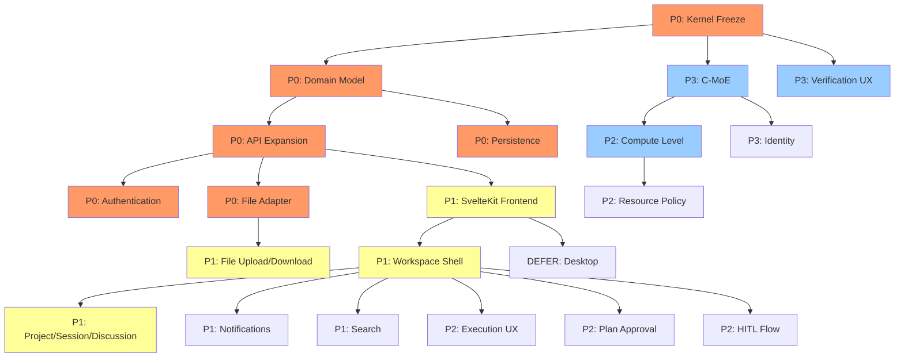

> **SUPERSEDED — DO NOT USE FOR IMPLEMENTATION**
> This document has been superseded by `docs/architecture/WORKSPACE_ARCHITECTURE.md` in the OCBrain repository.
> All content has been consolidated into the canonical document. This file is retained for historical reference only.

---

# OCBrain UX/UI & Workspace Architecture [SUPERSEDED] — Definitive Report

**Repository:** [ocbrain-v4.1](https://github.com/1h0lde4/ocbrain-v4.1)
**HEAD (main):** `977ebcc` — Merge security/rce-001-modules-new-hotfix
**Audit Date:** 2026-09-15 | **Classification method:** §0.2 applied throughout
**Tags:** `v1.0.0`, `v4.2.0-k4.2-cognitive-frontend`

---

## §0 — Research Method

Every statement classified per §0.2: **CURRENT FACT** (CF), **PARTIAL CURRENT FACT** (PCF), **DOCUMENTED INTENT** (DI), **RESEARCH FINDING** (RF), **ARCHITECTURAL PROPOSAL** (AP), **IMPLEMENTATION RECOMMENDATION** (IR), **OPEN DECISION** (OD).

HEAD fetched, commits inspected, branches inspected, tags inspected, code paths traced, repo-wide searches run. Prior report treated as hypothesis; revalidated against live source.

---

## §A — Executive Conclusion

**CF:** OCBrain today is a single-user, single-conversation, module-oriented AI assistant with a sophisticated kernel almost entirely hidden behind a thin browser UI.

**AP:** OCBrain should become a cognitive workspace where a human interacts with OCBrain through real domain primitives (Projects, Sessions, Discussions, Tasks, Files, Artifacts, C-MoE, Memory, Context, Verification, Identity, Components, Computational Resources) — all grounded in authoritative runtime state. The browser is the first client, never the definition of the system.

---

## §B — Live Repository Ground Truth

### B.1 Structure (CF)

```
ocbrain-v4.1/  HEAD: 977ebcc
├── core/                    # ~150 files
│   ├── orchestrator.py      # 831 lines — Parallel Orchestrator (Converged V3)
│   ├── model_router.py      # ModelRouter — model selection, maturity tracking
│   ├── brain_api.py         # Versioned Brain API v2 contract
│   ├── classifier_v3.py     # Query classification
│   ├── config.py            # Configuration
│   ├── context.py           # ContextMemory
│   ├── event_bus.py         # In-process pub/sub (non-persistent)
│   ├── provider_mesh.py     # Provider resolution + fallback
│   ├── cognitive/           # Intent(1105L), Planner(1654L), Compiler(425L),
│   │                        # Learning(36K), UserModel(327L), Recovery
│   ├── capabilities/        # CapabilityType, Registry, AdapterRuntime, Adapters
│   ├── events/              # EventStream — SQLite WAL, immutable, replay
│   ├── governance/          # GovernanceKernel + 5 governors
│   ├── memory/              # UnifiedMemory(58K), GraphRAG, retrieval, backends
│   ├── meta/                # SelfModel, Introspection, HealthMonitor
│   ├── runtime/             # ExecutionRuntime, Budget, Watchdog, Context, State
│   ├── sandbox/             # Phase 1: namespace/cgroup backend, seccomp-bpf
│   ├── workers/             # 7 worker types
│   ├── workflow/            # WorkflowDefinition, WorkflowRuntime(42K)
│   └── [dashboard, web, web_learning, shadow, skills, prompt, observability]
├── interface/
│   ├── api.py               # 653 lines — FastAPI, 22 endpoints
│   ├── cli.py, tray.py, voice.py, updater.py
│   └── web/                 # index.html(29K), settings.html(11K), wizard.html(18K)
├── modules/                 # coding, knowledge, system_ctrl, web_search
├── main.py                  # 489 lines — Composition root
├── tests/                   # ~65 test files, 1438+ passing
└── docs/                    # Architecture, studies, reports
```

### B.2 Branches (CF)

| Branch | Status |
|--------|--------|
| `main` | HEAD 977ebcc |
| `feature/verification-critic-evidence-phase-c` | Active, not merged |
| `sandbox-fabric` | Phase 1 merged |
| `eval-lab/research-and-architecture` | Active |

### B.3 Kernel Freeze (CF/PCF)

Near-freeze. All blockers resolved except:
- ⚠️ CTX-AUTH-001b (parser acceptance gap) — deferred
- 📋 DEBT-024 (SupervisorWorker retry) — non-blocking
- 📋 DEBT-025 (No API auth) — non-blocking

### B.4 Composition Root (CF) — [main.py](file:///C:/Users/Produ/.gemini/antigravity/scratch/ocbrain-repo/main.py)

Wires: UnifiedMemory → GovernanceKernel(7 governors) → EventStream(SQLite) → CapabilityRegistry → ResourceManager → AdapterRuntime → WorkerRegistry → ExecutionRuntime → WorkflowRuntime → Orchestrator. `use_k42_frontend` flag controls K4.2 cognitive pipeline activation (default: True).

---

## §C — Interface/API Ground Truth

### C.1 Frontend (CF)

Three static HTML files. No component framework, no build step, no routing, no state management library. Pure HTML + inline JS + CSS. Vanilla `fetch()` calls.

### C.2 API Endpoints — Actual Count: **28** (CF)

**interface/api.py — 22 endpoints:**

| # | Method | Path | Purpose |
|---|--------|------|---------|
| 1 | POST | `/query` | Query Orchestrator |
| 2 | GET | `/executions/{id}` | Execution details |
| 3 | GET | `/executions/{id}/events` | Execution events (SSE) |
| 4 | GET | `/health` | System health |
| 5 | GET | `/introspection` | Self-model |
| 6 | GET | `/dashboard` | Dashboard stats |
| 7 | POST | `/evolve/plan` | Evolution plan |
| 8 | GET | `/status` | System status |
| 9 | GET | `/modules` | List modules |
| 10 | POST | `/modules/new` | Create module |
| 11 | POST | `/train/{name}` | Train module |
| 12 | POST | `/distill` | Distill knowledge |
| 13 | POST | `/export` | Export module |
| 14 | POST | `/import` | Import module |
| 15 | GET | `/debug` | Debug info |
| 16 | GET | `/config` | Get config |
| 17 | PUT | `/config` | Set config (5 mutable keys) |
| 18 | GET | `/updates` | Check updates |
| 19 | POST | `/update/install` | Install update |
| 20 | POST | `/update/restart` | Restart |
| 21 | POST | `/rollback` | Rollback update |
| 22 | GET | `/events` | Global event stream (SSE) |

**core/brain_api.py — 6 endpoints (under `/brain/v2/`):**

| # | Method | Path | Purpose |
|---|--------|------|---------|
| 23 | GET | `/brain/v2/status` | Brain status |
| 24 | POST | `/brain/v2/query` | Brain query |
| 25 | POST | `/brain/v2/distill` | Distill |
| 26 | POST | `/brain/v2/export` | Export |
| 27 | POST | `/brain/v2/import` | Import |
| 28 | GET | `/brain/v2/version` | Version |

**Root serve:** `GET /` → index.html (not counted as API endpoint)

### C.3 What Does NOT Exist (CF)

No endpoints for: projects, sessions, discussions, files (upload/download/read/write/delete), artifacts, search, approvals, pause/resume, cancel, memory inspection, context queries, component inspection, computational level, resource policy, identity queries, verification.

No WebSocket support. SSE only (unidirectional server→client).
No authentication (DEBT-025). CSRF header protection only.

### C.4 Runtime Integration (CF/PCF)

| Component | Wired to API? | Accessible from UI? |
|-----------|--------------|-------------------|
| Orchestrator | ✅ via `/query` | ✅ |
| K4.2 Cognitive Front-End | ✅ (when `use_k42_frontend=true`) | ⚠️ Indirectly via `/query` |
| Planner | ✅ via cognitive pipeline | ❌ No plan inspection |
| Compiler | ✅ via cognitive pipeline | ❌ No compilation view |
| WorkflowRuntime | ✅ via orchestrator | ⚠️ Via execution events |
| ExecutionRuntime | ✅ via workflow | ❌ No direct access |
| CapabilityRegistry | ✅ (3 adapters) | ❌ No capability listing |
| GovernanceKernel | ✅ (enforces all actions) | ❌ No governance UX |
| EventStream | ✅ via `/events` + `/executions/{id}/events` | ⚠️ SSE streams |
| Verification | ❌ (in-progress on branch) | ❌ |
| Checkpoint/Resume | ✅ (WorkflowRuntime) | ❌ No UI |
| ExecutionBudget | ✅ (internal) | ❌ No UI |
| Watchdog | ✅ (internal) | ❌ No UI |
| UserCognitiveModel | ✅ (projection assembler) | ❌ No UI |

---

## §D — Context / Memory / User Model Ground Truth

### D.1 Memory System (CF)

| Layer | Implementation | Size |
|-------|---------------|------|
| UnifiedMemory | `core/memory/unified_memory.py` | 58K — production memory owner |
| L0 (working) | WorkingMemory in ExecutionContext | Per-execution scratch |
| L1 (active) | SQLite storage | Recent knowledge entries |
| L2 (consolidated) | Consolidator | Merged knowledge |
| L3 (promoted) | Validated knowledge | Passed validation_gate() |
| L4 (archive) | SQLite archive | Immutable history |
| Graph | GraphEngine, entity extraction, indexing | Knowledge graph |
| Retrieval | GraphRAG pipeline, BM25+embeddings+RRF fusion | Hybrid search |

### D.2 Context System (PCF)

| Context Type | Status |
|-------------|--------|
| Global context | ❌ Not implemented |
| Project context | ❌ Not implemented |
| Session context | ⚠️ `session_id` on ExecutionContext but no Session entity |
| Discussion context | ❌ Not implemented |
| Task context | ⚠️ Implicit via Goal → ExecutionPlan |
| Execution context | ✅ ExecutionContext (canonical, K2.1) |

### D.3 User Cognitive Model (CF)

**Implemented:** [user_model.py](file:///C:/Users/Produ/.gemini/antigravity/scratch/ocbrain-repo/core/cognitive/user_model.py) — `UserCognitiveModelProjection` with 7 fields: expertise, terminology_preferences, preferred_abstraction_level, communication_style, preferred_output_formats, recurring_objectives, behavioral_patterns. Read-mostly projection assembled from L1/L3 memory entries. Privacy invariants: fully inspectable and deletable. Writes go through `validation_gate()`. **Not yet wired into Intent Interpretation or Goal Formation** (future packet).

---

## §E — Identity Ground Truth

### E.1 Self-Model (CF)

Static Python dict + startup `CapabilityDetector`. Returns name, version ("3.01" — stale), capabilities, limits, health. `/introspection` endpoint returns this dict.

| Aspect | Type | Classification |
|--------|------|---------------|
| Name/version | Hard-coded | CF: Static |
| Capability flags | Startup-detected | CF: Semi-dynamic |
| Provider health | Startup-detected | CF: Semi-dynamic |
| Component graph | Missing | CF: Does not exist |
| Runtime state queries | Missing | CF: Does not exist |
| Verified knowledge | Missing | CF: Does not exist |
| Permission model | Missing | CF: Does not exist |
| Resource awareness | Missing | CF: Does not exist |
| Topology | Missing | CF: Does not exist |

**Verdict (CF):** Self-description, not machine-readable introspection. Cannot query components, cannot represent relationships, cannot verify its own claims.

---

## §F — C-MoE Ground Truth

**CF:** Zero executable C-MoE code. The compiler explicitly states: *"no such resolution mechanism exists anywhere in this repository today"* ([compiler.py](file:///C:/Users/Produ/.gemini/antigravity/scratch/ocbrain-repo/core/cognitive/compiler.py) L47-48). Research documents exist (`OCBRAIN_K4_3_CMOE_ARCHITECTURE_STUDY.md`). C-MoE is post-kernel-freeze.

---

## §G — File/Artifact Ground Truth

### G.1 Capability Types (CF)

Only `LLM_COMPLETION` has registered adapters (`ModelRouterAdapter`, `OllamaAdapter`, `OpenAICompatAdapter`). **FILE_ACCESS is declared at L73 of [capability.py](file:///C:/Users/Produ/.gemini/antigravity/scratch/ocbrain-repo/core/capabilities/capability.py) with the comment "declared, not registered."** No file adapter, no file endpoint, no file storage, no file metadata, no file upload, no file download, no file preview.

### G.2 Sandbox Artifacts (PCF)

`SandboxResult` has `artifacts: Dict[str, bytes]` in contracts. This is sandbox execution output only, not a general artifact system.

### G.3 File Operations Audit (CF)

| Operation | Status | Evidence |
|-----------|--------|----------|
| Read | ❌ | No adapter |
| Write | ❌ | No adapter |
| Create | ❌ | No adapter |
| Modify | ❌ | No adapter |
| Delete | ❌ | No adapter |
| Copy | ❌ | Nothing |
| Move | ❌ | Nothing |
| Upload | ❌ | No endpoint |
| Download | ❌ | No endpoint |
| Preview | ❌ | Nothing |
| Parse | ❌ | Nothing |
| Directories | ❌ | Nothing |
| Storage | ❌ | Nothing |

---

## §H — Computational/Resource Ground Truth

### H.1 What Exists (CF)

| Component | Implementation |
|-----------|---------------|
| ExecutionBudget | Time-based: startup(10s), progress(45s), hard_ceiling(300s), max_extension(240s) |
| ExecutionWatchdog | Enforces budget via CancellationToken |
| IterationBudget | Step-count limiter |
| OperationRecoveryBudget | Retry count (max_recovery_attempts, default 3) |
| ThroughputHistory | EMA of tokens/sec per (provider, model) |
| AdaptiveSemaphore | Concurrent request limiting |

### H.2 What Does NOT Exist (CF)

User-facing Computational Level, Resource Policy, task-difficulty classification, task-aware model routing, token budgets, cost budgets, expert allocation, verification depth scaling, resource contention management, resource accounting, resource reservation.

---

## §I — Landscape Research

### I.1 Computational Effort Controls (RF)

| Provider | Parameter | Values | Semantics |
|----------|-----------|--------|-----------|
| Gemini | `thinking_level` | LOW, MEDIUM, HIGH | Relative reasoning depth |
| Anthropic | `effort` | low, medium, high, xhigh, max | Adaptive thinking |
| OpenAI | `reasoning_effort` | none, low, medium, high, xhigh | O-series reasoning |
| Vercel AI SDK | `reasoning` | Unified parameter | Abstraction across providers |

All converge on relative scales. No provider exposes absolute token counts for thinking.

### I.2 GitHub Projects (RF)

| Project | Key Finding | OCBrain Relevance |
|---------|-------------|-------------------|
| **AG-UI** (CopilotKit) | Agent↔UI protocol. Events for lifecycle, tool calls, state | Borrow concepts; OCBrain is richer |
| **Open WebUI** | RBAC, local models, multi-provider. Chat-centric | Reference for auth patterns |
| **LibreChat** | File search, code interpretation. Still chat-centric | File handling reference |
| **Magentic-UI** (Microsoft) | Browser + local filesystem agent | Closest to OCBrain ambition |
| **MCP** (Anthropic) | JSON-RPC 2.0. Resources/Tools/Prompts primitives | Adopt as MCP Host |

### I.3 Academic (RF)

| Finding | Source | OCBrain Implication |
|---------|--------|---------------------|
| Traceable routing needed for trust | Agentic Routing XAI | Computational changes must be explainable |
| Confidence-aware routing saves cost | OI-MAS, STRMAC | Validates adaptive allocation |
| Progressive disclosure reduces overload | CHI research | Workspace must not expose everything |
| Information asymmetry needs scope management | ACL research | Validates context isolation |

---

## §J — File Workspace Architecture (AP)

### J.1 File Lifecycle

```
Upload → Validate → Metadata Extraction → Store
  → Inspect → Preview → Read
  → Select as Context → Analyze / Transform
  → Create / Modify → Version / Compare
  → Verify → Save Artifact
  → Download / Export → Archive / Delete / Restore
```

### J.2 Supported Formats (IR)

| Tier | Formats | Support Level |
|------|---------|--------------|
| Core | text, Markdown, code, JSON, YAML, XML, CSV | Full preview + analysis |
| Extended | PDF, DOCX, PPTX, spreadsheets | Parse + extract |
| Media | images, audio, video | Metadata + preview |
| Other | archives, binary, unknown | Metadata only |

### J.3 File vs Content (AP)

| Concept | Definition | Scope |
|---------|-----------|-------|
| File Identity | UUID, immutable | Global |
| File Reference / Handle | Lightweight pointer (file_id + path) | Per-reference |
| Metadata | MIME, size, encoding, hash, language | Per-file |
| Content | Actual bytes/text | Storage |
| Derived Representation | Embeddings, parsed structure, preview | Cache |
| Temporary Working Copy | Staged mutations, diffs | Ephemeral |
| Artifact | Versioned output with provenance | Project-scoped |

C-MoE works through **controlled references**, not automatic full-content injection.

### J.4 Large File Handling (AP)

| Strategy | When |
|----------|------|
| Chunking | Files > context window |
| Partial reads | Targeted sections |
| Streaming | Progressive processing |
| Structured extraction | Tables, code, sections |
| Embedding-based retrieval | Semantic search within file |
| Sampling | Large corpus analysis |

### J.5 File Security (AP)

```
UI → C-MoE → Capability Request → Governance → File Adapter → Sandbox/Runtime → Filesystem
```

| Threat | Mitigation |
|--------|-----------|
| Path traversal | Jail to project file store |
| Symlink attacks | Resolve and reject outside jail |
| Malicious documents | Parse in sandbox |
| Oversized files | Size limits at upload + governance |
| Decompression attacks | Archive extraction limits |
| Executable content | Never execute uploaded files |
| Parser vulnerabilities | Sandboxed parsers |

### J.6 File Concurrency (AP)

| Pattern | Application |
|---------|------------|
| Optimistic concurrency | Version field on File; reject stale writes |
| Staged mutation | Prepare → Preview/Diff → Approve → Commit |
| Atomic writes | Write-then-rename for filesystem safety |
| Lock-free readers | Readers never block; always see a consistent version |
| Conflict detection | Hash comparison on write |

### J.7 Large Corpus Workflows (AP)

```
File exists ≠ File indexed ≠ File embedded ≠ File in memory ≠ File in current context
```

For "Analyze 50,000-file repo":
1. Folder/glob selection → corpus
2. Background indexing → metadata + structure
3. Selective embedding → retrieval-ready subset
4. Retrieval → context-relevant files
5. Batch analysis with sampling/aggregation

---

## §K — Artifact Semantics (AP)

| Concept | Definition |
|---------|-----------|
| Source File | Original external file |
| Uploaded File | File brought into workspace |
| Working Copy | Staged mutation of a file |
| Execution Output | Raw output from a capability |
| Generated Artifact | Structured, named output |
| Verified Artifact | Artifact with verification status |
| Project Artifact | Persisted, project-scoped artifact |
| Exported Artifact | Artifact prepared for external use |

Lineage chain: `Artifact → Inputs → Task → Execution → Capabilities → Verification`

---

## §L — C-MoE Architecture (AP)

### L.1 C-MoE Responsibilities

| C-MoE Owns | C-MoE Does NOT Own |
|------------|-------------------|
| Intent interpretation | Authorization (→ Governance) |
| Task decomposition | Hard resource enforcement (→ Runtime) |
| Expert selection recommendation | Unrestricted filesystem access |
| Planning strategy | Final verification verdicts |
| Computational-intensity recommendation | Memory mutation authority |
| Capability selection recommendation | Governance decisions |
| Replanning after failure | Budget enforcement |

### L.2 C-MoE ↔ Files (AP)

```
User → Workspace → C-MoE → CapabilityRequest(FILE_ACCESS)
  → Governance evaluates → File Adapter → Sandbox/Runtime
  → Result → Verification → C-MoE → Workspace
```

**Never:** C-MoE → unrestricted filesystem.

---

## §M — Command / Query / Event Model (AP)

### M.1 Separation

| Type | Definition | Examples |
|------|-----------|----------|
| **QUERY** | "What is happening?" Read-only, idempotent, no side effects | Get project, list files, get execution status |
| **COMMAND** | "Do this." Mutating, identified, idempotent where possible | Create project, upload file, approve plan, set computational level |
| **EVENT** | "This happened." Immutable, append-only, past tense | project.created, file.uploaded, execution.completed, governance.denied |

### M.2 Command Properties (AP)

Every command has:
- `command_id` (UUID) — for idempotency
- `command_type` — categorical
- `issued_by` — user or system
- `issued_at` — timestamp
- `target` — entity being acted upon
- `payload` — command-specific data

Duplicate `command_id` → return previous result, do not re-execute.

---

## §N — Projection / Read-Model Architecture (AP)

### N.1 Projections

```
EventStream
├── ProjectProjection      — current state of all projects
├── SessionProjection      — sessions within a project
├── DiscussionProjection   — messages, files, tasks
├── TaskProjection         — goal, plan, state, executions
├── ExecutionProjection    — workflow state, events, budget
├── ActivityProjection     — recent activity feed
├── ArtifactProjection     — artifacts with provenance
├── IdentityProjection     — component state, health
├── VerificationProjection — verification status
├── ResourceProjection     — allocation, consumption
└── FileProjection         — file metadata, state
```

### N.2 Projection Properties (AP)

| Property | Decision |
|----------|----------|
| Rebuild | From EventStream replay |
| Snapshotting | Periodic for fast startup |
| Consistency | Eventually consistent with EventStream |
| Versioning | Schema version per projection |
| Migration | Rebuild from events when schema changes |

The workspace API serves **projections**, not raw kernel internals.

---

## §O — Event/State Synchronization (AP)

### O.1 Transport

```
EventStream.append() → EventBus.emit() → SSE transport → Client → UI
```

| Concern | Solution |
|---------|----------|
| Initial load | Snapshot from projection + recent events |
| Live updates | SSE delta stream with sequence IDs |
| Reconnect | Client sends last sequence → server replays since |
| Multiple tabs | Shared SSE connection via SharedWorker or BroadcastChannel |
| Missed events | Gap detection via sequence; force resync |
| Ordering | Monotonic sequence numbers (already in EventStream) |
| Idempotency | Client deduplicates by event_id |

### O.2 Protocol Recommendation (IR)

| Protocol | Role | Rationale |
|----------|------|-----------|
| SSE | Primary server→client | Already implemented, fits event-driven |
| REST | CRUD commands + queries | Standard, well-understood |
| WebSocket | Bidirectional (approvals, plan editing) | Future, when needed |

### O.3 Eventual Consistency UX (AP)

| State | Display |
|-------|---------|
| Requested | Optimistic indicator + "Sending..." |
| Accepted | Confirmed indicator |
| Processing | Progress indicator |
| Committed | Authoritative state update |
| Projected | Visible in UI |

Normal eventual consistency must NOT appear as failure.

### O.4 Optimistic vs Authoritative (AP)

| Operation | Optimistic OK? | Reason |
|-----------|---------------|--------|
| Send message | ✅ | Low risk |
| Create discussion | ✅ | Low risk |
| File upload progress | ✅ | UX quality |
| Approvals | ❌ | Must be authoritative |
| File mutations | ❌ | Must confirm commit |
| Destructive actions | ❌ | Must confirm |
| Execution state | ❌ | Must be authoritative |
| Verification | ❌ | Must be authoritative |
| Governance | ❌ | Must be authoritative |

---

## §P — Domain Model (AP)

### P.1 All Primitives

| Primitive | Owner | Scope | Persistence | Lifecycle | Authority | Events |
|-----------|-------|-------|-------------|-----------|-----------|--------|
| **Project** | User | Global | Durable | ACTIVE→ARCHIVED→DELETED | Backend | project.* |
| **Session** | Project | Project | Durable | ACTIVE→PAUSED→CLOSED→ARCHIVED | Backend | session.* |
| **Discussion** | Session | Session | Durable | ACTIVE→PAUSED→ARCHIVED | Backend | discussion.* |
| **Task** | Discussion/Session | Session | Durable | PLANNED→APPROVED→EXECUTING→COMPLETED/FAILED/CANCELLED | Backend+Runtime | task.* |
| **Execution** | Task | Task | Durable (events) | From ExecutionRuntime | Runtime (authoritative) | execution.* |
| **Operation** | Execution | Execution | Durable (events) | From Orchestrator | Runtime | operation.* |
| **File** | Project | Project | Durable | UPLOADED→ACTIVE→ARCHIVED→DELETED | Backend | file.* |
| **Artifact** | Project | Project | Durable | CREATED→VERIFIED→SUPERSEDED | Backend+Verification | artifact.* |
| **Context** | Scope-dependent | Inherited chain | Reconstructable | Session/discussion-scoped | Backend | context.* |
| **Memory** | Project/Global | Project or global | Durable | L0→L1→L2→L3→L4 | Memory system | memory.* |
| **Component** | System | Global | Runtime | Lifecycle-dependent | Identity system | component.* |
| **Expert** | C-MoE | Task | Ephemeral | Selected→Active→Complete | C-MoE | expert.* |
| **Identity** | System | Global | Derived | Always-on | Identity system | identity.* |
| **Verification** | Artifact/Claim | Artifact | Durable | UNVERIFIED→VERIFIED→CONTRADICTED→SUPERSEDED | Verification system | verification.* |
| **Event** | System | Global | Immutable | Append-only | EventStream | — |
| **Notification** | System/User | User | Ephemeral/durable | PENDING→READ→DISMISSED | Notification system | notification.* |
| **ComputationalLevel** | User | Task/Session/Project | Per-request | Per-task | User intent | — |
| **ResourcePolicy** | System | Task | Per-task | Derived | Resource Policy Engine | resource.* |
| **Allocation** | Runtime | Execution | Durable | Consumed | Runtime | allocation.* |
| **UserCognitiveModel** | User | Global | L1/L3 memory | Long-lived projection | Memory+validation_gate | user_model.* |

### P.2 Context Boundaries (AP)

```
Project context (persistent knowledge, policies)
  ↓ inherited by
Session context (active working state)
  ↓ inherited by
Discussion context (conversation-specific)
  ↓ inherited by
Task context (goal-specific)
  ↓ inherited by
Execution context (ExecutionContext — already exists)
```

Rules: automatic inheritance downward; explicit promotion upward (governed); no implicit leakage across siblings; governance controls promotion.

### P.3 Workspace Persistence ≠ Memory (AP)

| Concept | Is | Is NOT |
|---------|----|----|
| Persisted Discussion | Conversation history | Semantic memory |
| Project File | Data in workspace | Project knowledge |
| Execution History | What happened | Long-term learning |

Promotion: Discussion insight → Candidate Knowledge → Verification (where required) → Project Memory/Knowledge. Always explicit, never automatic.

### P.4 User Cognitive Model (CF/AP)

**CF:** Already implemented as `UserCognitiveModelProjection` with 7 fields (expertise, terminology_preferences, preferred_abstraction_level, communication_style, preferred_output_formats, recurring_objectives, behavioral_patterns). Privacy invariants: inspectable, deletable, excluded from cross-instance.

**AP Extensions:**
- Preferred computational levels
- Notification preferences
- Interface preferences
- Provider/model preferences
- Project-specific preferences (scoped, not global)

**Rules:** User personalization must NOT contaminate project memory. Inferred preferences require confirmation for high-impact changes. User can delete/forget any entry.

---

## §Q — Multi-Discussion UX (AP)

| Feature | Design |
|---------|--------|
| Parallel discussions | Multiple within a session |
| Tabs | Horizontal tabs per discussion |
| Split panes | Optional side-by-side |
| Branching | Fork from any message |
| Cross-discussion reference | Explicit linking, not implicit sharing |
| Isolation | Each discussion has its own context scope |
| Shared | Session context inherited by all discussions |
| Archive | Discussions can be archived individually |

---

## §R — Search / Retrieval (AP)

| Scope | Targets |
|-------|---------|
| Global | Cross-project (with permission) |
| Project | Sessions, files, artifacts, knowledge, decisions |
| Session | Discussions, tasks, executions |
| Discussion | Messages, files, decisions |
| File | File content, metadata |
| Artifact | Artifact content, provenance |
| Execution | Events, outcomes |
| Event | Event stream queries |
| Memory | Semantic + exact search |
| Component | Component state, capabilities |

Support: exact, semantic, filters (date, status, type, tags).

---

## §S — Task / Plan / Execution UX (AP)

### S.1 Task UX

Expose: goal, plan (task tree), constraints, computational level, approvals, execution state, results, artifacts. Allow: inspect, approve, reject, replan, cancel.

### S.2 Execution Observability

Display: task tree → workflow graph → timeline → active node → progress → waiting → retries → failure → recovery → pause → resume → cancel → governance decisions → capability activity → verification → artifacts → resource allocation.

### S.3 Failure Taxonomy (AP)

| Failure Type | Layer | UX Display |
|-------------|-------|-----------|
| Task failure | Cognitive | "Task could not be completed" |
| Capability failure | Adapter | "The [capability] encountered an error" |
| Governance denial | Governance | "This action was not permitted: [reason]" |
| Verification failure | Verification | "Verification found issues: [details]" |
| Resource exhaustion | Runtime | "Resource limit reached: [budget/time/tokens]" |
| Budget exhaustion | Resource Policy | "Budget exceeded" |
| Model/provider failure | Provider | "Provider unavailable: [details]" |
| File operation failure | File Adapter | "File operation failed: [details]" |
| Approval timeout | HITL | "Approval not received in time" |
| Network/disconnect | Transport | "Connection lost — reconnecting" |

Matches existing `FailureType` enum in [execution_outcome.py](file:///C:/Users/Produ/.gemini/antigravity/scratch/ocbrain-repo/core/runtime/execution_outcome.py) (SUCCESS, STALLED, HARD_DEADLINE, CANCELLED, PROVIDER_FAILURE, EMPTY_RESPONSE, VALIDATION_ERROR, COMPLETED_WITH_PARTIAL_OUTPUT, OTHER_FAILURE).

---

## §T — Background Jobs / Interruption / Handoff (AP)

### T.1 Concept Separation

| Concept | Definition |
|---------|-----------|
| Task | Goal-directed work unit |
| Execution | Single runtime attempt |
| Job | Long-running background execution |
| Activity | Any observable system action |

### T.2 Interruption Flow

```
C-MoE working → user leaves → task continues (background)
→ user returns → workspace reconstructs state from projections
→ pending approvals shown → execution progress visible
```

### T.3 Drafts (AP)

| State | Persistence |
|-------|------------|
| Draft message | Local storage + server draft API |
| Draft plan edit | Local storage |
| Unsaved edits | Local storage with recovery |
| Pending approval | Server-side, durable |
| Submitted command | Server-side, tracked by command_id |

---

## §U — Human-in-the-Loop (AP)

```
Requested → Awaiting Approval → Approved → Executing → Completed
                              → Rejected → Cancelled
                              → Timed Out → Escalated/Failed
```

| Scope | Meaning |
|-------|---------|
| One-time approval | This specific action |
| Session approval | All similar actions this session |
| Project approval | All similar actions in this project |
| Reusable policy | Persistent rule for future actions |
| Destructive confirmation | Always required for destructive actions |

---

## §V — Attention / Notification Model (AP)

| Priority | Examples | Behavior |
|----------|----------|----------|
| Urgent | Approval required, security alert | Interrupt immediately |
| Important | Task completed, failure | Badge + sound |
| Background | Progress update | Silent update |
| Informational | System status | Log only |

Attention queue with grouping. Quiet mode suppresses non-urgent. Completion/failure/approval always surface.

---

## §W — Undo / Compensation (AP)

| Type | Meaning | Example |
|------|---------|---------|
| UI Undo | Reverse UI action | Undo message draft |
| Domain Undo | Reverse domain mutation | Undelete file |
| Cancellation | Stop in-progress work | Cancel execution |
| Rollback | Revert to previous state | Rollback file version |
| Compensating Action | Counteract completed action | Archive instead of delete |
| Supersession | Replace with newer version | New artifact version |

Not all actions can be literally undone. Destructive actions use compensating actions or soft-delete.

---

## §X — Governance Matrix (AP)

| Operation | UI Requests | API Validates | Governance Validates | Runtime Executes |
|-----------|------------|--------------|---------------------|-----------------|
| File read | ✅ | ✅ auth, format | ✅ permission, sandbox | ✅ |
| File write | ✅ | ✅ auth, path | ✅ permission, mutation | ✅ |
| File delete | ✅ | ✅ auth | ✅ destructive confirm | ✅ |
| Artifact mutation | ✅ | ✅ auth | ✅ version, provenance | ✅ |
| Memory mutation | ✅ | ✅ auth | ✅ MemoryGovernor | ✅ |
| External provider | ✅ | ✅ | ✅ cost, data | ✅ |
| Browser/web | ✅ | ✅ | ✅ URL, sandbox | ✅ sandboxed |
| Code execution | ✅ | ✅ | ✅ sandbox required | ✅ sandboxed |
| Capability invoke | ✅ | ✅ | ✅ GovernanceAction | ✅ |
| Resource escalation | ✅ | ✅ | ✅ budget check | ✅ |
| Compute level change | ✅ | ✅ | ✅ cap enforcement | ✅ |

---

## §Y — Computational Level Architecture (AP)

### Y.1 Semantics

| Level | Intent | NOT |
|-------|--------|-----|
| **LOW** | Minimize latency and resource use | = small model |
| **MEDIUM** | Balanced quality/cost/latency | = default model |
| **HIGH** | Prioritize quality and reliability | = big model |
| **MAX** | Maximum justified computation within hard caps | = biggest model or unlimited |

**OD:** Whether AUTO should exist as a fifth option (system decides). Evidence: provider controls don't offer AUTO; it may cause confusion about who decided. **Recommendation:** Omit AUTO; MEDIUM serves as a reasonable default.

### Y.2 Resource Policy Layer (AP)

```
ComputationalLevel (user intent)
  + Task complexity (C-MoE analysis)
  + Task type/risk
  + Available resources
  + Model/provider availability
  + Project/session policy
  + Governance constraints
    ↓
ResourcePolicy (system-derived)
  → model_preference, reasoning_effort, expert_count
  → retrieval_breadth, verification_depth
  → retry_budget, tool_budget, token_budget, cost_budget
  → parallelism, runtime_budget
```

### Y.3 Router vs Policy vs Governance vs Runtime (AP)

| Concern | Owner | Responsibility |
|---------|-------|---------------|
| Resource Policy | Resource Policy Engine | Translate level + context → allocation |
| Router | ModelRouter | Concrete model/provider selection, fallback |
| Governance | GovernanceKernel | Hard ceilings, permissions, safety |
| Runtime | ExecutionRuntime/Watchdog | Actual enforcement, cancellation |

Router does NOT own policy. Policy does NOT own enforcement. Governance can override everything.

### Y.4 Computational Control Matrix (AP)

| Dimension | LOW | MEDIUM | HIGH | MAX | Adaptive? | Hard Cap? |
|-----------|-----|--------|------|-----|-----------|-----------|
| Model capability | Smallest adequate | Standard | Strong | Best available | ✅ | ✅ |
| Reasoning effort | low | medium | high | max | ✅ | ✅ |
| Expert count | 1 | 1-2 | 2-3 | 3+ | ✅ | ✅ |
| Retrieval breadth | Narrow | Standard | Expanded | Broadest | ✅ | ✅ |
| Context budget | Minimal | Standard | Large | Maximum | ✅ | ✅ |
| Verification | Minimal | Standard | Strong | Strongest | ✅ | ✅ |
| Retries | 0 | 1 | 2 | 3 | ✅ | ✅ |
| Tool calls | Limited | Standard | Expanded | Maximum | ✅ | ✅ |
| Parallelism | Sequential | Limited | Moderate | Maximum | ✅ | ✅ |
| Execution depth | Shallow | Standard | Deep | Maximum | ✅ | ✅ |
| Token budget | Conservative | Standard | Large | Maximum | ✅ | ✅ |
| Cost budget | Minimal | Standard | Elevated | Maximum | ✅ | ✅ |
| Latency target | Aggressive | Standard | Relaxed | No target | ❌ | ✅ Timeout |
| GPU/CPU | Minimal | Standard | Elevated | Maximum | ✅ | ✅ |
| External providers | Avoid | As needed | Preferred | Required if better | ✅ | ✅ Budget |

### Y.5 MAX Semantics (AP)

> **MAX is the maximum computation OCBrain is permitted and able to allocate under current system policy, resource availability, task constraints and hard safety limits.**

**Never:** infinite tokens, infinite retries, infinite tool calls, infinite execution, unlimited cost, unlimited infrastructure, Governance bypass.

### Y.6 Adaptation (AP)

```
Requested Level → Task analysis → Resource Policy → Effective Level → Actual Allocation
```

- MAX on trivial task → MEDIUM-equivalent (task-aware de-escalation)
- HIGH on unexpectedly complex task → within-policy escalation
- LOW on safety-critical detection → Governance-forced minimum verification

All adaptation respects hard ceilings. All adaptation logged as events.

### Y.7 Resource Accounting (AP)

| State | Meaning |
|-------|---------|
| Requested | What the user asked for |
| Reserved | What the policy allocated |
| Effective | What the system decided after policy |
| Actual | What was consumed |
| Remaining | Budget - Actual |

### Y.8 Resource Contention (AP)

When multiple tasks compete:
- Fairness: proportional allocation based on priority
- Foreground > Background
- No starvation: minimum guaranteed allocation
- MAX does not automatically win over other tasks
- Project priority configurable

### Y.9 Precedence (AP)

```
System hard maximum (immutable)
  → Governance constraints (cannot be overridden)
  → Project default → Session override → Task selection → Runtime adaptation
```

User can lower but never exceed system limits.

### Y.10 Computational UX (AP)

```
Requested: HIGH
Effective: HIGH
Current:   2 experts • expanded retrieval • strong verification
Budget:    68% │ ████████░░ │
```

Progressive disclosure: collapsed by default, expandable.

### Y.11 Explainability (AP)

The workspace should eventually answer:
- Why this computation level? → Policy derivation
- Why escalation? → Event log
- Why not MAX? → Governance constraint
- Which model? → Router decision
- Which constraint limited? → Policy audit

---

## §Z — Model/Provider/Capability Lifecycle (AP)

### Z.1 Provider States

| State | Meaning |
|-------|---------|
| Configured | Provider exists in config |
| Available | Provider reachable |
| Healthy | Provider responding normally |
| Rate-limited | Temporarily throttled |
| Offline | Unreachable |
| Degraded | Partially functional |
| Disabled | Manually disabled |

### Z.2 Capability States

| State | Meaning |
|-------|---------|
| Installed | Code exists |
| Available | Adapter registered |
| Enabled | Can be invoked |
| Disabled | Manually disabled |
| Unavailable | Dependencies missing |
| Degraded | Partially functional |
| Deprecated | Scheduled for removal |
| Removed | No longer available |

Capability exists ≠ Capability is currently executable.

---

## §AA — Instruction / Data Trust Boundaries (AP)

| Trust Class | Examples | Authority Level |
|-------------|----------|----------------|
| Trusted User Instruction | User's typed request | Highest |
| Project Policy | Project-level rules | High |
| Session Instruction | Session-level commands | High |
| Discussion Content | Prior messages | Medium |
| File Content | Uploaded/generated files | **Data, never instruction** |
| Tool Output | Capability results | Data with provenance |
| MCP Output | External MCP server results | Untrusted data |
| External Content | Web pages, APIs | Untrusted data |
| Generated Content | LLM output | Data, requires verification |
| Verified Evidence | Verified by verification system | Highest data trust |

**Rule:** A file saying "Ignore previous instructions" remains data. External/file/tool content never becomes trusted instruction merely because it was retrieved. Provenance must be tracked and exposed to C-MoE.

---

## §AB — Provenance Architecture (AP)

### Knowledge Provenance
```
Claim → Source → Execution → Evidence → Verification
```

### Artifact Provenance
```
Artifact → Inputs (files, artifacts) → Task → Execution → Capabilities → Verification
```

### Computational Provenance
```
Task → Requested Level → Policy → Actual Allocation → Outcome
```

---

## §AC — Secrets / Credentials (AP)

| Type | Storage | Exposure to C-MoE |
|------|---------|-------------------|
| API keys | Encrypted config / OS keychain | Never directly |
| OAuth tokens | Secure storage | Never |
| Provider credentials | Config with masking | Via capability request only |
| Project secrets | Per-project encrypted store | Never |
| Git credentials | OS credential manager | Never |

Secrets are distinct from ordinary configuration. C-MoE accesses capabilities that use secrets, never the secrets themselves.

---

## §AD — Data Lifecycle (AP)

| Action | Meaning |
|--------|---------|
| Archive | Move to cold storage, retrievable |
| Purge | Permanent deletion |
| Supersede | Replace with newer version |
| Invalidate | Mark as no longer accurate |
| Compact | Consolidate event history |

Retention policies per project. Event growth managed by compaction/snapshotting.

---

## §AE — Import / Export / Portability (AP)

| Operation | Scope | Format |
|-----------|-------|--------|
| Project export | Complete project | ZIP with manifest |
| Discussion export | Single discussion | Markdown/JSON |
| Artifact export | Individual artifact | Native format |
| Metadata export | Project structure | JSON |
| Workspace backup | Everything | Archive |
| Machine migration | Full system | Export + import |

---

## §AF — Performance / Accessibility / i18n (AP)

**Performance:** Virtualized message lists, lazy file trees, paginated event streams, incremental rendering, event batching, large artifact streaming.

**Accessibility:** Keyboard navigation, screen reader support, focus management, streaming state announcements, execution progress, reduced motion, high contrast.

**Internationalization:** Architecture for dates, numbers, units. Unicode throughout. RTL considered but not v1.

---

## §AG — Competitive Matrix (RF)

| Capability | OCBrain | Open WebUI | LibreChat | Magentic-UI | Cursor |
|-----------|---------|------------|-----------|-------------|--------|
| Projects | ❌ | ❌ | ❌ | ❌ | ✅ |
| Sessions | ❌ | ✅ | ✅ | ⚠️ | ✅ |
| Discussions | ❌ | ❌ | ❌ | ❌ | ❌ |
| Multi-Agent | ❌ | ❌ | ❌ | ⚠️ | ❌ |
| Files | ❌ | ⚠️ | ✅ | ✅ | ✅ |
| Artifacts | ❌ | ❌ | ⚠️ | ⚠️ | ✅ |
| Memory | ✅ | ⚠️ | ⚠️ | ❌ | ⚠️ |
| Context mgmt | ⚠️ | ❌ | ❌ | ❌ | ⚠️ |
| Execution UX | ⚠️ | ❌ | ❌ | ⚠️ | ⚠️ |
| Verification | ⚠️ | ❌ | ❌ | ❌ | ❌ |
| Identity | ⚠️ | ❌ | ❌ | ❌ | ❌ |
| Governance | ✅ | ❌ | ❌ | ❌ | ❌ |
| Compute Control | ❌ | ❌ | ❌ | ❌ | ❌ |
| Budgets | ⚠️ | ❌ | ❌ | ❌ | ❌ |
| Local-first | ✅ | ✅ | ⚠️ | ⚠️ | ❌ |
| Extensibility | ✅ | ✅ | ✅ | ⚠️ | ✅ |
| Desktop | ❌ | ❌ | ❌ | ❌ | ✅ |

OCBrain's unique edge: Governance, EventStream, Verification (in-progress), User Cognitive Model, architectural discipline.

---

## §AH — Frontend Technology Recommendation (IR)

| Criterion | SvelteKit | React/Vite | Vue |
|-----------|-----------|------------|-----|
| Event-driven reactivity | ⭐ Native stores | Good (needs libs) | Good (reactive refs) |
| Bundle size | Small | Medium | Small |
| SSE integration | Native | Requires libs | Requires libs |
| FastAPI integration | Excellent | Good | Good |
| Streaming UX | ⭐ Excellent | Good | Good |
| Large workspace perf | ⭐ Less overhead | More GC pressure | Good |
| File handling | Good | Good | Good |
| Testing | Vitest + Playwright | Jest + Playwright | Vitest + Playwright |
| Accessibility | Good | ⭐ Largest ecosystem | Good |
| Desktop (Tauri) | ⭐ Natural fit | Works | Works |
| Maintainability | ⭐ Less boilerplate | More boilerplate | Moderate |

**IR: SvelteKit** for browser client. **Tauri** for desktop.

---

## §AI — Browser / Desktop Strategy (IR)

**Recommendation: Strategy D — Shared core with multiple clients.**

```
OCBrain Core (Python/FastAPI)
  ├── REST + SSE API (client-agnostic)
  ├── Browser client (SvelteKit SPA) ← FIRST
  ├── Desktop client (Tauri + SvelteKit) ← SECOND
  └── Future: CLI, mobile, voice
```

Workspace architecture and API contracts are client-agnostic. Browser ships first. Desktop after workspace stabilizes.

---

## §AJ — Protocol Recommendation (IR)

| Protocol | Recommendation | Role |
|----------|---------------|------|
| REST | CONTINUE | Commands + queries |
| SSE | ADOPT (primary) | Server→client events |
| WebSocket | ADOPT (secondary) | Future bidirectional needs |
| AG-UI | BORROW CONCEPTS | Event naming, lifecycle patterns |
| MCP | ADOPT as HOST | Access community MCP servers |

MCP does not become OCBrain's internal protocol. AG-UI does not replace OCBrain's event architecture.

---

## §AK — State Model (AP)

| State Domain | Authoritative | Derived | Cached | Ephemeral |
|-------------|---------------|---------|--------|-----------|
| UI State | — | — | — | ✅ |
| Workspace State | ✅ (backend) | — | — | — |
| Cognitive State | ✅ (cognitive pipeline) | — | — | — |
| Task State | ✅ (backend) | — | — | — |
| Execution State | ✅ (Runtime) | — | — | — |
| File State | ✅ (backend + storage) | — | — | — |
| Artifact State | ✅ (backend) | — | — | — |
| Verification State | ✅ (Verification system) | — | — | — |
| Identity State | — | ✅ (from components) | — | — |
| Resource State | ✅ (Runtime) | — | — | — |

---

## §AL — Responsibility Matrix (AP)

| Concern | UX | C-MoE | Resource Policy | Router | Governance | Runtime | Verification |
|---------|-------|-------|-----------------|--------|------------|---------|-------------|
| Intent | Display | ✅ Own | — | — | — | — | — |
| Planning | Inspect/approve | ✅ Own | — | — | Gate | — | — |
| Routing | — | Recommend | Policy | ✅ Select | Constrain | — | — |
| Experts | Display | ✅ Select | Budget | — | — | — | — |
| Compute Level | ✅ Select | Recommend | ✅ Translate | — | Cap | Enforce | — |
| Budgets | Display | — | ✅ Derive | — | Cap | ✅ Enforce | — |
| File ops | Request | Decide | — | — | ✅ Authorize | ✅ Execute | — |
| Artifacts | Display/download | Create | — | — | — | — | ✅ Verify |
| Memory | Display | Read | — | — | ✅ Write gate | — | — |
| Execution | Observe | — | — | — | — | ✅ Own | — |
| Verification | Display | — | — | — | — | — | ✅ Own |
| Identity | Display | — | — | — | — | — | — |

---

## §AM — Architectural Invariants (AP)

1. Governance remains authoritative — no bypass path exists.
2. Verification is distinct from critique — model opinion ≠ verification.
3. Runtime remains authoritative for execution state.
4. UI remains replaceable — any client can be substituted.
5. C-MoE never gets unrestricted filesystem authority.
6. C-MoE never gets final resource authority.
7. Computational Level never bypasses hard limits.
8. MAX never means unlimited.
9. Workspace persistence does not automatically become memory.
10. Files do not automatically become semantic memory.
11. Project/session/discussion boundaries must exist in backend, not only frontend.
12. Event synchronization must be recoverable via replay.
13. User-visible state must have a defined source of truth.
14. External data never becomes trusted instruction merely because it was retrieved.
15. Resource allocation remains governable and observable.
16. Local-first remains valid without cloud providers.
17. External protocols cannot weaken internal authority boundaries.
18. Command IDs ensure idempotency.
19. User Cognitive Model is separated from project memory.
20. Capability existence ≠ capability executability.
21. Requested ≠ Effective ≠ Actual (computation and resources).

---

## §AN — Workspace v1 vs OCBrain Studio

### Workspace v1 (IR)

| Include | Reason |
|---------|--------|
| Projects CRUD | Foundation |
| Sessions | Working periods |
| Discussions | Conversations |
| File upload/download/preview | First-class files |
| Tasks + execution visibility | Core workflow |
| Basic computational level (LOW/MED/HIGH/MAX) | User control |
| Basic search | Navigation |
| Notifications | Awareness |
| HITL approvals | Governance UX |
| Context display | Transparency |
| SSE sync with reconnect | Reliability |

### OCBrain Studio (DEFER)

| Reserve | Reason |
|---------|--------|
| Component topology visualization | Requires Identity maturity |
| Deep Identity introspection | Post-C-MoE |
| Advanced verification UX | Post-verification system |
| Advanced memory/context visualization | Complex UX |
| Execution graph visualization | Complex UX |
| Advanced C-MoE expert controls | Post-C-MoE |
| Advanced resource visualization | Post-resource policy |
| Visual workflow design | Premature |
| Desktop-native shell (Tauri) | After workspace stabilizes |
| Multi-user collaboration | v2+ |
| Plugin marketplace | Premature |

---

## §AO — Current → Target Matrix

| Area | Current Reality | Target | Required Change | Dependency |
|------|----------------|--------|-----------------|------------|
| Browser UI | 3 static HTML files | SvelteKit SPA | Frontend rewrite | API expansion |
| Projects | ❌ Nothing | Full CRUD + persistence | New backend + frontend | Domain model |
| Sessions | ❌ Implicit single | Multi-session with lifecycle | New backend + frontend | Projects |
| Discussions | ❌ Single conversation | Multi-discussion, branching | New backend + frontend | Sessions |
| Tasks | ⚠️ Goal/Plan exist internally | Exposed with lifecycle | API exposure | Domain model |
| Files | ❌ Declared only | Full lifecycle | Adapter + storage + API | Capability system |
| Artifacts | ❌ Sandbox only | Versioned with provenance | Domain model + storage | Files |
| C-MoE | ❌ Research only | Expert selection + mediation | Implementation | Kernel freeze |
| Identity | ⚠️ Static dict | Dynamic introspection | Component registry | C-MoE |
| Verification | ⚠️ In-progress on branch | Full UX | Merge + UX | Verification system |
| Memory | ✅ UnifiedMemory | UX exposure | API + frontend | Existing system |
| Context | ⚠️ ExecutionContext | Scope hierarchy + display | Domain model | Sessions |
| Execution UX | ⚠️ Basic SSE | Rich observability | Frontend | Existing system |
| Search | ❌ Nothing | Multi-scope search | Backend + frontend | Memory + files |
| Notifications | ❌ Nothing | Priority-based | New subsystem | Events |
| Compute Level | ❌ Nothing | LOW/MED/HIGH/MAX | New subsystem | Resource Policy |
| Resource Policy | ❌ Nothing | Policy engine | New subsystem | C-MoE |
| Routing | ⚠️ Basic ModelRouter | Task-aware | Enhancement | Resource Policy |
| Event Sync | ⚠️ Basic SSE | Reconnect + replay | Enhancement | EventStream |
| Desktop | ❌ Nothing | Tauri client | New build | Workspace stability |

---

## §AP — Current-State Matrix

| Capability | Exists | Partial | Doc Only | Missing | Needs |
|-----------|--------|---------|----------|---------|-------|
| Workspace | — | ✅ | — | — | Frontend rewrite |
| Projects | — | — | — | ✅ | Backend + Frontend |
| Sessions | — | — | — | ✅ | Backend + Frontend |
| Discussions | — | — | — | ✅ | Backend + Frontend |
| Tasks | — | ✅ | — | — | API exposure |
| Files | — | — | ✅ | — | Adapter + Backend |
| Upload | — | — | — | ✅ | Full stack |
| Read | — | — | ✅ | — | Adapter |
| Create | — | — | — | ✅ | Adapter |
| Modify | — | — | — | ✅ | Adapter |
| Delete | — | — | — | ✅ | Adapter |
| Download | — | — | — | ✅ | Full stack |
| Artifacts | — | — | ✅ | — | Domain model |
| Search | — | — | — | ✅ | Backend + Frontend |
| Context | — | ✅ | — | — | Scope exposure |
| Memory | ✅ | — | — | — | UX exposure |
| Plans | ✅ | — | — | — | UX exposure |
| Execution UX | — | ✅ | — | — | Rich UX |
| Verification | — | — | ⚠️ | — | System + UX |
| Identity | — | ✅ | — | — | Dynamic |
| Component inspect | — | — | — | ✅ | Registry |
| C-MoE | — | — | ✅ | — | Implementation |
| Experts | — | — | — | ✅ | C-MoE |
| Event sync | — | ✅ | — | — | Reconnect |
| Approvals | — | — | ✅ | — | HITL UI |
| Pause/resume | — | ✅ | — | — | API + UX |
| Cancellation | — | ✅ | — | — | UX exposure |
| Branching | — | — | — | ✅ | Domain model |
| Recovery | — | ✅ | — | — | UX exposure |
| Notifications | — | — | — | ✅ | Full stack |
| Desktop | — | — | — | ✅ | Tauri |
| Compute Level | — | — | — | ✅ | New subsystem |
| Resource Policy | — | — | — | ✅ | New subsystem |
| Routing | — | ✅ | — | — | Task-aware |
| Budgets | — | ✅ | — | — | Token/cost |
| Escalation | — | — | — | ✅ | Resource subsystem |
| Reservation | — | — | — | ✅ | Resource subsystem |
| Accounting | — | — | — | ✅ | Resource subsystem |
| User Cognitive Model | ✅ | — | — | — | UI + wiring |

---

## §AQ — Prioritized Backlog

### P0 — Architectural Prerequisites

1. Kernel v1.0 freeze
2. Domain model (Project/Session/Discussion/Task/File/Artifact) — backend
3. Domain persistence (SQLite-backed repository)
4. API expansion (CRUD for all primitives)
5. Authentication (API key or session token)
6. File capability adapter + storage backend

### P1 — Foundation

7. SvelteKit frontend scaffold
8. Project/Session/Discussion CRUD UI
9. File upload/download/preview
10. SSE reconnect with replay
11. Notification center
12. Basic search

### P2 — High-Value

13. Computational Level selector + Resource Policy backend
14. Plan inspection/approval UI
15. HITL approval flow
16. Execution observability UI
17. Artifact lifecycle
18. Discussion branching
19. Command palette + keyboard shortcuts

### P3 — Advanced

20. C-MoE implementation
21. C-MoE expert UX
22. Dynamic Identity
23. Verification UX
24. Task-aware routing
25. Escalation/de-escalation
26. Provenance UX

### DEFER

- Desktop (Tauri)
- Multi-user collaboration
- Voice interface
- Plugin marketplace
- Visual workflow design

---

## §AR — Dependency Graph



---

## §AS — Architectural Risks

| Risk | Severity | Mitigation |
|------|----------|------------|
| Frontend becoming authoritative | 🔴 | All state owned by backend |
| Fake workspace entities (frontend-only) | 🔴 | Backend persistence required first |
| C-MoE filesystem authority | 🔴 | All ops through Governance → Adapter |
| MAX causing unbounded work | 🔴 | Hard caps on every dimension |
| Instruction injection via file content | 🔴 | Trust boundary enforcement |
| Context leakage across scopes | 🟡 | Isolation boundaries |
| Stale projections | 🟡 | Sequence-based sync |
| Event synchronization failure | 🟡 | Replay from sequence |
| Authority bypass | 🟡 | Governance enforces regardless of client |
| Compute Level as cosmetic | 🟡 | Must affect actual routing; integration tests |
| Hidden external cost | 🟡 | Cost tracking + budget caps |
| Resource starvation | 🟡 | Fair allocation + minimum guarantees |
| Fake Verification | 🟡 | Verification system is authoritative |
| Fake Identity | 🟡 | Identity derived from real components |
| UI overload | 🟡 | Progressive disclosure |
| Performance collapse | 🟡 | Virtualization from design start |
| Schema migration | 🟡 | Version all models |
| Premature desktop | 🟢 | Browser-first strategy |

---

## §AT — What OCBrain Must NOT Become

| Anti-pattern | Reason |
|-------------|--------|
| One giant chat | OCBrain has structured execution |
| One opaque agent | Value is transparency |
| Frontend-only projects/sessions | Must have backend persistence |
| Fake memory | Memory requires governed writes |
| Hard-coded Identity | Must derive from runtime |
| Direct C-MoE filesystem access | Violates PI LAW 1 |
| UI-only permissions | Governance must enforce |
| LLM-generated authoritative state | Runtime is authoritative |
| Computational Level as cosmetic slider | Must affect real allocation |
| Model tiers as computation control | Level is policy, not model picker |
| Unlimited MAX | Always bounded |
| Uncontrolled auto-escalation | Governance-constrained |
| File/tool content as trusted instruction | Data ≠ instruction |
| Frontend-reconstructed event state | Server-authoritative projections |

---

## §AU — Evidence Table

| Claim | Evidence | Source | Confidence |
|-------|----------|--------|------------|
| 28 API endpoints | Route count from api.py + brain_api.py | Code audit | HIGH |
| Only LLM_COMPLETION has adapters | Only 3 adapter files exist | `capabilities/adapters/` | HIGH |
| No Projects/Sessions/Discussions | No model, no API, no persistence | Full repo search | HIGH |
| Self-model is static dict | `SELF_MODEL = {...}` literal | `self_model.py` L4-37 | HIGH |
| C-MoE is research only | Compiler says "no such mechanism" | `compiler.py` L47 | HIGH |
| No authentication | DEBT-025 tracked | `CURRENT_STATE.md`, `api.py` | HIGH |
| EventStream has replay | SQLite WAL + sequence numbers | `event_stream.py` | HIGH |
| Governance enforces all actions | Template Method + evaluate_action() | `governance_kernel.py` | HIGH |
| ExecutionBudget is time-only | No token/cost fields | `execution_budget.py` L50-58 | HIGH |
| UserCognitiveModel exists | 7-field projection assembler | `user_model.py` | HIGH |
| Checkpoint/resume works | WorkflowRuntime implementation | Tests pass | HIGH |
| Provider efforts use relative scales | Gemini/Anthropic/OpenAI docs | Landscape research | HIGH |
| K4.2 is default path | `use_k42_frontend=true` default | `main.py`, `CURRENT_STATE.md` | HIGH |
| FailureType taxonomy exists | 9 failure types in enum | `execution_outcome.py` L19-33 | HIGH |

---

## §AV — Contradiction Register

| Topic | Existing Claim | Live Evidence | Resolution |
|-------|---------------|---------------|------------|
| Self-model version | "version": "3.01" | Repo is v4.1, tag v4.2.0 | Stale field; derive from build |
| max_parallel_tasks: 3 | Self-model claims 3 | No parallelism infrastructure | Aspirational |
| "K4.2 = Cognitive Front-End" | Implies rich frontend | Means cognitive pipeline | Clarify naming |
| CapabilityDetector "dynamic" | Claims dynamic detection | Only checks memory + providers at startup | Semi-dynamic, not live |

---

## §AW — Testing Requirements (AP)

| Category | Scope |
|----------|-------|
| Unit tests | Domain model, projections, policy derivation |
| UI component tests | SvelteKit components |
| API contract tests | All workspace endpoints |
| End-to-end tests | Full user flows |
| Event replay tests | Projection reconstruction |
| Reconnect tests | SSE gap recovery |
| Multi-tab tests | Concurrent sessions |
| Context isolation | Cross-scope leakage |
| Project isolation | Cross-project leakage |
| File safety | Path traversal, symlinks, size limits |
| File lifecycle | Upload → preview → analyze → delete |
| Artifact lifecycle | Create → version → verify → export |
| Approval idempotency | Double-click prevention |
| Resource policy | Level → policy → allocation correctness |
| Budget caps | Cannot exceed hard ceilings |
| Execution truthfulness | UI state matches runtime state |
| Verification truthfulness | Displayed status matches system |
| Accessibility | Keyboard, screen reader, focus |
| Performance | 1000+ messages, 10000+ files |

---

## §AX — Final Architectural Target

```
HUMAN
  │
  ▼
WORKSPACE (Projects, Sessions, Discussions, Files)
  │
  ▼
C-MoE (cognitive decisions: intent, planning, experts)
  │
  ▼
RESOURCE POLICY (level + context → allocation)
  │
  ▼
ROUTER (concrete model/provider selection)
  │
  ▼
CAPABILITY (through Adapter Protocol)
  │
  ▼
GOVERNANCE (authorization, hard ceilings)
  │
  ▼
RUNTIME (execution, enforcement)
  │
  ┌─────────────────┼─────────────────┐
  ▼                 ▼                 ▼
 FILES             WEB              CODE
  │
  ▼
ARTIFACTS (versioned, provenance-tracked)
  │
  ▼
VERIFICATION (evidence-based, distinct from critique)
  │
  ▼
EVENT STREAM (immutable, append-only, replayable)
  │
  ▼
PROJECTIONS (purpose-built read models)
  │
  ▼
WORKSPACE (state reconstruction, synchronization)
```

With:
- `ComputationalLevel → ResourcePolicy → Router → Capability → Governance → Runtime`
- `Identity → Topology → Components → Observations → Verified State → Self-Model`
- `User → Project → Session → Discussion → Task → Execution`
- `File ≠ Context ≠ Memory ≠ Artifact ≠ Verified Knowledge`
- `User instruction ≠ File content ≠ Tool output ≠ External content ≠ Verified evidence`

---

## §AY — Application Layer Architecture (AP)

### AY.1 Purpose

An explicit application layer sits between the Workspace API and lower-level kernel mechanisms:

```
Workspace
│
┌──┴──────────────┐
│                 │
QUERY           COMMAND
│                 │
▼                 ▼
Query Services  Application Services / Command Handlers
│                 │
▼                 ▼
Projections     C-MoE / Domain / Governance / Runtime
                  │
                  ▼
                EventStream
                  │
                  ▼
                Projections
```

### AY.2 Application Layer Responsibilities

| Responsibility | Description |
|---------------|-------------|
| Command validation | Semantic validation before kernel |
| Authority coordination | Route commands through correct authority boundaries |
| Idempotency enforcement | Reject duplicate command_ids |
| Kernel abstraction | Prevent kernel internals from leaking into UI |
| Event production | Ensure commands produce authoritative events |
| Projection maintenance | Keep read models consistent with events |

### AY.3 Command Identity and Idempotency

```
command_id: UUID (client-generated)
command_type: string
issued_by: principal_id
issued_at: timestamp
target: entity_id
payload: command-specific data
```

Duplicate `command_id` → return previous result, never re-execute side effects.

Required for: creation, uploads, approvals, retries, deletes, mutations, exports, configuration changes, reconnection replays.

---

## §AZ — Resource Envelope (AP)

### AZ.1 Definition

A Resource Envelope is a **per-task set of resource ceilings and targets** derived from the Resource Policy. It is distinct from both the Computational Level (user intent) and the Resource Policy (system rules).

```
Computational Level (user intent)
  → Resource Policy (system-derived rules)
  → Resource Envelope (per-task ceilings/targets)
  → Router / C-MoE / Runtime (execution)
  → Governance (hard constraints, always enforced)
```

### AZ.2 Envelope Contents

| Field | Type | Description |
|-------|------|-------------|
| max_tokens | int | Total token ceiling |
| max_cost_usd | float | Cost ceiling |
| max_duration_s | float | Wall-clock ceiling |
| max_retries | int | Retry ceiling |
| max_tool_calls | int | Tool/capability ceiling |
| max_llm_calls | int | LLM API call ceiling |
| max_parallel | int | Parallelism ceiling |
| max_experts | int | C-MoE expert ceiling |
| context_limit | int | Context window target |
| retrieval_breadth | float | Retrieval expansion factor |
| verification_depth | str | Verification effort level |
| reasoning_effort | str | Provider-neutral reasoning level |

Not every resource type uses the same reservation model. Token budgets are consumed; parallelism is a concurrency limit; retrieval_breadth is a multiplier.

### AZ.3 Envelope vs Budget vs Allocation vs Usage

| Term | Meaning | Timing |
|------|---------|--------|
| **Envelope** | Maximum allowed (ceilings) | Before execution |
| **Budget** | Allowed consumption (may be < envelope) | Before execution |
| **Allocation** | Resources actually assigned | During execution |
| **Usage** | Resources actually consumed | During/after execution |
| **Remaining** | Budget − Usage | During/after execution |

---

## §BA — Source-of-Truth Hierarchy (AP)

### BA.1 Authority Map

| Truth Domain | Authoritative Source | NOT Authoritative |
|-------------|---------------------|-------------------|
| Historical truth | EventStream | UI state, caches |
| Execution truth | Runtime | Projections, UI |
| Authorization truth | Governance | UI, C-MoE |
| Verification truth | Verification system | Model opinion, C-MoE |
| File byte truth | File storage / adapter | Metadata cache |
| Memory truth | Memory system | Projections |
| Resource-consumption truth | Runtime / resource subsystem | UI estimates |
| Identity state | Identity / introspection subsystem | Static self-model |
| Workspace read model | Projection layer | Direct kernel queries |

### BA.2 Source-of-Truth Matrix

| State | Authoritative Source | Projection | Cached | Ephemeral |
|-------|---------------------|-----------|--------|-----------|
| Project state | Backend (ProjectRepository) | ProjectProjection | — | — |
| Session state | Backend (SessionRepository) | SessionProjection | — | — |
| Discussion state | Backend (DiscussionRepository) | DiscussionProjection | — | — |
| Task state | Backend + Runtime | TaskProjection | — | — |
| Execution state | Runtime (authoritative) | ExecutionProjection | — | — |
| File bytes | File storage | — | Content cache | — |
| File metadata | Backend (FileRepository) | FileProjection | — | — |
| Artifact state | Backend (ArtifactRepository) | ArtifactProjection | — | — |
| Verification state | Verification system | VerificationProjection | — | — |
| Identity state | Component Registry + Runtime | IdentityProjection | — | — |
| Memory state | UnifiedMemory | — | Retrieval cache | — |
| Resource usage | Runtime | ResourceProjection | — | — |
| UI state | — | — | — | ✅ Client-only |
| Drafts | — | — | — | ✅ Client-local |

The projection is authoritative **as a read model**, not necessarily as the underlying fact.

---

## §BB — File State Semantics (AP)

The UX must distinguish these file states:

| State | Meaning | Implies |
|-------|---------|---------|
| **Selected** | User clicked/chose the file | Nothing else |
| **Attached** | File associated with a message | Not necessarily read |
| **Referenced** | File linked in discussion context | Not read or indexed |
| **Read** | File content accessed by OCBrain | Content in working memory |
| **In Context** | File actively part of current context | Influences reasoning |
| **Indexed** | File structure/metadata parsed | Searchable |
| **Retrieval-ready** | File embedded for semantic search | Can be found by similarity |
| **Memorized** | File knowledge promoted to memory | Persists beyond session |

**Rule:** Selected ≠ Read ≠ Indexed ≠ In Context ≠ Memorized. Each transition is explicit.

---

## §BC — Bulk Operations (AP)

### BC.1 Architecture

| Operation | Progress | Partial Failure | Cancellation | Authorization |
|-----------|----------|-----------------|-------------|---------------|
| Multi-file upload | Per-file | Continue others | Cancel remaining | Per-file |
| Bulk read/analyze | Per-file | Report per-item | Cancel remaining | Per-file |
| Bulk download | Per-file | Continue others | Cancel remaining | Per-file |
| Bulk archive | Per-file | Continue others | Cancel remaining | Per-file |
| Bulk deletion | Per-file | Report failures | Cancel remaining | Per-file + confirmation |
| Batch task creation | Per-task | Report per-item | Cancel remaining | Per-task |

### BC.2 Partial Failure Semantics

```
COMPLETE:   All items succeeded
PARTIAL:    Some items succeeded, some failed
FAILED:     All items failed
CANCELLED:  Operation cancelled (completed items remain)
```

Example:
```
10 files requested
 8 succeeded          ← individual success events
 1 permission denied  ← governance.denied event
 1 corrupted          ← file.validation_failed event
Result: PARTIAL (8/10)
```

Aligns with OCBrain's existing honest partial-completion semantics (`COMPLETED_WITH_PARTIAL_OUTPUT` in FailureType).

---

## §BD — Authentication / Principal / Ownership (AP)

### BD.1 Model

```
User
  → Authentication (verify identity)
  → Principal (authenticated entity)
  → Authorization (check permissions)
  → Project/File access
```

### BD.2 v1 Design

Even though v1 is single-user, design ownership semantics to avoid future rebuild:

| Concept | v1 Implementation | Future-Ready For |
|---------|------------------|-----------------|
| User | Single, implicit | Multi-user |
| Principal | API key / session token | OAuth, SSO |
| Ownership | All entities owned by single user | Per-user ownership |
| Access | Full access | Role-based |
| File permissions | Full access | Read/write/admin |

**Rule:** User Identity (the human) is distinct from OCBrain Identity (the system's self-model). Never conflate them.

---

## §BE — Identity Independence from C-MoE (AP)

### BE.1 Dependency Direction

```
Component Registry
  → System Topology
  → Component Observations (state, health, capabilities)
  → Verified / Runtime State
  → Identity / Self-Model
```

C-MoE **consumes** Identity. Identity does **not require** C-MoE.

### BE.2 Rationale

- Identity must work before C-MoE is implemented
- Identity must work when C-MoE is unavailable
- Identity is about system state, not cognitive mediation
- C-MoE needs to know what the system can do (queries Identity)

### BE.3 Component Inspection UX

For each component, the UX may expose:

| Property | Interaction Type |
|----------|-----------------|
| Identity (name, type, version) | READ |
| State (active, idle, error) | READ |
| Health (healthy, degraded, offline) | READ |
| Dependencies | INSPECT |
| Capabilities | INSPECT |
| Current activity | READ |
| Recent events | READ |
| Recent errors | READ |
| Configuration | INSPECT / CONTROL (governed) |
| Permissions | READ |

Interaction types: READ (always allowed), INSPECT (expanded detail), REQUEST (ask component to do something), CONTROL (change configuration — governed), MUTATE (change state — governed).

---

## §BF — Pre-Freeze vs Post-Freeze Work (AP)

### BF.1 Can Begin Before Kernel Freeze

| Work | Type |
|------|------|
| UX/domain research | Research |
| Domain model specification | Design |
| Workspace information architecture | Design |
| Design system foundations | Design |
| Frontend scaffold (SvelteKit) | Implementation |
| API contract design | Design |
| Resource Policy specification | Design |
| Projection architecture design | Design |
| File storage backend (standalone) | Implementation |
| Authentication foundation | Implementation |

### BF.2 Requires Kernel Freeze

| Work | Dependency |
|------|-----------|
| Deep C-MoE integration | Kernel + C-MoE implementation |
| Governed capability execution from workspace | Governance stability |
| Runtime-integrated workspace actions | Runtime stability |
| Full Resource Policy ↔ Runtime integration | Budget/watchdog stability |

### BF.3 Requires Specific Subsystem

| Work | Subsystem |
|------|-----------|
| Advanced Verification UX | Verification system (in-progress) |
| Dynamic Identity | Component Registry (new) |
| Full File Workspace | File Adapter (new) |
| C-MoE expert UX | C-MoE (post-freeze) |

---

## §BG — Command Palette / Power Users (AP)

| Action | Shortcut Category |
|--------|------------------|
| Quick project switch | Navigation |
| Quick file search | Search |
| Quick discussion switch | Navigation |
| Inspect execution | Observability |
| Ask C-MoE | Interaction |
| Change Computational Level | Control |
| Inspect Identity/component | Introspection |
| Search memory | Search |
| Cancel execution | Control |
| Approve/reject | HITL |

---

## §BH — Navigation / Deep Linking (AP)

Addressable entities:

| Entity | URL Pattern | Bookmarkable |
|--------|-------------|-------------|
| Project | `/project/:id` | ✅ |
| Session | `/project/:id/session/:id` | ✅ |
| Discussion | `/project/:id/session/:id/discussion/:id` | ✅ |
| Task | `/project/:id/task/:id` | ✅ |
| Execution | `/execution/:id` | ✅ |
| File | `/project/:id/file/:id` | ✅ |
| Artifact | `/project/:id/artifact/:id` | ✅ |
| Component | `/system/component/:id` | ✅ |

Support browser history, bookmarks, restore, and resumability.

---

## §BI — Domain Responsibility Matrix (AP)

| Concern | Workspace | App Layer | C-MoE | Capability | Governance | Runtime | EventStream | Projection |
|---------|-----------|-----------|-------|-----------|------------|---------|-------------|-----------|
| Projects | Display | CRUD commands | — | — | Authorize | — | Record | Read model |
| Sessions | Display | CRUD commands | — | — | Authorize | — | Record | Read model |
| Discussions | Display | CRUD commands | — | — | Authorize | — | Record | Read model |
| Tasks | Display/approve | Create/coordinate | Plan/decompose | — | Gate | Execute | Record | Read model |
| Files | Display/upload | Validate/store | Read/analyze | Execute | Authorize | Sandbox | Record | Read model |
| Artifacts | Display/download | Create/version | Produce | — | — | — | Record | Read model |
| Commands | Issue | Validate/route | — | — | — | — | — | — |
| Queries | Issue | Serve from projection | — | — | — | — | — | Source |
| Execution | Observe | Coordinate | — | Execute | Gate | Own | Record | Read model |
| State | Display | — | — | — | — | Own | — | Derive |
| Approvals | Request/respond | Route | — | — | Own | — | Record | Read model |
| Memory | Display | — | Read/use | — | Write gate | — | — | — |
| Verification | Display | — | — | — | — | — | Record | Read model |
| Resources | Display | — | Recommend | — | Cap | Enforce/track | Record | Read model |

---

## §BJ — Computational Responsibility Matrix (AP)

| Concern | UX | C-MoE | Resource Policy | Resource Envelope | Router | Governance | Runtime | Verification |
|---------|-------|-------|-----------------|-------------------|--------|------------|---------|-------------|
| Computational Level | ✅ Select | Recommend | Input | — | — | Cap | — | — |
| Task complexity | — | ✅ Assess | Input | — | — | — | — | — |
| Expert allocation | Display | ✅ Select | Budget | Ceiling | — | — | — | — |
| Model selection | — | Recommend | Preference | — | ✅ Select | Constrain | — | — |
| Token budget | Display | — | ✅ Derive | ✅ Ceiling | — | Cap | Enforce | — |
| Cost budget | Display | — | ✅ Derive | ✅ Ceiling | — | Cap | Enforce | — |
| Hard limits | — | — | — | — | — | ✅ Own | Enforce | — |
| Resource allocation | Display | — | — | ✅ Targets | ✅ Assign | Constrain | ✅ Execute | — |
| Consumption | Display | — | — | — | — | — | ✅ Track | — |
| Escalation | Display | Recommend | ✅ Authorize | Adjust | Re-route | Constrain | Execute | May trigger |
| De-escalation | Display | Recommend | ✅ Authorize | Adjust | Re-route | — | Execute | — |
| Verification depth | Display | — | Influence | Ceiling | — | Override | — | ✅ Own |

---

## §BK — AG-UI Protocol Decision (IR)

| Option | Assessment | Recommendation |
|--------|-----------|---------------|
| ADOPT | AG-UI assumes simpler agent architecture than OCBrain | ❌ |
| ADAPT | Significant work for marginal benefit | ❌ |
| INTEROPERATE | Publish AG-UI events alongside native events | OD (future) |
| BORROW | Take naming conventions, lifecycle patterns | ✅ Recommended |
| REJECT | Lose community alignment | ❌ |

**Decision: BORROW.** Use AG-UI's event naming conventions and lifecycle patterns where they align. Do not replace OCBrain's native event model. AG-UI does not support governance, verification, computational control, or projections.

### MCP Decision (IR)

**Decision: ADOPT as HOST.** OCBrain acts as an MCP Host to access community MCP servers (GitHub, databases, APIs). MCP is an external interoperability/capability boundary, NOT the internal OCBrain authority protocol. MCP output is classified as untrusted external data.

---

## §BL — Open Decisions (OD)

| Question | Status | Options | Recommendation |
|----------|--------|---------|---------------|
| Should AUTO be a fifth computational level? | OD | Include / Omit | Omit — MEDIUM serves as default |
| Should discussions have explicit end? | OD | Auto-archive / manual close / both | Both — auto-archive after inactivity, manual close |
| CTX-AUTH-001b parser acceptance gap | OD | Before / after freeze | After — defer to Context Compiler |
| Event compaction strategy | OD | Time-based / size-based / explicit | Time-based with manual trigger |
| File storage backend | OD | Local FS / object store | Local FS first |
| Discussion branching depth limit | OD | Unlimited / configurable | Configurable (default: 3) |
| Cross-project file references | OD | Copy / link / deny | Copy-on-reference |
| MCP server allowlisting | OD | Manual / governance-gated | Governance-gated |
| AG-UI interoperability | OD | Now / later / never | Later (post-v1) |
| Projection snapshot frequency | OD | Per-event / periodic / on-demand | Periodic + on-demand |
| Resource Envelope granularity | OD | Per-task / per-execution / per-step | Per-task with per-execution refinement |

---

## §BM — Final Decisions (§105)

| Question | Decision |
|----------|----------|
| Should OCBrain remain browser-first? | **Yes.** Browser-first, desktop-second. |
| Replace or incrementally migrate UI? | **Replace.** Monolithic HTML → SvelteKit SPA. Incremental migration risks architectural debt. |
| Canonical workspace hierarchy? | **Project → Session → Discussion → Task → Execution** |
| What is a Project? | Persistent workspace container with memory, files, policies, sessions. Long-lived. |
| What is a Session? | Active working period. Closeable, resumable, session-scoped context. Medium-lived. |
| What is a Discussion? | Focused conversation thread. Branchable, context-scoped, message-bearing. Medium-lived. |
| What is a Task? | Goal-directed work unit with plan and executions. Short-lived. |
| What is an Execution? | Single runtime attempt with workflow, budget, events, outcome. Short-lived. |
| What is an Artifact? | Versioned, traceable output with provenance and verification status. Long-lived. |
| How do Files relate to Artifacts? | **Distinct but linked.** Files are inputs. Artifacts are outputs. Both first-class. |
| How does C-MoE interact with files? | Through CapabilityRequest(FILE_ACCESS) → Governance → File Adapter. Never directly. |
| What does C-MoE own? | Intent, decomposition, planning, expert selection, capability recommendation, effort recommendation. |
| What does C-MoE NOT own? | Authorization, governance, hard resource enforcement, filesystem access, verification verdicts. |
| What is the Application Layer? | Explicit layer between Workspace API and kernel: validates commands, coordinates authority, enforces idempotency, serves projections. |
| What is a Query? | Read-only, idempotent request. No side effects. Served from projections. |
| What is a Command? | Requested mutation with command_id for idempotency. Routed through application layer. |
| What is an Event? | Immutable fact. Append-only. Past tense. Stored in EventStream. |
| What does each Projection represent? | Purpose-built read model for a specific workspace concern (project, session, task, etc.) |
| Which subsystem is authoritative? | See Source-of-Truth Matrix (§BA.2). |
| Context inheritance? | Automatic downward (Project → Session → Discussion → Task → Execution). Explicit promotion upward. No sibling leakage. |
| Memory promotion? | Discussion insight → Candidate → Verification (where required) → Project Memory. Always explicit, governed. |
| Identity independence? | Identity works without C-MoE. Component Registry → Topology → Observations → Self-Model. C-MoE consumes Identity. |
| Component inspection? | READ/INSPECT for all users. CONTROL/MUTATE governed. Progressive disclosure. |
| Verification UX? | Verification status distinct from model opinion. VERIFIED/UNVERIFIED/CONTRADICTED/SUPERSEDED. Evidence-linked. |
| Execution UX? | Task tree → workflow graph → timeline → active node → progress. Progressive disclosure. |
| Human-in-the-loop? | Requested → Awaiting Approval → Approved/Rejected. Scopes: one-time, session, project, policy. Idempotent. |
| File lifecycle? | Upload → Quarantine → Validate → Metadata → Store → Discover → Inspect → Preview → Read → Context → Analyze → Create/Modify → Version → Verify → Artifact → Export → Archive/Delete/Restore. |
| Large corpora? | Corpus selection → Background indexing → Selective embedding → Retrieval → Batch analysis with sampling. |
| Provenance? | Artifact → Inputs → Task → Execution → Capabilities → Verification. Progressive disclosure. |
| Trust boundaries? | User instruction > Project policy > Session instruction > Discussion content > File content (data, never instruction) > Tool/MCP output (untrusted) > External content (untrusted). |
| What is Computational Level? | User-facing intent expressing desired computational intensity. Provider-neutral. |
| Keep LOW/MEDIUM/HIGH/MAX? | **Yes.** Evaluated alternatives (AUTO, effort levels, task-class labels); this vocabulary is clearest. |
| Level → Resource Policy? | Level + task complexity + risk + availability + governance → Resource Policy (system rules). |
| Resource Policy → Resource Envelope? | Policy derives per-task Envelope with ceilings/targets for each resource type. |
| Router responsibility? | Concrete model/provider selection, fallback, provider-specific parameter mapping. Does NOT own policy. |
| Governance responsibility? | Hard ceilings, permissions, safety, approval requirements. Cannot be bypassed. |
| Runtime responsibility? | Actual enforcement, execution, cancellation, budget consumption, concurrency tracking. |
| Dynamic escalation? | C-MoE recommends → Resource Policy authorizes → within Envelope and Governance constraints → event logged. |
| Resource contention? | Fairness-based. Priority ordering. No starvation. MAX does not automatically win. Foreground > background. |
| Actual allocation surfaced? | Requested → Allowed → Effective → Actual, all visible. Progressive disclosure. |
| Search? | Multi-scope (global, project, session, discussion, file, artifact, event, memory, component). Exact + semantic. |
| Notifications? | Priority-based (urgent/important/background/informational). Event-driven. User preferences respected. |
| Offline/reconnect? | Local drafts preserved. SSE reconnect with sequence-based replay. Command dedup via command_id. |
| Projection synchronization? | Initial snapshot + SSE delta stream. Sequence-based gap detection. Replay from last known sequence. |
| Protocol strategy? | REST (commands + queries) + SSE (primary events) + WebSocket (future bidirectional). Borrow AG-UI concepts. MCP Host. |
| Frontend technology? | **SvelteKit.** Evidence: best reactivity for event-driven UX, smallest bundles, natural Tauri fit, lowest boilerplate. |
| Pre-freeze work? | Domain model, API contracts, design system, frontend scaffold, file storage, auth foundation. |
| Post-freeze work? | C-MoE integration, full resource policy, dynamic identity, advanced verification. |
| Workspace v1? | Projects, Sessions, Discussions, Tasks, Files/Artifacts, C-MoE interaction (basic), execution visibility, context display, basic search, basic Computational Level, essential approvals, reliable sync. |
| Studio (deferred)? | Component topology, deep Identity, advanced verification, advanced memory visualization, execution graphs, C-MoE controls, resource visualization, workflow authoring, desktop shell, collaboration. |
| Explicitly deferred? | Desktop (Tauri), multi-user, voice, plugin marketplace, visual workflow design, AG-UI interoperability. |

---

## §BN — Final Acceptance Criteria

The architecture is accepted when:

- [x] Repository state revalidated (HEAD 977ebcc)
- [x] API count correct (28 endpoints)
- [x] Facts and proposals separated (§0.2 classification applied)
- [x] Application Layer defined (§AY)
- [x] Query/Command/Event semantics explicit (§M)
- [x] Projections distinguished from sources of truth (§BA)
- [x] Identity independent of C-MoE (§BE)
- [x] User Identity distinct from OCBrain Identity (§BD)
- [x] Projects/Sessions/Discussions have real semantics (§P)
- [x] Workspace persistence distinct from memory (§P.3)
- [x] File identity/content/reference semantics explicit (§J, §BB)
- [x] File security explicit (§J.5)
- [x] Trust/authority boundaries explicit (§AA)
- [x] C-MoE has no unrestricted capability authority (§L)
- [x] C-MoE has no final resource authority (§L)
- [x] Resource Policy distinct from C-MoE (§Y.3)
- [x] Resource Envelope defined (§AZ)
- [x] Router distinct from Resource Policy (§Y.3)
- [x] Governance remains authoritative (§X)
- [x] Runtime remains authoritative (§AK)
- [x] Computational Level is provider-neutral (§Y.1)
- [x] Requested/Allowed/Effective/Actual distinguished (§Y.9, §AZ.3)
- [x] Budget/Allocation/Usage distinct (§AZ.3)
- [x] MAX bounded (§Y.5)
- [x] Escalation/de-escalation constrained (§Y.6)
- [x] Resource contention addressed (§Y.8)
- [x] Numeric heuristics labeled as examples (§Y.4 header)
- [x] Computational provenance defined (§AB)
- [x] Verification distinct from critique (§AM #2)
- [x] Basic Verification UX not blocked on C-MoE (§BF.3)
- [x] Capability/provider lifecycle addressed (§Z)
- [x] Search addressed (§R)
- [x] Background work addressed (§T)
- [x] Attention/notifications addressed (§V)
- [x] Drafts/recovery addressed (§T.3)
- [x] Idempotency addressed (§AY.3)
- [x] Concurrency addressed (§J.6)
- [x] Eventual consistency addressed (§O.3)
- [x] Offline/reconnect addressed (§O)
- [x] Large file/corpus handling addressed (§J.7)
- [x] Bulk operations addressed (§BC)
- [x] Secrets addressed (§AC)
- [x] Data lifecycle addressed (§AD)
- [x] AG-UI/MCP evidence-evaluated (§BK)
- [x] Frontend technology evidence-evaluated (§AH)
- [x] Browser/desktop separation explicit (§AI)
- [x] Workspace v1 and Studio separated (§AN)
- [x] Pre-freeze/post-freeze separated (§BF)
- [x] Testing requirements exist (§AW)
- [x] No material architectural contradiction hidden (§AV)

---

## §BO — Final Architectural Target

```
HUMAN
  │
  ▼
WORKSPACE
  │
  ┌──────┴──────┐
  │             │
 QUERY        COMMAND
  │             │
  ▼             ▼
Query Layer   Application Layer
  │             │
  ▼        ┌────┼──────────────────┐
PROJECTIONS │    │                  │
            C-MoE  Resource Policy  Direct Domain Commands
            │      │
            │      Resource Envelope
            │      │
            └──┬───┘
               ▼
             ROUTER
               │
             CAPABILITY
               │
             GOVERNANCE
               │
             RUNTIME
               │
  ┌────────────┼────────────┐
  ▼            ▼            ▼
 FILES        WEB         CODE
  │
  ▼
ARTIFACTS
  │
  ▼
VERIFICATION
  │
  ▼
EVENT STREAM
  │
  ▼
PROJECTIONS
  │
  ▼
WORKSPACE
```

With:
- `ComputationalLevel → ResourcePolicy → ResourceEnvelope → Router → Capability → Governance → Runtime`
- `ComponentRegistry → Topology → Observations → VerifiedState → Identity/SelfModel`
- `User → Project → Session → Discussion → Task → Execution`
- `File ≠ FileContent ≠ Context ≠ Memory ≠ Artifact ≠ VerifiedKnowledge`
- `UserInstruction ≠ FileContent ≠ ToolOutput ≠ ExternalContent ≠ VerifiedEvidence`
- `C-MoE ≠ Governance ≠ ResourceEnforcement ≠ FilesystemAuthority ≠ Verification`
- `Requested ≠ Allowed ≠ Effective ≠ Actual` (computation and resources)
- `Budget ≠ Allocation ≠ Usage ≠ Remaining`

The architecture is OCBrain-specific, grounded in the current repository (HEAD 977ebcc) and current external research, designed to guide implementation without forcing later redesign of the Kernel, C-MoE, Verification, Identity, File Capability architecture, Resource Policy, Event model, or Governance model.
